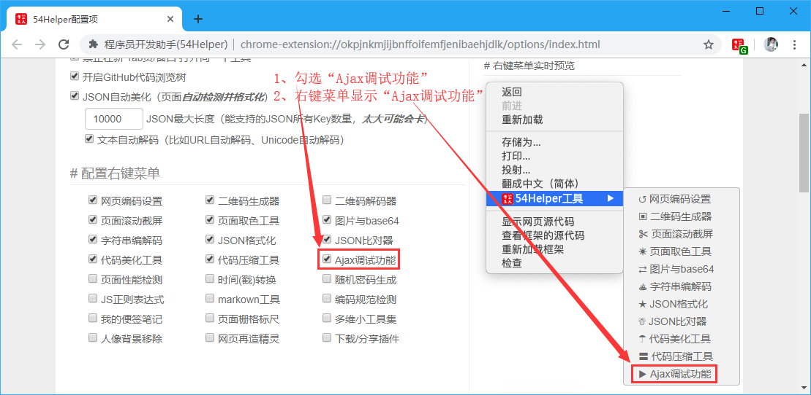
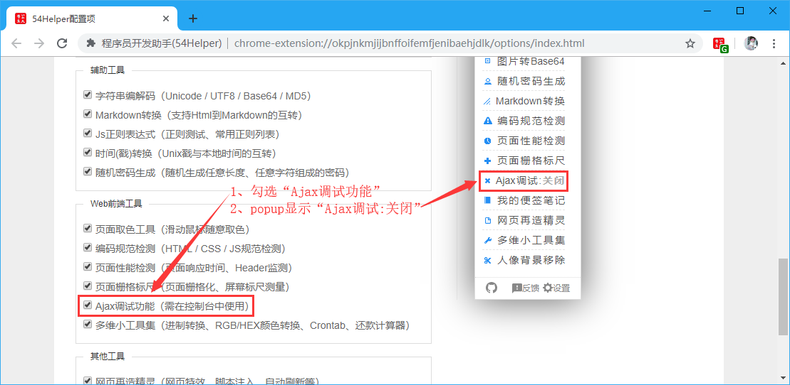
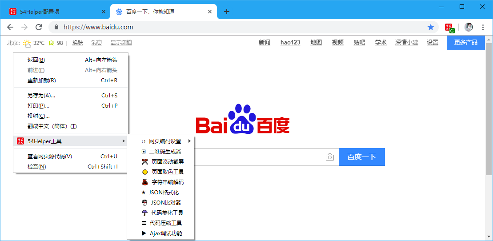
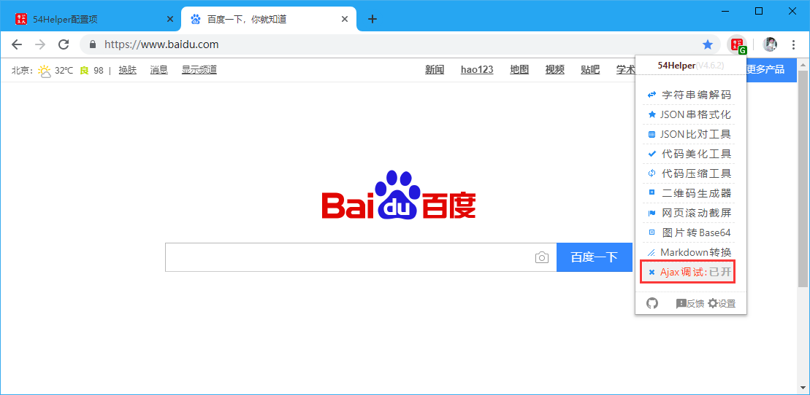
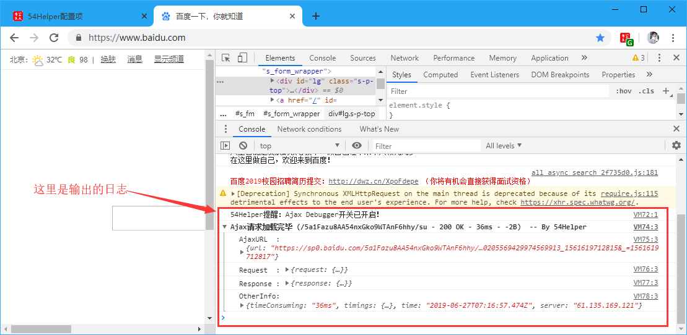

# 一、简介
1、本工具在网页调试时使用  
2、打开网页调试(ctrl+shift+i)或者(F12)->在popup点击“Ajax调试”显示已开启  
3、在console面板将会看到发出的Ajax请求和网络应答  

# 二、配置
## 2.1、右键菜单配置
在设置界面，** 配置右键菜单 **  
1、勾选“Ajax调试功能”  
2、右键菜单将显示“Ajax调试功能”  

👆配置右键菜单-Ajax调试功能开启

## 2.2、popup菜单配置
在设置界面，** 配置功能菜单 **  
1、勾选“Ajax调试功能”  
2、popup菜单将出现“Ajax调试功能”  

👆配置功能菜单-Ajax调试功能开启

# 三、使用
## 3.1、开箱即用
1、点击“鼠标右键”->“54Helper工具”->“Ajax调试功能”->弹出“Ajax调试功能”的提示框->请确保已开启网页调试模式  

👆Ajax调试功能的使用-右键菜单

2、点击“工具栏54Helper的popup”->“popup弹出”->“Ajax调试”->切换“Ajax调试:已开启”和“Ajax调试:已关闭”  

👆Ajax调试功能的使用-popup菜单

## 3.2、功能演示说明  
- 本工具在网页调试时使用  
- 打开网页调试(ctrl+shift+i)或者(F12)->在popup点击“Ajax调试”显示已开启  
- 在console面板将会看到发出的Ajax请求和网络应答  

👆Ajax调试
