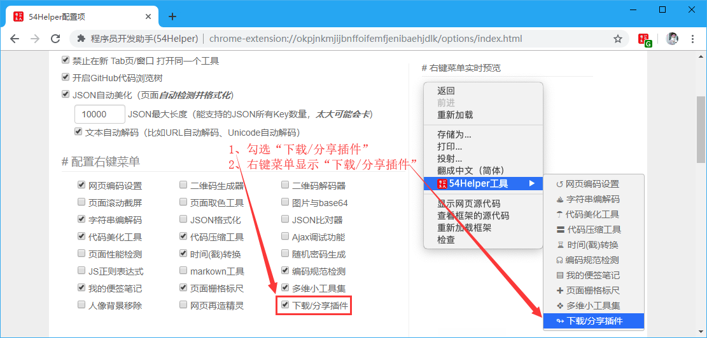
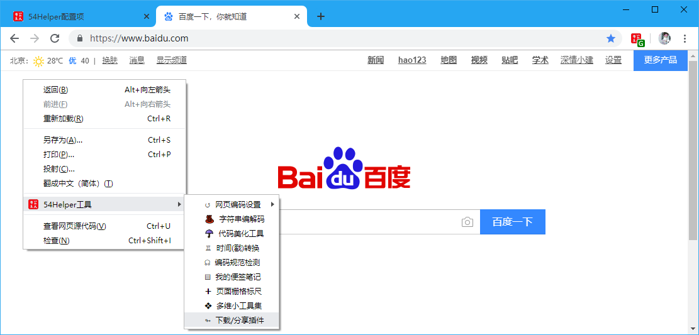
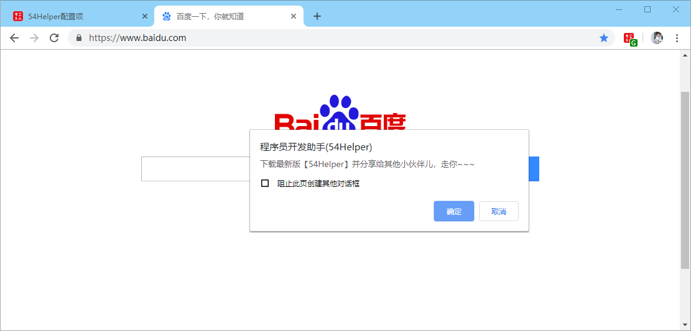

# 一、简介
1、本工具旨在提供一个下载入口，下载当前插件，便于线下通过QQ、微信等分享  
2、本工具下载前需要先连接上谷歌访问助手，以便能够访问Chrome商店，否则会下载失败，下载失败将会跳转至GitHub下载页面 *https://github.com/lijian17/54Helper/releases*  

# 二、配置
## 2.1、右键菜单配置
在设置界面，** 配置右键菜单 **  
1、勾选“下载分享插件”  
2、右键菜单将显示“下载分享插件”  

👆配置右键菜单-下载分享插件开启

# 三、使用
## 3.1、开箱即用
1、点击“鼠标右键”->“54Helper工具”->“下载分享插件”->弹出“下载分享插件”的提示框->点击“确定”将弹出本地存放目录->选择本地保存目录，点确定后将开始下载  

👆下载分享插件的使用-右键菜单

👆下载分享插件的使用-右键菜单
