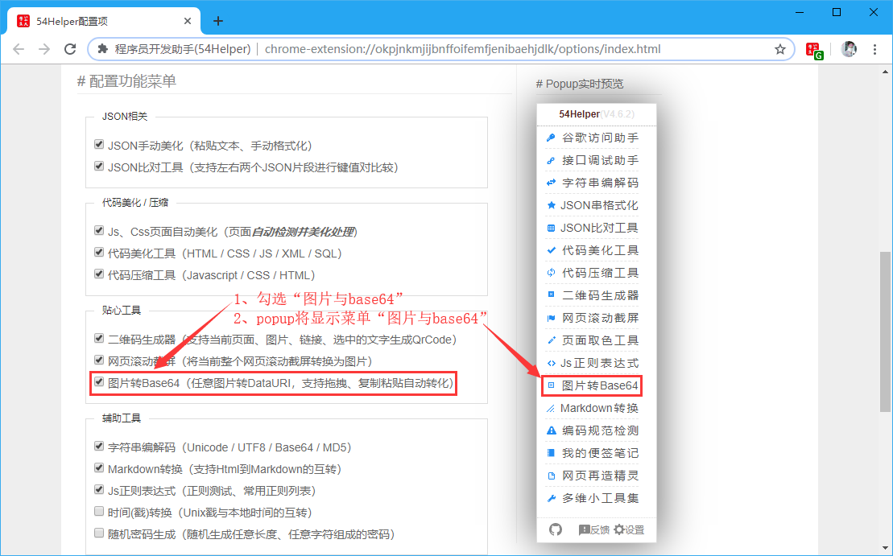

# 一、简介
1、本工具可以对小图片进行base64转码，即将图片转为base64  
2、亦可将图片的base64反转为图片  

# 二、配置
## 2.1、右键菜单配置
在设置界面，** 配置右键菜单 **  
1、勾选“图片转base64”  
2、右键菜单将显示“图片转base64”

👆配置右键菜单-图片转base64开启

## 2.2、popup菜单配置
在设置界面，** 配置功能菜单 **  
1、勾选“图片转base64”  
2、popup菜单将出现“图片转base64”  

👆配置功能菜单-图片转base64开启

# 三、使用
## 3.1、开箱即用
1、点击“工具栏54Helper的popup”->“popup弹出”->“图片转base64”->跳转至“图片转base64”页面  

👆图片转base64的使用-popup菜单

2、点击“选择图片”或“拖拽图片”至图片选框中，将自动在右侧框中显示转码后的base64，复制即可使用  
3、支持屏幕截图后直接在此处粘贴进行转化  
4、支持复制文件、复制图片在线地址在此处直接粘贴进行转化  

👆图片转base64的使用
