# 一、简介
1、本工具可以对字符串进行编解码  
2、支持的算法有Unicode加密(\u开头)、Unicode解密(\u开头)、UTF8/URL加密(%开头)、UTF8/URL解密(%开头)、Gzip加密、Gzip解密、HTML转JS、UTF16加密(\x开头)、UTF16解密(\x开头)、Base64加密、Base64解密、md5加密、Hex加密、Hex解密  

# 二、配置
## 2.1、右键菜单配置
在设置界面，** 配置右键菜单 **  
1、勾选“字符串编解码”  
2、右键菜单将显示“字符串编解码”

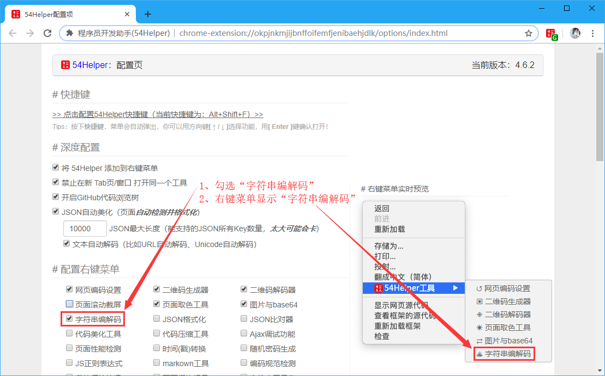
👆配置右键菜单-字符串编解码开启

## 2.2、popup菜单配置
在设置界面，** 配置功能菜单 **  
1、勾选“字符串编解码”  
2、popup菜单将出现“字符串编解码”  

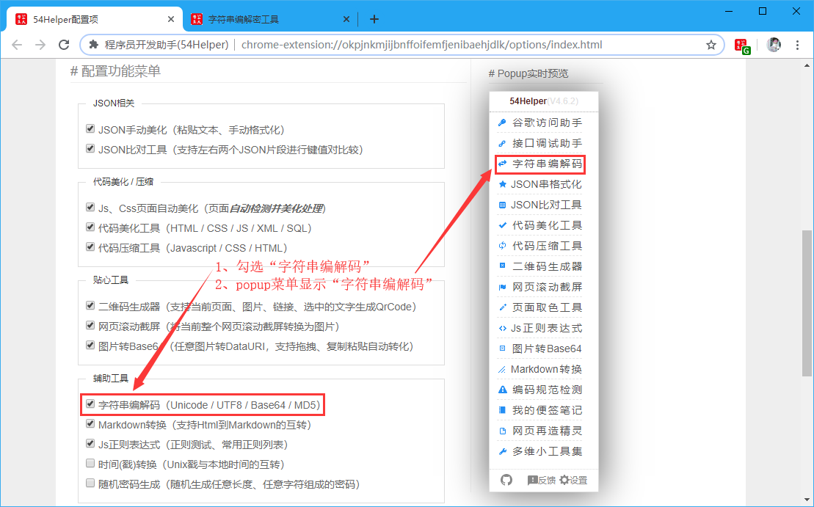
👆配置功能菜单-字符串编解码开启

# 三、使用
## 3.1、开箱即用
1、点击“鼠标右键”->“54Helper工具”->“字符串编解码”->跳转至“字符串编解码”页面  

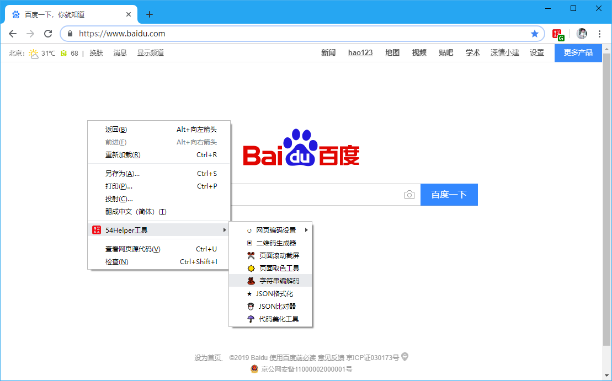
👆页面取色工具的使用-右键菜单

2、点击“工具栏54Helper的popup”->“popup弹出”->“字符串编解码”->跳转至“字符串编解码”页面  

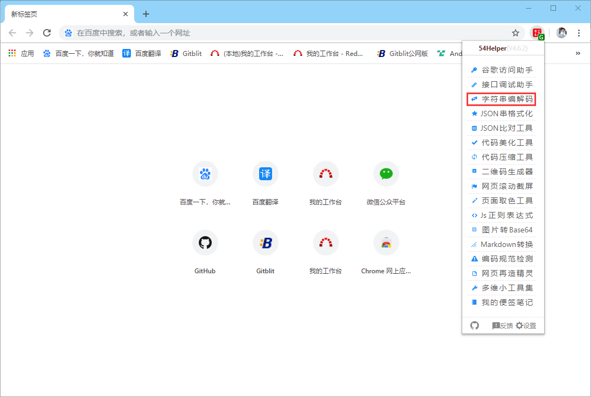
👆字符串编解码的使用-popup菜单

3、编解码具体使用步骤
- 输入待转换的字符串
- 选择转码方式
- 点击转换按钮
- 获得转换结果

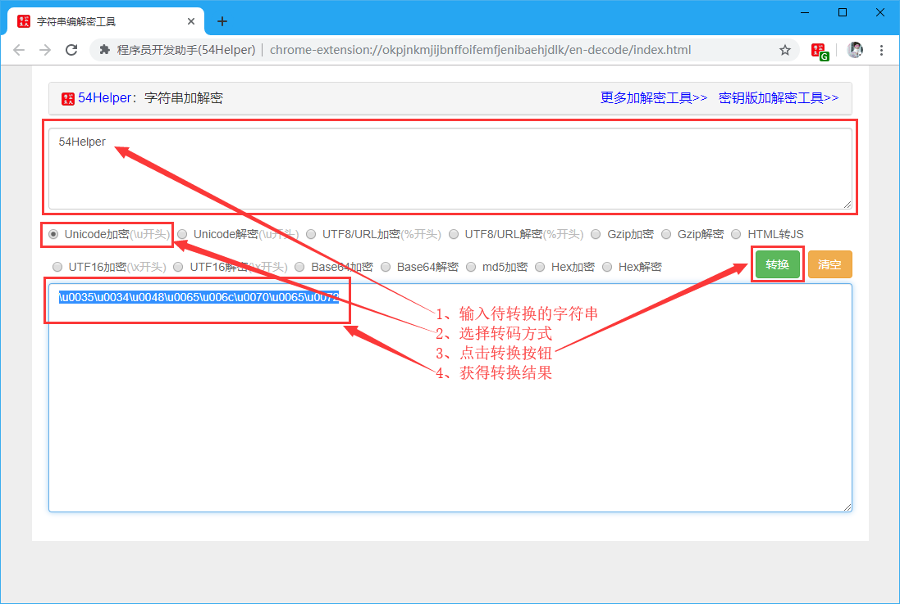
👆Unicode加密(\u开头)

👆Unicode解密(\u开头)

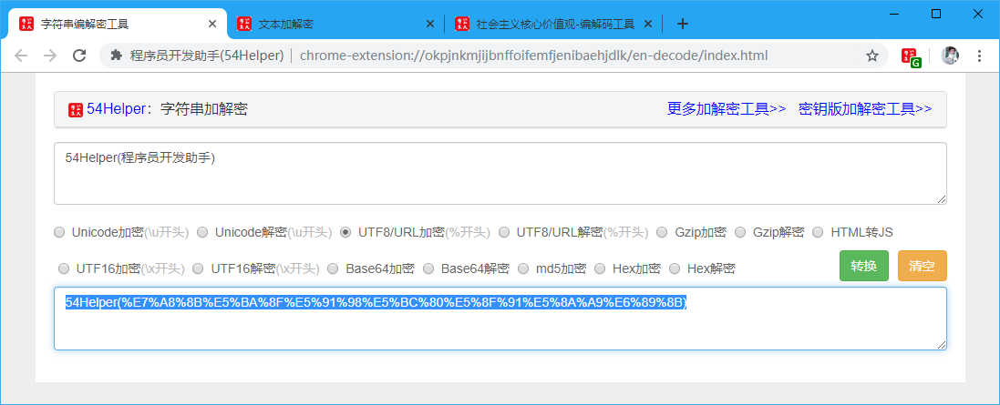
👆UTF8/URL加密(%开头) 

👆UTF8/URL解密(%开头)

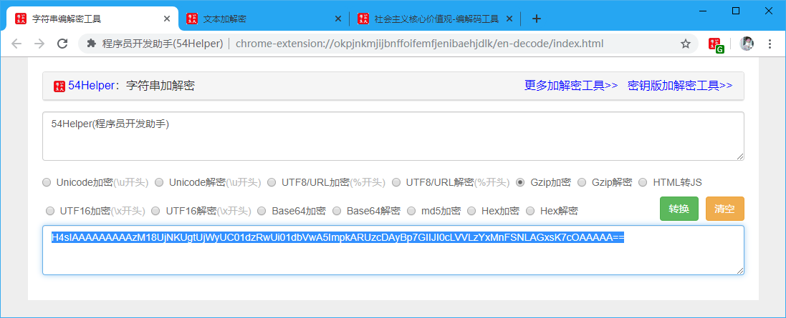
👆Gzip加密

👆Gzip解密

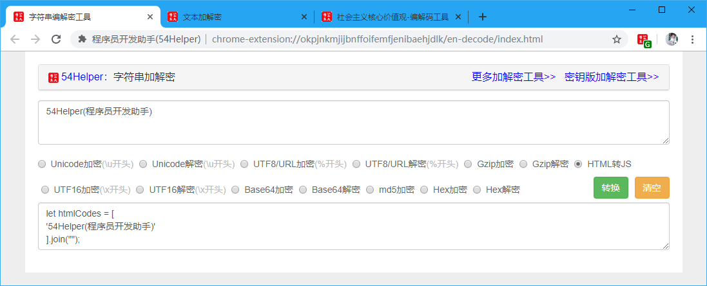
👆HTML转JS

👆UTF16加密(\x开头)

👆UTF16解密(\x开头)

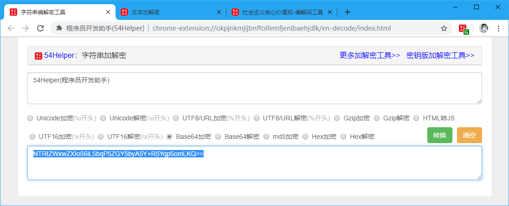
👆Base64加密

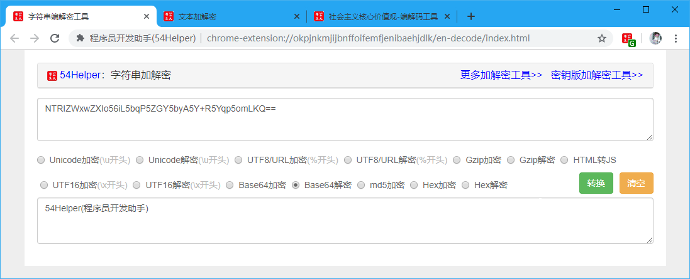
👆Base64解密

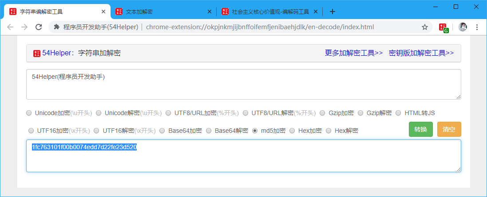
👆md5加密

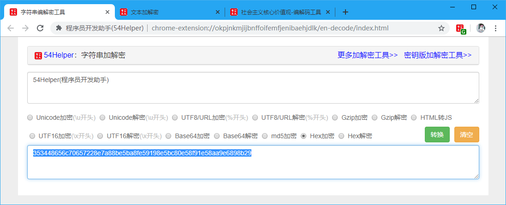
👆Hex加密

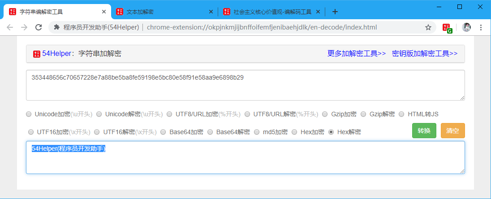
👆Hex解密

4、社会主义核心价值观-编解码工具  
点击“更多加解密工具>>”->即可跳转至“社会主义核心价值观-编解码工具”页面  

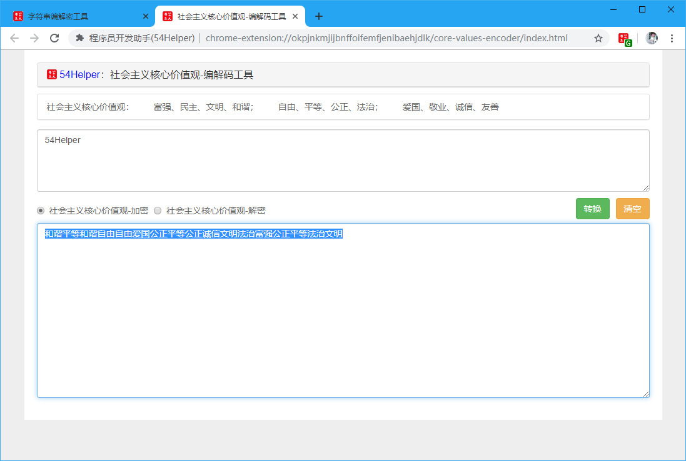
👆社会主义核心价值观-加密

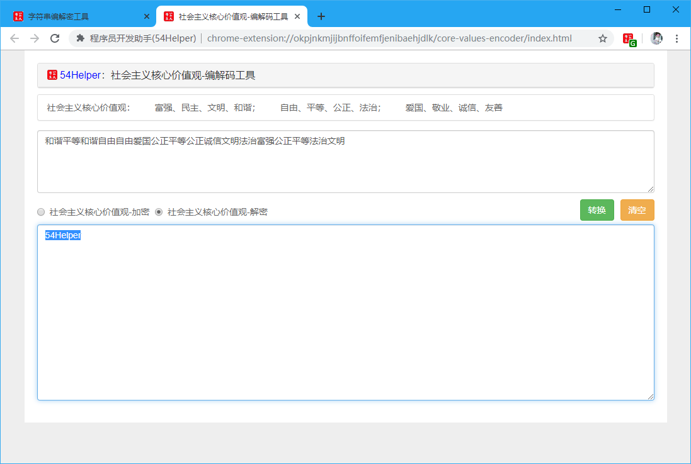
👆社会主义核心价值观-解密

5、密钥版加解密工具
点击“密钥版加解密工具>>”->即可跳转至“文本加解密”页面  

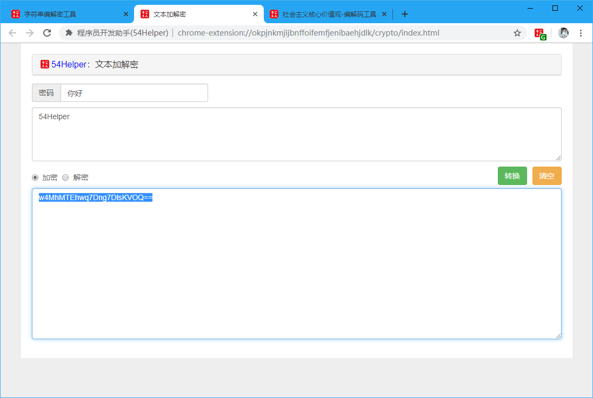
👆密钥版加解密工具-加密

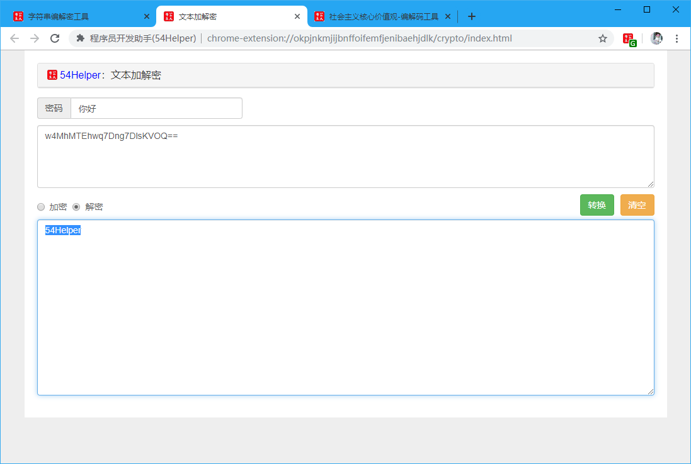
👆密钥版加解密工具-解密

