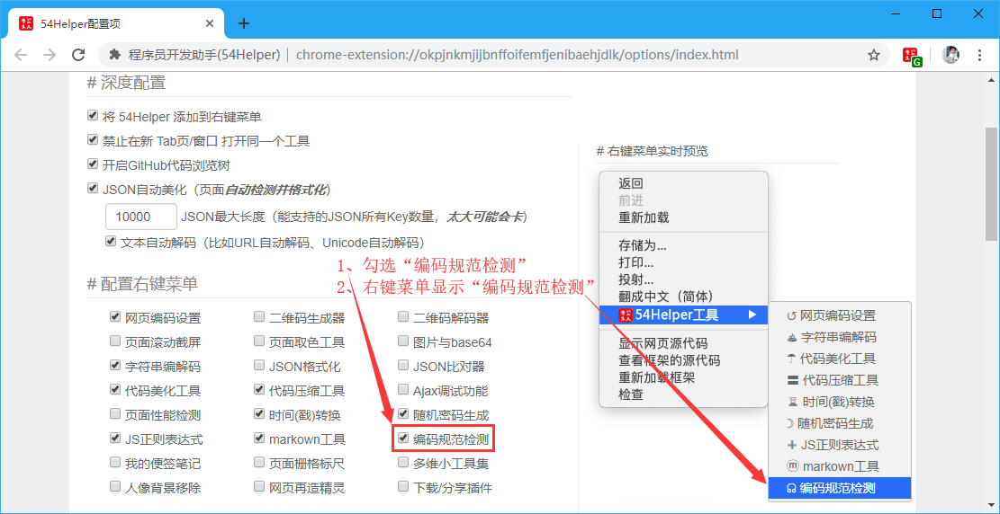
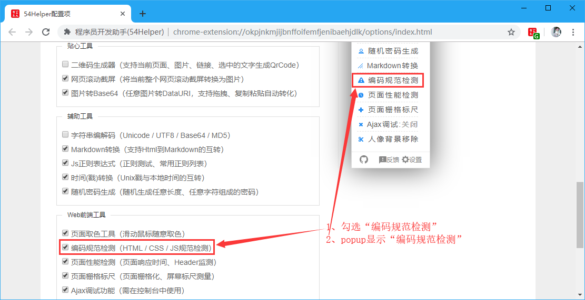
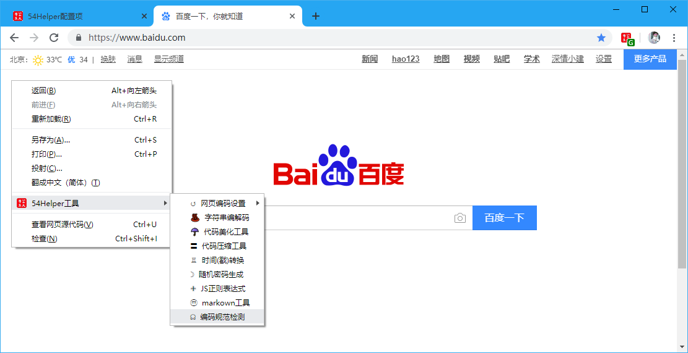
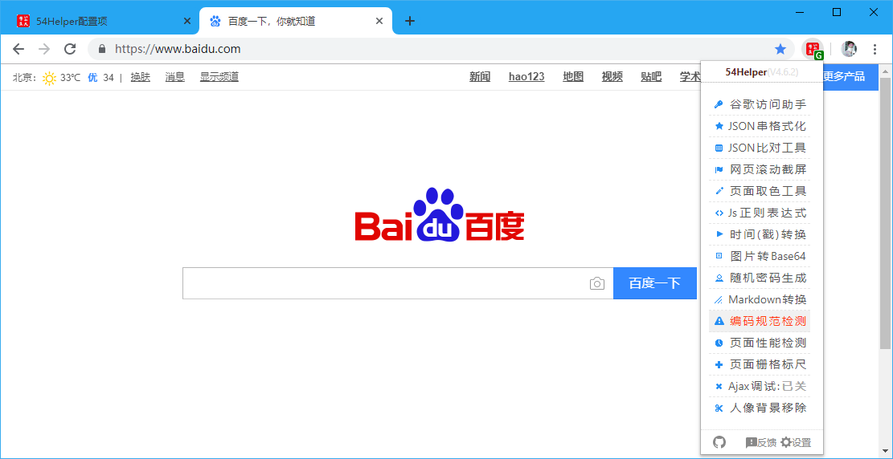
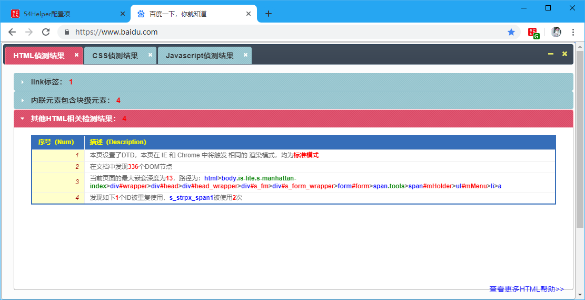

# 一、简介
1、本工具可以检测页面编码的规范包括(`HTML检测、CSS检测、JavaScript检测`)  
2、HTML检测包括(`link标签、内联元素包含块级元素、页面渲染模式等`)  
3、CSS检测包括(`冗余的CSS选择器、可能用到的CSS伪类选择器、实际用到的CSS选择器`)  
4、JavaScript检测包括(`所有处于存活期的cookie、<script>应用数、<script>外部js引入数、JavaScript是否经过压缩`)

# 二、配置
## 2.1、右键菜单配置
在设置界面，** 配置右键菜单 **  
1、勾选“编码规范检测”  
2、右键菜单将显示“编码规范检测”  

👆配置右键菜单-编码规范检测开启

## 2.2、popup菜单配置
在设置界面，** 配置功能菜单 **  
1、勾选“编码规范检测”  
2、popup菜单将出现“编码规范检测”  

👆配置功能菜单-编码规范检测开启

# 三、使用
## 3.1、开箱即用
1、在目标页面点击“鼠标右键”->“54Helper工具”->“编码规范检测”->在目标页面弹出检测结果面板  

👆编码规范检测的使用-右键菜单

2、在目标页面点击“工具栏54Helper的popup”->“popup弹出”->“编码规范检测”->在目标页面弹出检测结果面板  

👆编码规范检测的使用-popup菜单

## 3.2、功能演示说明  
编码规范检测简单示例如下  
操作步骤：  
> 1、在目标页面点击“编码规范检测”  
> 2、将计算html、css、JavaScript相关代码规范  
> 3、计算结果将生成结果报告、并叠加在当前目标页面的上层  
> 4、点击相关`HTML检测结果、CSS检测结果、JavaScript检测结果`面板可以查看详情  

👆编码规范检测
