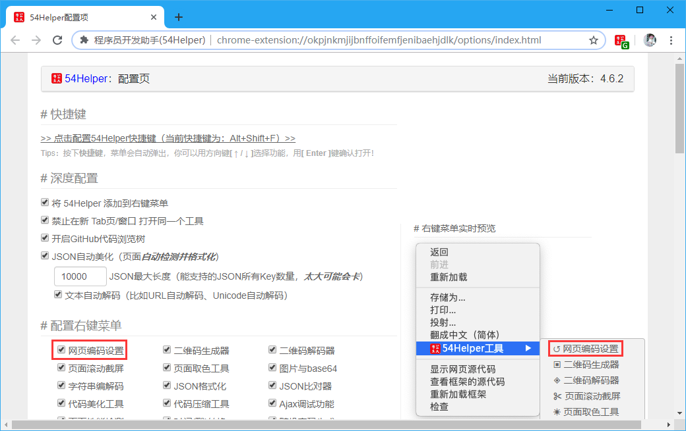
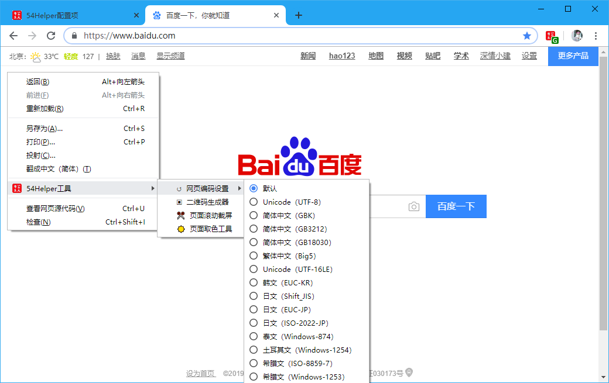

# 一、简介
1、当网页因为编码原因出现乱码时，可使用本工具解决。  
2、本地文件是以GBK编码保存，但却用浏览器UTF-8打开浏览，此时将出现乱码现象，本工具即可解决该问题。  

# 二、配置
## 2.1、右键菜单配置
在设置界面，** 配置右键菜单 **  
1、勾选“网页编码设置”  

👆配置右键菜单-网页编码设置开启

# 三、使用
## 3.1、开箱即用
1、目标网页中点击“鼠标右键”->“54Helper工具”->“网页编码设置”->选择对应“国家编码”  

👆网页编码设置的使用

