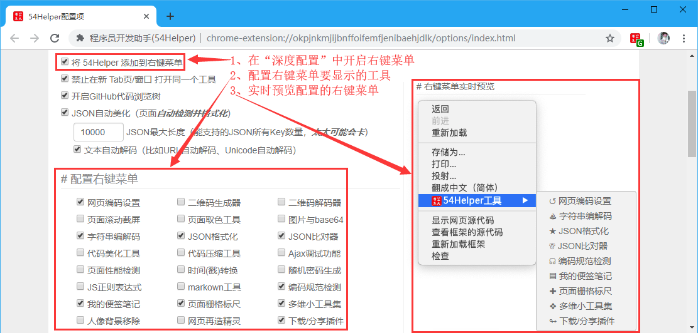
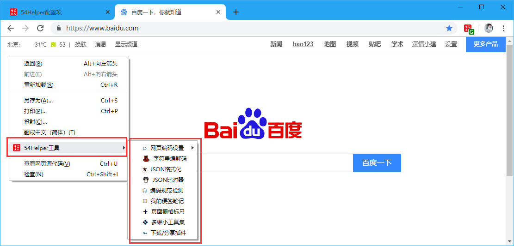

# 一、简介
1、本功能是用来配置鼠标🖱右键菜单的  
2、首先在`深度配置`中开启`将 54Helper 添加到右键菜单`  
3、然后在`配置右键菜单`中开启想开启的工具  
4、右侧`右键菜单实时预览`可以即时看到开启右键菜单的工具的情况  

# 二、配置
## 2.1、配置右键菜单  
在设置界面，** 配置右键菜单 **  
1、首先在`深度配置`中开启`将 54Helper 添加到右键菜单`  
2、然后在`配置右键菜单`中开启想开启的工具  
3、右侧`右键菜单实时预览`可以即时看到开启右键菜单的工具的情况  

👆配置右键菜单-开启

# 三、使用
## 3.1、开箱即用
1、在任意页面点击鼠标🖱右键，可以看到`54Helper工具`，鼠标🖱滑上去可以浏览配置的工具集，想使用哪个工具，点击那个即可使用    

👆配置右键菜单-使用
