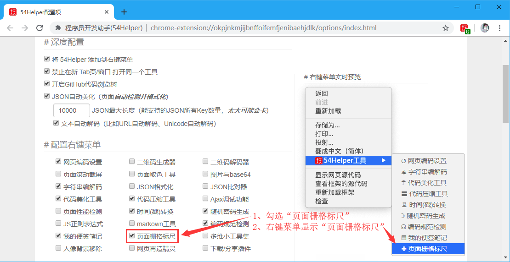
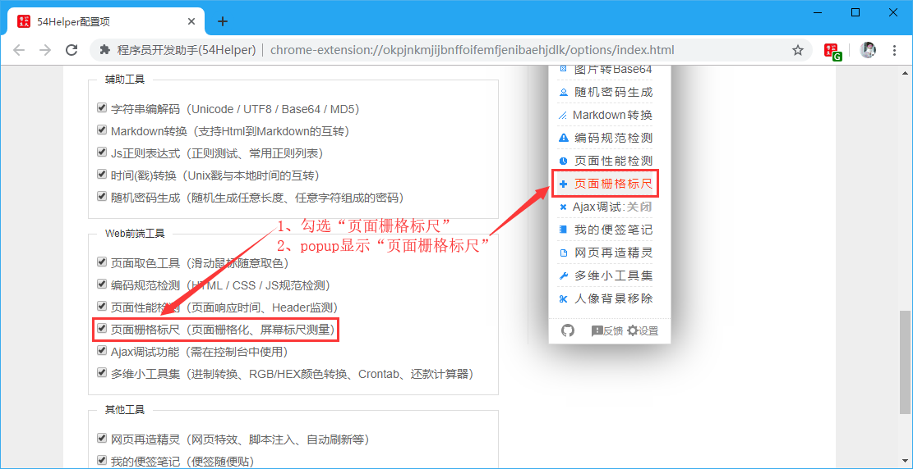
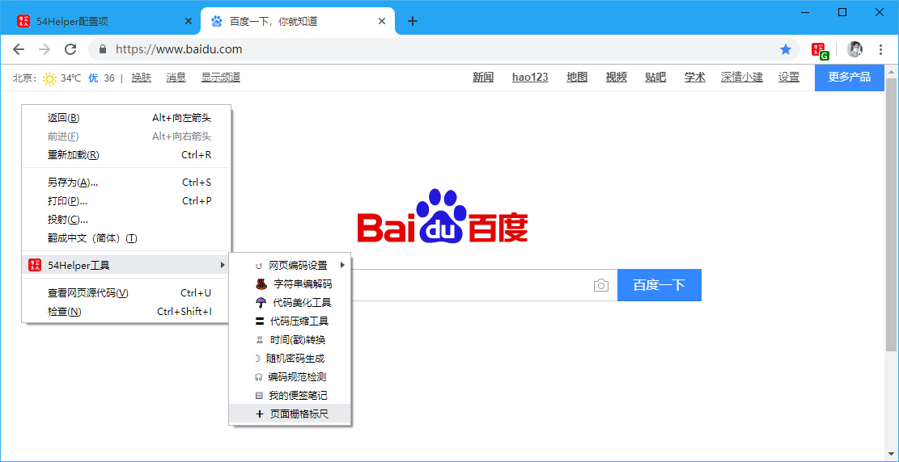
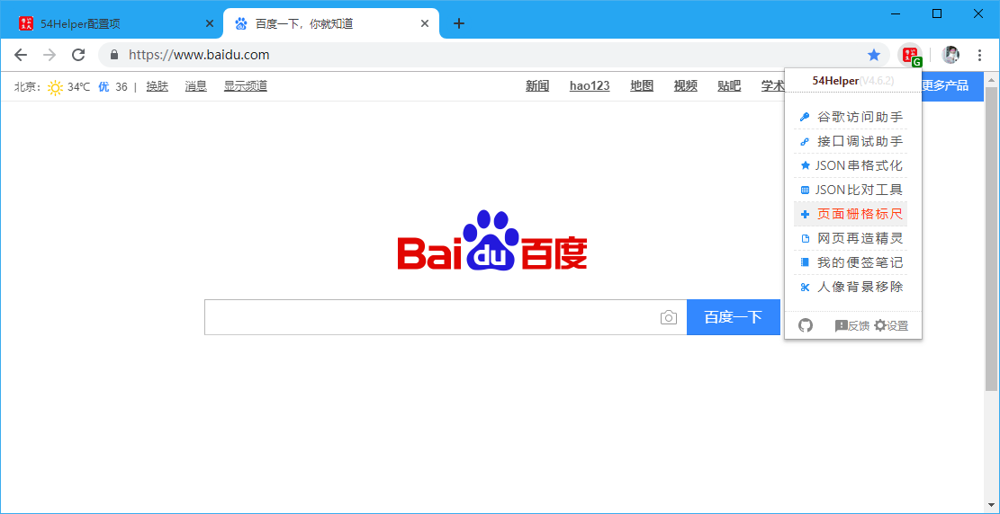
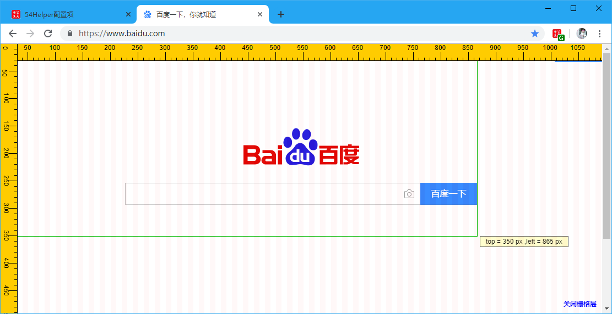

# 一、简介
1、本工具可以测量页面按钮的坐标位置  
2、根据测量的按钮四个角坐标可计算出按钮的大小  

# 二、配置
## 2.1、右键菜单配置
在设置界面，** 配置右键菜单 **  
1、勾选“页面栅格标尺”  
2、右键菜单将显示“页面栅格标尺”  

👆配置右键菜单-页面栅格标尺开启

## 2.2、popup菜单配置
在设置界面，** 配置功能菜单 **  
1、勾选“页面栅格标尺”  
2、popup菜单将出现“页面栅格标尺”  

👆配置功能菜单-页面栅格标尺开启

# 三、使用
## 3.1、开箱即用
1、在目标页面点击“鼠标右键”->“54Helper工具”->“页面栅格标尺”->弹出透明标尺层叠层  

👆页面栅格标尺的使用-右键菜单

2、在目标页面点击“工具栏54Helper的popup”->“popup弹出”->“页面栅格标尺”->弹出透明标尺层叠层  

👆页面栅格标尺的使用-popup菜单

## 3.2、功能演示说明  
页面栅格标尺简单示例如下  
操作步骤：  
> 鼠标🖱在页面中移动至需要测量的元素上，坐标会根据鼠标🖱所在位置实时显示坐标值  

👆页面栅格标尺
