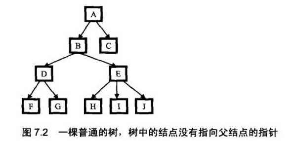

## 一、题目

求树中两个结点的最低公共祖先，此树不是二叉树，并且没有指向父节点的指针。

## 二、解题思路

我们首先得到一条从根结点到树中某一结点的路径，这就要求在遍历的时候，有一个辅助内存来保存路径．



比如我们用前序遍历的方法来得到从根结点到H 的路径的过程是这样的：（ 1 ）遍历到A，把A 存放到路径中去，路径中只有一个结点A; ( 2 ）遍历到B，把B 存到路径中去，此时路径为A->B; ( 3 ）遍历到D，把D 存放到路径中去，此，时路径为A->B->D; ( 4 ） 遍历到F，把F 存放到路径中去，此时路径为A->B->D->F;( 5) F 已经没有子结点了，因此这条路径不可能到这结点H. 把F 从路径中删除，变成A->B->D; ( 6 ）遍历G. 和结点F 一样，这条路径也不能到达H. 边历完G 之后，路径仍然是A->B->D; ( 7 ）由于D 的所有子结点都遍历过了，不可能到这结点H，因此D 不在从A 到H 的路径中，把D 从路径中删除，变成A->B; ( 8 ）遥历E，把E 加入到路径中，此时路径变成A->B->E, ( 9 ）遍历H，已经到达目标给点， A->B->E 就是从根结点开始到达H 必须经过的路径。 

同样，我们也可以得到从根结点开始到达F 必须经过的路径是A->B。接着，我们求出这两个路径的最后公共结点，也就是B. B这个结点也是F 和H 的最低公共祖先． 

为了得到从根结点开始到输入的两个结点的两条路径，需要遍历两次树，每边历一次的时间复杂度是O(n)。

## 三、解题代码

```java
public class Test{
    /**
     * 树的结点定义
     */
    private static class TreeNode {
        int val;

        List<TreeNode> children = new LinkedList<>();


        public TreeNode() {
        }

        public TreeNode(int val) {
            this.val = val;
        }

        @Override
        public String toString() {
            return val + "";
        }
    }

    /**
     * 找结点的路径
     *
     * @param root   根结点
     * @param target 目标结点
     * @param path   从根结点到目标结点的路径
     */
    public static void getNodePath(TreeNode root, TreeNode target, List<TreeNode> path) {
        if (root == null) {
            return;
        }

        // 添加当前结点
        path.add(root);

        List<TreeNode> children = root.children;
        // 处理子结点
        for (TreeNode node : children) {

            if (node == target) {
                path.add(node);
                return;
            } else {
                getNodePath(node, target, path);
            }
        }

        // 现场还原
        path.remove(path.size() - 1);
    }

    /**
     * 找两个路径中的最后一个共同的结点
     *
     * @param p1 路径1
     * @param p2 路径2
     * @return 共同的结点，没有返回null
     */
    public static TreeNode getLastCommonNode(List<TreeNode> p1, List<TreeNode> p2) {
        Iterator<TreeNode> ite1 = p1.iterator();
        Iterator<TreeNode> ite2 = p2.iterator();
        TreeNode last = null;

        while (ite1.hasNext() && ite2.hasNext()) {
            TreeNode tmp = ite1.next();
            if (tmp == ite2.next()) {
                last = tmp;
            }
        }

        return last;

    }

    /**
     * 找树中两个结点的最低公共祖先
     * @param root 树的根结点
     * @param p1 结点1
     * @param p2 结点2
     * @return 公共结点，没有返回null
     */
    public static TreeNode getLastCommonParent(TreeNode root, TreeNode p1, TreeNode p2) {
        if (root == null || p1 == null || p2 == null) {
            return null;
        }
        List<TreeNode> path1 = new LinkedList<>();
        getNodePath(root, p1, path1);
        List<TreeNode> path2 = new LinkedList<>();
        getNodePath(root, p2, path2);

        return getLastCommonNode(path1, path2);
    }
}
```

