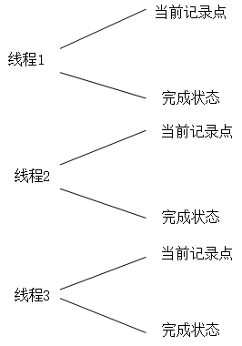
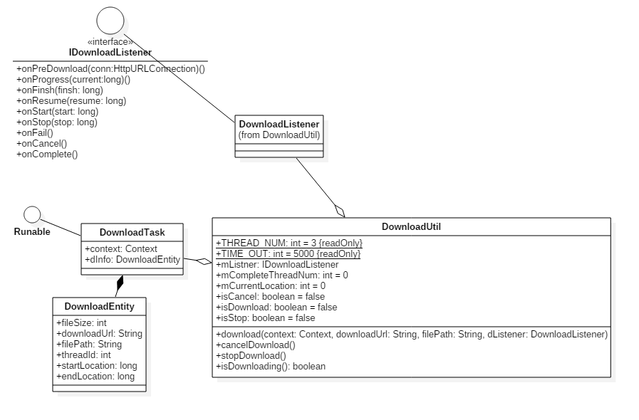
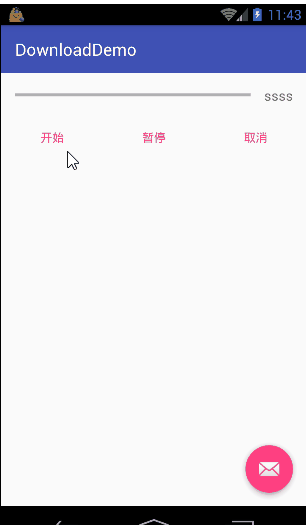

## 一、原理

其实断点续传的原理很简单，从字面上理解，所谓断点续传就是从停止的地方重新下载。
断点：线程停止的位置。
续传：从停止的位置重新下载。

用代码解析就是：
断点 ： 当前线程已经下载完成的数据长度。
续传 ： 向服务器请求上次线程停止位置之后的数据。
原理知道了，功能实现起来也简单。每当线程停止时就把已下载的数据长度写入记录文件，当重新下载时，从记录文件读取已经下载了的长度。而这个长度就是所需要的断点。

续传的实现也简单，可以通过设置网络请求参数，请求服务器从指定的位置开始读取数据。
而要实现这两个功能只需要使用到httpURLconnection里面的setRequestProperty方法便可以实现.

```java
public void setRequestProperty(String field, String newValue)
```

如下所示，便是向服务器请求500-1000之间的500个byte：

```Java
conn.setRequestProperty("Range", "bytes=" + 500 + "-" + 1000);
```

以上只是续传的一部分需求，当我们获取到下载数据时，还需要将数据写入文件，而普通发File对象并不提供从指定位置写入数据的功能，这个时候，就需要使用到RandomAccessFile来实现从指定位置给文件写入数据的功能。

```java
public void seek(long offset)
```

如下所示，便是从文件的的第100个byte后开始写入数据。

```java
raFile.seek(100);
```

而开始写入数据时还需要用到RandomAccessFile里面的另外一个方法

```java
public void write(byte[] buffer, int byteOffset, int byteCount)
```

该方法的使用和OutputStream的write的使用一模一样...

以上便是断点续传的原理。

## 二、多线程断点续传

多线程断点续传便是在单线程的断点续传上延伸的。多线程断点续传是把整个文件分割成几个部分，每个部分由一条线程执行下载，而每一条下载线程都要实现断点续传功能。
为了实现文件分割功能，我们需要使用到httpURLconnection的另外一个方法：

```java
public int getContentLength()
```

当请求成功时，可以通过该方法获取到文件的总长度。
`每一条线程下载大小 = fileLength / THREAD_NUM`

如下图所示，描述的便是多线程的下载模型：


在多线程断点续传下载中，有一点需要特别注意：
由于文件是分成多个部分是被不同的线程的同时下载的，这就需要，每一条线程都分别需要有一个断点记录，和一个线程完成状态的记录；



只有所有线程的下载状态都处于完成状态时，才能表示文件已经下载完成。
实现记录的方法多种多样，我这里采用的是JDK自带的Properties类来记录下载参数。

## 三、断点续传结构

通过原理的了解，便可以很快的设计出断点续传工具类的基本结构图



### IDownloadListener.java

```java
    package com.arialyy.frame.http.inf;
    import java.net.HttpURLConnection;

    /** 
     * 在这里面编写你的业务逻辑
     */
    public interface IDownloadListener {
        /**
         * 取消下载
         */
        public void onCancel();

        /**
         * 下载失败
         */
        public void onFail();

        /**
         * 下载预处理,可通过HttpURLConnection获取文件长度
         */
        public void onPreDownload(HttpURLConnection connection);

        /**
         * 下载监听
         */
        public void onProgress(long currentLocation);

        /**
         * 单一线程的结束位置
         */
        public void onChildComplete(long finishLocation);

        /**
         * 开始
         */
        public void onStart(long startLocation);

        /**
         * 子程恢复下载的位置
         */
        public void onChildResume(long resumeLocation);

        /**
         * 恢复位置
         */
        public void onResume(long resumeLocation);

        /**
         * 停止
         */
        public void onStop(long stopLocation);

        /**
         * 下载完成
         */
        public void onComplete();
    }
```

该类是下载监听接口

### DownloadListener.java

```java
import java.net.HttpURLConnection;

/**
 * 下载监听
 */
public class DownloadListener implements IDownloadListener {

    @Override
    public void onResume(long resumeLocation) {

    }

    @Override
    public void onCancel() {

    }

    @Override
    public void onFail() {

    }

    @Override
    public void onPreDownload(HttpURLConnection connection) {

    }

    @Override
    public void onProgress(long currentLocation) {

    }

    @Override
    public void onChildComplete(long finishLocation) {

    }

    @Override
    public void onStart(long startLocation) {

    }

    @Override
    public void onChildResume(long resumeLocation) {

    }

    @Override
    public void onStop(long stopLocation) {

    }

    @Override
    public void onComplete() {

    }
}
```

## 下载参数实体

```java
    /**
     * 子线程下载信息类
     */
    private class DownloadEntity {
        //文件总长度
        long fileSize;
        //下载链接
        String downloadUrl;
        //线程Id
        int threadId;
        //起始下载位置
        long startLocation;
        //结束下载的文章
        long endLocation;
        //下载文件
        File tempFile;
        Context context;

        public DownloadEntity(Context context, long fileSize, String downloadUrl, File file, int threadId, long startLocation, long endLocation) {
            this.fileSize = fileSize;
            this.downloadUrl = downloadUrl;
            this.tempFile = file;
            this.threadId = threadId;
            this.startLocation = startLocation;
            this.endLocation = endLocation;
            this.context = context;
        }
    }
```

该类是下载信息配置类，每一条子线程的下载都需要一个下载实体来配置下载信息。

### 下载任务线程

```java
    /**
     * 多线程下载任务类
     */
    private class DownLoadTask implements Runnable {
        private static final String TAG = "DownLoadTask";
        private DownloadEntity dEntity;
        private String configFPath;

        public DownLoadTask(DownloadEntity downloadInfo) {
            this.dEntity = downloadInfo;
            configFPath = dEntity.context.getFilesDir().getPath() + "/temp/" + dEntity.tempFile.getName() + ".properties";
        }

        @Override
        public void run() {
            try {
                L.d(TAG, "线程_" + dEntity.threadId + "_正在下载【" + "开始位置 : " + dEntity.startLocation + "，结束位置：" + dEntity.endLocation + "】");
                URL url = new URL(dEntity.downloadUrl);
                HttpURLConnection conn = (HttpURLConnection) url.openConnection();
                //在头里面请求下载开始位置和结束位置
                conn.setRequestProperty("Range", "bytes=" + dEntity.startLocation + "-" + dEntity.endLocation);
                conn.setRequestMethod("GET");
                conn.setRequestProperty("Charset", "UTF-8");
                conn.setConnectTimeout(TIME_OUT);
                conn.setRequestProperty("User-Agent", "Mozilla/4.0 (compatible; MSIE 8.0; Windows NT 5.2; Trident/4.0; .NET CLR 1.1.4322; .NET CLR 2.0.50727; .NET CLR 3.0.04506.30; .NET CLR 3.0.4506.2152; .NET CLR 3.5.30729)");
                conn.setRequestProperty("Accept", "image/gif, image/jpeg, image/pjpeg, image/pjpeg, application/x-shockwave-flash, application/xaml+xml, application/vnd.ms-xpsdocument, application/x-ms-xbap, application/x-ms-application, application/vnd.ms-excel, application/vnd.ms-powerpoint, application/msword, */*");
                conn.setReadTimeout(2000);  //设置读取流的等待时间,必须设置该参数
                InputStream is = conn.getInputStream();
                //创建可设置位置的文件
                RandomAccessFile file = new RandomAccessFile(dEntity.tempFile, "rwd");
                //设置每条线程写入文件的位置
                file.seek(dEntity.startLocation);
                byte[] buffer = new byte[1024];
                int len;
                //当前子线程的下载位置
                long currentLocation = dEntity.startLocation;
                while ((len = is.read(buffer)) != -1) {
                    if (isCancel) {
                        L.d(TAG, "++++++++++ thread_" + dEntity.threadId + "_cancel ++++++++++");
                        break;
                    }

                    if (isStop) {
                        break;
                    }

                    //把下载数据数据写入文件
                    file.write(buffer, 0, len);
                    synchronized (DownLoadUtil.this) {
                        mCurrentLocation += len;
                        mListener.onProgress(mCurrentLocation);
                    }
                    currentLocation += len;
                }
                file.close();
                is.close();

                if (isCancel) {
                    synchronized (DownLoadUtil.this) {
                        mCancelNum++;
                        if (mCancelNum == THREAD_NUM) {
                            File configFile = new File(configFPath);
                            if (configFile.exists()) {
                                configFile.delete();
                            }

                            if (dEntity.tempFile.exists()) {
                                dEntity.tempFile.delete();
                            }
                            L.d(TAG, "++++++++++++++++ onCancel +++++++++++++++++");
                            isDownloading = false;
                            mListener.onCancel();
                            System.gc();
                        }
                    }
                    return;
                }

                //停止状态不需要删除记录文件
                if (isStop) {
                    synchronized (DownLoadUtil.this) {
                        mStopNum++;
                        String location = String.valueOf(currentLocation);
                        L.i(TAG, "thread_" + dEntity.threadId + "_stop, stop location ==> " + currentLocation);
                        writeConfig(dEntity.tempFile.getName() + "_record_" + dEntity.threadId, location);
                        if (mStopNum == THREAD_NUM) {
                            L.d(TAG, "++++++++++++++++ onStop +++++++++++++++++");
                            isDownloading = false;
                            mListener.onStop(mCurrentLocation);
                            System.gc();
                        }
                    }
                    return;
                }

                L.i(TAG, "线程【" + dEntity.threadId + "】下载完毕");
                writeConfig(dEntity.tempFile.getName() + "_state_" + dEntity.threadId, 1 + "");
                mListener.onChildComplete(dEntity.endLocation);
                mCompleteThreadNum++;
                if (mCompleteThreadNum == THREAD_NUM) {
                    File configFile = new File(configFPath);
                    if (configFile.exists()) {
                        configFile.delete();
                    }
                    mListener.onComplete();
                    isDownloading = false;
                    System.gc();
                }
            } catch (MalformedURLException e) {
                e.printStackTrace();
                isDownloading = false;
                mListener.onFail();
            } catch (IOException e) {
                FL.e(this, "下载失败【" + dEntity.downloadUrl + "】" + FL.getPrintException(e));
                isDownloading = false;
                mListener.onFail();
            } catch (Exception e) {
                FL.e(this, "获取流失败" + FL.getPrintException(e));
                isDownloading = false;
                mListener.onFail();
            }
        }
```

这个是每条下载子线程的下载任务类，子线程通过下载实体对每一条线程进行下载配置，由于在多断点续传的概念里，停止表示的是暂停状态，而恢复表示的是线程从记录的断点重新进行下载，所以，线程处于停止状态时是不能删除记录文件的。

### 下载入口

```java
    /**
     * 多线程断点续传下载文件，暂停和继续
     *
     * @param context          必须添加该参数，不能使用全局变量的context
     * @param downloadUrl      下载路径
     * @param filePath         保存路径
     * @param downloadListener 下载进度监听 {@link DownloadListener}
     */
    public void download(final Context context, @NonNull final String downloadUrl, @NonNull final String filePath,
                         @NonNull final DownloadListener downloadListener) {
        isDownloading = true;
        mCurrentLocation = 0;
        isStop = false;
        isCancel = false;
        mCancelNum = 0;
        mStopNum = 0;
        final File dFile = new File(filePath);
        //读取已完成的线程数
        final File configFile = new File(context.getFilesDir().getPath() + "/temp/" + dFile.getName() + ".properties");
        try {
            if (!configFile.exists()) { //记录文件被删除，则重新下载
                newTask = true;
                FileUtil.createFile(configFile.getPath());
            } else {
                newTask = false;
            }
        } catch (Exception e) {
            e.printStackTrace();
            mListener.onFail();
            return;
        }
        newTask = !dFile.exists();
        new Thread(new Runnable() {
            @Override
            public void run() {
                try {
                    mListener = downloadListener;
                    URL url = new URL(downloadUrl);
                    HttpURLConnection conn = (HttpURLConnection) url.openConnection();
                    conn.setRequestMethod("GET");
                    conn.setRequestProperty("Charset", "UTF-8");
                    conn.setConnectTimeout(TIME_OUT);
                    conn.setRequestProperty("User-Agent", "Mozilla/4.0 (compatible; MSIE 8.0; Windows NT 5.2; Trident/4.0; .NET CLR 1.1.4322; .NET CLR 2.0.50727; .NET CLR 3.0.04506.30; .NET CLR 3.0.4506.2152; .NET CLR 3.5.30729)");
                    conn.setRequestProperty("Accept", "image/gif, image/jpeg, image/pjpeg, image/pjpeg, application/x-shockwave-flash, application/xaml+xml, application/vnd.ms-xpsdocument, application/x-ms-xbap, application/x-ms-application, application/vnd.ms-excel, application/vnd.ms-powerpoint, application/msword, */*");
                    conn.connect();
                    int len = conn.getContentLength();
                    if (len < 0) {  //网络被劫持时会出现这个问题
                        mListener.onFail();
                        return;
                    }
                    int code = conn.getResponseCode();
                    if (code == 200) {
                        int fileLength = conn.getContentLength();
                        //必须建一个文件
                        FileUtil.createFile(filePath);
                        RandomAccessFile file = new RandomAccessFile(filePath, "rwd");
                        //设置文件长度
                        file.setLength(fileLength);
                        mListener.onPreDownload(conn);
                        //分配每条线程的下载区间
                        Properties pro = null;
                        pro = Util.loadConfig(configFile);
                        int blockSize = fileLength / THREAD_NUM;
                        SparseArray<Thread> tasks = new SparseArray<>();
                        for (int i = 0; i < THREAD_NUM; i++) {
                            long startL = i * blockSize, endL = (i + 1) * blockSize;
                            Object state = pro.getProperty(dFile.getName() + "_state_" + i);
                            if (state != null && Integer.parseInt(state + "") == 1) {  //该线程已经完成
                                mCurrentLocation += endL - startL;
                                L.d(TAG, "++++++++++ 线程_" + i + "_已经下载完成 ++++++++++");
                                mCompleteThreadNum++;
                                if (mCompleteThreadNum == THREAD_NUM) {
                                    if (configFile.exists()) {
                                        configFile.delete();
                                    }
                                    mListener.onComplete();
                                    isDownloading = false;
                                    System.gc();
                                    return;
                                }
                                continue;
                            }
                            //分配下载位置
                            Object record = pro.getProperty(dFile.getName() + "_record_" + i);
                            if (!newTask && record != null && Long.parseLong(record + "") > 0) {       //如果有记录，则恢复下载
                                Long r = Long.parseLong(record + "");
                                mCurrentLocation += r - startL;
                                L.d(TAG, "++++++++++ 线程_" + i + "_恢复下载 ++++++++++");
                                mListener.onChildResume(r);
                                startL = r;
                            }
                            if (i == (THREAD_NUM - 1)) {
                                endL = fileLength;//如果整个文件的大小不为线程个数的整数倍，则最后一个线程的结束位置即为文件的总长度
                            }
                            DownloadEntity entity = new DownloadEntity(context, fileLength, downloadUrl, dFile, i, startL, endL);
                            DownLoadTask task = new DownLoadTask(entity);
                            tasks.put(i, new Thread(task));
                        }
                        if (mCurrentLocation > 0) {
                            mListener.onResume(mCurrentLocation);
                        } else {
                            mListener.onStart(mCurrentLocation);
                        }
                        for (int i = 0, count = tasks.size(); i < count; i++) {
                            Thread task = tasks.get(i);
                            if (task != null) {
                                task.start();
                            }
                        }
                    } else {
                        FL.e(TAG, "下载失败，返回码：" + code);
                        isDownloading = false;
                        System.gc();
                        mListener.onFail();
                    }
                } catch (IOException e) {
                    FL.e(this, "下载失败【downloadUrl:" + downloadUrl + "】\n【filePath:" + filePath + "】" + FL.getPrintException(e));
                    isDownloading = false;
                    mListener.onFail();
                }
            }
        }).start();
    }
```

其实也没啥好说的，注释已经很完整了，需要注意两点
1、恢复下载时：`已下载的文件大小 = 该线程的上一次断点的位置 - 该线程起始下载位置`；
2、为了保证下载文件的完整性，只要记录文件不存在就需要重新进行下载；

## 四、最终效果



[Demo点我](https://github.com/AriaLyy/DownloadUtil)