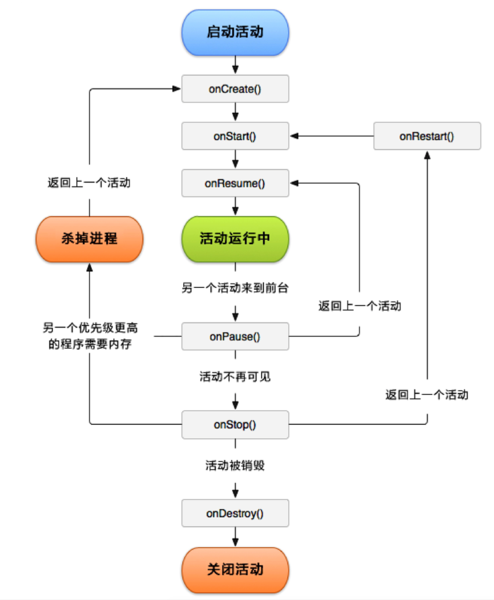
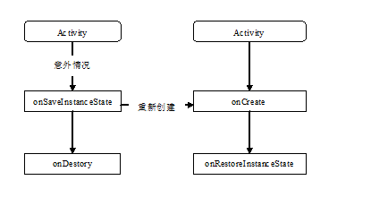
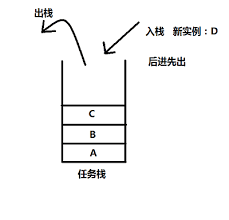
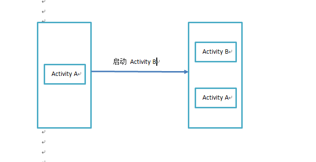
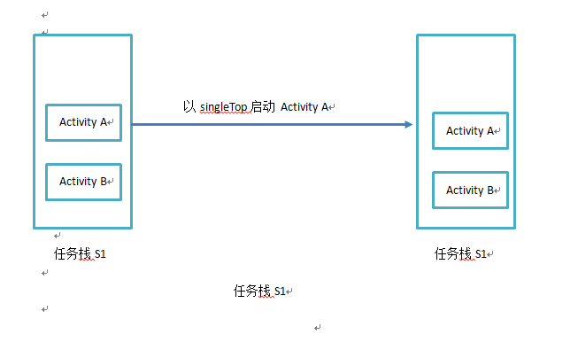
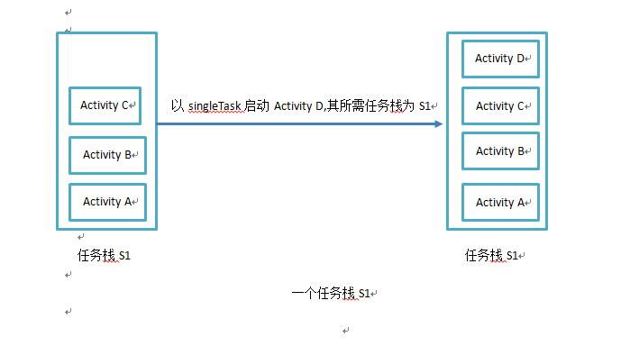
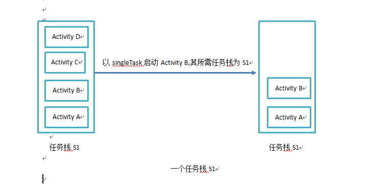
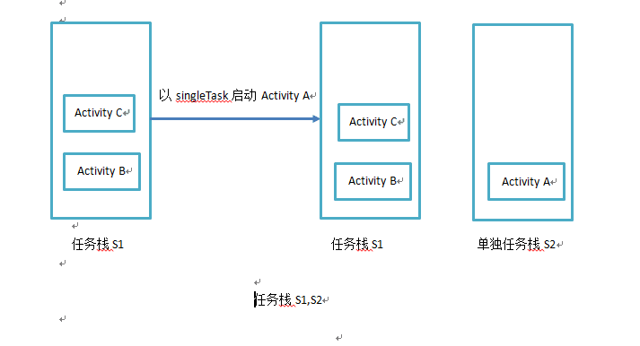
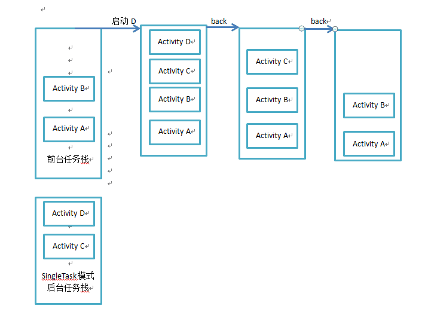
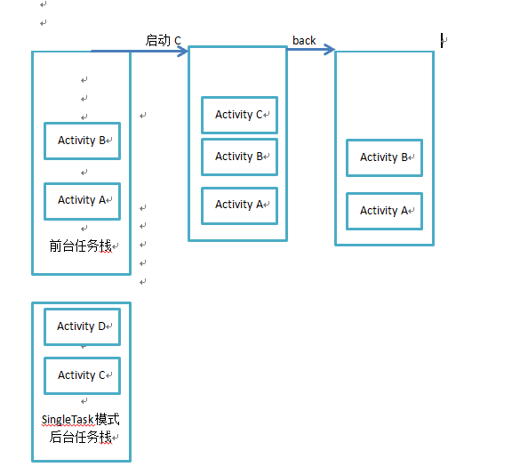

### 一、Activity的生命周期

本节内容将生命周期的情况分为两部分介绍，第一部分先了解典型的生命周期的7个部分及Activity的状态。第二部分会介绍Activity在一些特殊情况下的生命周期的经历过程。

#### 1.典型的生命周期的了解

先上经典图片。  




  


关于这张图片，我们可能在初学Android时就有接触，今天我们继续回顾一下。

在正常情况下，一个Activity从启动到结束会以如下顺序经历整个生命周期：  
onCreate\(\)-&gt;onStart\(\)-&gt;onResume\(\)-&gt;onPause\(\)-&gt;onStop\(\)-&gt;onDestory\(\)。包含了六个部分，还有一个onRestart\(\)没有调用，下面我们一一介绍这七部分内容。

\(1\) onCreate\(\)：当 Activity 第一次创建时会被调用。这是生命周期的第一个方法。在这个方法中，可以做一些初始化工作，比如调用setContentView去加载界面布局资源，初始化Activity所需的数据。当然也可借助onCreate\(\)方法中的Bundle对象来回复异常情况下Activity结束时的状态（后面会介绍）。

\(2\) onRestart\(\)：表示Activity正在重新启动。一般情况下，当当前Activity从不可见重新变为可见状态时，onRestart就会被调用。这种情形一般是用户行为导致的，比如用户按Home键切换到桌面或打开了另一个新的Activity，接着用户又回到了这个Actvity。（关于这部分生命周期的历经过程，后面会介绍。）

\(3\) onStart\(\): 表示Activity正在被启动，即将开始，这时Activity已经**出现**了，但是还没有出现在前台，无法与用户交互。这个时候可以理解为**Activity已经显示出来，但是我们还看不到。**

\(4\) onResume\(\):表示Activity**已经可见了，并且出现在前台并开始活动**。需要和onStart\(\)对比，onStart的时候Activity还在后台，onResume的时候Activity才显示到前台。

\(5\) onPause\(\):表示 Activity正在停止，仍可见，正常情况下，紧接着onStop就会被调用。在特殊情况下，如果这个时候快速地回到当前Activity，那么onResume就会被调用（极端情况）。**onPause中不能进行耗时操作，会影响到新Activity的显示。因为onPause必须执行完，新的Activity的onResume才会执行。**

\(6\) onStop\(\):表示Activity即将停止，不可见，位于后台。可以做稍微重量级的回收工作，同样不能太耗时。

\(7\) onDestory\(\):表示Activity即将销毁，这是Activity生命周期的最后一个回调，可以做一些回收工作和最终的资源回收。

在平常的开发中，我们经常用到的就是 onCreate\(\)和onDestory\(\)，做一些初始化和回收操作。

##### 生命周期的几种普通情况

①针对一个特定的Activity，第一次启动，回调如下：onCreate\(\)-&gt;onStart\(\)-&gt;onResume\(\)

②用户打开新的Activiy的时候，上述Activity的回调如下：onPause\(\)-&gt;onStop\(\)

③再次回到原Activity时，回调如下：onRestart\(\)-&gt;onStart\(\)-&gt;onResume\(\)

④按back键回退时，回调如下：onPause\(\)-&gt;onStop\(\)-&gt;onDestory\(\)

⑤按Home键切换到桌面后又回到该Actitivy，回调如下：onPause\(\)-&gt;onStop\(\)-&gt;onRestart\(\)-&gt;onStart\(\)-&gt;onResume\(\)

⑥调用finish\(\)方法后，回调如下：onDestory\(\)**\(以在onCreate\(\)方法中调用为例，不同方法中回调不同，通常都是在onCreate\(\)方法中调用\)**

#### 2.特殊情况下的生命周期

上面是普通情况下Activity生命周期的一些流程，但是在一些特殊情况下，Activity的生命周期的经历有些异常，下面就是两种特殊情况。  
**①横竖屏切换**  
在横竖屏切换的过程中，会发生Activity被销毁并重建的过程。

在了解这种情况下的生命周期时，首先应该了解这两个回调：**onSaveInstanceState和onRestoreInstanceState**。

在Activity由于异常情况下终止时，系统会调用onSaveInstanceState来保存当前Activity的状态。这个方法的调用是在onStop之前，它和onPause没有既定的时序关系，该方法只在Activity被异常终止的情况下调用。当异常终止的Activity被重建以后，系统会调用onRestoreInstanceState，并且把Activity销毁时onSaveInstanceState方法所保存的Bundle对象参数同时传递给onRestoreInstanceState和onCreate方法。因此，可以通过onRestoreInstanceState方法来恢复Activity的状态，该方法的调用时机是在onStart之后。**其中onCreate和onRestoreInstanceState方法来恢复Activity的状态的区别：** onRestoreInstanceState回调则表明其中Bundle对象非空，不用加非空判断。onCreate需要非空判断。建议使用onRestoreInstanceState。  




  


横竖屏切换的生命周期：onPause\(\)-&gt;onSaveInstanceState\(\)-&gt; onStop\(\)-&gt;onDestroy\(\)-&gt;onCreate\(\)-&gt;onStart\(\)-&gt;onRestoreInstanceState-&gt;onResume\(\)

可以通过在AndroidManifest文件的Activity中指定如下属性：

```java
android:configChanges = "orientation| screenSize"
```

来避免横竖屏切换时，Activity的销毁和重建，而是回调了下面的方法：

```java
@Override
    public void onConfigurationChanged(Configuration newConfig) {
        super.onConfigurationChanged(newConfig);
    }
```

**②资源内存不足导致优先级低的Activity被杀死**  
Activity优先级的划分和下面的Activity的三种运行状态是对应的。

\(1\) 前台Activity——正在和用户交互的Activity，优先级最高。

\(2\) 可见但非前台Activity——比如Activity中弹出了一个对话框，导致Activity可见但是位于后台无法和用户交互。

\(3\) 后台Activity——已经被暂停的Activity，比如执行了onStop，优先级最低。

当系统内存不足时，会按照上述优先级从低到高去杀死目标Activity所在的进程。我们在平常使用手机时，能经常感受到这一现象。这种情况下数组存储和恢复过程和上述情况一致，生命周期情况也一样。

#### 3.Activity的三种运行状态

①Resumed（活动状态）

又叫Running状态，这个Activity正在屏幕上显示，并且有用户焦点。这个很好理解，就是用户正在操作的那个界面。

②Paused（暂停状态）

这是一个比较不常见的状态。这个Activity在屏幕上是可见的，但是并不是在屏幕最前端的那个Activity。比如有另一个非全屏或者透明的Activity是Resumed状态，没有完全遮盖这个Activity。

③Stopped（停止状态）

当Activity完全不可见时，此时Activity还在后台运行，仍然在内存中保留Activity的状态，并不是完全销毁。这个也很好理解，当跳转的另外一个界面，之前的界面还在后台，按回退按钮还会恢复原来的状态，大部分软件在打开的时候，直接按Home键，并不会关闭它，此时的Activity就是Stopped状态。

### 二、Activity的启动模式

#### 1.启动模式的类别

Android提供了四种Activity启动方式：

标准模式（standard）  
栈顶复用模式（singleTop）  
栈内复用模式（singleTask）  
单例模式（singleInstance）

#### 2.启动模式的结构——栈

Activity的管理是采用任务栈的形式，任务栈采用“后进先出”的栈结构。  




  


#### 3.Activity的LaunchMode

##### \(1\)标准模式（standard）

每启动一次Activity，就会创建一个新的Activity实例并置于栈顶。谁启动了这个Activity，那么这个Activity就运行在启动它的那个Activity所在的栈中。

例如：Activity A启动了Activity B，则就会在A所在的栈顶压入一个新的Activity。  




  


**特殊情况，如果在Service或Application中启动一个Activity，其并没有所谓的任务栈，可以使用标记位Flag来解决。解决办法：为待启动的Activity指定FLAG\_ACTIVITY\_NEW\_TASK标记位，创建一个新栈。**

**应用场景：** 绝大多数Activity。如果以这种方式启动的Activity被跨进程调用，在5.0之前新启动的Activity实例会放入发送Intent的Task的栈的顶部，尽管它们属于不同的程序，这似乎有点费解看起来也不是那么合理，所以在5.0之后，上述情景会创建一个新的Task，新启动的Activity就会放入刚创建的Task中，这样就合理的多了。

##### \(2\)栈顶复用模式（singleTop）

如果需要新建的Activity位于任务栈栈顶，那么此Activity的实例就不会重建，而是重用栈顶的实例。并回调如下方法：

```java
    @Override
    protected void onNewIntent(Intent intent) {
        super.onNewIntent(intent);
    }
```

由于不会重建一个Activity实例，则不会回调其他生命周期方法。  
如果栈顶不是新建的Activity,就会创建该Activity新的实例，并放入栈顶。  




**应用场景：** 在通知栏点击收到的通知，然后需要启动一个Activity，这个Activity就可以用singleTop，否则每次点击都会新建一个Activity。当然实际的开发过程中，测试妹纸没准给你提过这样的bug：某个场景下连续快速点击，启动了两个Activity。如果这个时候待启动的Activity使用 singleTop模式也是可以避免这个Bug的。同standard模式，如果是外部程序启动singleTop的Activity，在Android 5.0之前新创建的Activity会位于调用者的Task中，5.0及以后会放入新的Task中。

##### \(3\)栈内复用模式（singleTask）

该模式是一种单例模式，即一个栈内只有一个该Activity实例。该模式，可以通过在AndroidManifest文件的Activity中指定该Activity需要加载到那个栈中，即singleTask的Activity可以指定想要加载的目标栈。singleTask和taskAffinity配合使用，指定开启的Activity加入到哪个栈中。

``` xml
<activity android:name=".Activity1"
	android:launchMode="singleTask"
	android:taskAffinity="com.lvr.task"
	android:label="@string/app_name">
</activity>
```

**关于taskAffinity的值：** 每个Activity都有taskAffinity属性，这个属性指出了它希望进入的Task。如果一个Activity没有显式的指明该Activity的taskAffinity，那么它的这个属性就等于Application指明的taskAffinity，如果Application也没有指明，那么该taskAffinity的值就等于包名。

**执行逻辑：**

在这种模式下，如果Activity指定的栈不存在，则创建一个栈，并把创建的Activity压入栈内。如果Activity指定的栈存在，如果其中没有该Activity实例，则会创建Activity并压入栈顶，如果其中有该Activity实例，则把该Activity实例之上的Activity杀死清除出栈，重用并让该Activity实例处在栈顶，然后调用onNewIntent\(\)方法。

对应如下三种情况：  




  




  


  


**应用场景：** 大多数App的主页。对于大部分应用，当我们在主界面点击回退按钮的时候都是退出应用，那么当我们第一次进入主界面之后，主界面位于栈底，以后不管我们打开了多少个Activity，只要我们再次回到主界面，都应该使用将主界面Activity上所有的Activity移除的方式来让主界面Activity处于栈顶，而不是往栈顶新加一个主界面Activity的实例，通过这种方式能够保证退出应用时所有的Activity都能报销毁。在跨应用Intent传递时，如果系统中不存在singleTask Activity的实例，那么将创建一个新的Task，然后创建SingleTask Activity的实例，将其放入新的Task中。

##### \(4\)单例模式（singleInstance）

作为栈内复用模式（singleTask）的加强版,打开该Activity时，直接创建一个新的任务栈，并创建该Activity实例放入新栈中。一旦该模式的Activity实例已经存在于某个栈中，任何应用再激活该Activity时都会重用该栈中的实例。  




  


**应用场景：** 呼叫来电界面。这种模式的使用情况比较罕见，在Launcher中可能使用。或者你确定你需要使Activity只有一个实例。建议谨慎使用。

### 3.特殊情况——前台栈和后台栈的交互

假如目前有两个任务栈。前台任务栈为AB，后台任务栈为CD，这里假设CD的启动模式均为singleTask,现在请求启动D，那么这个后台的任务栈都会被切换到前台，这个时候整个后退列表就变成了ABCD。当用户按back返回时，列表中的activity会一一出栈，如下图。




  


如果不是请求启动D而是启动C，那么情况又不一样，如下图。  




  


**调用SingleTask模式的后台任务栈中的Activity，会把整个栈的Actvity压入当前栈的栈顶。singleTask会具有clearTop特性，把之上的栈内Activity清除。**

#### 4.Activity的Flags

Activity的Flags很多，这里介绍集中常用的，用于设定Activity的启动模式。可以在启动Activity时，通过Intent的addFlags\(\)方法设置。

**\(1\)FLAG\_ACTIVITY\_NEW\_TASK**
其效果与指定Activity为singleTask模式一致。

**\(2\)FLAG\_ACTIVITY\_SINGLE\_TOP**
其效果与指定Activity为singleTop模式一致。

**\(3\)FLAG\_ACTIVITY\_CLEAR\_TOP**
具有此标记位的Activity，当它启动时，在同一个任务栈中所有位于它上面的Activity都要出栈。如果和singleTask模式一起出现，若被启动的Activity已经存在栈中，则清除其之上的Activity，并调用该Activity的onNewIntent方法。如果被启动的Activity采用standard模式，那么该Activity连同之上的所有Activity出栈，然后创建新的Activity实例并压入栈中。

