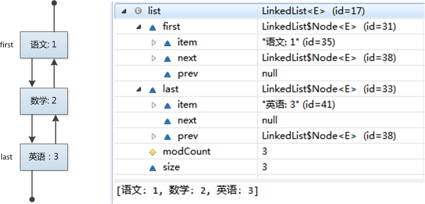

## [ ](https://yikun.github.io/2015/04/05/Java-LinkedList%E5%B7%A5%E4%BD%9C%E5%8E%9F%E7%90%86%E5%8F%8A%E5%AE%9E%E7%8E%B0/)一、 概述

> 以双向链表实现。链表无容量限制，但双向链表本身使用了更多空间，也需要额外的链表指针操作。
>
> 按下标访问元素—get\(i\)/set\(i,e\) 要悲剧的遍历链表将指针移动到位\(如果i&gt;数组大小的一半，会从末尾移起\)。
>
> 插入、删除元素时修改前后节点的指针即可，但还是要遍历部分链表的指针才能移动到下标所指的位置，只有在链表两头的操作—add\(\)，addFirst\(\)，removeLast\(\)或用iterator\(\)上的remove\(\)能省掉指针的移动。

LinkedList是一个简单的数据结构，与ArrayList不同的是，他是基于链表实现的。

> Doubly-linked list implementation of the List and Deque interfaces. Implements all optional list operations, and permits all elements \(including null\).

```java
LinkedList<String> list = new LinkedList<String>();
list.add("语文: 1");
list.add("数学: 2");
list.add("英语: 3");
```

结构也相对简单一些，如下图所示：  


### 二、 set和get函数 {#2-_set和get函数}

```java
public E set(int index, E element) {
    checkElementIndex(index);
    Node<E> x = node(index);
    E oldVal = x.item;
    x.item = element;
    return oldVal;
}
public E get(int index) {
    checkElementIndex(index);
    return node(index).item;
}
```

这两个函数都调用了`node`函数，该函数会以O\(n/2\)的性能去获取一个节点，具体实现如下所示：

```java
Node<E> node(int index) {
    // assert isElementIndex(index);
    if (index < (size >> 1)) {
        Node<E> x = first;
        for (int i = 0; i < index; i++)
            x = x.next;
        return x;
    } else {
        Node<E> x = last;
        for (int i = size - 1; i > index; i--)
            x = x.prev;
        return x;
    }
}
```

就是判断index是在前半区间还是后半区间，如果在前半区间就从head搜索，而在后半区间就从tail搜索。而不是一直从头到尾的搜索。如此设计，将节点访问的复杂度由O\(n\)变为O\(n/2\)。

