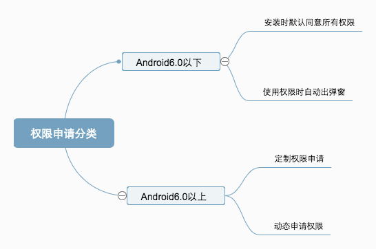
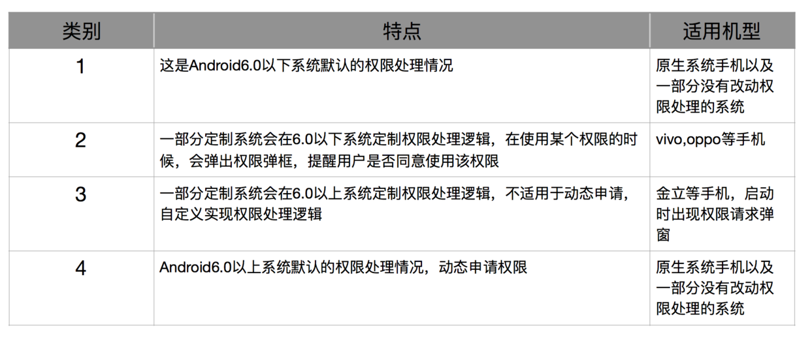
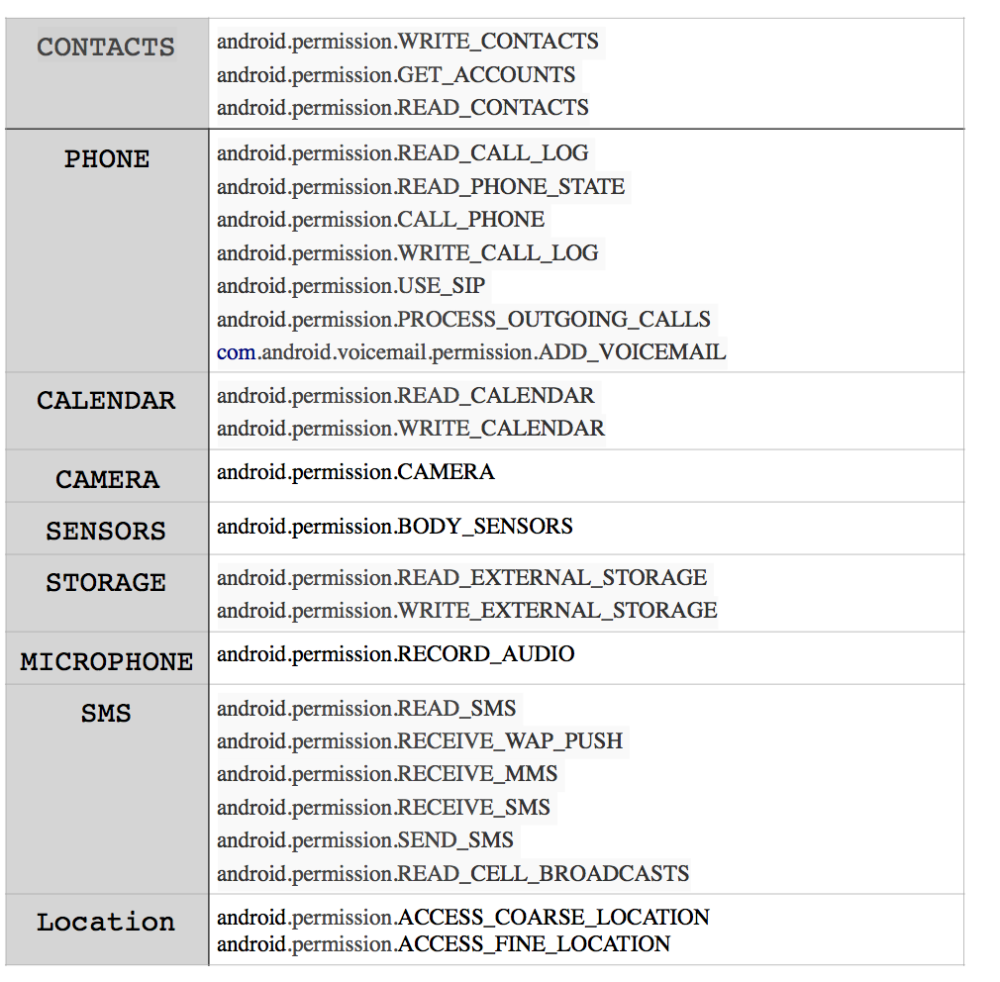
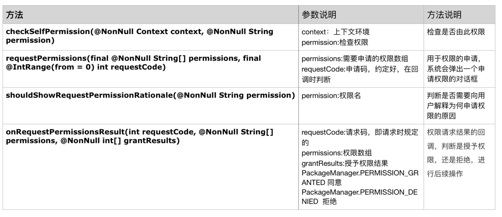
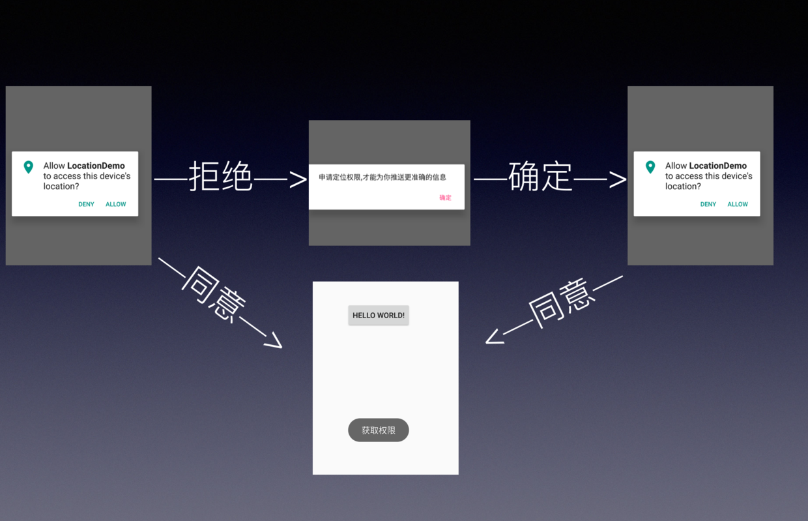

## 一、权限处理分类



由上图可以看出，主要分为四类。下表逐一介绍各类对应的一些情况。



## 二、动态权限申请

虽然总的来说分为四类，但是只需要处理一种情况，即动态申请权限。其他三种情况，要么默认实现，要么系统定制，无法从代码角度进行调整。那么下面先来看下那些权限需要动态申请。

### (1)权限列表



Android6.0以上把权限分为普通权限和危险权限，所以危险权限是需要动态申请，给予用户提示的，而危险权限就是上表展示的内容。

看到上面的 permissions，会发现一个问题，危险权限都是一组一组的。

分组对权限机制的申请是有一定影响的。例如app运行在android 6.x的机器上，对于授权机制是这样的。如果你申请某个危险的权限，假设你的app早已被用户授权了**同一组**的某个危险权限，那么系统会立即授权，而不需要用户去点击授权。比如你的app对READ_CONTACTS已经授权了，当你的app申请WRITE_CONTACTS时，系统会直接授权通过。

此外，对于申请时的弹窗上面的文本说明也是对整个权限组的说明，而不是单个权限。

下面介绍下Android 6.0以上 动态申请权限所设计到的一些方法。

### (2)权限申请方法

在申请权限先，首先要保证在AndroidManifest中写明需要的权限。
例如：

```xml
<uses-permission android:name="android.permission.ACCESS_COARSE_LOCATION"></uses-permission>
<uses-permission android:name="android.permission.ACCESS_FINE_LOCATION"></uses-permission>
```

**具体权限方法详解：**



#### 权限申请示例

以获取定位权限为例。

1.点击按钮，检查并申请权限

```java
btn.setOnClickListener(new View.OnClickListener() {
            @Override
            public void onClick(View view) {
                if (Build.VERSION.SDK_INT >23) {
                    if (ContextCompat.checkSelfPermission(MainActivity.this,
                             Manifest.permission.ACCESS_COARSE_LOCATION)
                            == PackageManager.PERMISSION_GRANTED) {
                        //授予权限
                        getLoation();
                    }else{
                        //未获得权限
                        requestPermissions(new String[]{Manifest.permission.ACCESS_COARSE_LOCATION}
                                ,REQUEST_CODE_LOCATION);
                    }
                }
            }
        });
```

如果有权限，执行获取位置逻辑，如果没权限，则进行请求权限。

2.权限申请结果回调

```java
public void onRequestPermissionsResult(int requestCode, @NonNull String[] permissions, @NonNull int[] grantResults) {
        if (requestCode == REQUEST_CODE_LOCATION)
        {
            if (grantResults[0] == PackageManager.PERMISSION_GRANTED)
            {
                getLoation();
            } else
            {
                if (shouldShowRequestPermissionRationale( Manifest.permission.ACCESS_COARSE_LOCATION)){
                    new AlertDialog.Builder(this)
                            .setMessage("申请定位权限,才能为你推送更准确的信息")
                            .setPositiveButton("确定", new DialogInterface.OnClickListener() {
                                @Override
                                public void onClick(DialogInterface dialog, int which) {
                                    //申请定位权限
                                    requestPermissions(MainActivity.this,
                                            new String[]{Manifest.permission.ACCESS_COARSE_LOCATION}, REQUEST_CODE_LOCATION);
                                }
                            }).show();
                }
            }
            return;
        }
        super.onRequestPermissionsResult(requestCode, permissions, grantResults);
    }
```

如果同意，执行获取位置逻辑，如果拒绝，重写shouldShowRequestPermissionRationale方法，返回true,向用户弹窗给出一个获取权限的提示，点击后再次申请权限。

```java
public boolean shouldShowRequestPermissionRationale(@NonNull String permission) {
        if (permission.equals(Manifest.permission.ACCESS_COARSE_LOCATION) ) {
            return true;
        } else {
            return super.shouldShowRequestPermissionRationale(permission);
        }
    }
```

重写shouldShowRequestPermissionRationale，在申请位置权限时，返回true，给用户解释。

以上就是动态申请权限的逻辑，大概流程如下：



**注意：**
shouldShowRequestPermissionRationale ：默认情况下，不重写该方法，在Android原生系统中，如果第二次弹出权限申请的对话框，会出现“以后不再弹出”的提示框，如果用户勾选了，你再申请权限，则shouldShowRequestPermissionRationale返回true，意思是说要给用户一个 解释，告诉用户为什么要这个权限。

## 三、开源项目

- [PermissionsDispatcher](https://github.com/hotchemi/PermissionsDispatcher)
  使用注解的方式，动态生成类处理运行时权限.
- [Grant](https://github.com/anthonycr/Grant)
  简化运行时权限的处理，比较灵活
- [android-RuntimePermissions](https://github.com/googlesamples/android-RuntimePermissions)
  Google官方的例子