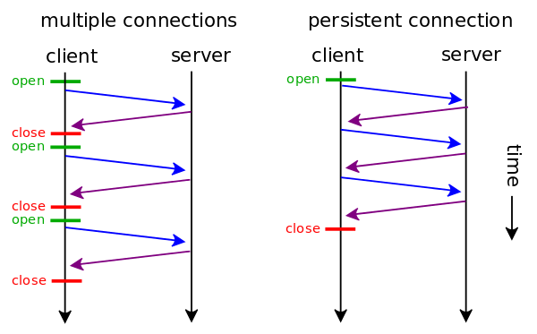

## Android推送服务的几种实现方式

现实生活中, 推送服务就像订杂志一样, 只要留下你的地址, 杂志就能如期送到你手里, 可以认为每个人都有唯一的一个地址, 但在目前的网络上, 这是办不到的, 因为不是每个人都有一个唯一的地址, 服务器想要给我们推送一条消息, 必须知道我们的地址, 但服务器不知道我们在哪.

说到推送服务, 我所知道的实现方案有如下几种:

### 轮询

客户端定期询问服务器有没有新的消息, 这样服务器不用管客户端的地址是什么, 客户端来问, 直接告诉它就行.

这种方案最简单, 对于一些不追求实时性的客户端来说, 很适合, 只需要把时间间隔设定成几个小时取一次, 就能很方便的解决问题.

但对于即时通讯产品来说, 这种方案完全不能用. 假设即时通讯软件在网络畅通的情况下发送的消息要求对方10s内就能收到, 如果用轮询, 那么客户端要每隔5s连一次服务器, 如果在移动端, 手机的电量和流量很快就会被消耗殆尽.

### SMS通知

这种方案在移动端是有可能的, 让客户端拦截手机短信, 服务器在有新消息时给用户的手机号发一条特殊的短信, 客户端拦截短信后发现是正常短信就放行, 如果是特殊短信就连接服务器取消息.

运营商不会配合, 用户也不会放心, 这方案普通公司玩不起.

### 长连接

这大概是目前情况下最佳的方案了, 客户端主动和服务器建立TCP长连接之后, 客户端定期向服务器发送心跳包, 有消息的时候, 服务器直接通过这个已经建立好的TCP连接通知客户端.

### XMPP, MQTT等不算推送技术

在网上搜索资料的时候, 经常看见*XMPP协议实现的Android推送*和*MQTT协议实现的Android推送*, 我个人觉得这两种说法都怪怪的, XMPP和MQTT二者都是协议, 尽管我不清楚严格来讲这俩协议工作在哪一层, 但是绝对是在传输层之上的, 姑且认为他俩在TCP/IP四层模型的应用层吧, 闭口不提传输层的实现, 而是扯应用层, 这种说法真是令我费解, 所以我个人认为XMPP, MQTT等等不算推送技术.

> 关于为什么TCP/IP是四层模型, 感谢评论区指出, 对应的是 应用层, 传输层, 网络层, 网络接口层, 也有说法把网络接口层分成两层, 这样就有了五层, 因为TCP/IP是事实上的模型, 所以说法不一很正常, 主流说法是四层.

关于这个XMPP, 我想很多人都是参考Openfire和Smack那套东西, 我一年前尝试用aSmack和Openfire做IM, 不过那个时候什么都不懂, 做的东西很烂, 唯一懂的就是Openfire这东西相当老了, 我看有一些开源的推送解决方案都是在这套东西的基础上改的, 想想这工作量, 挺可怕的.

## 细说TCP长连接与心跳

长连接方案乍一听怪怪的, 什么是长连接? 定时发送心跳, 这和轮询有什么区别? 心跳是干什么的? 同样是定期和服务器沟通, 为什么长连接就比轮询更加优秀? 手机休眠了TCP连接不会断掉吗?

这是我在刚开始研究推送技术的时候的问题, 虽然有些还是没有很准确的答案, 但了解的大概可以分享一下, 有什么错误欢迎指出.

### 什么是长连接

先说短连接, 短连接是通讯双方有数据交互时就建立一个连接, 数据发送完成后，则断开此连接.

长连接就是大家建立连接之后, 不主动断开. 双方互相发送数据, 发完了也不主动断开连接, 之后有需要发送的数据就继续通过这个连接发送.

TCP连接在默认的情况下就是所谓的*长连接*, 也就是说连接双方都不主动关闭连接, 这个连接就应该一直存在.

但是网络中的情况是复杂的, 这个连接可能会被切断. 比如客户端到服务器的链路因为故障断了, 或者服务器宕机了, 或者是你家网线被人剪了, 这些都是一些莫名其妙的导致连接被切断的因素, 还有几种比较特殊的:

#### NAT超时

因为IPv4地址不足, 或者我们想通过无线路由器上网, 我们的设备可能会处在一个NAT设备的后面, 生活中最常见的NAT设备是家用路由器.

NAT设备会在IP封包通过设备时修改源/目的IP地址. 对于家用路由器来说, 使用的是网络地址端口转换(NAPT), 它不仅改IP, 还修改TCP和UDP协议的端口号, 这样就能让内网中的设备共用同一个外网IP. 举个例子, NAPT维护一个类似下表的NAT表

| 内网地址             | 外网地址               |
| ---------------- | ------------------ |
| 192.168.0.2:5566 | 120.132.92.21:9200 |
| 192.168.0.3:7788 | 120.132.92.21:9201 |
| 192.168.0.3:8888 | 120.132.92.21:9202 |

NAT设备会根据NAT表对出去和进来的数据做修改, 比如将`192.168.0.3:8888`发出去的封包改成`120.132.92.21:9202`, 外部就认为他们是在和`120.132.92.21:9202`通信. 同时NAT设备会将`120.132.92.21:9202`收到的封包的IP和端口改成`192.168.0.3:8888`, 再发给内网的主机, 这样内部和外部就能双向通信了, 但如果其中`192.168.0.3:8888 == 120.132.92.21:9202`这一映射因为某些原因被NAT设备淘汰了, 那么外部设备就无法直接与`192.168.0.3:8888`通信了.

我们的设备经常是处在NAT设备的后面, 比如在大学里的校园网, 查一下自己分配到的IP, 其实是内网IP, 表明我们在NAT设备后面, 如果我们在寝室再接个路由器, 那么我们发出的数据包会多经过一次NAT.

国内移动无线网络运营商在链路上一段时间内没有数据通讯后, 会淘汰NAT表中的对应项, 造成链路中断.

#### 网络状态切换

手机网络和WIFI网络切换, 网络断开和连上等情况, 也会使长连接断开. 这里原因可能比较多, 但结果无非就是IP变了, 或者被系统通知连接断了.

#### DHCP的租期

> 目前测试发现安卓系统对DHCP的处理有Bug, DHCP租期到了不会主动续约并且会继续使用过期IP, 这个问题会造成TCP长连接偶然的断连.
>
> 引自[Android微信智能心跳方案](http://mp.weixin.qq.com/s?__biz=MzAwNDY1ODY2OQ==&mid=207243549&idx=1&sn=4ebe4beb8123f1b5ab58810ac8bc5994&scene=4#wechat_redirect)

### 心跳包的作用

网上很多文章介绍长连接的时候都说:

> 因为是长连接, 所以需要定期发送心跳包.
> 心跳包是用来通知服务器客户端当前状态.

提出这些说法的人其实自己也是一知半解. 这些说法其实都对, 但是没有答到点上. 就好像别人问: "你为什么要去食堂"? 这人回答: "检查自己还能不能找到食堂". 这个答案说不上错了, 但是其实这人是去食堂吃饭的, 证明自己认得路只是个附赠品.

明确一点, TCP长连接本质上不需要心跳包来维持, 大家可以试一试, 让两台电脑连上同一个wifi, 然后让其中一台做服务器, 另一台用一个普通的没有设置`KeepAlive`的`Socket`连上服务器, 只要两台电脑别断网, 路由器也别断电, DHCP正常续租, 就这么放着, 过几个小时再用其中一台电脑通过之前建立的TCP连接给另一台发消息, 另一台肯定能收到.

那为什么要有心跳包呢? 其实**主要是为了防止上面提到的NAT超时**, 既然一些NAT设备判断是否淘汰NAT映射的依据是一定时间没有数据, 那么客户端就主动发一个数据.

当然, 如果仅仅是为了防止NAT超时, 可以让服务器来发送心跳包给客户端, 不过这样做有个弊病就是, 万一连接断了, 服务器就再也联系不上客户端了. 所以心跳包必须由客户端发送, 客户端发现连接断了, 还可以尝试重连服务器.

所以心跳包的主要作用是防止NAT超时, 其次是探测连接是否断开. 

链路断开, 没有写操作的TCP连接是感知不到的, 除非这个时候发送数据给服务器, 造成写超时, 否则TCP连接不会知道断开了. 主动kill掉一方的进程, 另一方会关闭TCP连接, 是系统代进程给服务器发的FIN. TCP连接就是这样, 只有明确的收到对方发来的关闭连接的消息(收到RST也会关闭, 大家都懂), 或者自己意识到发生了写超时, 否则它认为连接还存在.

### 心跳包的时间间隔

既然心跳包的主要作用是防止NAT超时, 那么这个间隔就大有文章了.

发送心跳包势必要先唤醒设备, 然后才能发送, 如果唤醒设备过于频繁, 或者直接导致设备无法休眠, 会大量消耗电量, 而且移动网络下进行网络通信, 比在wifi下耗电得多. 所以这个心跳包的时间间隔应该尽量的长, 最理想的情况就是根本没有NAT超时, 比如刚才我说的两台在同一个wifi下的电脑, 完全不需要心跳包. 这也就是网上常说的*长连接, 慢心跳*.

现实是残酷的, 根据网上的一些说法, 中移动2/3G下, NAT超时时间为5分钟, 中国电信3G则大于28分钟, 理想的情况下, 客户端应当以略小于NAT超时时间的间隔来发送心跳包.

wifi下, NAT超时时间都会比较长, 据说宽带的网关一般没有空闲释放机制, GCM有些时候在wifi下的心跳比在移动网络下的心跳要快, 可能是因为wifi下联网通信耗费的电量比移动网络下小.

关于如何让心跳间隔逼近NAT超时的间隔, 同时自动适应NAT超时间隔的变化, 可以参看[Android微信智能心跳方案](http://mp.weixin.qq.com/s?__biz=MzAwNDY1ODY2OQ==&mid=207243549&idx=1&sn=4ebe4beb8123f1b5ab58810ac8bc5994&scene=4#wechat_redirect).

### 服务器如何处理心跳包

如果客户端心跳间隔是固定的, 那么服务器在连接闲置超过这个时间还没收到心跳时, 可以认为对方掉线, 关闭连接. 如果客户端心跳会动态改变, 如上节提到的微信心跳方案, 应当设置一个最大值, 超过这个最大值才认为对方掉线. 还有一种情况就是服务器通过TCP连接主动给客户端发消息出现写超时, 可以直接认为对方掉线.

这个就需要具体业务具体分析了, 也许还有更优的策略, 这里就不写了.

### 心跳包和轮询的区别

心跳包和轮询看起来类似, 都是客户端主动联系服务器, 但是区别很大.

- 轮询是为了获取数据, 而心跳是为了保活TCP连接.
- 轮询得越频繁, 获取数据就越及时, 心跳的频繁与否和数据是否及时没有直接关系
- 轮询比心跳能耗更高, 因为一次轮询需要经过TCP三次握手, 四次挥手, 单次心跳不需要建立和拆除TCP连接.

### TCP唤醒Android

*这部分内容我只知道结论, 不知道具体的知识*
大家有没有想过, 手机的短信功能和微信的功能差不多, 为什么微信会比短信耗电这么多? 当然不是因为短信一条0.1元. 手机短信是通过什么获取推送的呢?
下面这段出处不明的话也许可以给大家启示

> 首先Android手机有两个处理器, 一个叫Application Processor(AP), 一个叫Baseband Processor(BP). AP是ARM架构的处理器，用于运行Android系统; BP用于运行实时操作系统(RTOS), 通讯协议栈运行于BP的RTOS之上. 非通话时间, BP的能耗基本上在5mA左右，而AP只要处于非休眠状态, 能耗至少在50mA以上, 执行图形运算时会更高. 另外LCD工作时功耗在100mA左右, WIFI也在100mA左右. 一般手机待机时, AP, LCD, WIFI均进入休眠状态, 这时Android中应用程序的代码也会停止执行.
>
> Android为了确保应用程序中关键代码的正确执行, 提供了Wake Lock的API, 使得应用程序有权限通过代码阻止AP进入休眠状态. 但如果不领会Android设计者的意图而滥用Wake Lock API, 为了自身程序在后台的正常工作而长时间阻止AP进入休眠状态, 就会成为待机电池杀手.
>
> 完全没必要担心AP休眠会导致收不到消息推送. 通讯协议栈运行于BP，一旦收到数据包, BP会将AP唤醒, 唤醒的时间足够AP执行代码完成对收到的数据包的处理过程. 其它的如Connectivity事件触发时AP同样会被唤醒. 那么唯一的问题就是程序如何执行向服务器发送心跳包的逻辑. 你显然不能靠AP来做心跳计时. Android提供的Alarm Manager就是来解决这个问题的. Alarm应该是BP计时(或其它某个带石英钟的芯片，不太确定，但绝对不是AP), 触发时唤醒AP执行程序代码. 那么Wake Lock API有啥用呢? 比如心跳包从请求到应答, 比如断线重连重新登陆这些关键逻辑的执行过程, 就需要Wake Lock来保护. 而一旦一个关键逻辑执行成功, 就应该立即释放掉Wake Lock了. 两次心跳请求间隔5到10分钟, 基本不会怎么耗电. 除非网络不稳定. 频繁断线重连, 那种情况办法不多.

上面所说的通信协议, 我猜应该是无线资源控制协议(Radio Resource Control), RRC应该工作在OSI参考模型中的第三层网络层, 而TCP, UDP工作在第四层传输层, 上文说的BP, 应该就是手机中的基带, 也有叫Radio的, 我有点搞不清楚Radio怎么翻译. Google在[Optimizing Downloads for Efficient Network Access](http://developer.android.com/training/efficient-downloads/efficient-network-access.html#RadioStateMachine)中提到了一个叫Radio State Machine的东西, 我翻译成*无线电波状态机*, 也不知道正确的翻译是什么.

移动网络下, 每一个TCP连接底层都应该是有RRC连接, 而RRC连接会唤醒基带, 基带会唤醒CPU处理TCP数据, 这是我个人的理解.

至于wifi下如何工作, 我暂时没有找到资料.

上面说了这么多, 其实意思就是TCP数据包能唤醒手机. 至于UDP, 我不确定.

而推送中最重要的部分就是让手机尽量休眠, 只有在服务器需要它处理数据时才唤醒它, 这正好符合我们的要求.

### 移动网络下的耗电

Google在[Optimizing Downloads for Efficient Network Access](http://developer.android.com/training/efficient-downloads/efficient-network-access.html#RadioStateMachine)中提到了一个叫Radio State Machine的东西.

mobile radio state machine

说的应该就是基带的工作状态, 在Radio Standby下几乎不耗电, 但是一旦有需要处理的事情, 比如手机里某个app要访问网络(从上一节可以推测: 收到RRC指令也会导致唤醒), 就会进入到Radio Full Power中, 由Standby转为Full Power这一唤醒过程很耗电, Full Power下基带空闲后5s进入Radio Low Power, 如果又空闲12s才进入Standby. 主要的意思就是不要频繁的唤醒基带去请求网络, 因为只要一唤醒, 就至少会让基带在Full Power下工作5s, 在Low Power下工作12s, 而且唤醒过程很耗电. 所以在移动网络下, 心跳需要尽量的慢才好, 不过以当前这种情况, 想慢下来几乎不可能.

不过这也带来另外一个问题, 假如手机里有10个应用, 每个应用都发送心跳包, 每个应用的服务器都可能唤醒手机, 那手机还休不休眠了?