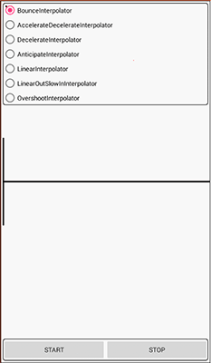
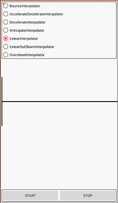
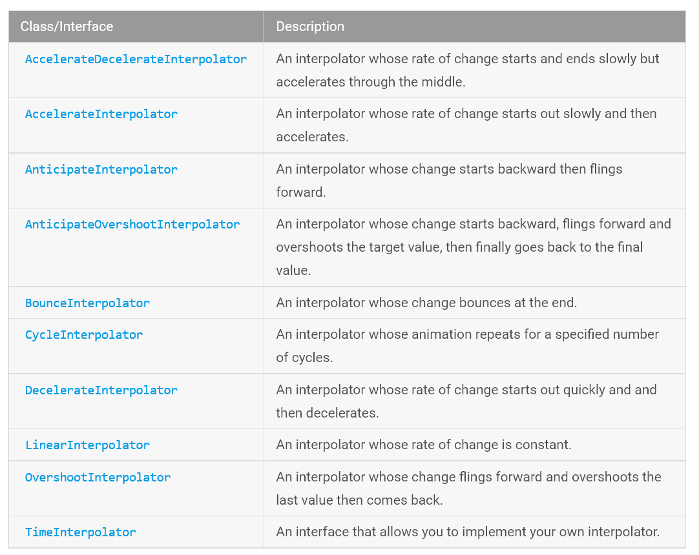
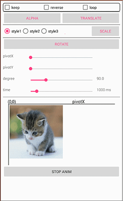
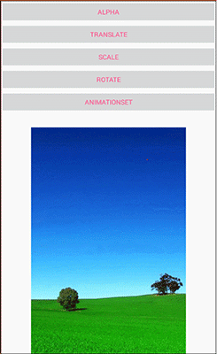

## 一、Android 动画分类

总的来说，Android动画可以分为两类，最初的**传统动画**和Android3.0 之后出现的**属性动画**；

传统动画又包括 帧动画（Frame Animation）和补间动画（Tweened Animation）。

## 二、传统动画

### 帧动画

帧动画是最容易实现的一种动画，这种动画更多的依赖于完善的UI资源，他的原理就是将一张张单独的图片连贯的进行播放，从而在视觉上产生一种动画的效果；有点类似于某些软件制作gif动画的方式。


如上图中的京东加载动画，代码要做的事情就是把一幅幅的图片按顺序显示，造成动画的视觉效果。

**京东动画实现**

```xml
<?xml version="1.0" encoding="utf-8"?>
<animation-list xmlns:android="http://schemas.android.com/apk/res/android">
    <item
        android:drawable="@drawable/a_0"
        android:duration="100" />
    <item
        android:drawable="@drawable/a_1"
        android:duration="100" />
    <item
        android:drawable="@drawable/a_2"
        android:duration="100" />
</animation-list>
```

```java
protected void onCreate(@Nullable Bundle savedInstanceState) {
        super.onCreate(savedInstanceState);
        setContentView(R.layout.activity_frame_animation);
        ImageView animationImg1 = (ImageView) findViewById(R.id.animation1);
        animationImg1.setImageResource(R.drawable.frame_anim1);
        AnimationDrawable animationDrawable1 = (AnimationDrawable) animationImg1.getDrawable();
        animationDrawable1.start();
    }
```

*可以说，图片资源决定了这种方式可以实现怎样的动画*

*在有些代码中，我们还会看到android：oneshot="false" ，这个oneshot 的含义就是动画执行一次（true）还是循环执行多次。*

这里其他几个动画实现方式都是一样，无非就是图片资源的差异。

### 补间动画

补间动画又可以分为四种形式，分别是 **alpha（淡入淡出），translate（位移），scale（缩放大小），rotate（旋转）**。
补间动画的实现，一般会采用xml 文件的形式；代码会更容易书写和阅读，同时也更容易复用。

#### XML 实现

首先，在res/anim/ 文件夹下定义如下的动画实现方式

**alpha_anim.xml 动画实现**

```xml
<?xml version="1.0" encoding="utf-8"?>
<alpha xmlns:android="http://schemas.android.com/apk/res/android"
    android:duration="1000"
    android:fromAlpha="1.0"
    android:interpolator="@android:anim/accelerate_decelerate_interpolator"
    android:toAlpha="0.0" />
```

**scale.xml 动画实现**

```xml
<?xml version="1.0" encoding="utf-8"?>
<scale xmlns:android="http://schemas.android.com/apk/res/android"
    android:duration="1000"
    android:fromXScale="0.0"
    android:fromYScale="0.0"
    android:pivotX="50%"
    android:pivotY="50%"
    android:toXScale="1.0"
    android:toYScale="1.0"/>
```

然后，在Activity中 

```java
Animation animation = AnimationUtils.loadAnimation(mContext, R.anim.alpha_anim);
img = (ImageView) findViewById(R.id.img);
img.startAnimation(animation);
```

这样就可以实现ImageView alpha 透明变化的动画效果。

也可以使用set 标签将多个动画组合（代码源自Android SDK API）

```xml
<?xml version="1.0" encoding="utf-8"?>
<set xmlns:android="http://schemas.android.com/apk/res/android"
    android:interpolator="@[package:]anim/interpolator_resource"
    android:shareInterpolator=["true" | "false"] >
    <alpha
        android:fromAlpha="float"
        android:toAlpha="float" />
    <scale
        android:fromXScale="float"
        android:toXScale="float"
        android:fromYScale="float"
        android:toYScale="float"
        android:pivotX="float"
        android:pivotY="float" />
    <translate
        android:fromXDelta="float"
        android:toXDelta="float"
        android:fromYDelta="float"
        android:toYDelta="float" />
    <rotate
        android:fromDegrees="float"
        android:toDegrees="float"
        android:pivotX="float"
        android:pivotY="float" />
    <set>
        ...
    </set>
</set>
```

可以看到组合动画是可以嵌套使用的。

各个动画属性的含义结合动画自身的特点应该很好理解，就不一一阐述了；这里主要说一下**interpolator** 和 **pivot**。

> Interpolator 主要作用是可以控制动画的变化速率 ，就是动画进行的快慢节奏。

Android 系统已经为我们提供了一些Interpolator ，比如 accelerate_decelerate_interpolator，accelerate_interpolator等。更多的interpolator 及其含义可以在Android SDK 中查看。同时这个Interpolator也是可以自定义的，这个后面还会提到。

> pivot 决定了当前动画执行的参考位置

pivot 这个属性主要是在translate 和 scale 动画中，这两种动画都牵扯到view 的“物理位置“发生变化，所以需要一个参考点。而pivotX和pivotY就共同决定了这个点；它的值可以是float或者是百分比数值。

我们以pivotX为例，

| pivotX取值 | 含义                               |
| -------- | -------------------------------- |
| 10       | 距离动画所在view自身左边缘10像素              |
| 10%      | 距离动画所在view自身左边缘 的距离是整个view宽度的10% |
| 10%p     | 距离动画所在view父控件左边缘的距离是整个view宽度的10% |

pivotY 也是相同的原理，只不过变成的纵向的位置。如果还是不明白可以参考[源码](https://github.com/REBOOTERS/AndroidAnimationExercise)，在Tweened Animation中结合seekbar的滑动观察rotate的变化理解。


#### Java Code  实现

有时候，动画的属性值可能需要动态的调整，这个时候使用xml 就不合适了，需要使用java代码实现

```java
private void RotateAnimation() {
        animation = new RotateAnimation(-deValue, deValue, Animation.RELATIVE_TO_SELF,
                pxValue, Animation.RELATIVE_TO_SELF, pyValue);
        animation.setDuration(timeValue);

        if (keep.isChecked()) {
            animation.setFillAfter(true);
        } else {
            animation.setFillAfter(false);
        }
        if (loop.isChecked()) {
            animation.setRepeatCount(-1);
        } else {
            animation.setRepeatCount(0);
        }

        if (reverse.isChecked()) {
            animation.setRepeatMode(Animation.REVERSE);
        } else {
            animation.setRepeatMode(Animation.RESTART);
        }
        img.startAnimation(animation);
    }
```

**这里animation.setFillAfter决定了动画在播放结束时是否保持最终的状态；animation.setRepeatCount和animation.setRepeatMode 决定了动画的重复次数及重复方式，具体细节可查看源码理解。**

好了，传统动画的内容就说到这里了。

## 三、属性动画

属性动画，顾名思义它是对于对象属性的动画。因此，所有补间动画的内容，都可以通过属性动画实现。

### 属性动画入门

首先我们来看看如何用属性动画实现上面补间动画的效果

```java
    private void RotateAnimation() {
        ObjectAnimator anim = ObjectAnimator.ofFloat(myView, "rotation", 0f, 360f);
        anim.setDuration(1000);
        anim.start();
    }

    private void AlpahAnimation() {
        ObjectAnimator anim = ObjectAnimator.ofFloat(myView, "alpha", 1.0f, 0.8f, 0.6f, 0.4f, 0.2f, 0.0f);
        anim.setRepeatCount(-1);
        anim.setRepeatMode(ObjectAnimator.REVERSE);
        anim.setDuration(2000);
        anim.start();
    }
```

这两个方法用属性动画的方式分别实现了旋转动画和淡入淡出动画，其中setDuration、setRepeatMode及setRepeatCount和补间动画中的概念是一样的。

可以看到，属性动画貌似强大了许多，实现很方便，同时动画可变化的值也有了更多的选择，动画所能呈现的细节也更多。

当然属性动画也是可以组合实现的

```java
                ObjectAnimator alphaAnim = ObjectAnimator.ofFloat(myView, "alpha", 1.0f, 0.5f, 0.8f, 1.0f);
                ObjectAnimator scaleXAnim = ObjectAnimator.ofFloat(myView, "scaleX", 0.0f, 1.0f);
                ObjectAnimator scaleYAnim = ObjectAnimator.ofFloat(myView, "scaleY", 0.0f, 2.0f);
                ObjectAnimator rotateAnim = ObjectAnimator.ofFloat(myView, "rotation", 0, 360);
                ObjectAnimator transXAnim = ObjectAnimator.ofFloat(myView, "translationX", 100, 400);
                ObjectAnimator transYAnim = ObjectAnimator.ofFloat(myView, "tranlsationY", 100, 750);
                AnimatorSet set = new AnimatorSet();
                set.playTogether(alphaAnim, scaleXAnim, scaleYAnim, rotateAnim, transXAnim, transYAnim);
//                set.playSequentially(alphaAnim, scaleXAnim, scaleYAnim, rotateAnim, transXAnim, transYAnim);
                set.setDuration(3000);
                set.start();
```

可以看到这些动画可以同时播放，或者是按序播放。

### 属性动画核心原理

在上面实现属性动画的时候，我们反复的使用到了ObjectAnimator  这个类，这个类继承自ValueAnimator，使用这个类可以对任意对象的**任意属性**进行动画操作。而ValueAnimator是整个属性动画机制当中最核心的一个类；这点从下面的图片也可以看出。


属性动画核心原理，此图来自于Android SDK API 文档。

> 属性动画的运行机制是通过不断地对值进行操作来实现的，而初始值和结束值之间的动画过渡就是由ValueAnimator这个类来负责计算的。它的内部使用一种时间循环的机制来计算值与值之间的动画过渡，我们只需要将初始值和结束值提供给ValueAnimator，并且告诉它动画所需运行的时长，那么ValueAnimator就会自动帮我们完成从初始值平滑地过渡到结束值这样的效果。除此之外，ValueAnimator还负责管理动画的播放次数、播放模式、以及对动画设置监听器等。

从上图我们可以了解到，通过duration、startPropertyValue和endPropertyValue 等值，我们就可以定义动画运行时长，初始值和结束值。然后通过start方法开始动画。
那么ValueAnimator 到底是怎样实现从初始值平滑过渡到结束值的呢？这个就是由TypeEvaluator 和TimeInterpolator 共同决定的。

具体来说，**TypeEvaluator 决定了动画如何从初始值过渡到结束值。**

**TimeInterpolator 决定了动画从初始值过渡到结束值的节奏。**

说的通俗一点，你每天早晨出门去公司上班，TypeEvaluator决定了你是坐公交、坐地铁还是骑车；而当你决定骑车后，TimeInterpolator决定了你一路上骑行的方式，你可以匀速的一路骑到公司，你也可以前半程骑得飞快，后半程骑得慢悠悠。

如果，还是不理解，那么就看下面的代码吧。首先看一下下面的这两个gif动画，一个小球在屏幕上以 y=sin(x) 的数学函数轨迹运行，同时小球的颜色和半径也发生着变化，可以发现，两幅图动画变化的节奏也是不一样的。





*如果不考虑属性动画，这样的一个动画纯粹的使用Canvas+Handler的方式绘制也是有可能实现的。但是会复杂很多，而且加上各种线程，会带来很多意想不到的问题。*

这里就通过自定义属性动画的方式看看这个动画是如何实现的。

### 属性动画自定义实现

这个动画最关键的三点就是 运动轨迹、小球半径及颜色的变化；我们就从这三个方面展开。最后我们在结合Interpolator说一下TimeInterpolator的意义。

##### 用TypeEvaluator 确定运动轨迹

前面说了，TypeEvaluator决定了动画如何从初始值过渡到结束值。这个TypeEvaluator是个接口，我们可以实现这个接口。

```java
public class PointSinEvaluator implements TypeEvaluator {

    @Override
    public Object evaluate(float fraction, Object startValue, Object endValue) {
        Point startPoint = (Point) startValue;
        Point endPoint = (Point) endValue;
        float x = startPoint.getX() + fraction * (endPoint.getX() - startPoint.getX());

        float y = (float) (Math.sin(x * Math.PI / 180) * 100) + endPoint.getY() / 2;
        Point point = new Point(x, y);
        return point;
    }
}
```

PointSinEvaluator 继承了TypeEvaluator类，并实现了他唯一的方法evaluate；这个方法有三个参数，第一个参数fraction 代表当前动画完成的**百分比**，这个值是如何变化的后面还会提到；第二个和第三个参数代表动画的**初始值和结束值**。这里我们的逻辑很简单，x的值随着fraction 不断变化，并最终达到结束值；y的值就是当前x值所对应的sin(x) 值，然后用x 和 y 产生一个新的点（Point对象）返回。

这样我们就可以使用这个PointSinEvaluator 生成属性动画的实例了。

```java
        Point startP = new Point(RADIUS, RADIUS);//初始值（起点）
        Point endP = new Point(getWidth() - RADIUS, getHeight() - RADIUS);//结束值（终点）
        final ValueAnimator valueAnimator = ValueAnimator.ofObject(new PointSinEvaluator(), startP, endP);
        valueAnimator.setRepeatCount(-1);
        valueAnimator.setRepeatMode(ValueAnimator.REVERSE);
        valueAnimator.addUpdateListener(new ValueAnimator.AnimatorUpdateListener() {
            @Override
            public void onAnimationUpdate(ValueAnimator animation) {
                currentPoint = (Point) animation.getAnimatedValue();
                postInvalidate();
            }
        });
```

这样我们就完成了动画轨迹的定义，现在只要调用valueAnimator.start() 方法，就会绘制出一个正弦曲线的轨迹。

##### 颜色及半径动画实现

之前我们说过，使用ObjectAnimator  可以对任意对象的任意属性进行动画操作，这句话是不太严谨的，这个任意属性还需要有get 和 set  方法。

```java
public class PointAnimView extends View {

    /**
     * 实现关于color 的属性动画
     */
    private int color;
    private float radius = RADIUS;

    .....

}
```

这里在我们的自定义view中，定义了两个属性color 和 radius，并实现了他们各自的get set 方法，这样我们就可以使用属性动画的特点实现小球颜色变化的动画和半径变化的动画。

```java
        ObjectAnimator animColor = ObjectAnimator.ofObject(this, "color", new ArgbEvaluator(), Color.GREEN,
                Color.YELLOW, Color.BLUE, Color.WHITE, Color.RED);
        animColor.setRepeatCount(-1);
        animColor.setRepeatMode(ValueAnimator.REVERSE);


        ValueAnimator animScale = ValueAnimator.ofFloat(20f, 80f, 60f, 10f, 35f,55f,10f);
        animScale.setRepeatCount(-1);
        animScale.setRepeatMode(ValueAnimator.REVERSE);
        animScale.setDuration(5000);
        animScale.addUpdateListener(new ValueAnimator.AnimatorUpdateListener() {
            @Override
            public void onAnimationUpdate(ValueAnimator animation) {
                radius = (float) animation.getAnimatedValue();
            }
        });
```

这里，我们使用ObjectAnimator  实现对color 属性的值按照ArgbEvaluator 这个类的规律在给定的颜色值之间变化，这个ArgbEvaluator 和我们之前定义的PointSinEvaluator一样，都是决定动画如何从初始值过渡到结束值的，只不过这个类是系统自带的，我们直接拿来用就可以，他可以实现各种颜色间的自由过渡。

对radius 这个属性使用了ValueAnimator，使用了其ofFloat方法实现了一系列float值的变化；同时为其添加了动画变化的监听器，在属性值更新的过程中，我们可以将变化的结果赋给radius，这样就实现了半径动态的变化。

**这里radius 也可以使用和color相同的方式，只需要把ArgbEvaluator 替换为FloatEvaluator，同时修改动画的变化值即可；使用添加监听器的方式，只是为了介绍监听器的使用方法而已**

好了，到这里我们已经定义出了所有需要的动画，前面说过，属性动画也是可以组合使用的。因此，在动画启动的时候，同时播放这三个动画，就可以实现图中的效果了。

```java
        animSet = new AnimatorSet();
        animSet.play(valueAnimator).with(animColor).with(animScale);
        animSet.setDuration(5000);
        animSet.setInterpolator(interpolatorType);
        animSet.start();
```

PointAnimView  源码

```java
public class PointAnimView extends View {

    public static final float RADIUS = 20f;

    private Point currentPoint;

    private Paint mPaint;
    private Paint linePaint;

    private AnimatorSet animSet;
    private TimeInterpolator interpolatorType = new LinearInterpolator();

    /**
     * 实现关于color 的属性动画
     */
    private int color;
    private float radius = RADIUS;

    public PointAnimView(Context context) {
        super(context);
        init();
    }


    public PointAnimView(Context context, AttributeSet attrs) {
        super(context, attrs);
        init();
    }

    public PointAnimView(Context context, AttributeSet attrs, int defStyleAttr) {
        super(context, attrs, defStyleAttr);
        init();
    }


    public int getColor() {
        return color;
    }

    public void setColor(int color) {
        this.color = color;
        mPaint.setColor(this.color);
    }

    public float getRadius() {
        return radius;
    }

    public void setRadius(float radius) {
        this.radius = radius;
    }

    private void init() {
        mPaint = new Paint(Paint.ANTI_ALIAS_FLAG);
        mPaint.setColor(Color.TRANSPARENT);

        linePaint = new Paint(Paint.ANTI_ALIAS_FLAG);
        linePaint.setColor(Color.BLACK);
        linePaint.setStrokeWidth(5);
    }

    @Override
    protected void onDraw(Canvas canvas) {
        if (currentPoint == null) {
            currentPoint = new Point(RADIUS, RADIUS);
            drawCircle(canvas);
//            StartAnimation();
        } else {
            drawCircle(canvas);
        }

        drawLine(canvas);
    }

    private void drawLine(Canvas canvas) {
        canvas.drawLine(10, getHeight() / 2, getWidth(), getHeight() / 2, linePaint);
        canvas.drawLine(10, getHeight() / 2 - 150, 10, getHeight() / 2 + 150, linePaint);
        canvas.drawPoint(currentPoint.getX(), currentPoint.getY(), linePaint);

    }

    public void StartAnimation() {
        Point startP = new Point(RADIUS, RADIUS);
        Point endP = new Point(getWidth() - RADIUS, getHeight() - RADIUS);
        final ValueAnimator valueAnimator = ValueAnimator.ofObject(new PointSinEvaluator(), startP, endP);
        valueAnimator.setRepeatCount(-1);
        valueAnimator.setRepeatMode(ValueAnimator.REVERSE);
        valueAnimator.addUpdateListener(new ValueAnimator.AnimatorUpdateListener() {
            @Override
            public void onAnimationUpdate(ValueAnimator animation) {
                currentPoint = (Point) animation.getAnimatedValue();
                postInvalidate();
            }
        });

//
        ObjectAnimator animColor = ObjectAnimator.ofObject(this, "color", new ArgbEvaluator(), Color.GREEN,
                Color.YELLOW, Color.BLUE, Color.WHITE, Color.RED);
        animColor.setRepeatCount(-1);
        animColor.setRepeatMode(ValueAnimator.REVERSE);


        ValueAnimator animScale = ValueAnimator.ofFloat(20f, 80f, 60f, 10f, 35f,55f,10f);
        animScale.setRepeatCount(-1);
        animScale.setRepeatMode(ValueAnimator.REVERSE);
        animScale.setDuration(5000);
        animScale.addUpdateListener(new ValueAnimator.AnimatorUpdateListener() {
            @Override
            public void onAnimationUpdate(ValueAnimator animation) {
                radius = (float) animation.getAnimatedValue();
            }
        });


        animSet = new AnimatorSet();
        animSet.play(valueAnimator).with(animColor).with(animScale);
        animSet.setDuration(5000);
        animSet.setInterpolator(interpolatorType);
        animSet.start();

    }

    private void drawCircle(Canvas canvas) {
        float x = currentPoint.getX();
        float y = currentPoint.getY();
        canvas.drawCircle(x, y, radius, mPaint);
    }


    public void setInterpolatorType(int type ) {
        switch (type) {
            case 1:
                interpolatorType = new BounceInterpolator();
                break;
            case 2:
                interpolatorType = new AccelerateDecelerateInterpolator();
                break;
            case 3:
                interpolatorType = new DecelerateInterpolator();
                break;
            case 4:
                interpolatorType = new AnticipateInterpolator();
                break;
            case 5:
                interpolatorType = new LinearInterpolator();
                break;
            case 6:
                interpolatorType=new LinearOutSlowInInterpolator();
                break;
            case 7:
                interpolatorType = new OvershootInterpolator();
            default:
                interpolatorType = new LinearInterpolator();
                break;
        }
    }


    @TargetApi(Build.VERSION_CODES.KITKAT)
    public void pauseAnimation() {
        if (animSet != null) {
            animSet.pause();
        }
    }


    public void stopAnimation() {
        if (animSet != null) {
            animSet.cancel();
            this.clearAnimation();
        }
    }
}
```

#### TimeInterpolator 介绍

Interpolator的概念其实我们并不陌生，在补间动画中我们就使用到了。他就是用来控制动画快慢节奏的；而在属性动画中，TimeInterpolator 也是类似的作用；TimeInterpolator 继承自Interpolator。我们可以继承TimerInterpolator 以自己的方式控制动画变化的节奏，也可以使用Android 系统提供的Interpolator。

下面都是系统帮我们定义好的一些Interpolator，我们可以通过setInterpolator 设置不同的Interpolator。



这里我们使用的Interpolator就决定了 前面我们提到的fraction。变化的节奏决定了动画所执行的百分比。不得不说，这么ValueAnimator的设计的确是很巧妙。

#### XML 属性动画

这里提一下，属性动画当然也可以使用xml文件的方式实现，但是属性动画的属性值一般会牵扯到对象具体的属性，更多是通过代码动态获取，所以xml文件的实现会有些不方便。

```xml
<set android:ordering="sequentially">
    <set>
        <objectAnimator
            android:propertyName="x"
            android:duration="500"
            android:valueTo="400"
            android:valueType="intType"/>
        <objectAnimator
            android:propertyName="y"
            android:duration="500"
            android:valueTo="300"
            android:valueType="intType"/>
    </set>
    <objectAnimator
        android:propertyName="alpha"
        android:duration="500"
        android:valueTo="1f"/>
</set>
```

使用方式：

```java
AnimatorSet set = (AnimatorSet) AnimatorInflater.loadAnimator(myContext,
    R.anim.property_animator);
set.setTarget(myObject);
set.start();
```

xml 文件中的标签也和属性动画的类相对应。

```xml
 ValueAnimator --- <animator> 
 ObjectAnimator --- <objectAnimator> 
 AnimatorSet --- <set>
```

这些就是属性动画的核心内容。现在使用属性动画的特性自定义动画应该不是难事了。其余便签的含义，结合之前的内容应该不难理解了。

## 四、传统动画 VS 属性动画

相较于传统动画，属性动画有很多优势。那是否意味着属性动画可以完全替代传统动画呢。其实不然，两种动画都有各自的优势，属性动画如此强大，也不是没有缺点。





- 从上面两幅图比较可以发现，补间动画中，虽然使用translate将图片移动了，但是点击原来的位置，依旧可以发生点击事件，而属性动画却不是。因此我们可以确定，属性动画才是真正的实现了view的移动，补间动画对view的移动更像是在不同地方绘制了一个影子，实际的对象还是处于原来的地方。
- 当我们把动画的repeatCount设置为无限循环时，如果在Activity退出时没有及时将动画停止，属性动画会导致Activity无法释放而导致内存泄漏，而补间动画却没有问题。因此，使用属性动画时切记在Activity执行 onStop 方法时顺便将动画停止。（对这个怀疑的同学可以自己通过在动画的Update  回调方法打印日志的方式进行验证）。
- xml 文件实现的补间动画，复用率极高。在Activity切换，窗口弹出时等情景中有着很好的效果。
- 使用帧动画时需要注意，不要使用过多特别大的图，容易导致内存不足。