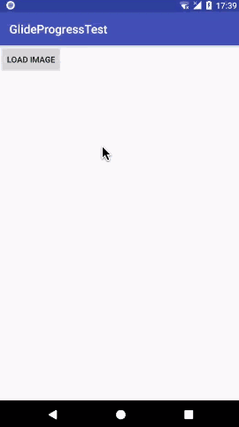
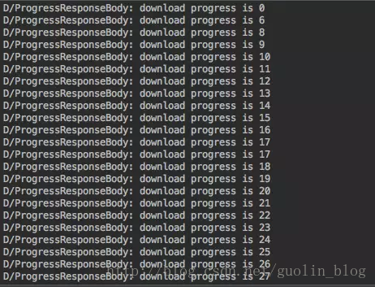
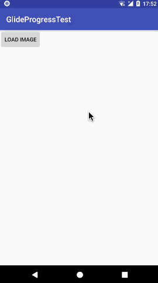
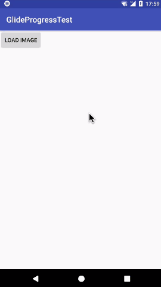

我们的Glide系列文章终于要进入收尾篇了。从我开始写这个系列的第一篇文章时，我就知道这会是一个很长的系列，只是没有想到竟然会写这么久。

在前面的六篇文章中，我们对Glide的方方面面都进行了学习，包括[基本用法](Glide-1.html)、[源码解析](Glide-2.html)、[缓存机制](Glide-3.html)、[回调与监听](Glide-4.html)、[图片变换](Glide-5.html)以及[自定义模块](Glide-6.html)。而今天，我们就要综合利用之前所学到的知识，来对Glide进行一个比较大的功能扩展，希望大家都已经好好阅读过了前面的六篇文章，并且有了不错的理解。


## 扩展目标
首先来确立一下功能扩展的目标。虽说Glide本身就已经十分强大了，但是有一个功能却长期以来都不支持，那就是监听下载进度功能。

我们都知道，使用Glide来加载一张网络上的图片是非常简单的，但是让人头疼的是，我们却无从得知当前图片的下载进度。如果这张图片很小的话，那么问题也不大，反正很快就会被加载出来。但如果这是一张比较大的GIF图，用户耐心等了很久结果图片还没显示出来，这个时候你就会觉得下载进度功能是十分有必要的了。

好的，那么我们今天的目标就是对Glide进行功能扩展，使其支持监听图片下载进度的功能。


## 开始
今天这篇文章我会带着大家从零去创建一个新的项目，一步步地进行实现，最终完成一个带进度的Glide图片加载的Demo。当然，在本篇文章的最后我会提供这个Demo的完整源码，但是这里我仍然希望大家能用心跟着我一步步来编写。

那么我们现在就开始吧，首先创建一个新项目，就叫做GlideProgressTest吧。

项目创建完成后的第一件事就是要将必要的依赖库引入到当前的项目当中，目前我们必须要依赖的两个库就是Glide和OkHttp。在app/build.gradle文件当中添加如下配置：
```java
dependencies { 
    compile 'com.github.bumptech.glide:glide:3.7.0' 
    compile 'com.squareup.okhttp3:okhttp:3.9.0' 
}
```

另外，由于Glide和OkHttp都需要用到网络功能，因此我们还得在AndroidManifest.xml中声明一下网络权限才行：
```java
<uses-permission android:name="android.permission.INTERNET" />
```

好了，这样准备工作就完成了。


## 替换通讯组件
通过[第二篇](Glide-2.html)文章的源码分析，我们知道了Glide内部HTTP通讯组件的底层实现是基于HttpUrlConnection来进行定制的。但是HttpUrlConnection的可扩展性比较有限，我们在它的基础之上无法实现监听下载进度的功能，因此今天的第一个大动作就是要将Glide中的HTTP通讯组件替换成OkHttp。

关于HTTP通讯组件的替换原理和替换方式，我在[第六篇](Glide-6.html)文章当中都介绍得比较清楚了，这里就不再赘述。下面我们就来开始快速地替换一下。

新建一个OkHttpFetcher类，并且实现DataFetcher接口，代码如下所示：
```java
public class OkHttpFetcher implements DataFetcher<InputStream> { 

    private final OkHttpClient client; 
    private final GlideUrl url; 
    private InputStream stream; 
    private ResponseBody responseBody; 
    private volatile boolean isCancelled; 

    public OkHttpFetcher(OkHttpClient client, GlideUrl url) { 
        this.client = client; 
        this.url = url; 
    } 

    @Override 
    public InputStream loadData(Priority priority) throws Exception { 
        Request.Builder requestBuilder = new Request.Builder() 
                .url(url.toStringUrl()); 
        for (Map.Entry<String, String> headerEntry : url.getHeaders().entrySet()) {
            String key = headerEntry.getKey(); 
            requestBuilder.addHeader(key, headerEntry.getValue()); 
        } 
        Request request = requestBuilder.build(); 
        if (isCancelled) { 
            return null; 
        } 
        Response response = client.newCall(request).execute(); 
        responseBody = response.body(); 
        if (!response.isSuccessful() || responseBody == null) { 
            throw new IOException("Request failed with code: " + response.code());
        } 
        stream = ContentLengthInputStream.obtain(responseBody.byteStream(), 
                responseBody.contentLength()); 
        return stream; 
    } 

    @Override 
    public void cleanup() { 
        try { 
            if (stream != null) { 
                stream.close(); 
            } 
            if (responseBody != null) { 
                responseBody.close(); 
            } 
        } catch (IOException e) { 
            e.printStackTrace(); 
        } 
    } 

    @Override 
    public String getId() { 
        return url.getCacheKey(); 
    } 

    @Override 
    public void cancel() { 
        isCancelled = true; 
    } 
}
```

然后新建一个OkHttpGlideUrlLoader类，并且实现ModelLoader
```java
public class OkHttpGlideUrlLoader implements ModelLoader<GlideUrl, InputStream> { 

    private OkHttpClient okHttpClient; 

    public static class Factory implements ModelLoaderFactory<GlideUrl, InputStream> { 

        private OkHttpClient client; 

        public Factory() { 
        } 

        public Factory(OkHttpClient client) { 
            this.client = client; 
        } 

        private synchronized OkHttpClient getOkHttpClient() { 
            if (client == null) { 
                client = new OkHttpClient(); 
            } 
            return client; 
        } 

        @Override 
        public ModelLoader<GlideUrl, InputStream> build(Context context, GenericLoaderFactory factories) {
            return new OkHttpGlideUrlLoader(getOkHttpClient()); 
        } 

        @Override 
        public void teardown() { 
        } 
    } 

    public OkHttpGlideUrlLoader(OkHttpClient client) { 
        this.okHttpClient = client; 
    } 

    @Override 
    public DataFetcher<InputStream> getResourceFetcher(GlideUrl model, int width, int height) { 
        return new OkHttpFetcher(okHttpClient, model); 
    } 
}
```

接下来，新建一个MyGlideModule类并实现GlideModule接口，然后在registerComponents()方法中将我们刚刚创建的OkHttpGlideUrlLoader和OkHttpFetcher注册到Glide当中，将原来的HTTP通讯组件给替换掉，如下所示：
```java
public class MyGlideModule implements GlideModule { 
    @Override 
    public void applyOptions(Context context, GlideBuilder builder) { 
    } 

    @Override 
    public void registerComponents(Context context, Glide glide) { 
        glide.register(GlideUrl.class, InputStream.class, new OkHttpGlideUrlLoader.Factory());
    } 
}
```

最后，为了让Glide能够识别我们自定义的MyGlideModule，还得在AndroidManifest.xml文件当中加入如下配置才行：
```java
<manifest> 
    ... 
    <application> 
        <meta-data 
            android:name="com.example.glideprogresstest.MyGlideModule" 
            android:value="GlideModule" /> 
        ... 
    </application> 
</manifest>
```

OK，这样我们就把Glide中的HTTP通讯组件成功替换成OkHttp了。


## 实现下载进度监听
那么，将HTTP通讯组件替换成OkHttp之后，我们又该如何去实现监听下载进度的功能呢？这就要依靠OkHttp强大的拦截器机制了。

我们只要向OkHttp中添加一个自定义的拦截器，就可以在拦截器中捕获到整个HTTP的通讯过程，然后加入一些自己的逻辑来计算下载进度，这样就可以实现下载进度监听的功能了。

拦截器属于OkHttp的高级功能，不过即使你之前并没有接触过拦截器，我相信你也能轻松看懂本篇文章的，因为它本身并不难。

确定了实现思路之后，那我们就开始动手吧。首先创建一个没有任何逻辑的空拦截器，新建ProgressInterceptor类并实现Interceptor接口，代码如下所示：
```java
public class ProgressInterceptor implements Interceptor { 

    @Override 
    public Response intercept(Chain chain) throws IOException {
        Request request = chain.request(); 
        Response response = chain.proceed(request); 
        return response; 
    } 

}
```

这个拦截器中我们可以说是什么都没有做。就是拦截到了OkHttp的请求，然后调用proceed()方法去处理这个请求，最终将服务器响应的Response返回。

接下来我们需要启用这个拦截器，修改MyGlideModule中的代码，如下所示：
```java
public class MyGlideModule implements GlideModule { 
    @Override 
    public void applyOptions(Context context, GlideBuilder builder) { 
    } 

    @Override 
    public void registerComponents(Context context, Glide glide) { 
        OkHttpClient.Builder builder = new OkHttpClient.Builder(); 
        builder.addInterceptor(new ProgressInterceptor()); 
        OkHttpClient okHttpClient = builder.build(); 
        glide.register(GlideUrl.class, InputStream.class, new OkHttpGlideUrlLoader.Factory(okHttpClient));
    } 
}
```

这里我们创建了一个OkHttpClient.Builder，然后调用addInterceptor()方法将刚才创建的ProgressInterceptor添加进去，最后将构建出来的新OkHttpClient对象传入到OkHttpGlideUrlLoader.Factory中即可。

好的，现在自定义的拦截器已经启用了，接下来就可以开始去实现下载进度监听的具体逻辑了。首先新建一个ProgressListener接口，用于作为进度监听回调的工具，如下所示：
```java
public interface ProgressListener {

    void onProgress(int progress);

}
```

然后我们在ProgressInterceptor中加入注册下载监听和取消注册下载监听的方法。修改ProgressInterceptor中的代码，如下所示：
```java
public class ProgressInterceptor implements Interceptor { 

    static final Map<String, ProgressListener> LISTENER_MAP = new HashMap<>();

    public static void addListener(String url, ProgressListener listener) {
        LISTENER_MAP.put(url, listener); 
    } 

    public static void removeListener(String url) { 
        LISTENER_MAP.remove(url); 
    } 

    @Override 
    public Response intercept(Chain chain) throws IOException { 
        Request request = chain.request(); 
        Response response = chain.proceed(request); 
        return response; 
    } 

}
```

可以看到，这里使用了一个Map来保存注册的监听器，Map的键是一个URL地址。之所以要这么做，是因为你可能会使用Glide同时加载很多张图片，而这种情况下，必须要能区分出来每个下载进度的回调到底是对应哪个图片URL地址的。

接下来就要到今天最复杂的部分了，也就是下载进度的具体计算。我们需要新建一个ProgressResponseBody类，并让它继承自OkHttp的ResponseBody，然后在这个类当中去编写具体的监听下载进度的逻辑，代码如下所示：
```java
public class ProgressResponseBody extends ResponseBody {

    private static final String TAG = "ProgressResponseBody";

    private BufferedSource bufferedSource;

    private ResponseBody responseBody;

    private ProgressListener listener;

    public ProgressResponseBody(String url, ResponseBody responseBody) {
        this.responseBody = responseBody;
        listener = ProgressInterceptor.LISTENER_MAP.get(url);
    }

    @Override
    public MediaType contentType() {
        return responseBody.contentType();
    }

    @Override
    public long contentLength() {
        return responseBody.contentLength();
    }

    @Override 
    public BufferedSource source() {
        if (bufferedSource == null) {
            bufferedSource = Okio.buffer(new ProgressSource(responseBody.source()));
        }
        return bufferedSource;
    }

    private class ProgressSource extends ForwardingSource {

        long totalBytesRead = 0;

        int currentProgress;

        ProgressSource(Source source) {
            super(source);
        }

        @Override 
        public long read(Buffer sink, long byteCount) throws IOException {
            long bytesRead = super.read(sink, byteCount);
            long fullLength = responseBody.contentLength();
            if (bytesRead == -1) {
                totalBytesRead = fullLength;
            } else {
                totalBytesRead += bytesRead;
            }
            int progress = (int) (100f * totalBytesRead / fullLength);
            Log.d(TAG, "download progress is " + progress);
            if (listener != null && progress != currentProgress) {
                listener.onProgress(progress);
            }
            if (listener != null && totalBytesRead == fullLength) {
                listener = null;
            }
            currentProgress = progress;
            return bytesRead;
        }
    }

}
```

其实这段代码也不是很难，下面我来简单解释一下。首先，我们定义了一个ProgressResponseBody的构造方法，该构造方法中要求传入一个url参数和一个ResponseBody参数。那么很显然，url参数就是图片的url地址了，而ResponseBody参数则是OkHttp拦截到的原始的ResponseBody对象。然后在构造方法中，我们调用了ProgressInterceptor中的LISTENER_MAP来去获取该url对应的监听器回调对象，有了这个对象，待会就可以回调计算出来的下载进度了。

由于继承了ResponseBody类之后一定要重写contentType()、contentLength()和source()这三个方法，我们在contentType()和contentLength()方法中直接就调用传入的原始ResponseBody的contentType()和contentLength()方法即可，这相当于一种委托模式。但是在source()方法中，我们就必须加入点自己的逻辑了，因为这里要涉及到具体的下载进度计算。

那么我们具体看一下source()方法，这里先是调用了原始ResponseBody的source()方法来去获取Source对象，接下来将这个Source对象封装到了一个ProgressSource对象当中，最终再用Okio的buffer()方法封装成BufferedSource对象返回。

那么这个ProgressSource是什么呢？它是一个我们自定义的继承自ForwardingSource的实现类。ForwardingSource也是一个使用委托模式的工具，它不处理任何具体的逻辑，只是负责将传入的原始Source对象进行中转。但是，我们使用ProgressSource继承自ForwardingSource，那么就可以在中转的过程中加入自己的逻辑了。

可以看到，在ProgressSource中我们重写了read()方法，然后在read()方法中获取该次读取到的字节数以及下载文件的总字节数，并进行一些简单的数学计算就能算出当前的下载进度了。这里我先使用Log工具将算出的结果打印了一下，再通过前面获取到的回调监听器对象将结果进行回调。

好的，现在计算下载进度的逻辑已经完成了，那么我们快点在拦截器当中使用它吧。修改ProgressInterceptor中的代码，如下所示：
```java
public class ProgressInterceptor implements Interceptor { 

    ... 

    @Override 
    public Response intercept(Chain chain) throws IOException { 
        Request request = chain.request(); 
        Response response = chain.proceed(request); 
        String url = request.url().toString(); 
        ResponseBody body = response.body(); 
        Response newResponse = response.newBuilder().body(new ProgressResponseBody(url, body)).build();
        return newResponse; 
    } 

}
```

这里也都是一些OkHttp的简单用法。我们通过Response的newBuilder()方法来创建一个新的Response对象，并把它的body替换成刚才实现的ProgressResponseBody，最终将新的Response对象进行返回，这样计算下载进度的逻辑就能生效了。

代码写到这里，我们就可以来运行一下程序了。现在无论是加载任何网络上的图片，都应该是可以监听到它的下载进度的。

修改activity_main.xml中的代码，如下所示：
```xml
<LinearLayout xmlns:android="http://schemas.android.com/apk/res/android" 
    android:layout_width="match_parent" 
    android:layout_height="match_parent" 
    android:orientation="vertical"> 

    <Button 
        android:layout_width="wrap_content" 
        android:layout_height="wrap_content" 
        android:text="Load Image" 
        android:onClick="loadImage" 
        /> 

    <ImageView 
        android:id="@+id/image" 
        android:layout_width="wrap_content" 
        android:layout_height="wrap_content" /> 
</LinearLayout>
```

很简单，这里使用了一个Button按钮来加载图片，使用了一个ImageView来展示图片。

然后修改MainActivity中的代码，如下所示：
```java
public class MainActivity extends AppCompatActivity { 

    String url = "http://guolin.tech/book.png"; 

    ImageView image; 

    @Override 
    protected void onCreate(Bundle savedInstanceState) { 
        super.onCreate(savedInstanceState); 
        setContentView(R.layout.activity_main); 
        image = (ImageView) findViewById(R.id.image); 
    } 

    public void loadImage(View view) { 
        Glide.with(this) 
             .load(url) 
             .diskCacheStrategy(DiskCacheStrategy.NONE)
             .override(Target.SIZE_ORIGINAL, Target.SIZE_ORIGINAL)
             .into(image); 
    } 
}
```

现在就可以运行一下程序了，效果如下图所示。



OK，图片已经加载出来了。那么怎么验证有没有成功监听到图片的下载进度呢？还记得我们刚才在ProgressResponseBody中加的打印日志吗？现在只要去logcat中观察一下就知道了，如下图所示：



由此可见，下载进度监听功能已经成功实现了。


## 进度显示
虽然现在我们已经能够监听到图片的下载进度了，但是这个进度目前还只能显示在控制台打印当中，这对于用户来说是没有任何意义的，因此我们下一步就是要想办法将下载进度显示到界面上。

现在修改MainActivity中的代码，如下所示：
```java
public class MainActivity extends AppCompatActivity {

    String url = "http://guolin.tech/book.png";

    ImageView image;

    ProgressDialog progressDialog;

    @Override
    protected void onCreate(Bundle savedInstanceState) {
        super.onCreate(savedInstanceState);
        setContentView(R.layout.activity_main);
        image = (ImageView) findViewById(R.id.image);
        progressDialog = new ProgressDialog(this);
        progressDialog.setProgressStyle(ProgressDialog.STYLE_HORIZONTAL);
        progressDialog.setMessage("加载中"); 
    }

    public void loadImage(View view) {
        ProgressInterceptor.addListener(url, new ProgressListener() {
            @Override
            public void onProgress(int progress) {
                progressDialog.setProgress(progress);
            }
        });
        Glide.with(this)
             .load(url)
             .diskCacheStrategy(DiskCacheStrategy.NONE)
             .override(Target.SIZE_ORIGINAL, Target.SIZE_ORIGINAL)
             .into(new GlideDrawableImageViewTarget(image) {
                 @Override
                 public void onLoadStarted(Drawable placeholder) {
                     super.onLoadStarted(placeholder);
                     progressDialog.show();
                 }

                 @Override 
                 public void onResourceReady(GlideDrawable resource, GlideAnimation<? super GlideDrawable> animation) {
                     super.onResourceReady(resource, animation);
                     progressDialog.dismiss();
                     ProgressInterceptor.removeListener(url);
                 }
             });
    }
```

代码并不复杂。这里我们新增了一个ProgressDialog用来显示下载进度，然后在loadImage()方法中，调用了ProgressInterceptor.addListener()方法来去注册一个下载监听器，并在onProgress()回调方法中更新当前的下载进度。

最后，Glide的into()方法也做了修改，这次是into到了一个GlideDrawableImageViewTarget当中。我们重写了它的onLoadStarted()方法和onResourceReady()方法，从而实现当图片开始加载的时候显示进度对话框，当图片加载完成时关闭进度对话框的功能。

现在重新运行一下程序，效果如下图所示。



当然，不仅仅是静态图片，体积比较大的GIF图也是可以成功监听到下载进度的。比如我们把图片的url地址换成http://guolin.tech/test.gif，重新运行程序，效果如下图所示。



好了，这样我们就把带进度的Glide图片加载功能完整地实现了一遍。虽然这个例子当中的界面都比较粗糙，下载进度框也是使用的最简陋的，不过只要将功能学会了，界面那都不是事，大家后期可以自己进行各种界面优化。

最后，如果你想要下载完整的Demo，请[点击这里](http://download.csdn.net/download/sinyu890807/10104928)。

写了大半年的一个系列就这么要结束了，突然还有一点点小不舍。如果大家能将整个系列的七篇文章都很好地掌握了，那么现在自称为Glide高手应该不算过分。

其实在刚打算写这个系列的时候，我是准备写八篇文章，结果最后满打满算就只写出了七篇。那么为了兑现自己当初八篇的承诺，我准备最后一篇写一下关于Glide 4.0版本的用法，顺便让我自己也找个契机去研究一下新版本。当然，这并不是说Glide 3.7版本就已经淘汰了，事实上，Glide 3.7版本十分稳定，而且还能几乎完全满足我平时开发的所有需求，是可以长期使用下去的一个版本。

感兴趣的朋友请继续阅读 [Android图片加载框架最全解析（八），带你全面了解Glide 4的用法](Glide-8.html) 。
