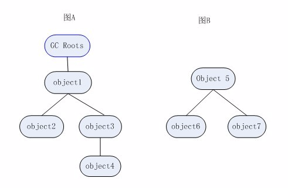

## 一、引用计数法

给对象添加一个引用计数器，每当有一个地方引用它时，计数器值就加1；当引用失效时，计数器值就减1；任何时刻计数器为0的对象就是不可能被再使用的。

**主流的JVM里面没有选用引用计数算法来管理内存，其中最主要的原因是它很难解决对象间的互循环引用的问题。**

## 二、可达性分析算法

通过一些列的称为“GC Roots”的对象作为起始点，从这些节点开始向下搜索，搜索所走过的路径称为引用链，当一个对象到GC Roots没有任何引用链相连时（就是从GC Roots 到这个对象是不可达），则证明此对象是不可用的。所以它们会被判定为可回收对象（例如图B中的对象既是不可达的）。

在Java语言中，可以作为GC Roots的对象包括下面几种：

* 虚拟机栈（栈帧中的本地变量表）中引用的对象；
* 方法区中类静态属性引用的对象；
* 方法区中常量引用的对象；
* 本地方法栈中JNI（即一般说的Native方法）引用的对象；

总结就是，方法运行时，方法中引用的对象；类的静态变量引用的对象；类中常量引用的对象；Native方法中引用的对象

**在可达性分析算法中，要真正宣告一个对象死亡，至少要经历两次标记过程：**

1.如果对象在进行可达性分析后发现没有与GC Roots相连接的引用链，那它将会被第一次标记并且进行一次筛选，筛选的条件是此对象是否有必要执行finalize\(\)方法。当对象没有 覆盖finalize\(\)方法，或者finalize\(\)方法已经被虚拟机调用过，虚拟机将这两种情况都视为“没有必要执行”。

2.如果这个对象被判定为有必要执行finalize\(\)方法，那么这个对象将会放置在一个叫做F-Queue队列之中，并在稍后由一个由虚拟机自动建立的、低优先级的Finalizer线程去执行它。finalize\(\)方法是对象逃脱死亡命运的最后一次机会，稍候GC将对F-Queue中的对象进行第二次小规模的标记，如果对象要在finalie\(\)中成功拯救自己——只要重新与引用链上的任何一个对象建立关联即可，譬如把自己（this关键字）赋值给某个类变量或者对象的成员变量，那在第二次标记时它将会被移除出“即将回收”的集合；如果对象这时候还没有逃脱，那基本上它就真的被回收了。

## 三、判断对象是否存活与“引用”有关

在JDK1.2之后，Java对引用的概念进行了扩充，将引用分为强引用（Strong Reference）、软引用（Soft Reference）、弱引用（Weak Reference）、虚引用（Phantom Reference）四种，这四种**引用强度依次逐渐减弱**。

**强引用：** 就是指在程序代码之中普遍存在的，类似“Object obj = new Object\(\)”这类的引用，只要强引用还存在，垃圾收集器永远不会回收掉被引用的对象。

**软引用：** 用来描述一些还有用但并非必须的对象。在系统将要发生内存溢出异常之前，将会把这些对象列进回收范围之中进行第二次回收。

**弱引用：** 用户描述非必须对象的。被弱引用关联的对象只能生存到下一次垃圾收集发生之前。当垃圾收集器工作时，无论当前内存是否足够，都会回收掉只被弱引用关联的对象。

**虚引用：** 一个对象是否有虚引用存在，完全不会对其生存时间构成影响，也无法通过虚引用来取得一个对象实例。为一个对象设置虚引用的唯一目的就是能在这个对象被收集器回收时刻得到一个系统通知。

