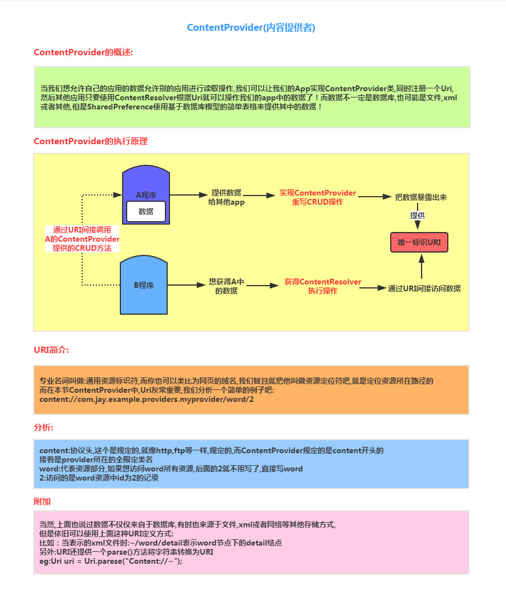
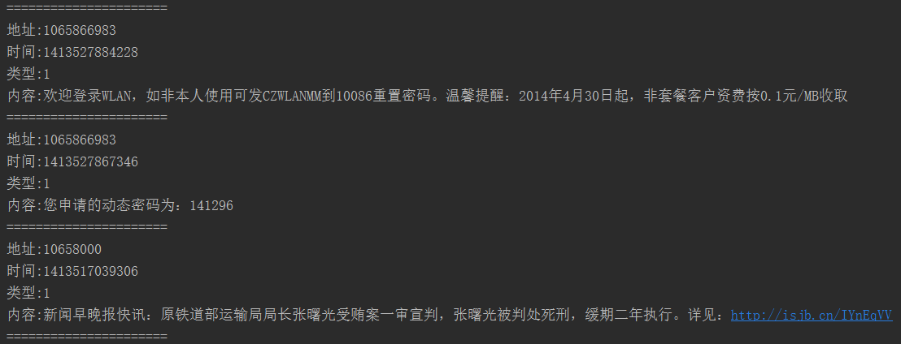
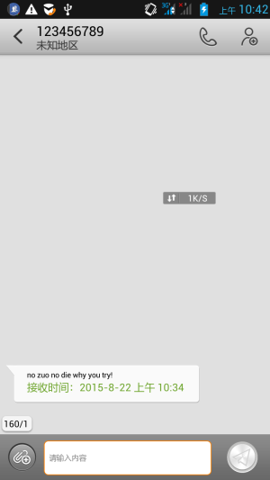
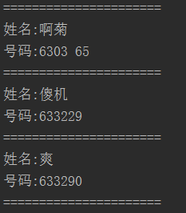
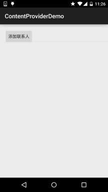
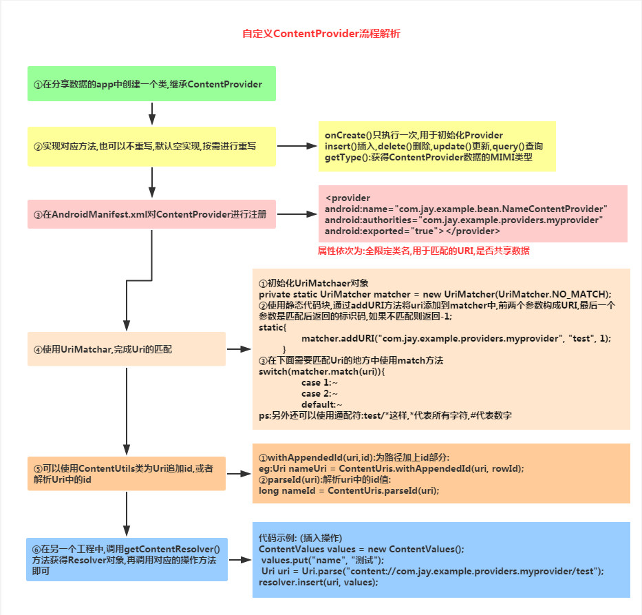
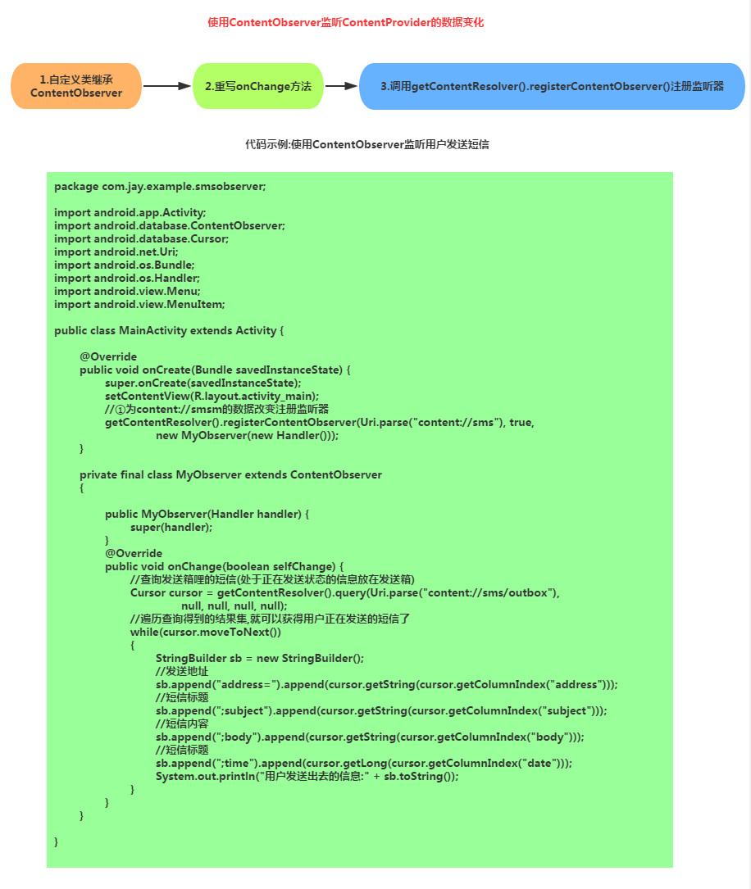

## 一、本节引言：
本节给大家带来的是Android四大组件中的最后一个——ContentProvider(内容提供者)，可能部分读者 有疑问了，"Android不是有五大组件的吗？还有个Intent呢？"对的，Intent也是很重要的，但是他 只是维系这几个组件间的纽带！Intent我们下一章会讲解！说会这个ContentProvider，我们什么时候 会用到他呢？有下面这两种：

1. 我们想在自己的应用中访问别的应用，或者说一些ContentProvider暴露给我们的一些数据， 比如手机联系人，短信等！我们想对这些数据进行读取或者修改，这就需要用到ContentProvider了！
2. 我们自己的应用，想把自己的一些数据暴露出来，给其他的应用进行读取或操作，我们也可以用 到ContentProvider，另外我们可以选择要暴露的数据，就避免了我们隐私数据的的泄露！

好像好流弊的样子，其实用起来也很简单，下面我们来对ContentProvider进行学习~ 官方文档：ContentProvider 本节我们来讲解下ContentProvder的概念，给大家写几个常用的使用系统ContentProvider的示例， 以及自定义ContentProvider！


## 二、ContentProvider概念讲解：




## 三、使用系统提供的ContentProvider
其实很多时候我们用到ContentProvider并不是自己暴露自己的数据，更多的时候通过 ContentResolver来读取其他应用的信息，最常用的莫过于读取系统APP，信息，联系人， 多媒体信息等！如果你想来调用这些ContentProvider就需要自行查阅相关的API资料了！ 另外，不同的版本，可能对应着不同的URL！这里给出如何获取URL与对应的数据库表的字段， 这里以最常用的联系人为例，其他自行google~

①来到系统源码文件下:all-src.rar -> TeleponeProvider -> AndroidManifest.xml查找对应API

②打开模拟器的file exploer/data/data/com.android.providers.contacts/databases/contact2.db 导出后使用SQLite图形工具查看，三个核心的表:raw_contact表，data表，mimetypes表！

下面演示一些基本的操作示例：

- 1）简单的读取收件箱信息：
核心代码：
```java
private void getMsgs(){
    Uri uri = Uri.parse("content://sms/");
    ContentResolver resolver = getContentResolver();
    //获取的是哪些列的信息
    Cursor cursor = resolver.query(uri, new String[]{"address","date","type","body"}, null, null, null);
    while(cursor.moveToNext())
    {
        String address = cursor.getString(0);
        String date = cursor.getString(1);
        String type = cursor.getString(2);
        String body = cursor.getString(3);
        System.out.println("地址:" + address);
        System.out.println("时间:" + date);
        System.out.println("类型:" + type);
        System.out.println("内容:" + body);
        System.out.println("======================");
    }
    cursor.close();
}
```

别忘了，往`AndroidManifest.xml`加入读取收件箱的权限：
```xml
<uses-permission android:name="android.permission.READ_SMS"/>
```

运行结果：

部分运行结果如下：



- 2）简单的往收件箱里插入一条信息
核心代码：
```java
private void insertMsg() {
    ContentResolver resolver = getContentResolver();
    Uri uri = Uri.parse("content://sms/");
    ContentValues conValues = new ContentValues();
    conValues.put("address", "123456789");
    conValues.put("type", 1);
    conValues.put("date", System.currentTimeMillis());
    conValues.put("body", "no zuo no die why you try!");
    resolver.insert(uri, conValues);
    Log.e("HeHe", "短信插入完毕~");
}
```

运行结果：



注意事项：

上述代码在4.4以下都可以实现写入短信的功能，而5.0上就无法写入，原因是： 从5.0开始，默认短信应用外的软件不能以写入短信数据库的形式发短信！

- 3）简单的读取手机联系人
核心代码：
```java
private void getContacts(){
    //①查询raw_contacts表获得联系人的id
    ContentResolver resolver = getContentResolver();
    Uri uri = ContactsContract.CommonDataKinds.Phone.CONTENT_URI;
    //查询联系人数据
    cursor = resolver.query(uri, null, null, null, null);
    while(cursor.moveToNext())
    {
        //获取联系人姓名,手机号码
        String cName = cursor.getString(cursor.getColumnIndex(ContactsContract.CommonDataKinds.Phone.DISPLAY_NAME));
        String cNum = cursor.getString(cursor.getColumnIndex(ContactsContract.CommonDataKinds.Phone.NUMBER));
        System.out.println("姓名:" + cName);
        System.out.println("号码:" + cNum);
        System.out.println("======================");
    }
    cursor.close();
}
```

别忘了加读联系人的权限：
```xml
<uses-permission android:name="android.permission.READ_CONTACTS"/>
```

运行结果：

部分运行结果如下：




- 4）查询指定电话的联系人信息
核心代码：
```java
private void queryContact(String number){
        Uri uri = Uri.parse("content://com.android.contacts/data/phones/filter/" + number);
        ContentResolver resolver = getContentResolver();
        Cursor cursor = resolver.query(uri, new String[]{"display_name"}, null, null, null);
        if (cursor.moveToFirst()) {
            String name = cursor.getString(0);
            System.out.println(number + "对应的联系人名称：" + name);
        }
    cursor.close();
}
```

运行结果：


- 5）添加一个新的联系人
核心代码：
```java
private void AddContact() throws RemoteException, OperationApplicationException {
    //使用事务添加联系人
    Uri uri = Uri.parse("content://com.android.contacts/raw_contacts");
    Uri dataUri =  Uri.parse("content://com.android.contacts/data");

    ContentResolver resolver = getContentResolver();
    ArrayList<ContentProviderOperation> operations = new ArrayList<ContentProviderOperation>();
    ContentProviderOperation op1 = ContentProviderOperation.newInsert(uri)
            .withValue("account_name", null)
            .build();
    operations.add(op1);

    //依次是姓名，号码，邮编
    ContentProviderOperation op2 = ContentProviderOperation.newInsert(dataUri)
            .withValueBackReference("raw_contact_id", 0)
            .withValue("mimetype", "vnd.android.cursor.item/name")
            .withValue("data2", "Coder-pig")
            .build();
    operations.add(op2);

    ContentProviderOperation op3 = ContentProviderOperation.newInsert(dataUri)
            .withValueBackReference("raw_contact_id", 0)
            .withValue("mimetype", "vnd.android.cursor.item/phone_v2")
            .withValue("data1", "13798988888")
            .withValue("data2", "2")
            .build();
    operations.add(op3);

    ContentProviderOperation op4 = ContentProviderOperation.newInsert(dataUri)
            .withValueBackReference("raw_contact_id", 0)
            .withValue("mimetype", "vnd.android.cursor.item/email_v2")
            .withValue("data1", "779878443@qq.com")
            .withValue("data2", "2")
            .build();
    operations.add(op4);
    //将上述内容添加到手机联系人中~
    resolver.applyBatch("com.android.contacts", operations);
    Toast.makeText(getApplicationContext(), "添加成功", Toast.LENGTH_SHORT).show();
}
```

运行结果:



别忘了权限：
```xml
<uses-permission android:name="android.permission.WRITE_CONTACTS"/>
<uses-permission android:name="android.permission.WRITE_PROFILE"/>
```


## 四、自定义ContentProvider
我们很少会自己来定义ContentProvider，因为我们很多时候都不希望自己应用的数据暴露给 其他应用，虽然这样，学习如何ContentProvider还是有必要的，多一种数据传输的方式，是吧~
这是之前画的一个流程图：



接下来我们就来一步步实现：

在开始之前我们先要创建一个数据库创建类(数据库内容后面会讲~)：

`DBOpenHelper.java`
```java
public class DBOpenHelper extends SQLiteOpenHelper {

    final String CREATE_SQL = "CREATE TABLE test(_id INTEGER PRIMARY KEY AUTOINCREMENT,name)";
    
    public DBOpenHelper(Context context, String name, CursorFactory factory,
            int version) {
        super(context, name, null, 1);
    }

    
    @Override
    public void onCreate(SQLiteDatabase db) {
        db.execSQL(CREATE_SQL);
    }

    @Override
    public void onUpgrade(SQLiteDatabase db, int oldVersion, int newVersion) {
        // TODO Auto-generated method stub

    }
}
```

- Step 1：自定义ContentProvider类，实现onCreate()，getType()，根据需求重写对应的增删改查方法：

`NameContentProvider.java`
```java
public class NameContentProvider extends ContentProvider {

    //初始化一些常量
     private static UriMatcher matcher = new UriMatcher(UriMatcher.NO_MATCH);        
     private DBOpenHelper dbOpenHelper;
    
    //为了方便直接使用UriMatcher,这里addURI,下面再调用Matcher进行匹配
     
     static{  
         matcher.addURI("com.jay.example.providers.myprovider", "test", 1);
     }  
     
    @Override
    public boolean onCreate() {
        dbOpenHelper = new DBOpenHelper(this.getContext(), "test.db", null, 1);
        return true;
    }

    @Override
    public Cursor query(Uri uri, String[] projection, String selection,
            String[] selectionArgs, String sortOrder) {
        return null;
    }

    @Override
    public String getType(Uri uri) {
        return null;
    }

    @Override
    public Uri insert(Uri uri, ContentValues values) {
        
        switch(matcher.match(uri))
        {
        //把数据库打开放到里面是想证明uri匹配完成
        case 1:
            SQLiteDatabase db = dbOpenHelper.getReadableDatabase();
            long rowId = db.insert("test", null, values);
            if(rowId > 0)
            {
                //在前面已有的Uri后面追加ID
                Uri nameUri = ContentUris.withAppendedId(uri, rowId);
                //通知数据已经发生改变
                getContext().getContentResolver().notifyChange(nameUri, null);
                return nameUri;
            }
        }
        return null;
    }

    @Override
    public int delete(Uri uri, String selection, String[] selectionArgs) {
        return 0;
    }

    @Override
    public int update(Uri uri, ContentValues values, String selection,
            String[] selectionArgs) {
        return 0;
    }
}
```

- Step 2：AndroidManifest.xml中为ContentProvider进行注册：
```xml
<!--属性依次为：全限定类名,用于匹配的URI,是否共享数据 -->
<provider android:name="com.jay.example.bean.NameContentProvider"
            android:authorities="com.jay.example.providers.myprovider"
            android:exported="true" />
```

好的，作为ContentProvider的部分就完成了！

接下来，创建一个新的项目，我们来实现ContentResolver的部分，我们直接通过按钮点击插入一条数据：

`MainActivity.java`
```java
public class MainActivity extends Activity {

    private Button btninsert;
    
    @Override
    protected void onCreate(Bundle savedInstanceState) {
        super.onCreate(savedInstanceState);
        setContentView(R.layout.activity_main);
        
        btninsert = (Button) findViewById(R.id.btninsert);
        
        //读取contentprovider 数据  
        final ContentResolver resolver = this.getContentResolver();
        
        
        btninsert.setOnClickListener(new OnClickListener() {
            
            @Override
            public void onClick(View v) {
                 ContentValues values = new ContentValues();
                 values.put("name", "测试");
                 Uri uri = Uri.parse("content://com.jay.example.providers.myprovider/test");
                resolver.insert(uri, values);
                Toast.makeText(getApplicationContext(), "数据插入成功", Toast.LENGTH_SHORT).show();
                
            }
        });
       
    }
}
```

如何使用？ 好吧，代码还是蛮简单的，先运行作为ContentProvider的项目，接着再运行ContentResolver的项目， 点击按钮插入一条数据，然后打开file exploer将ContentProvider的db数据库取出，用图形查看工具 查看即可发现插入数据，时间关系，就不演示结果了~


## 五、通过ContentObserver监听ContentProvider的数据变化



使用指南：

运行程序后，晾一边，收到短信后，可以在logcat上看到该条信息的内容，可以根据自己的需求 将Activtiy改做Service，而在后台做这种事情~


## 六、本节小结：
好的，关于ContentProvider的初探就到这里，本节我们学习了： ContentProvider的概念以及流程，使用系统提供的一些ContentProvider，以及定制自己的ContentProvider， 最后还讲解了通过ContentObserver监听ContentProvider的数据变化，ContentProvider的内容就掌握得差不多 了，下一节我们来走走文档看下有什么不知道的~谢谢