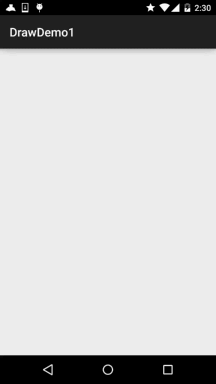
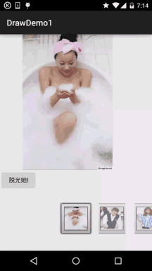

## 一、本节引言：
前两节我们学了Bitmap和一些基本的绘图API的属性以及常用的方法，但心里总觉得有点 不踏实，总得写点什么加深下映像是吧，嗯，本节我们就来写两个简单的例子：

1. 简单画图板的实现
2. 帮美女擦衣服的简单实现
嘿嘿，第二个例子是小猪刚学安卓写的一个小Demo~嘿嘿~ 开始本节内容~


## 二、实战示例1：简单画图板的实现：
这个相信大家都不陌生，很多手机都会自带一个给用户涂鸦的画图板，这里我们就来写个简单的 例子，首先我们分析下，实现这个东东的一些逻辑：

**Q1：这个画板放在哪里？**

答：View里，我们自定义一个View，在onDraw()里完成绘制，另外View还有个onTouchEvent的方法， 我们可以在获取用户的手势操作！

**Q2.需要准备些什么？**

答：一只画笔(Paint)，一块画布(Canvas)，一个路径(Path)记录用户绘制路线； 另外划线的时候，每次都是从上次拖动时间的发生点到本次拖动时间的发生点！那么之前绘制的 就会丢失，为了保存之前绘制的内容，我们可以引入所谓的"双缓冲"技术： 其实就是每次不是直接绘制到Canvas上，而是先绘制到Bitmap上，等Bitmap上的绘制完了， 再一次性地绘制到View上而已！

**Q3.具体的实现流程？**

答：初始化画笔，设置颜色等等一些参数；在View的onMeasure()方法中创建一个View大小的Bitmap， 同时创建一个Canvas；onTouchEvent中获得X,Y坐标，做绘制连线，最后invalidate()重绘，即调用 onDraw方法将bitmap的东东画到Canvas上！

好了，逻辑知道了，下面就上代码了：

`MyView.java：`
```java
/**
 * Created by Jay on 2015/10/15 0015.
 */
public class MyView extends View{

    private Paint mPaint;  //绘制线条的Path
    private Path mPath;      //记录用户绘制的Path
    private Canvas mCanvas;  //内存中创建的Canvas
    private Bitmap mBitmap;  //缓存绘制的内容

    private int mLastX;
    private int mLastY;

    public MyView(Context context) {
        super(context);
        init();
    }

    public MyView(Context context, AttributeSet attrs) {
        super(context, attrs);
        init();
    }

    public MyView(Context context, AttributeSet attrs, int defStyleAttr) {
        super(context, attrs, defStyleAttr);
        init();
    }

    private void init(){
        mPath = new Path();
        mPaint = new Paint();   //初始化画笔
        mPaint.setColor(Color.GREEN);
        mPaint.setAntiAlias(true);
        mPaint.setDither(true);
        mPaint.setStyle(Paint.Style.STROKE);
        mPaint.setStrokeJoin(Paint.Join.ROUND); //结合处为圆角
        mPaint.setStrokeCap(Paint.Cap.ROUND); // 设置转弯处为圆角
        mPaint.setStrokeWidth(20);   // 设置画笔宽度
    }

    @Override
    protected void onMeasure(int widthMeasureSpec, int heightMeasureSpec) {
        super.onMeasure(widthMeasureSpec, heightMeasureSpec);
        int width = getMeasuredWidth();
        int height = getMeasuredHeight();
        // 初始化bitmap,Canvas
        mBitmap = Bitmap.createBitmap(width, height, Bitmap.Config.ARGB_8888);
        mCanvas = new Canvas(mBitmap);
    }

    //重写该方法，在这里绘图
    @Override
    protected void onDraw(Canvas canvas) {
        drawPath();
        canvas.drawBitmap(mBitmap, 0, 0, null);
    }

    //绘制线条
    private void drawPath(){
        mCanvas.drawPath(mPath, mPaint);
    }

    @Override
    public boolean onTouchEvent(MotionEvent event) {

        int action = event.getAction();
        int x = (int) event.getX();
        int y = (int) event.getY();

        switch (action)
        {
            case MotionEvent.ACTION_DOWN:
                mLastX = x;
                mLastY = y;
                mPath.moveTo(mLastX, mLastY);
                break;
            case MotionEvent.ACTION_MOVE:
                int dx = Math.abs(x - mLastX);
                int dy = Math.abs(y - mLastY);
                if (dx > 3 || dy > 3)
                    mPath.lineTo(x, y);
                mLastX = x;
                mLastY = y;
                break;
        }

        invalidate();
        return true;
    }
}
```

运行效果图：




你可以根据自己的需求进行扩展，比如加上修改画笔大小，修改画笔颜色，保存自己画的图等！ 发散思维，自己动手~


## 三、实战示例2：擦掉美女衣服的实现
核心思路是： 利用帧布局，前后两个ImageView，前面的显示未擦掉衣服的情况，后面的显示擦掉衣服后的情况！

为两个ImageView设置美女图片后，接着为前面的ImageView设置OnTouchListener！在这里对手指 触碰点附近的20*20个像素点，设置为透明！

运行效果图：



代码实现：

Step 1：第一个选妹子的Activity相关的编写，首先是界面，一个ImageView，Button和Gallery！

`activity_main.xml：`
```xml
<?xml version="1.0" encoding="utf-8"?>
<LinearLayout xmlns:android="http://schemas.android.com/apk/res/android"
    android:layout_width="match_parent"
    android:layout_height="match_parent"
    android:orientation="vertical">

    <ImageView
        android:id="@+id/img_choose"
        android:layout_width="320dp"
        android:layout_height="320dp" />

    <Button
        android:id="@+id/btn_choose"
        android:layout_width="wrap_content"
        android:layout_height="wrap_content"
        android:text="脱光她!" />

    <Gallery
        android:id="@+id/gay_choose"
        android:layout_width="match_parent"
        android:layout_height="wrap_content"
        android:layout_marginTop="25dp"
        android:spacing="1pt"
        android:unselectedAlpha="0.6" />

</LinearLayout>
```

接着是我们Gallery的Adapter类，这里我们重写下BaseAdapter，而里面就显示一个图片比较简单， 就不另外写一个布局了！

`MeiziAdapter.java:`
```java
/**
 * Created by Jay on 2015/10/16 0016.
 */
public class MeiziAdapter extends BaseAdapter{

    private Context mContext;
    private int[] mData;

    public MeiziAdapter() {
    }

    public MeiziAdapter(Context mContext,int[] mData) {
        this.mContext = mContext;
        this.mData = mData;
    }

    @Override
    public int getCount() {
        return mData.length;
    }

    @Override
    public Object getItem(int position) {
        return mData[position];
    }

    @Override
    public long getItemId(int position) {
        return position;
    }

    @Override
    public View getView(int position, View convertView, ViewGroup parent) {
        ImageView imgMezi = new ImageView(mContext);
        imgMezi.setImageResource(mData[position]);         //创建一个ImageView
        imgMezi.setScaleType(ImageView.ScaleType.FIT_XY);      //设置imgView的缩放类型
        imgMezi.setLayoutParams(new Gallery.LayoutParams(250, 250));    //为imgView设置布局参数
        TypedArray typedArray = mContext.obtainStyledAttributes(R.styleable.Gallery);
        imgMezi.setBackgroundResource(typedArray.getResourceId(R.styleable.Gallery_android_galleryItemBackground, 0));
        return imgMezi;
    }
}
```

最后到我们的Activity，也很简单，无非是为gallery设置onSelected事件，点击按钮后把，当前选中的 Position传递给下一个页面！

`MainActivity.java：`
```java
public class MainActivity extends AppCompatActivity implements AdapterView.OnItemSelectedListener,
        View.OnClickListener {

    private Context mContext;
    private ImageView img_choose;
    private Button btn_choose;
    private Gallery gay_choose;
    private int index = 0;
    private MeiziAdapter mAdapter = null;
    private int[] imageIds = new int[]
            {
                    R.mipmap.pre1, R.mipmap.pre2, R.mipmap.pre3, R.mipmap.pre4,
                    R.mipmap.pre5, R.mipmap.pre6, R.mipmap.pre7, R.mipmap.pre8,
                    R.mipmap.pre9, R.mipmap.pre10, R.mipmap.pre11, R.mipmap.pre12,
                    R.mipmap.pre13, R.mipmap.pre14, R.mipmap.pre15, R.mipmap.pre16,
                    R.mipmap.pre17, R.mipmap.pre18, R.mipmap.pre19, R.mipmap.pre20,
                    R.mipmap.pre21
            };

    @Override
    protected void onCreate(Bundle savedInstanceState) {
        super.onCreate(savedInstanceState);
        setContentView(R.layout.activity_main);
        mContext = MainActivity.this;
        bindViews();
    }

    private void bindViews() {
        img_choose = (ImageView) findViewById(R.id.img_choose);
        btn_choose = (Button) findViewById(R.id.btn_choose);
        gay_choose = (Gallery) findViewById(R.id.gay_choose);


        mAdapter = new MeiziAdapter(mContext, imageIds);
        gay_choose.setAdapter(mAdapter);
        gay_choose.setOnItemSelectedListener(this);
        btn_choose.setOnClickListener(this);

    }


    @Override
    public void onItemSelected(AdapterView<?> parent, View view, int position, long id) {
        img_choose.setImageResource(imageIds[position]);
        index = position;
    }

    @Override
    public void onNothingSelected(AdapterView<?> parent) {
    }

    @Override
    public void onClick(View v) {
        Intent it = new Intent(mContext,CaClothes.class);
        Bundle bundle = new Bundle();
        bundle.putCharSequence("num", Integer.toString(index));
        it.putExtras(bundle);
        startActivity(it);
    }
}
```

接着是我们擦掉妹子衣服的页面了，布局比较简单，FrameLayout + 前后两个ImageView：

`activity_caclothes.xml：`
```xml
<?xml version="1.0" encoding="utf-8"?>
<FrameLayout xmlns:android="http://schemas.android.com/apk/res/android"
    android:layout_width="match_parent"
    android:layout_height="match_parent">

    <ImageView
        android:id="@+id/img_after"
        android:layout_width="wrap_content"
        android:layout_height="wrap_content" />

    <ImageView
        android:id="@+id/img_before"
        android:layout_width="wrap_content"
        android:layout_height="wrap_content" />

</FrameLayout>
```

接着到就到Java部分的代码了：

`CaClothes.java：`
```java
/**
 * Created by Jay on 2015/10/16 0016.
 */
public class CaClothes extends AppCompatActivity implements View.OnTouchListener {

    private ImageView img_after;
    private ImageView img_before;
    private Bitmap alterBitmap;
    private Canvas canvas;
    private Paint paint;
    private Bitmap after;
    private Bitmap before;
    private int position;

    int[] imageIds1 = new int[]
            {
                    R.mipmap.pre1, R.mipmap.pre2, R.mipmap.pre3, R.mipmap.pre4,
                    R.mipmap.pre5, R.mipmap.pre6, R.mipmap.pre7, R.mipmap.pre8,
                    R.mipmap.pre9, R.mipmap.pre10, R.mipmap.pre11, R.mipmap.pre12,
                    R.mipmap.pre13, R.mipmap.pre14, R.mipmap.pre15, R.mipmap.pre16,
                    R.mipmap.pre17, R.mipmap.pre18, R.mipmap.pre19, R.mipmap.pre20,
                    R.mipmap.pre21
            };


    int[] imageIds2 = new int[]
            {
                    R.mipmap.after1, R.mipmap.after2, R.mipmap.after3, R.mipmap.after4,
                    R.mipmap.after5, R.mipmap.after6, R.mipmap.after7, R.mipmap.after8,
                    R.mipmap.after9, R.mipmap.after10, R.mipmap.after11, R.mipmap.after12,
                    R.mipmap.after13, R.mipmap.after14, R.mipmap.after15, R.mipmap.after16,
                    R.mipmap.after17, R.mipmap.after18, R.mipmap.after19, R.mipmap.after20,
                    R.mipmap.after21
            };


    @Override
    public void onCreate(Bundle savedInstanceState) {
        super.onCreate(savedInstanceState);
        setContentView(R.layout.activity_caclothes);

        Bundle bd = getIntent().getExtras();
        position = Integer.parseInt(bd.getString("num"));
        bindViews();

    }

    private void bindViews() {
        img_after = (ImageView) findViewById(R.id.img_after);
        img_before = (ImageView) findViewById(R.id.img_before);


        BitmapFactory.Options opts = new BitmapFactory.Options();
        opts.inSampleSize = 1;
        after = BitmapFactory.decodeResource(getResources(), imageIds2[position], opts);
        before = BitmapFactory.decodeResource(getResources(), imageIds1[position], opts);
        //定义出来的是只读图片

        alterBitmap = Bitmap.createBitmap(before.getWidth(), before.getHeight(), Bitmap.Config.ARGB_4444);
        canvas = new Canvas(alterBitmap);
        paint = new Paint();
        paint.setStrokeCap(Paint.Cap.ROUND);
        paint.setStrokeJoin(Paint.Join.ROUND);
        paint.setStrokeWidth(5);
        paint.setColor(Color.BLACK);
        paint.setAntiAlias(true);
        canvas.drawBitmap(before, new Matrix(), paint);
        img_after.setImageBitmap(after);
        img_before.setImageBitmap(before);
        img_before.setOnTouchListener(this);
    }

    @Override
    public boolean onTouch(View v, MotionEvent event) {
        switch (event.getAction()) {
            case MotionEvent.ACTION_DOWN:
                break;
            case MotionEvent.ACTION_MOVE:
                int newX = (int) event.getX();
                int newY = (int) event.getY();
                //setPixel方法是将某一个像素点设置成一个颜色，而这里我们把他设置成透明
                //另外通过嵌套for循环将手指触摸区域的20*20个像素点设置为透明
                for (int i = -20; i < 20; i++) {
                    for (int j = -20; j < 20; j++) {
                        if (i + newX >= 0 && j + newY >= 0 && i + newX < before.getWidth() && j + newY < before.getHeight())
                            alterBitmap.setPixel(i + newX, j + newY, Color.TRANSPARENT);
                    }
                }
                img_before.setImageBitmap(alterBitmap);
                break;
        }
        return true;
    }
}
```

代码也不算苦涩难懂，还是比较简单的哈，嗯，效果图看看就好，别做那么多右手螺旋定则哈.... 


## 四、代码示例下载：
[DrawDemo1.zip](../img/DrawDemo1.zip) 项目比较大，20多M，图片资源比较多，你懂的~


## 五、本节小结：
好的，本节写了关于绘图的两个小例子，还是蛮有趣的，相信你发下了，擦美女衣服那里， 消除的时候是方块的，不那么完美是吧，没事，下节我们学多个PorterDuff这个东西，我们 再来写多个例子，相比起这个代码就简单很多了，另外，时间关系，代码并没有去优化 或者整理，可以根据自己需求进行修改~好的，就说这么多，祝大家周末愉快~