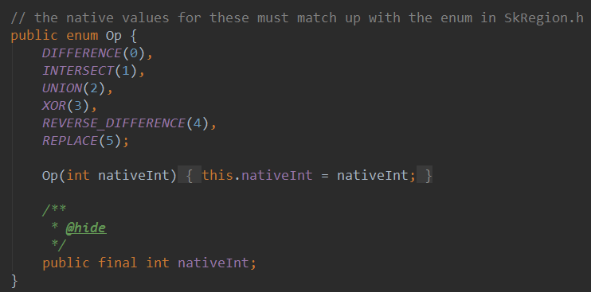
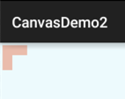
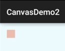
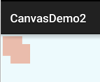
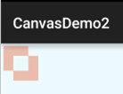
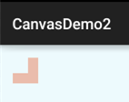
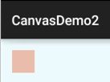
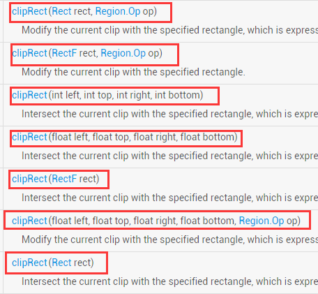
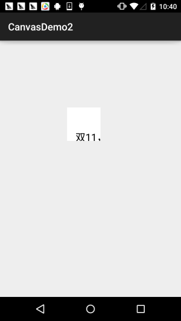
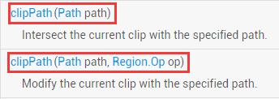

## 一、本节引言：
本节继续带来Android绘图系列详解之Canvas API详解(Part 2)，今天要讲解的是Canvas 中的ClipXxx方法族！我们可以看到文档中给我们提供的Clip方法有三种类型： clipPath( )，clipRect( )，clipRegion( )；

通过Path，Rect，Region的不同组合，几乎可以支持任意形状的裁剪区域！

- Path：可以是开放或闭合的曲线，线构成的复杂的集合图形

- Rect：矩形区域

- Region：可以理解为区域组合，比如可以将两个区域相加，相减，并，疑惑等！

Region.Op定义了Region支持的区域间运算种类！等下我们会讲到， 另外要说一点，我们平时理解的剪切可能是对已经存在的图形进行Clip，但是Android中对 Canvas进行Clip，是要在画图前进行的，如果画图后再对Canvas进行Clip的话将不会影响 到已经画好的图形，记住Clip是针对Canvas而非图形！ 嗯，不BB，直接开始本节内容！

官方API文档：Canvas


## 二、Region.Op组合方式详解
其实难点无非这个，Region代表着区域，表示的是Canvas图层上的某一块封闭区域！ 当然，有时间你可以自己慢慢去扣这个类，而我们一般关注的只是他的一个枚举值：Op



下面我们来看看个个枚举值所起的作用： 我们假设两个裁剪区域A和B，那么我们调用Region.Op对应的枚举值：

- DIFFERENCE：A和B的差集范围，即A - B，只有在此范围内的绘制内容才会被显示；

- INTERSECT：即A和B的交集范围，只有在此范围内的绘制内容才会被显示

- UNION：即A和B的并集范围，即两者所包括的范围的绘制内容都会被显示；

- XOR：A和B的补集范围，此例中即A除去B以外的范围，只有在此范围内的绘制内容才会被显示；

- REVERSE_DIFFERENCE：B和A的差集范围，即B - A，只有在此范围内的绘制内容才会被显示；

- REPLACE：不论A和B的集合状况，B的范围将全部进行显示，如果和A有交集，则将覆盖A的交集范围；

如果你学过集合，那么画个Venn(韦恩图)就一清二楚了，没学过？没事，我们写个例子来试试 对应的结果~！写个初始化画笔以及画矩形的方法:
```java
private void init() {
    mPaint = new Paint();
    mPaint.setAntiAlias(true);
    mPaint.setStrokeWidth(6);
    mPaint.setColor(getResources().getColor(R.color.blush));
}

private void drawScene(Canvas canvas){
    canvas.drawRect(0, 0, 200, 200, mPaint);
}
```

### Op.DIFFERENCE：
```java
canvas.clipRect(10, 10, 110, 110);        //第一个
canvas.clipRect(50, 50, 150, 150, Region.Op.DIFFERENCE); //第二个
drawScene(canvas);
```

结果：



先后在(10,10)以及(50,50)为起点，裁剪了两个100*100的矩形，得出的裁剪结果是：

A和B的差集 = A - (A和B相交的部分)

### Op.INTERSECT：
```java
canvas.clipRect(10, 10, 110, 110);        //第一个
canvas.clipRect(50, 50, 150, 150, Region.Op.INTERSECT); //第二个
drawScene(canvas);
```

结果：



先后在(10,10)以及(50,50)为起点，裁剪了两个100*100的矩形，得出的裁剪结果是： A和B的交集 = A和B相交的部分


### Op.UNION：
```java
canvas.clipRect(10, 10, 110, 110);        //第一个
canvas.clipRect(40, 40, 140, 140, Region.Op.UNION); //第二个
drawScene(canvas);
```

结果：



先后在(10,10)以及(50,50)为起点，裁剪了两个100*100的矩形，得出的裁剪结果是： A和B的并集 = A的区域 + B的区域


### Op.XOR：
```java
canvas.clipRect(10, 10, 110, 110);        //第一个
canvas.clipRect(50, 50, 150, 150, Region.Op.XOR); //第二个
drawScene(canvas);
```
结果：



先后在(10,10)以及(50,50)为起点，裁剪了两个100*100的矩形，得出的裁剪结果是： A和B的补集 = A和B的合集 - A和B的交集


### Op.REVERSE_DIFFERENCE：
```java
canvas.clipRect(10, 10, 110, 110);        //第一个
canvas.clipRect(50, 50, 150, 150, Region.Op.REVERSE_DIFFERENCE); //第二个
drawScene(canvas);
```

结果：



先后在(10,10)以及(50,50)为起点，裁剪了两个100*100的矩形，得出的裁剪结果是： B和A的差集 = B - A和B的交集


### Op.REPLACE
```java
canvas.clipRect(10, 10, 110, 110);        //第一个
canvas.clipRect(50, 50, 150, 150, Region.Op.REPLACE); //第二个
drawScene(canvas);
```

结果：



先后在(10,10)以及(50,50)为起点，裁剪了两个100*100的矩形，得出的裁剪结果是： 不论A和B的集合状况，B的范围将全部进行显示，如果和A有交集，则将覆盖A的交集范围；


## 三、Region.Op使用实例：
例子参考自：[Android 2D Graphics学习（二）、Canvas篇2、Canvas裁剪和Region、RegionIterator](http://blog.csdn.net/lonelyroamer/article/details/8349601)

运行效果图：


关键部分代码 MyView.java：
```java
/**
 * Created by Jay on 2015/11/10 0010.
 */
public class MyView extends View{

    private Bitmap mBitmap = null;
    private int limitLength = 0;     //
    private int width;
    private int heigth;
    private static final int CLIP_HEIGHT = 50;

    private boolean status = HIDE;//显示还是隐藏的状态，最开始为HIDE
    private static final boolean SHOW = true;//显示图片
    private static final boolean HIDE = false;//隐藏图片

    public MyView(Context context) {
        this(context, null);
    }

    public MyView(Context context, AttributeSet attrs) {
        super(context, attrs);
        mBitmap = BitmapFactory.decodeResource(getResources(), R.mipmap.img_meizi);
        limitLength = width = mBitmap.getWidth();
        heigth = mBitmap.getHeight();
    }

    public MyView(Context context, AttributeSet attrs, int defStyleAttr) {
        super(context, attrs, defStyleAttr);
    }

    @Override
    protected void onDraw(Canvas canvas) {
        Region region = new Region();
        int i = 0;
        while (i * CLIP_HEIGHT <= heigth) {//计算clip的区域
            if (i % 2 == 0) {
                region.union(new Rect(0, i * CLIP_HEIGHT, limitLength, (i + 1) * CLIP_HEIGHT));
            } else {
                region.union(new Rect(width - limitLength, i * CLIP_HEIGHT, width, (i + 1)
                        * CLIP_HEIGHT));
            }
            i++;
        }
        canvas.clipRegion(region);
        canvas.drawBitmap(mBitmap, 0, 0, new Paint());
        if (status == HIDE) {//如果此时是隐藏
            limitLength -= 10;
            if(limitLength <= 0)
                status=SHOW;
        } else {//如果此时是显示
            limitLength += 5;
            if(limitLength >= width)
                status=HIDE;
        }
        invalidate();
    }
}
```

实现分析：

初始化的时候获得宽高，然后循环，可以理解把图片分割成一条条的线，循环条件是：i * 每条的高度 不大于高度，然后线又分两种情况，调用的是Region的union，其实就是结合方式为UNINO的剪切方式 而已，最后是对此时图片的是否显示做下判断，隐藏和显示的情况做不同的处理，最后调用invalidate() 重绘！还是蛮简单的，自己理解理解吧~

另外要说一点：Canvas的变换对clipRegion没有作用


## 四、clipRect方法详解：
clipRect提供了七个重载方法：



参数介绍如下：

- rect：Rect对象，用于定义裁剪区的范围，Rect和RectF功能类似，精度和提供的方法不同而已

- left：矩形裁剪区的左边位置

- top：矩形裁剪区的上边位置

- right：矩形裁剪区的右边位置

- bottom：矩形裁剪区的下边位置

- op：裁剪区域的组合方式

上述四个值可以是浮点型或者整型

使用示例：
```java
mPaint = new Paint();
mPaint.setAntiAlias(true);
mPaint.setColor(Color.BLACK);
mPaint.setTextSize(60);

canvas.translate(300,300);
canvas.clipRect(100, 100, 300, 300);                //设置显示范围
canvas.drawColor(Color.WHITE);                      //白色背景
canvas.drawText("双11，继续吃我的狗粮...", 150, 300, mPaint); //绘制字符串
```

运行结果：



从上面的例子，不知道你发现了没？ clipRect会受Canvas变换的影响，白色区域是不花的区域，所以clipRect裁剪的是画布， 而我们的绘制是在这个裁剪后的画布上进行的！超过该区域的不显示！


## 五、clipPath方法详解：
相比起clipRect，clipPath就只有两个重载方法，使用方法非常简单，自己绘制一个Paht然后 传入即可！



使用示例：

这里复用我们以前在ImageView那里写的圆形ImageView的例子~

实现代码：

自定义ImageView：RoundImageView.java
```java
/**
 * Created by coder-pig on 2015/7/18 0018.
 */
public class RoundImageView extends ImageView {

    private Bitmap mBitmap;
    private Rect mRect = new Rect();
    private PaintFlagsDrawFilter pdf = new PaintFlagsDrawFilter(0, Paint.ANTI_ALIAS_FLAG);
    private Paint mPaint = new Paint();
    private Path mPath=new Path();
    public RoundImageView(Context context, AttributeSet attrs) {
        super(context, attrs);
        init();
    }


    //传入一个Bitmap对象
    public void setBitmap(Bitmap bitmap) {
        this.mBitmap = bitmap;
    }


    private void init() {
        mPaint.setStyle(Paint.Style.STROKE);
        mPaint.setFlags(Paint.ANTI_ALIAS_FLAG);
        mPaint.setAntiAlias(true);// 抗锯尺
    }


    @Override
    protected void onDraw(Canvas canvas) {
        super.onDraw(canvas);
        if(mBitmap == null)
        {
            return;
        }
        mRect.set(0,0,getWidth(),getHeight());
        canvas.save();
        canvas.setDrawFilter(pdf);
        mPath.addCircle(getWidth() / 2, getWidth() / 2, getHeight() / 2, Path.Direction.CCW);
        canvas.clipPath(mPath, Region.Op.REPLACE);
        canvas.drawBitmap(mBitmap, null, mRect, mPaint);
        canvas.restore();
    }
}
```

布局代码：activity_main.xml:
```xml
<com.jay.demo.imageviewdemo.RoundImageView
        android:id="@+id/img_round"
        android:layout_width="200dp"
        android:layout_height="200dp"
        android:layout_margin="5px"/>
```

`MainActivity.java:`
```java
public class MainActivity extends AppCompatActivity {

    private RoundImageView img_round;

    @Override
    protected void onCreate(Bundle savedInstanceState) {
        super.onCreate(savedInstanceState);
        setContentView(R.layout.activity_main);
        img_round = (RoundImageView) findViewById(R.id.img_round);
        Bitmap bitmap = BitmapFactory.decodeResource(getResources(),R.mipmap.meinv);
        img_round.setBitmap(bitmap);
    }
}
```

运行效果图：


另外使用该方法制作的圆角ImageView会有锯齿明显，即使你为Paint，Canvas设置了 抗锯齿也没用~假如你要求高的，可以使用Xfermode-PorterDuff设置图像混排来实现， 基本没锯齿，可见：[9.3.6、Paint API之Xfermode与PorterDuff详解(3)](../custom/xfermode-porterduff3.html)


## 六、本节示例代码下载：
[CanvasDemo2.zip](../img/CanvasDemo2.zip)

[XfermodeDemo1.zip](../img/XfermodeDemo1 (1).zip)


## 七、本节小结：
好的，本节给大家讲解了下Canvas中剪切有个的三个方法：clipPath( )，clipRect( )， clipRegion( )，难点应该是在最后一个上，六种不同的Op组合方式，其实也不难，集合 的概念而已，放在开头，消化了就好，而clipPath( )，clipRect( )则没什么难点~ 对喔，今天双11，不知道你剁手了没~