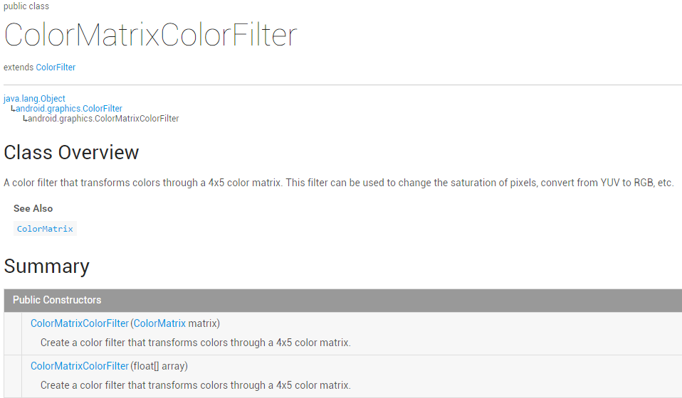
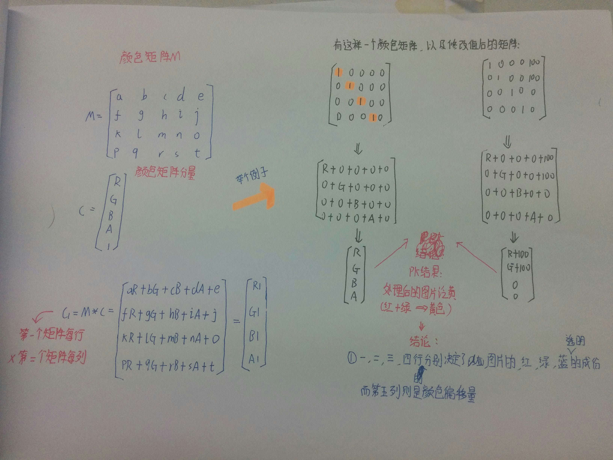
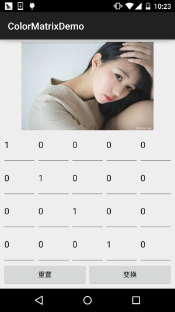
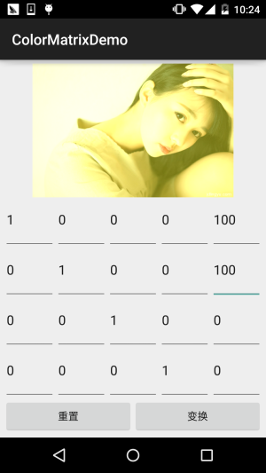
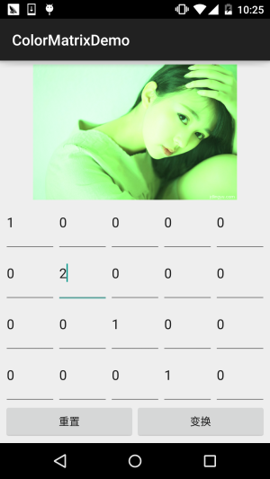
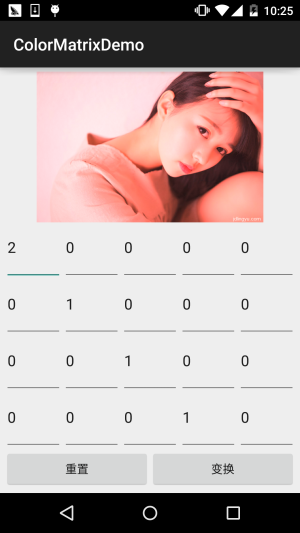
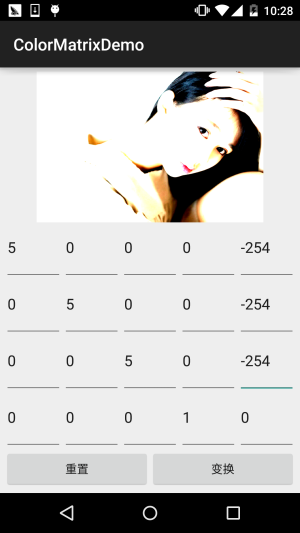
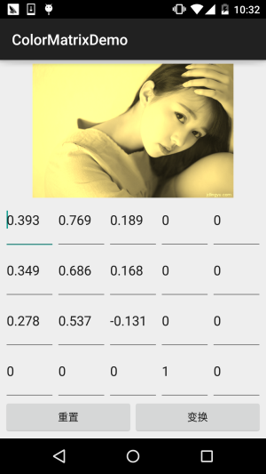

## 一、本节引言：
上节我们学习了MaskFilter(面具)，用它的两个子类BlurMaskFilter弄了下模糊效果，EmbossMaskFilter 弄了下浮雕效果，而本节我们来学习的是另一个API——ColorFilter(颜色过滤器)，和MaskFilter一样， 我们并不直接使用该类，而是使用该类的三个子类：

颜色矩阵颜色过滤器：ColorMatrixColorFilter

光照色彩过滤器：LightingColorFilter

混排颜色过滤器滤器PorterDuffColorFilter

本节我们就来学习下第一个ColorMatrixColorFilter的使用吧，打开ColorMatrixColorFilter的文档，



大概说的是：通过一个4 x 5的颜色矩阵来变换颜色，可以修改像素的饱和度，将YUV转换成RGB等！ 而构造方法中的ColorMatrix就是颜色矩阵，也是我们学习的核心，下面听我一一道来！

PS：ColorMatrix的API文档


## 二、相关常识的普及：
### RGBA模型：
RGBA不知道你听过没，黄绿蓝知道了吧，光的三基色，而RAGB则是在此的基础上多了一个透明度！ R(Red红色)，G(Green绿色)，B(Blue蓝色)，A(Alpha透明度)；另外要和颜料的三 原色区分开来哦，最明显的区别就是颜料的三原色中用黄色替换了光三基色中的绿色！知道下就好， 有兴趣的可自行百度~

### 一些名词：
- 色调/色相——物体传递的颜色 


- 饱和度——颜色的纯度，从0(灰)到100%(饱和)来进行描述


 
- 亮度/明度——颜色的相对明暗程度 


## 三、ColorMatrix的解读
如题，颜色矩阵(4 * 5)，我们可以修改矩阵中的值，来实现黑白照，泛黄老照片，高对比度等效果！ 手撕颜色矩阵解释图如下：




不知道你看懂上图没，如果你学过高数的话，肯定对此很熟悉，无非是矩阵的叉乘而已，没学过也没关系 计算方法就是右下角那个，拿颜色矩阵的每一行来 * 颜色矩阵分量的每一列！

很典型的一个例子，处理前后的结果比较，我们还可以让某个颜色值 * 一个常数，比如让第三行(蓝) 乘以2，效果就变成泛蓝色了，当然，我们肯定要写代码来验证验证上面的结果！


## 四、写代码来验证ColorMatrix所起的作用
这里来写烂大街的例子，一个ImageView，4 * 5个EditText，一个重置按钮和一个生成按钮， 我们来看下效果图：

依次是原图，泛黄，泛绿，泛红，高对比度，色相变换，以及黄色复古













 
接下来我们来写代码，完成上述的效果： 代码实现：

首先是布局文件`activity_main.xml`：
```xml
<?xml version="1.0" encoding="utf-8"?>
<LinearLayout xmlns:android="http://schemas.android.com/apk/res/android"
    android:layout_width="match_parent"
    android:layout_height="match_parent"
    android:orientation="vertical"
    android:padding="5dp">

    <ImageView
        android:id="@+id/img_show"
        android:layout_width="match_parent"
        android:layout_height="0dp"
        android:layout_weight="2" />

    <GridLayout
        android:id="@+id/gp_matrix"
        android:layout_width="match_parent"
        android:layout_height="0dp"
        android:layout_weight="3"
        android:columnCount="5"
        android:rowCount="4"></GridLayout>

    <LinearLayout
        android:layout_width="match_parent"
        android:layout_height="wrap_content"
        android:orientation="horizontal">
        <Button
            android:id="@+id/btn_reset"
            android:layout_width="0dp"
            android:layout_height="wrap_content"
            android:layout_weight="1"
            android:text="重置" />
        <Button
            android:id="@+id/btn_Change"
            android:layout_width="0dp"
            android:layout_height="wrap_content"
            android:layout_weight="1"
            android:text="变换" />
    </LinearLayout>
</LinearLayout>
```

接着是`MainActivity.java：`
```java
public class MainActivity extends AppCompatActivity implements View.OnClickListener {

    private ImageView img_show;
    private GridLayout gp_matrix;
    private Button btn_reset;
    private Button btn_Change;
    private Bitmap mBitmap;
    private int mEtWidth, mEtHeight;
    private EditText[] mEts = new EditText[20];
    private float[] mColorMatrix = new float[20];
    private Context mContext;


    @Override
    protected void onCreate(Bundle savedInstanceState) {
        super.onCreate(savedInstanceState);
        setContentView(R.layout.activity_main);
        mContext = MainActivity.this;
        bindViews();


        gp_matrix.post(new Runnable() {
            @Override
            public void run() {
                mEtWidth = gp_matrix.getWidth() / 5;
                mEtHeight = gp_matrix.getHeight() / 4;
                //添加5 * 4个EditText
                for (int i = 0; i < 20; i++) {
                    EditText editText = new EditText(mContext);
                    mEts[i] = editText;
                    gp_matrix.addView(editText, mEtWidth, mEtHeight);
                }
                initMatrix();
            }
        });
    }

    private void bindViews() {
        img_show = (ImageView) findViewById(R.id.img_show);
        gp_matrix = (GridLayout) findViewById(R.id.gp_matrix);
        btn_reset = (Button) findViewById(R.id.btn_reset);
        btn_Change = (Button) findViewById(R.id.btn_Change);

        mBitmap = BitmapFactory.decodeResource(getResources(), R.mipmap.img_meizi);
        img_show.setImageBitmap(mBitmap);

        btn_reset.setOnClickListener(this);
        btn_Change.setOnClickListener(this);
    }


    //定义一个初始化颜色矩阵的方法
    private void initMatrix() {
        for (int i = 0; i < 20; i++) {
            if (i % 6 == 0) {
                mEts[i].setText(String.valueOf(1));
            } else {
                mEts[i].setText(String.valueOf(0));
            }
        }
    }

    //定义一个获取矩阵值得方法
    private void getMatrix() {
        for (int i = 0; i < 20; i++) {
            mColorMatrix[i] = Float.valueOf(mEts[i].getText().toString());
        }
    }

    //根据颜色矩阵的值来处理图片
    private void setImageMatrix() {
        Bitmap bmp = Bitmap.createBitmap(mBitmap.getWidth(), mBitmap.getHeight(),
                Bitmap.Config.ARGB_8888);
        android.graphics.ColorMatrix colorMatrix = new android.graphics.ColorMatrix();
        colorMatrix.set(mColorMatrix);

        Canvas canvas = new Canvas(bmp);
        Paint paint = new Paint(Paint.ANTI_ALIAS_FLAG);
        paint.setColorFilter(new ColorMatrixColorFilter(colorMatrix));
        canvas.drawBitmap(mBitmap, 0, 0, paint);
        img_show.setImageBitmap(bmp);
    }
    
    @Override
    public void onClick(View v) {
        switch (v.getId()) {
            case R.id.btn_Change:
                getMatrix();
                setImageMatrix();
                break;
            case R.id.btn_reset:
                initMatrix();
                getMatrix();
                setImageMatrix();
                break;
        }
    }
}
```

代码非常的简单，就加载布局，然后往GridLayout里面塞 5 * 4 个EditText，这里用 post()方法是为了保证GridLayout加载完毕后才去获取长宽，不然在获取GridLayout长 宽的时候可是获取不到值的！接着定义了三个方法，初始矩阵，获取矩阵值，以及根据 矩阵值来处理图片~是不是很简单咧~

不过到这里你可能有一点疑问：

" 难道处理图像我们只能这样修改颜色矩阵么？次次都这样肯定很麻烦，谁会去记矩阵 里的应该填的值？有没有简单一点处理图片的方法？ "

答：肯定是有的，我们可以看回文档，我们可以发现几个很常用的方法： setRotate(int axis, float degrees)：设置色调

setSaturation(float sat)：设置饱和度

setScale(float rScale, float gScale, float bScale, float aScale)：设置亮度

下面我们写个例子来试下这个三个方法！


## 五、使用ColorMatrix的三个方法处理图像
运行效果图：


代码实现：

首先我们来编写一个图片处理的工具类，我们传入Bitmap，色相，饱和度以及亮度，处理后，返回 处理后的图片：ImageHelper.java：
```java
/**
 * Created by Jay on 2015/10/28 0028.
 */
public class ImageHelper {
    /**
     * 该方法用来处理图像，根据色调，饱和度，亮度来调节
     *
     * @param bm:要处理的图像
     * @param hue:色调
     * @param saturation:饱和度
     * @param lum:亮度
     *
     */
    public static Bitmap handleImageEffect(Bitmap bm, float hue, float saturation, float lum) {
        Bitmap bmp = Bitmap.createBitmap(bm.getWidth(), bm.getHeight(), Bitmap.Config.ARGB_8888);
        Canvas canvas = new Canvas(bmp);
        Paint paint = new Paint(Paint.ANTI_ALIAS_FLAG);

        ColorMatrix hueMatrix = new ColorMatrix();
        hueMatrix.setRotate(0, hue);    //0代表R，红色
        hueMatrix.setRotate(1, hue);    //1代表G，绿色
        hueMatrix.setRotate(2, hue);    //2代表B，蓝色

        ColorMatrix saturationMatrix = new ColorMatrix();
        saturationMatrix.setSaturation(saturation);

        ColorMatrix lumMatrix = new ColorMatrix();
        lumMatrix.setScale(lum, lum, lum, 1);


        ColorMatrix imageMatrix = new ColorMatrix();
        imageMatrix.postConcat(hueMatrix);
        imageMatrix.postConcat(saturationMatrix);
        imageMatrix.postConcat(lumMatrix);

        paint.setColorFilter(new ColorMatrixColorFilter(imageMatrix));
        canvas.drawBitmap(bm, 0, 0, paint);

        return bmp;
    }
}
```

接下来我们把布局也撸出来，activity_main.xml：
```xml
<?xml version="1.0" encoding="utf-8"?>
<RelativeLayout xmlns:android="http://schemas.android.com/apk/res/android"
    android:layout_width="match_parent"
    android:layout_height="match_parent"
    android:orientation="vertical"
    android:padding="5dp">

    <ImageView
        android:id="@+id/img_meizi"
        android:layout_width="300dp"
        android:layout_height="300dp"
        android:layout_centerHorizontal="true"
        android:layout_marginBottom="24dp"
        android:layout_marginTop="24dp" />


    <TextView
        android:id="@+id/txt_hue"
        android:layout_width="wrap_content"
        android:layout_height="32dp"
        android:layout_below="@id/img_meizi"
        android:gravity="center"
        android:text="色调    :"
        android:textSize="18sp" />

    <SeekBar
        android:id="@+id/sb_hue"
        android:layout_width="match_parent"
        android:layout_height="32dp"
        android:layout_below="@id/img_meizi"
        android:layout_toRightOf="@id/txt_hue" />


    <TextView
        android:id="@+id/txt_saturation"
        android:layout_width="wrap_content"
        android:layout_height="32dp"
        android:layout_below="@id/txt_hue"
        android:gravity="center"
        android:text="饱和度:"
        android:textSize="18sp" />

    <SeekBar
        android:id="@+id/sb_saturation"
        android:layout_width="match_parent"
        android:layout_height="32dp"
        android:layout_below="@id/sb_hue"
        android:layout_toRightOf="@id/txt_saturation" />


    <TextView
        android:id="@+id/txt_lun"
        android:layout_width="wrap_content"
        android:layout_height="32dp"
        android:layout_below="@id/txt_saturation"
        android:gravity="center"
        android:text="亮度    :"
        android:textSize="18sp" />

    <SeekBar
        android:id="@+id/sb_lum"
        android:layout_width="match_parent"
        android:layout_height="32dp"
        android:layout_below="@id/sb_saturation"
        android:layout_toRightOf="@id/txt_lun" />

</RelativeLayout>
```

最后是我们的`MainActivity.java`：
```java
public class MainActivity extends AppCompatActivity implements SeekBar.OnSeekBarChangeListener{

    private ImageView img_meizi;
    private SeekBar sb_hue;
    private SeekBar sb_saturation;
    private SeekBar sb_lum;
    private final static int MAX_VALUE = 255;
    private final static int MID_VALUE = 127;
    private float mHue = 0.0f;
    private float mStauration = 1.0f;
    private float mLum = 1.0f;
    private Bitmap mBitmap;


    @Override
    protected void onCreate(Bundle savedInstanceState) {
        super.onCreate(savedInstanceState);
        setContentView(R.layout.activity_main);
        mBitmap = BitmapFactory.decodeResource(getResources(), R.mipmap.img_meizi);
        bindViews();
    }

    private void bindViews() {
        img_meizi = (ImageView) findViewById(R.id.img_meizi);
        sb_hue = (SeekBar) findViewById(R.id.sb_hue);
        sb_saturation = (SeekBar) findViewById(R.id.sb_saturation);
        sb_lum = (SeekBar) findViewById(R.id.sb_lum);

        img_meizi.setImageBitmap(mBitmap);
        sb_hue.setMax(MAX_VALUE);
        sb_hue.setProgress(MID_VALUE);
        sb_saturation.setMax(MAX_VALUE);
        sb_saturation.setProgress(MID_VALUE);
        sb_lum.setMax(MAX_VALUE);
        sb_lum.setProgress(MID_VALUE);

        sb_hue.setOnSeekBarChangeListener(this);
        sb_saturation.setOnSeekBarChangeListener(this);
        sb_lum.setOnSeekBarChangeListener(this);

    }

    @Override
    public void onProgressChanged(SeekBar seekBar, int progress, boolean fromUser) {
        switch (seekBar.getId()) {
            case R.id.sb_hue:
                mHue = (progress - MID_VALUE) * 1.0F / MID_VALUE * 180;
                break;
            case R.id.sb_saturation:
                mStauration = progress * 1.0F / MID_VALUE;
                break;
            case R.id.sb_lum:
                mLum = progress * 1.0F / MID_VALUE;
                break;
        }
        img_meizi.setImageBitmap(ImageHelper.handleImageEffect(mBitmap, mHue, mStauration, mLum));
    }

    @Override
    public void onStartTrackingTouch(SeekBar seekBar) {}

    @Override
    public void onStopTrackingTouch(SeekBar seekBar) {}
}
```

代码同样很简单，这里就不讲解了~


## 六、本节代码示例下载：
[ColorMatrixDemo.zip](../img/ColorMatrixDemo.zip)

[ColorMatrixDemo2.zip](../img/ColorMatrixDemo2.zip)


## 七、本节小结：
好的，本节跟大家介绍了ColorFilter中的第一个ColorMatrixColorFilter，颜色矩阵过滤器 其实核心还是ColorMatrix，我们通过该类处理图片可以自己设置4*5矩阵的值，又或者直接调用 ColorMatrix给我们提供的设置色调，饱和度，亮度的方法！图像处理无非就这样，还有一种是修改 像素点形式的，后面也会讲，本节内容参考自——医生(徐宜生)的慕客网视频： [Android图像处理-打造美图秀秀从它开始](http://www.imooc.com/learn/302)，不想看文字的可以看视频，讲得还是蛮赞的~