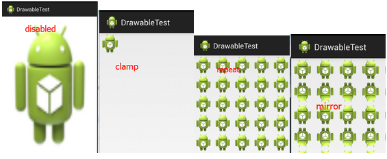
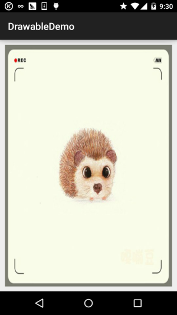
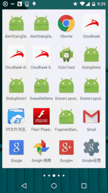
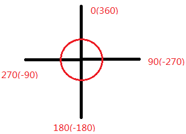
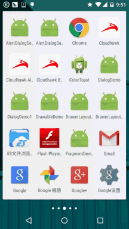
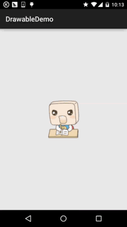

## 一、本节引言：
本节我们继续来学习Android中的Drawable资源，上一节我们学习了：
ColorDrawable；
NinePatchDrawable；
ShapeDrawable；
GradientDrawable！

这四个Drawable~ 而本节我们继续来学习接下来的五个Drawable，他们分别是：
BitmapDrawable；
InsertDrawable；
ClipDrawable；
RotateDrawable；
AnimationDrawable!
还是贴下13种Drawable的导图：


好的，开始本节内容~


## 二、BitmapDrawable
对Bitmap的一种封装,可以设置它包装的bitmap在BitmapDrawable区域中的绘制方式,有: 平铺填充,拉伸填或保持图片原始大小!以<bitmap>为根节点! 可选属性如下：

- `src`:图片资源~
- `antialias`:是否支持抗锯齿
- `filter`:是否支持位图过滤,支持的话可以是图批判显示时比较光滑
- `dither`:是否对位图进行抖动处理
- `gravity`:若位图比容器小,可以设置位图在容器中的相对位置
- `tileMode`:指定图片平铺填充容器的模式,设置这个的话,gravity属性会被忽略,有以下可选值: disabled(整个图案拉伸平铺),clamp(原图大小), repeat(平铺),mirror(镜像平铺)

对应的效果图：



①XML定义BitmapDrawable:
```xml
<?xml version="1.0" encoding="utf-8"?>  
<bitmap xmlns:android="http://schemas.android.com/apk/res/android"  
    android:dither="true"  
    android:src="@drawable/ic_launcher"  
    android:tileMode="mirror" />
```

②实现相同效果的Java代码:
```java
BitmapDrawable bitDrawable = new BitmapDrawable(bitmap);  
bitDrawable.setDither(true);  
bitDrawable.setTileModeXY(TileMode.MIRROR,TileMode.MIRROR);  
```


## 三、InsetDrawable
表示把一个Drawable嵌入到另外一个Drawable的内部，并且在内部留一些间距, 类似与Drawable的padding属性,但padding表示的是Drawable的内容与Drawable本身的边距! 而InsetDrawable表示的是两个Drawable与容器之间的边距,当控件需要的背景比实际的边框 小的时候,比较适合使用InsetDrawable,比如使用这个可以解决我们自定义Dialog与屏幕之间 的一个间距问题,相信做过的朋友都知道,即使我们设置了layout_margin的话也是没用的,这个 时候就可以用到这个InsetDrawable了!只需为InsetDrawable设置一个insetXxx设置不同 方向的边距,然后为设置为Dialog的背景即可！

相关属性如下：

1. drawable:引用的Drawable,如果为空,必须有一个Drawable类型的子节点!
2. visible:设置Drawable是否额空间
3. insetLeft,insetRight,insetTop,insetBottm:设置左右上下的边距

①XML中使用:
```xml
<?xml version="1.0" encoding="utf-8"?>  
<inset xmlns:android="http://schemas.android.com/apk/res/android"  
    android:drawable="@drawable/test1"  
    android:insetBottom="10dp"  
    android:insetLeft="10dp"  
    android:insetRight="10dp"  
    android:insetTop="10dp" /> 
```

在Java代码中使用：
```java
InsetDrawable insetDrawable = new InsetDrawable(getResources()  
        .getDrawable(R.drawable.test1), 10, 10, 10, 10); 
```

使用效果图：




## 四、ClipDrawable
Clip可以译为剪的意思,我们可以把ClipDrawable理解为从位图上剪下一个部分; Android中的进度条就是使用ClipDrawable来实现的,他根据设置level的值来决定剪切 区域的大小,根节点是<clip>

相关属性如下：

- `clipOrietntion`:设置剪切的方向,可以设置水平和竖直2个方向
- `gravity`:从那个位置开始裁剪
- `drawable`:引用的drawable资源,为空的话需要有一个Drawable类型的子节点 ps:这个Drawable类型的子节点:就是在<clip里>加上这样的语句: 这样...

使用示例：

核心：通过代码修改ClipDrawable的level的值！Level的值是0~10000！

运行效果图：



代码实现：

①定义一个ClipDrawable的资源xml:
```xml
<?xml version="1.0" encoding="utf-8"?>
<clip xmlns:android="http://schemas.android.com/apk/res/android"
    android:clipOrientation="horizontal"
    android:drawable="@mipmap/ic_bg_meizi"
    android:gravity="left" /> 
```

②在activity_main主布局文件中设置一个ImageView,将src设置为clipDrawable! 记住是src哦,如果你写成了blackground的话可是会报空指针的哦!!!!
```xml
<LinearLayout xmlns:android="http://schemas.android.com/apk/res/android"
    xmlns:tools="http://schemas.android.com/tools"
    android:layout_width="match_parent"
    android:layout_height="match_parent"
    android:orientation="vertical">

    <ImageView
        android:id="@+id/img_show"
        android:layout_width="match_parent"
        android:layout_height="match_parent"
        android:src="@drawable/clip_bg" />

</LinearLayout>  
```

③MainActivity.java通过setLevel设置截取区域大小:
```java
public class MainActivity extends AppCompatActivity {

    private ImageView img_show;
    private ClipDrawable cd;
    private Handler handler = new Handler() {
        @Override
        public void handleMessage(Message msg) {
            if (msg.what == 0x123) {
                cd.setLevel(cd.getLevel() + 500);
            }
        }
    };

    @Override
    protected void onCreate(Bundle savedInstanceState) {
        super.onCreate(savedInstanceState);
        setContentView(R.layout.activity_main);
        img_show = (ImageView) findViewById(R.id.img_show);
        // 核心实现代码
        cd = (ClipDrawable) img_show.getDrawable();
        final Timer timer = new Timer();
        timer.schedule(new TimerTask() {
            @Override
            public void run() {
                handler.sendEmptyMessage(0x123);
                if (cd.getLevel() >= 10000) {
                    timer.cancel();
                }
            }
        }, 0, 300);
    }
}
```

好的，有点意思，妹子图别问我拿，百度上一堆哈~


## 五、RotateDrawable
用来对Drawable进行旋转,也是通过setLevel来控制旋转的,最大值也是:10000

相关属性如下：

- `fromDegrees`:起始的角度,,对应最低的level值,默认为0
- `toDegrees`:结束角度,对应最高的level值,默认360
- `pivotX`:设置参照点的x坐标,取值为0~1,默认是50%,即0.5
- `pivotY`:设置参照点的Y坐标,取值为0~1,默认是50%,即0.5 ps:如果出现旋转图片显示不完全的话可以修改上述两个值解决!
- `drawable`:设置位图资源
- `visible`:设置drawable是否可见!
角度图如下：



使用示例：

运行效果图：



代码实现：

在第三点的clipDrawable上做一点点修改即可!

①定义一个rotateDrawable资源文件:
```xml
<?xml version="1.0" encoding="utf-8"?>
<rotate xmlns:android="http://schemas.android.com/apk/res/android"
    android:drawable="@mipmap/ic_launcher"
    android:fromDegrees="-180"
    android:pivotX="50%"
    android:pivotY="50%" />  
```

②activity_main.xml中修改下src指向上述drawable即可,MainActivity只需要把ClipDrawable 改成rotateDrawable即可!
```java
public class MainActivity extends AppCompatActivity {

    private ImageView img_show;
    private RotateDrawable cd;
    private Handler handler = new Handler() {
        @Override
        public void handleMessage(Message msg) {
            if (msg.what == 0x123) {
                if (cd.getLevel() >= 10000)
                    Toast.makeText(MainActivity.this, "转完了~",
                            Toast.LENGTH_LONG).show();
                cd.setLevel(cd.getLevel() + 400);
            }
        }
    };

    @Override
    protected void onCreate(Bundle savedInstanceState) {
        super.onCreate(savedInstanceState);
        setContentView(R.layout.activity_main);
        img_show = (ImageView) findViewById(R.id.img_show);
        // 核心实现代码
        cd = (RotateDrawable) img_show.getDrawable();
        final Timer timer = new Timer();
        timer.schedule(new TimerTask() {
            @Override
            public void run() {
                handler.sendEmptyMessage(0x123);
                if (cd.getLevel() >= 10000) {
                    timer.cancel();
                }
            }
        }, 0, 100);
    }
}
```


## 六、AnimationDrawable
本节最后一个Drawable，AnimationDrawable是用来实现Android中帧动画的,就是把一系列的 Drawable，按照一定得顺序一帧帧地播放；Android中动画比较丰富,有传统补间动画,平移, 缩放等等效果,但是这里我们仅仅介绍这个AnimationDrawable实现帧动画,关于alpha,scale, translate,rotate等,后续在动画章节再进行详细的介绍~

我们这里使用<animation-list>作为根节点

相关属性方法:

oneshot:设置是否循环播放,false为循环播放!!! duration:帧间隔时间,通常我们会设置为300毫秒 我们获得AniamtionDrawable实例后，需要调用它的start()方法播放动画，另外要注意 在OnCreate()方法中调用的话,是没有任何效果的,因为View还没完成初始化,我们可以 用简单的handler来延迟播放动画!当然还有其他的方法,可见下述链接: Android AnimationDrawable运行的几种方式 使用AnimationDrawable来实现帧动画真的是非常方便的~

使用示例：

运行效果图：



代码实现：

①先定义一个AnimationDrawable的xml资源文件:
```xml
<?xml version="1.0" encoding="utf-8"?>
<animation-list xmlns:android="http://schemas.android.com/apk/res/android"
    android:oneshot="false">

    <item
        android:drawable="@mipmap/ic_pull_to_refresh_loading01"
        android:duration="100" />

    <item
        android:drawable="@mipmap/ic_pull_to_refresh_loading02"
        android:duration="100" />
    <item
        android:drawable="@mipmap/ic_pull_to_refresh_loading03"
        android:duration="100" />
    <item
        android:drawable="@mipmap/ic_pull_to_refresh_loading04"
        android:duration="100" />
    <item
        android:drawable="@mipmap/ic_pull_to_refresh_loading05"
        android:duration="100" />
    <item
        android:drawable="@mipmap/ic_pull_to_refresh_loading06"
        android:duration="100" />

</animation-list>
```
 
②activity_main.xml设置下src,然后MainActivity中:
```java
public class MainActivity extends AppCompatActivity {

    private ImageView img_show;
    private AnimationDrawable ad;

    @Override
    protected void onCreate(Bundle savedInstanceState) {
        super.onCreate(savedInstanceState);
        setContentView(R.layout.activity_main);
        img_show = (ImageView) findViewById(R.id.img_show);
        // 核心实现代码
        ad = (AnimationDrawable) img_show.getDrawable();
        Handler handler = new Handler();
        handler.postDelayed(new Runnable() {
            @Override
            public void run() {
                ad.start();
            }
        }, 300);
    }
}
```

嘿嘿，超简单有木有，以后在一些需要用到帧动画的地方，直接上AnimationDrawable， 当然，只适合于不需要进行控制的帧动画，比如上面这个就是超表下拉刷新时候的进度条素材 做成的一个简单帧动画！根据自己的需求自行拓展~


## 七、本节小结：
 本节又介绍了另外的五个Drawable，很有趣是吧，还不快快将他们应用到你的实际开发当中~ 嘻嘻，就说这么多，谢谢!另外刚刚有读者私信我说以前的文章别删行不行，嗯，这里说下 只删除一些重复的，比如和这个雷同的那几节~当然我也会备份！删除的文章都会备份的~ 所以放心！