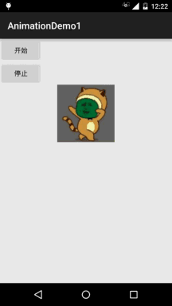
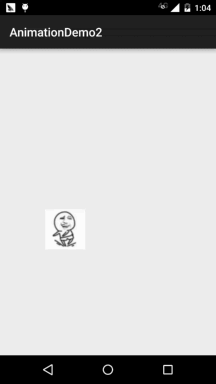

## 一、本节引言：
从本节开始我们来探究Android中的动画，毕竟在APP中添加上一些动画，会让我们的应用变得 很炫，比如最简单的关开Activity，当然自定义控件动画肯定必不可少啦~而Android中的动画 分为三大类，逐帧动画(Frame)以及补间动画(Tween)，还有Android 3.0以后引入的属性动画 (Property)，而本节给大家带来的是第一种动画——逐帧动画的一个基本使用~ 


## 二、帧动画概念以及用法
帧动画非常容易理解，其实就是简单的由N张静态图片收集起来，然后我们通过控制依次显示 这些图片，因为人眼"视觉残留"的原因，会让我们造成动画的"错觉"，跟放电影的原理一样！

而Android中实现帧动画，一般我们会用到前面讲解到的一个Drawable：[AnimationDrawable](../custom/drawable2.html) 先编写好Drawable，然后代码中调用start()以及stop()开始或停止播放动画~

当然我们也可以在Java代码中创建逐帧动画，创建AnimationDrawable对象，然后调用 addFrame(Drawable frame,int duration)向动画中添加帧，接着调用start()和stop()而已~

下面我们来写两个例子体会下帧动画的效果以及熟悉下用法


## 三、使用示例：
### 示例一：最简单的例子：
运行效果图：



代码实现：

首先编写我们的动画文件，非常简单，先在res下创建一个anim目录，接着开始撸我们的 动画文件：miao_gif.xml： 这里的android:oneshot是设置动画是否只是播放一次，true只播放一次，false循环播放！
```xml
<?xml version="1.0" encoding="utf-8"?>
<animation-list xmlns:android="http://schemas.android.com/apk/res/android"
    android:oneshot="false">
    <item
        android:drawable="@mipmap/img_miao1"
        android:duration="80" />
    <item
        android:drawable="@mipmap/img_miao2"
        android:duration="80" />
    <item
        android:drawable="@mipmap/img_miao3"
        android:duration="80" />
    <!--限于篇幅，省略其他item，自己补上-->
    ...
</animation-list>
```

动画文件有了，接着到我们的布局文件：activity_main.xml：
```xml
<LinearLayout xmlns:android="http://schemas.android.com/apk/res/android"
    android:layout_width="match_parent"
    android:layout_height="match_parent"
    android:orientation="vertical">

    <Button
        android:id="@+id/btn_start"
        android:layout_width="wrap_content"
        android:layout_height="wrap_content"
        android:text="开始" />

    <Button
        android:id="@+id/btn_stop"
        android:layout_width="wrap_content"
        android:layout_height="wrap_content"
        android:text="停止" />

    <ImageView
        android:id="@+id/img_show"
        android:layout_width="120dp"
        android:layout_height="120dp"
        android:layout_gravity="center"
        android:background="@anim/miao_gif" />
    
</LinearLayout>
```

最后是我们的MainActivity.java，这里在这里控制动画的开始以及暂停：
```java
public class MainActivity extends AppCompatActivity implements View.OnClickListener {

    private Button btn_start;
    private Button btn_stop;
    private ImageView img_show;
    private AnimationDrawable anim;

    @Override
    protected void onCreate(Bundle savedInstanceState) {
        super.onCreate(savedInstanceState);
        setContentView(R.layout.activity_main);
        bindViews();
        anim = (AnimationDrawable) img_show.getBackground();
    }

    private void bindViews() {
        btn_start = (Button) findViewById(R.id.btn_start);
        btn_stop = (Button) findViewById(R.id.btn_stop);
        img_show = (ImageView) findViewById(R.id.img_show);
        btn_start.setOnClickListener(this);
        btn_stop.setOnClickListener(this);
    }
    
    @Override
    public void onClick(View v) {
        switch (v.getId()) {
            case R.id.btn_start:
                anim.start();
                break;
            case R.id.btn_stop:
                anim.stop();
                break;
        }
    }
}
```

好的，非常的简单哈~

### 示例二：在指定地方播放帧动画
运行效果图：



代码实现：

依旧是先上我们的动画文件:anim_zhuan.xml：
```xml
<animation-list xmlns:android="http://schemas.android.com/apk/res/android"
    android:oneshot="true">
    <item
        android:drawable="@mipmap/img_zhuan1"
        android:duration="80" />
    <item
        android:drawable="@mipmap/img_zhuan2"
        android:duration="80" />
    <item
        android:drawable="@mipmap/img_zhuan3"
        android:duration="80" />
     <!--限于篇幅，省略其他item，自己补上-->
    ...
</animation-list> 
```

接着我们来写一个自定义的ImageView：FrameView.java，这里通过反射获得当前播放的帧， 然后是否为最后一帧，是的话隐藏控件！
```java
/**
 * Created by Jay on 2015/11/15 0015.
 */
public class FrameView extends ImageView {

    private AnimationDrawable anim;

    public FrameView(Context context) {
        super(context);
    }

    public FrameView(Context context, AttributeSet attrs) {
        super(context, attrs);
    }

    public FrameView(Context context, AttributeSet attrs, int defStyleAttr) {
        super(context, attrs, defStyleAttr);
    }

    public void setAnim(AnimationDrawable anim){
        this.anim = anim;
    }

    public void setLocation(int top,int left){
        this.setFrame(left,top,left + 200,top + 200);
    }

    @Override
    protected void onDraw(Canvas canvas) {
        try{
            //反射调用AnimationDrawable里的mCurFrame值
            Field field = AnimationDrawable.class
                    .getDeclaredField("mCurFrame");
            field.setAccessible(true);
            int curFrame = field.getInt(anim);// 获取anim动画的当前帧
            if (curFrame == anim.getNumberOfFrames() - 1)// 如果已经到了最后一帧
            {
                //让该View隐藏
                setVisibility(View.INVISIBLE);
            }
        }catch (Exception e){e.printStackTrace();}
        super.onDraw(canvas);
    }
}
```

最后是我们的MainActivity.java，创建一个FrameLayout，添加View，对触摸事件中按下的 事件做处理，显示控件以及开启动画~
```java
public class MainActivity extends AppCompatActivity {

    private FrameView fView;
    private AnimationDrawable anim = null;

    @Override
    protected void onCreate(Bundle savedInstanceState) {
        super.onCreate(savedInstanceState);
        FrameLayout fly = new FrameLayout(this);
        setContentView(fly);
        fView = new FrameView(this);
        fView.setBackgroundResource(R.anim.anim_zhuan);
        fView.setVisibility(View.INVISIBLE);
        anim = (AnimationDrawable) fView.getBackground();
        fView.setAnim(anim);
        fly.addView(fView);
        fly.setOnTouchListener(new View.OnTouchListener() {
            @Override
            public boolean onTouch(View v, MotionEvent event) {
                //设置按下时才产生动画效果
                if(event.getAction() == MotionEvent.ACTION_DOWN){
                    anim.stop();
                    float x = event.getX();
                    float y = event.getY();
                    fView.setLocation((int) y - 40,(int)x-20);  //View显示的位置
                    fView.setVisibility(View.VISIBLE);
                    anim.start();    //开启动画
                }
                return false;
            }
        });
    }
}
```

好的，同样很简单哈~


## 四、本节示例代码和Gif帧提取工具下载
[AnimationDemo1.zip](../img/AnimationDemo1.zip)

[AnimationDemo2.zip](../img/AnimationDemo2.zip)

[Gif帧提取工具](../img/HA_AVD_Animated_GIF_producer_V5.2_FULL_Fix_ata.rar)


## 五、本节小结：
好的，本节给大家介绍了一下Android三种动画中最简单的帧动画，实际开发用的并不多 不过学多点东西，以后也多个思路嘛~好的，本节就到这里，谢谢~