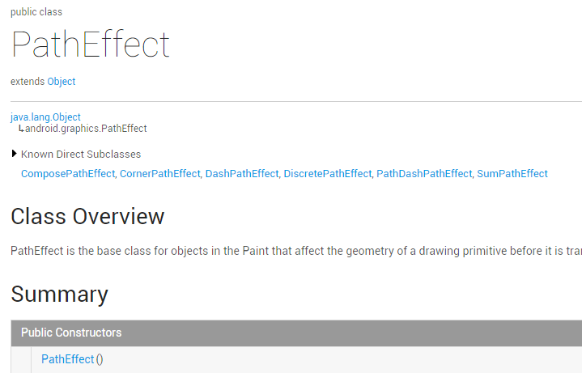
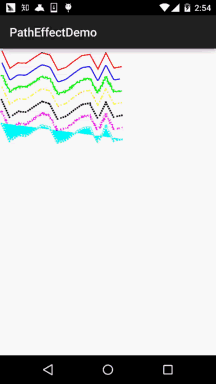

## 一、本节引言：
本节继续来学习Paint的API——PathEffect(路径效果)，我们把画笔的sytle设置为Stroke，可以 绘制一个个由线构成的图形，而这些线偶尔会显得单调是吧，比如你想把这些先改成虚线，又 或者想让路径的转角变得圆滑等，那你就可以考虑使用这个PathEffect来实现了！

官方API文档：PathEffect 进去看文档，可以发现这个PathEffect和我们前面学的MaskFilter(面具)与ColorFilter(颜色 过滤器)一样，几乎没有可用的方法：



我们一般使用的是他的六个子类：

- ComposePathEffect
- CornerPathEffect
- DashPathEffect
- DiscretePathEffect
- PathDashPathEffect
- SumPathEffect

下面我们依次对他们的作用，以及构造方法进行分析！


## 二、子类作用与构造方法参数分析：
### 1)CornerPathEffect
CornerPathEffect(float radius)

将Path的各个连接线段之间的夹角用一种更平滑的方式连接，类似于圆弧与切线的效果。 radius则是指定圆弧的半径！


### 2)DashPathEffect
DashPathEffect(float[] intervals, float phase)

将Path的线段虚线化，intervals为虚线的ON和OFF的数组，数组中元素数目需要 >= 2； 而phase则为绘制时的偏移量！


### 3)DiscretePathEffect
DiscretePathEffect(float segmentLength, float deviation)

打散Path的线段，使得在原来路径的基础上发生打散效果。 segmentLength指定最大的段长，deviation则为绘制时的偏离量。


### 4)PathDashPathEffect
PathDashPathEffect(Path shape, float advance, float phase, PathDashPathEffect.Style style)

作用是使用Path图形来填充当前的路径，shape指的填充图形，advance是每个图形间的间隔， style则是该类自由的枚举值，有三种情况：ROTATE、MORPH和TRANSLATE。

- ROTATE情况下：线段连接处的图形转换以旋转到与下一段移动方向相一致的角度进行连接
- MORPH情况下：图形会以发生拉伸或压缩等变形的情况与下一段相连接
- TRANSLATE情况下：图形会以位置平移的方式与下一段相连接


### 5)ComposePathEffect
ComposePathEffect(PathEffect outerpe, PathEffect innerpe)

作用是：组合效果，会首先将innerpe变现出来，接着在innerpe的基础上来增加outerpe效果！


### 6)SumPathEffect
SumPathEffect(PathEffect first, PathEffect second)

作用是：叠加效果，和ComposePathEffect不同，在表现时会将两个参数的效果都独立的表现出来， 接着将两个效果简单的重叠在一起显示出来！


## 三、写代码来验证各自的效果
多说无益，写代码最实际，我们写下代码来试试这几个子类各自所起的效果！

运行效果图：



实现代码：

我们自己来写一个View，里面的线移动的效果是phase增加造成的，每次 + 2， 然后invalidate重绘而已，所以别惊讶！PathEffectView.java:
```java
/**
 * Created by Jay on 2015/10/30 0030.
 */
public class PathEffectView extends View {

    private Paint mPaint;
    private Path mPath;
    private float phase = 0;
    private PathEffect[] effects = new PathEffect[7];
    private int[] colors;

    public PathEffectView(Context context) {
        this(context, null);
    }

    public PathEffectView(Context context, AttributeSet attrs) {
        super(context, attrs);
        init();
    }

    public PathEffectView(Context context, AttributeSet attrs, int defStyleAttr) {
        super(context, attrs, defStyleAttr);
    }

    //初始化画笔
    private void init() {
        mPaint = new Paint(Paint.ANTI_ALIAS_FLAG); //抗锯齿
        mPaint.setStyle(Paint.Style.STROKE);       //绘画风格:空心
        mPaint.setStrokeWidth(5);                  //笔触粗细
        mPath = new Path();
        mPath.moveTo(0, 0);
        for (int i = 1; i <= 15; i++) {
            // 生成15个点，随机生成它们的坐标，并将它们连成一条Path
            mPath.lineTo(i * 40, (float) Math.random() * 100);
        }
        // 初始化7个颜色
        colors = new int[] { Color.RED, Color.BLUE, Color.GREEN,
                Color.YELLOW, Color.BLACK, Color.MAGENTA, Color.CYAN };
    }


    @Override
    protected void onDraw(Canvas canvas) {
        canvas.drawColor(Color.WHITE);
        //初始化其中路径效果：
        effects[0] = null;                                    //无效果
        effects[1] = new CornerPathEffect(10);                //CornerPathEffect
        effects[2] = new DiscretePathEffect(3.0f, 5.0f);      //DiscretePathEffect
        effects[3] = new DashPathEffect(new float[] { 20, 10, 5, 10 },phase);   //DashPathEffect
        Path p = new Path();
        p.addRect(0, 0, 8, 8, Path.Direction.CCW);
        effects[4] = new PathDashPathEffect(p, 12, phase,
                PathDashPathEffect.Style.ROTATE);             //PathDashPathEffect
        effects[5] = new ComposePathEffect(effects[2], effects[4]);    //ComposePathEffect
        effects[6] = new SumPathEffect(effects[2], effects[4]);   //SumPathEffect
        // 将画布移动到(10,10)处开始绘制
        canvas.translate(10, 10);
        // 依次使用7中不同的路径效果、7中不同的颜色来绘制路径
        for (int i = 0; i < effects.length; i++) {
            mPaint.setPathEffect(effects[i]);
            mPaint.setColor(colors[i]);
            canvas.drawPath(mPath, mPaint);
            canvas.translate(0, 60);
        }
        // 改变phase值，形成动画效果
        phase += 2;
        invalidate();
    }
}
```

好的，代码的注释已经非常清楚了，这里也不唠叨了~


## 四、本节示例代码下载：
[PathEffectDemo.zip](../img/PathEffectDemo.zip)


## 五、本节小结
本节没什么难的东西，就介绍了PathEffect的六个子类所起的作用，只需调用setPathEffect 方法应用到Paint对象中，非常简单~嗯，就说这么多，谢谢~