## 一、一些BB
上节我们把简单的项目搭起来了，然后把仓库托管到Github上了，经过分析， 我们觉得有必要把下面两点优化下：

1.URL写死 -> 解析接口返回的Json，处理获取图片URL 2.优化图片加载，添加本地加载

本节就来完成上述的第一点！


## 二、开始写代码
1）在Develop上开辟功能分支：parse_json

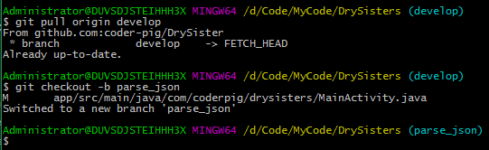

2）抠脚Json解析接口数据

数据来源接口：[Gank.io API](http://gank.io/api)

这里我们用的接口是：http://gank.io/api/data/福利/{请求个数}/{第几页} 例如：每页显示10个，第一页：http://gank.io/api/data/福利/10/1

先看下服务器返回的Json格式：

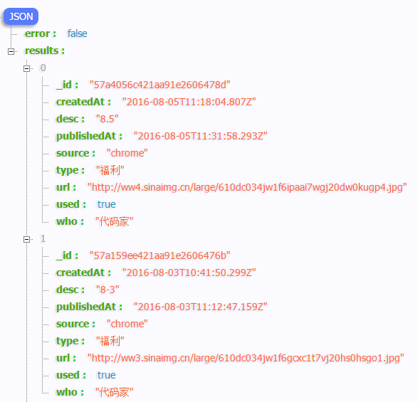

PS：格式化Json的是Chrome的插件：JSON_handle

根据这个我们先来编写我们的Bean类：Sister.java：
```java
/**
 * 描述：妹子业务Bean
 *
 * @author coder-pig： 2016/08/06 17:16
 */
public class Sister {

    private String _id;
    private String createAt;
    private String desc;
    private String publishedAt;
    private String source;
    private String type;
    private String url;
    private boolean used;
    private String who;

    // 一些get和set方法...
    
}
```

接下来我们编写一个用来解析网络数据的类，这个类里要做的事依次是：

- Step 1：通过HttpUrlConnection发起Get请求，然后获得后台返回的数据，此时是流形式的
- Step 2：我们需要写一个流转成字节数组的方法
- Step 3：将字节数组转成字符串后，得到的就是后台的给我们返回的数据了，接着要做的就 是写一个解析这一大串Json的方法了，我们需要获取Json里我们需要的数据，丢到Bean里
- Step 4：返回处理后的集合数据

于是乎我们编写一个网络请求的处理类：SisterApi.java：
```java
/**
 * 描述：网络请求处理相关类
 *
 * @author coder-pig： 2016/08/07 14:28
 */
public class SisterApi {
    private static final String TAG = "Network";
    private static final String BASE_URL = "http://gank.io/api/data/福利/";

    /**
     * 查询妹子信息
     */
    public ArrayList<Sister> fetchSister(int count, int page) {
        String fetchUrl = BASE_URL + count + "/" + page;
        ArrayList<Sister> sisters = new ArrayList<>();
        try {
            URL url = new URL(fetchUrl);
            HttpURLConnection conn = (HttpURLConnection) url.openConnection();
            conn.setConnectTimeout(5000);
            conn.setRequestMethod("GET");
            int code = conn.getResponseCode();
            Log.v(TAG, "Server response：" + code);
            if (code == 200) {
                InputStream in = conn.getInputStream();
                byte[] data = readFromStream(in);
                String result = new String(data, "UTF-8");
                sisters = parseSister(result);
            } else {
                Log.e(TAG,"请求失败：" + code);
            }
        } catch (Exception e) {
            e.printStackTrace();
        }
        return sisters;
    }


    /**
     * 解析返回Json数据的方法
     */
    public ArrayList<Sister> parseSister(String content) throws Exception {
        ArrayList<Sister> sisters = new ArrayList<>();
        JSONObject object = new JSONObject(content);
        JSONArray array = object.getJSONArray("results");
        for (int i = 0; i < array.length(); i++) {
            JSONObject results = (JSONObject) array.get(i);
            Sister sister = new Sister();
            sister.set_id(results.getString("_id"));
            sister.setCreateAt(results.getString("createdAt"));
            sister.setDesc(results.getString("desc"));
            sister.setPublishedAt(results.getString("publishedAt"));
            sister.setSource(results.getString("source"));
            sister.setType(results.getString("type"));
            sister.setUrl(results.getString("url"));
            sister.setUsed(results.getBoolean("used"));
            sister.setWho(results.getString("who"));
            sisters.add(sister);
        }
        return sisters;
    }

    /**
     * 读取流中数据的方法
     */
    public byte[] readFromStream(InputStream inputStream) throws Exception {
        ByteArrayOutputStream outputStream = new ByteArrayOutputStream();
        byte[] buffer = new byte[1024];
        int len ;
        while ((len = inputStream.read(buffer)) != -1) {
            outputStream.write(buffer, 0, len);
        }
        inputStream.close();
        return outputStream.toByteArray();
    }
}
```

好的，接着我们就去调用这个网络请求类了，我们把调用写在MainActivity.java里 而Android是不允许在主线程做网络操作的这里我们就不直接new Runnable， 直接写一个AsyncTask，在里面进网络操作，还有一些简单的逻辑。
```java
public class MainActivity extends AppCompatActivity implements View.OnClickListener {
    private Button showBtn;
    private Button refreshBtn;
    private ImageView showImg;

    private ArrayList<Sister> data;
    private int curPos = 0; //当前显示的是哪一张
    private int page = 1;   //当前页数
    private PictureLoader loader;
    private SisterApi sisterApi;

    @Override protected void onCreate(Bundle savedInstanceState) {
        super.onCreate(savedInstanceState);
        setContentView(R.layout.activity_main);
        sisterApi = new SisterApi();
        loader = new PictureLoader();
        initData();
        initUI();
    }

    private void initData() {
        data = new ArrayList<>();
        new SisterTask(page).execute();
    }

    private void initUI() {
        showBtn = (Button) findViewById(R.id.btn_show);
        refreshBtn = (Button) findViewById(R.id.btn_refresh);
        showImg = (ImageView) findViewById(R.id.img_show);

        showBtn.setOnClickListener(this);
        refreshBtn.setOnClickListener(this);
    }

    @Override public void onClick(View v) {
        switch (v.getId()) {
            case R.id.btn_show:
                if(data != null && !data.isEmpty()) {
                    if (curPos > 9) {
                        curPos = 0;
                    }
                    loader.load(showImg, data.get(curPos).getUrl());
                    curPos++;
                }
                break;
            case R.id.btn_refresh:
                page++;
                new SisterTask(page).execute();
                curPos = 0;
                break;
        }
    }

    private class SisterTask extends AsyncTask<Void,Void,ArrayList<Sister>> {

        private int page;

        public SisterTask(int page) {
            this.page = page;
        }

        @Override
        protected ArrayList<Sister> doInBackground(Void... params) {
            return sisterApi.fetchSister(10,page);
        }

        @Override
        protected void onPostExecute(ArrayList<Sister> sisters) {
            super.onPostExecute(sisters);
            data.clear();
            data.addAll(sisters);
        }
    }
}
```

核心是这些，还有一些小改动，加了个Application的类，调整了一下结构，变成这样的：

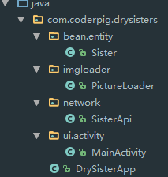


## 三、运行效果图

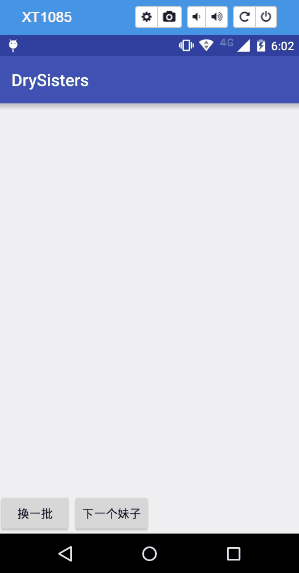


## 四、提交代码，合并分支，删除分支
依次键入命令提交代码：

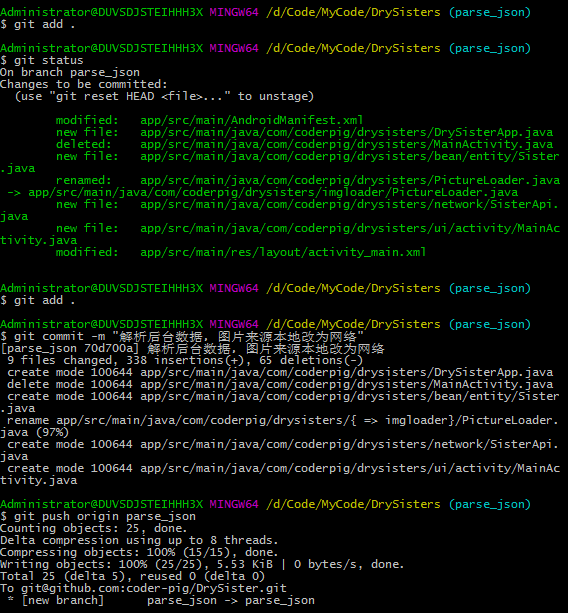

提交完到Github上可以看到：

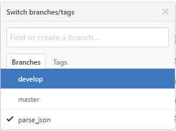

因为没下载Github客户端，所以分支合并就用命令行走一发了： 切到develop分支上，走一波merge parse_json

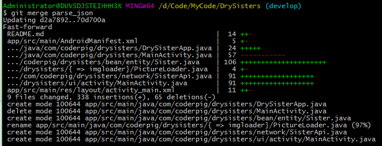

然后把合并后的develop提交到Github，（因为一个人开发，所以基本不用处理冲突

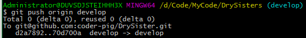

好的，推完看到github上的develop内容已经发生了变化

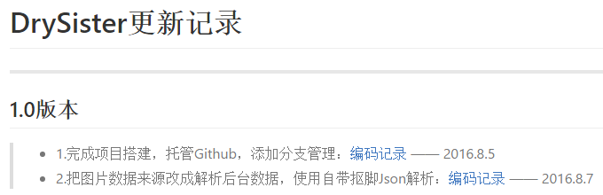

那么开辟的这个parse_json分支，现在已经没什么作用了，我们可以用命令删掉这个分支：

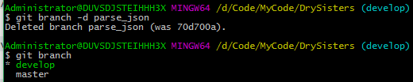

当然，这里我们删除的只是本地仓库，Github上还是有这个分支的，再键入命令：

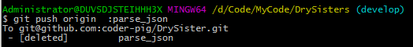

然后到GitHub上面看看：

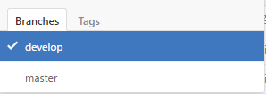

好的，分支已经被删除了！develop分支上的代码也是最新的代码了！

**Bug修复——(2016.8.9)：**
今天群里的B神和我反馈了下new AsyncTask可能会导致内存溢出的问题， 仔细一想确实有这个可能，时间关系写的时候并没有注意这个，特意开 了个 asyncTask_bug 的分支来修复这个问题，对MainActivity的代码 进行了修改，修改后的代码如下：
```java
public class MainActivity extends AppCompatActivity implements View.OnClickListener {
    private Button showBtn;
    private Button refreshBtn;
    private ImageView showImg;

    private ArrayList<Sister> data;
    private int curPos = 0; //当前显示的是哪一张
    private int page = 1;   //当前页数
    private PictureLoader loader;
    private SisterApi sisterApi;
    private SisterTask sisterTask;

    @Override protected void onCreate(Bundle savedInstanceState) {
        super.onCreate(savedInstanceState);
        setContentView(R.layout.activity_main);
        sisterApi = new SisterApi();
        loader = new PictureLoader();
        initData();
        initUI();
    }

    private void initData() {
        data = new ArrayList<>();
    }

    private void initUI() {
        showBtn = (Button) findViewById(R.id.btn_show);
        refreshBtn = (Button) findViewById(R.id.btn_refresh);
        showImg = (ImageView) findViewById(R.id.img_show);

        showBtn.setOnClickListener(this);
        refreshBtn.setOnClickListener(this);
    }

    @Override public void onClick(View v) {
        switch (v.getId()) {
            case R.id.btn_show:
                if(data != null && !data.isEmpty()) {
                    if (curPos > 9) {
                        curPos = 0;
                    }
                    loader.load(showImg, data.get(curPos).getUrl());
                    curPos++;
                }
                break;
            case R.id.btn_refresh:
                sisterTask = new SisterTask();
                sisterTask.execute();
                curPos = 0;
                break;
        }
    }

    private class SisterTask extends AsyncTask<Void,Void,ArrayList<Sister>> {

        public SisterTask() { }

        @Override
        protected ArrayList<Sister> doInBackground(Void... params) {
            return sisterApi.fetchSister(10,page);
        }

        @Override
        protected void onPostExecute(ArrayList<Sister> sisters) {
            super.onPostExecute(sisters);
            data.clear();
            data.addAll(sisters);
            page++;
        }

        @Override
        protected void onCancelled() {
            super.onCancelled();
            sisterTask = null;
        }
    }

    @Override
    protected void onDestroy() {
        super.onDestroy();
        sisterTask.cancel(true);
    }
}
```


源码下载：[DrySister](https://github.com/coder-pig/DrySister/tree/develop)
