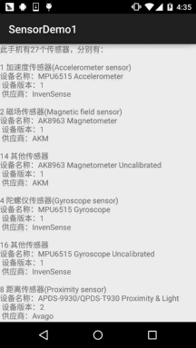

## 一、传感器相关介绍：
说到传感器，相信大家都不会陌生吧，比如微信的摇一摇就用到了加速度传感器；

传感器的定义：一种物理设备或者生物器官，能够探测、感受外界的信号，物理条件(如光，热， 适度)或化学组成（如烟雾），并将探知的信息传递给其他的设备或者器官！

传感器的种类：可以从不同的角度对传感器进行划分，转换原理(传感器工作的基本物理或化学 效应)；用途；输出信号以及制作材料和工艺等。一般是按工作原来来分：物理传感器与化学传感器 两类！手机上搭载的基本都是物理传感器，手机上搭载的传感器有下面这些：

- 方向传感器(Orientation sensor)
- 加速感应器（Accelerometer sensor）
- 陀螺仪传感器(Gyroscope sensor)
- 磁场传感器(Magnetic field sensor)
- 距离传感器(Proximity sensor)
- 光线传感器(Light sensor)
- 气压传感器(Pressure sensor)
- 温度传感器（Temperature sensor）
- 重力感应器（Gravity sensor，Android 2.3引入）
- 线性加速感应器（Linear acceleration sensor ，Android 2.3引入）
- 旋转矢量传感器（Rotation vector sensor，Android 2.3）
- 相对湿度传感器（Relative humidity sensor，Android 4.0）
- 近场通信（NFC）传感器（Android 2.3引入），NFC和其他不一样，具有读写功能。

当然除了这些以外还有其他比如心率传感器，记步传感器，指纹传感器等， 关于Android设备所支持的传感器类型可见官方文档：Sensor Summary部分的内容~


## 二、如何查看自己手机所支持的传感器有哪些？
上面说的这么多种肯定不是所有手机都具备的，每台手机上搭载的传感器类型 以及数目都可能是不一样的，比如我手头上的Nexus 5支持的传感器类型有： 重力，光线，距离，气压和陀螺仪！而令意外moto x 二代则有重力，光线， 距离和红外传感器！关于自己手机支持的传感器类型，你可以到相关的评测 网站比如：中关村手机在线，太平洋等，搜索到自己的机型查看相关参数！ 当然，我们也可以自己写代码来看看自己手机支持的传感器类型~

代码示例：

运行效果图：



代码实现：

`activity_main.xml：`
```xml
<RelativeLayout xmlns:android="http://schemas.android.com/apk/res/android"
    android:layout_width="match_parent"
    android:layout_height="match_parent">
    <ScrollView
        android:layout_width="match_parent"
        android:layout_height="match_parent">
        <TextView
            android:id="@+id/txt_show"
            android:layout_width="match_parent"
            android:layout_height="match_parent" />
    </ScrollView>
</RelativeLayout>
```

`MainActivity.java：`
```java
public class MainActivity extends AppCompatActivity {

    private TextView txt_show;
    private SensorManager sm;

    @Override
    protected void onCreate(Bundle savedInstanceState) {
        super.onCreate(savedInstanceState);
        setContentView(R.layout.activity_main);
        sm = (SensorManager) getSystemService(Context.SENSOR_SERVICE);
        txt_show = (TextView) findViewById(R.id.txt_show);

        List<Sensor> allSensors = sm.getSensorList(Sensor.TYPE_ALL);
        StringBuilder sb = new StringBuilder();

        sb.append("此手机有" + allSensors.size() + "个传感器，分别有：\n\n");
        for(Sensor s:allSensors){
            switch (s.getType()){
                case Sensor.TYPE_ACCELEROMETER:
                    sb.append(s.getType() + " 加速度传感器(Accelerometer sensor)" + "\n");
                    break;
                case Sensor.TYPE_GYROSCOPE:
                    sb.append(s.getType() + " 陀螺仪传感器(Gyroscope sensor)" + "\n");
                    break;
                case Sensor.TYPE_LIGHT:
                    sb.append(s.getType() + " 光线传感器(Light sensor)" + "\n");
                    break;
                case Sensor.TYPE_MAGNETIC_FIELD:
                    sb.append(s.getType() + " 磁场传感器(Magnetic field sensor)" + "\n");
                    break;
                case Sensor.TYPE_ORIENTATION:
                    sb.append(s.getType() + " 方向传感器(Orientation sensor)" + "\n");
                    break;
                case Sensor.TYPE_PRESSURE:
                    sb.append(s.getType() + " 气压传感器(Pressure sensor)" + "\n");
                    break;
                case Sensor.TYPE_PROXIMITY:
                    sb.append(s.getType() + " 距离传感器(Proximity sensor)" + "\n");
                    break;
                case Sensor.TYPE_TEMPERATURE:
                    sb.append(s.getType() + " 温度传感器(Temperature sensor)" + "\n");
                    break;
                default:
                    sb.append(s.getType() + " 其他传感器" + "\n");
                    break;
            }
            sb.append("设备名称：" + s.getName() + "\n 设备版本：" + s.getVersion() + "\n 供应商："
                    + s.getVendor() + "\n\n");
        }
        txt_show.setText(sb.toString());
    }
}
```


## 三、Sensor传感器相关的方法以及使用套路
从2中的例子我们可以大概地总结下获取Sensor传感器以及获取传感器相关的一些信息 流程如下：

### 1)Sensor传感器的相关方法
Step 1：获得传感器管理器：
```java
SensorManager sm = (SensorManager)getSystemService(SENSOR_SERVICE); 
```

Step 2：获得设备的传感器对象的列表：
```java
List<Sensor> allSensors = sm.getSensorList(Sensor.TYPE_ALL);
```

Step 3：迭代获取Sensor对象，然后调用对应方法获得传感器的相关信息：
```java
for(Sensor s:allSensors){
    sensor.getName();   //获得传感器名称
    sensor.getType();     //获得传感器种类
    sensor.getVendor();    //获得传感器供应商
    sensor.getVersion();    //获得传感器版本
    sensor.getResolution();  //获得精度值
    sensor.getMaximumRange(); //获得最大范围
    sensor.getPower();        //传感器使用时的耗电量 
}
```


### 2)传感器的使用套路
一般我们是很少说直接去获取Sensor，然后获取上面这些信息的！因为这没什么 大的作用，我们更多的时候是去获取传感器采集到的数据，比如获取当前的大气压， 或者方向传感器三个角的值，或者陀螺仪的值这样~而大部分的传感器数据采集都是 下面的一个套路：

~Step 1：获得传感器管理器：
```java
SensorManager sm = (SensorManager)getSystemService(SENSOR_SERVICE); 
```

~Step 2：调用特定方法获得需要的传感器：

比如这里获取的是方向传感器，想获得什么传感器自己查API~：
```java
Sensor mSensorOrientation = sm.getDefaultSensor(Sensor.TYPE_ORIENTATION);
```

~Step 3：实现SensorEventListener接口，重写onSensorChanged和onAccuracyChanged的方法！

- onSensorChanged：当传感器的值变化时会回调

- onAccuracyChanged：当传感器的进度发生改变时会回调
```java
@Override
public void onSensorChanged(SensorEvent event) {
    final float[] _Data = event.values;
   this.mService.onSensorChanged(_Data[0],_Data[1],_Data[2]);
}
@Override
public void onAccuracyChanged(Sensor sensor, int accuracy) {
}
```

我们一般获取传感器数据的来源就是这个SensorEvent，这个类中有一个values的变量， 类型是Float[]，该变量最多有只有三个元素，而且传感器不同，对应元素代表的含义也不同， 比如方向传感器中第一个元素是方位角的值，而气压传感器中第一个值则是气压值！

~Step 4：SensorManager对象调用registerListener注册监听器：

```java
ms.registerListener(mContext, mSensorOrientation, android.hardware.SensorManager.SENSOR_DELAY_UI);
```

方法也很简单，对应的参数：上下文对象，Sensor传感器对象， 以及传感器的延时时间的精度密度，有四个可选值：

- SENSOR_DELAY_FASTEST——延时：0ms
- SENSOR_DELAY_GAME——延时：20ms
- SENSOR_DELAY_UI——延时：60ms
- SENSOR_DELAY_NORMAL——延时：200ms

当然低延时意味着更频繁的检车，更意味着更多的电量消耗，如果不是要求精度非常高的建议 别使用太高精度的，一般用第三个较多~自己衡量衡量吧~

~Step 5：监听器的取消注册：

用完就放，一个很好的习惯，一般我们可以把他写到Activity或者Service的销毁方法中：
```java
ms.registerListener(mContext, mSensorOrientation, android.hardware.SensorManager.SENSOR_DELAY_UI);
```

好的，套路非常简单~


## 四、本节示例代码下载：
[SensorDemo1.zip](../img/SensorDemo1.zip)


## 五、本节小结：
好的，本节给大家讲解了下Android中的传感器的介绍以及如何了解自己手机所支持的传感器， 除了网上查，也可以自己写代码测，然后还讲解了Sensor传感器相关信息获取的方法流程，最后 还讲解了采集传感器数据的套路，后面我们会针对一些常用的传感器的用法进行剖析，敬请期待~ 