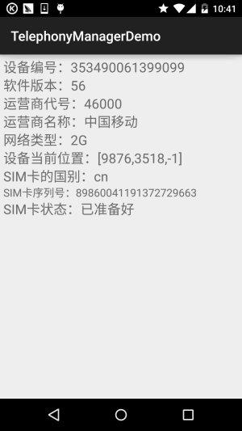
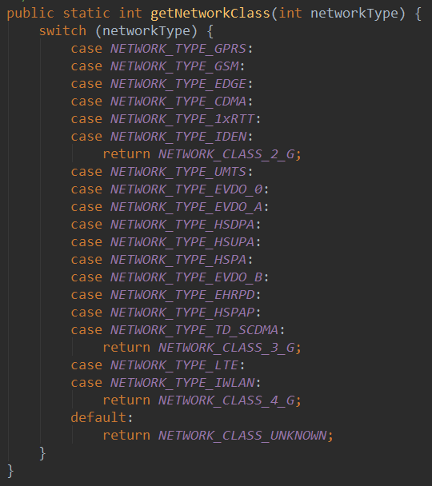
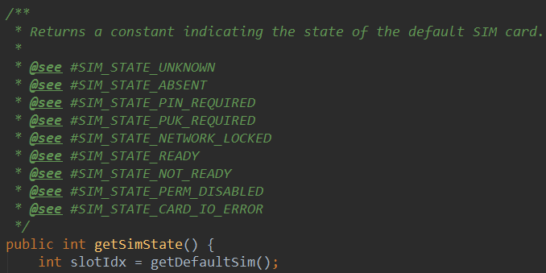

## 一、本节引言：
本章节是Android基础入门教程的最后一章，主要讲解是一些零零散散的一些知识点，以及一些遗漏 知识点的补充，这些零散的知识点包括，各种系统服务的使用，比如本节的电话管理器，短信管理器， 振动器，闹钟，壁纸等等，还有传感器之类的东西！乱七八糟什么都有哈！好的，本节我们要学习的 是TelephonyManager，见名知义：用于管理手机通话状态，获取电话信息(设备信息、sim卡信息以及 网络信息)，侦听电话状态(呼叫状态服务状态、信号强度状态等)以及可以调用电话拨号器拨打电话！ 话不多开始本节内容~

官方API:TelephonyManager


## 二、获得TelephonyManager的服务对象
```java
TelephonyManager tManager = (TelephonyManager)getSystemService(Context.TELEPHONY_SERVICE);
```


## 三、用法示例
### 1)调用拨号器拨打电话号码
```java
Uri uri=Uri.parse("tel:"+电话号码);    
Intent intent=new Intent(Intent.ACTION_DIAL,uri);    
startActivity(intent);  
```


### 2)获取Sim卡信息与网络信息
运行效果图：



实现代码：

布局文件：`activity_main.xml：`
```xml
<LinearLayout xmlns:android="http://schemas.android.com/apk/res/android"
    xmlns:tools="http://schemas.android.com/tools"
    android:layout_width="match_parent"
    android:layout_height="match_parent"
    android:orientation="vertical"
    android:padding="5dp"
    tools:context=".MainActivity">

    <TextView
        android:id="@+id/tv_phone1"
        android:layout_width="match_parent"
        android:layout_height="wrap_content"
        android:textSize="20sp" />

    <TextView
        android:id="@+id/tv_phone2"
        android:layout_width="match_parent"
        android:layout_height="wrap_content"
        android:textSize="20sp" />

    <TextView
        android:id="@+id/tv_phone3"
        android:layout_width="match_parent"
        android:layout_height="wrap_content"
        android:textSize="20sp" />

    <TextView
        android:id="@+id/tv_phone4"
        android:layout_width="match_parent"
        android:layout_height="wrap_content"
        android:textSize="20sp" />

    <TextView
        android:id="@+id/tv_phone5"
        android:layout_width="match_parent"
        android:layout_height="wrap_content"
        android:textSize="20sp" />

    <TextView
        android:id="@+id/tv_phone6"
        android:layout_width="match_parent"
        android:layout_height="wrap_content"
        android:textSize="20sp" />

    <TextView
        android:id="@+id/tv_phone7"
        android:layout_width="match_parent"
        android:layout_height="wrap_content"
        android:textSize="20sp" />

    <TextView
        android:id="@+id/tv_phone8"
        android:layout_width="match_parent"
        android:layout_height="wrap_content"
        android:textSize="16sp" />

    <TextView
        android:id="@+id/tv_phone9"
        android:layout_width="match_parent"
        android:layout_height="wrap_content"
        android:textSize="20sp" />

</LinearLayout>
```

`MainActivity.java：`
```java
public class MainActivity extends AppCompatActivity {

    private TextView tv_phone1;
    private TextView tv_phone2;
    private TextView tv_phone3;
    private TextView tv_phone4;
    private TextView tv_phone5;
    private TextView tv_phone6;
    private TextView tv_phone7;
    private TextView tv_phone8;
    private TextView tv_phone9;
    private TelephonyManager tManager;
    private String[] phoneType = {"未知","2G","3G","4G"};
    private String[] simState = {"状态未知","无SIM卡","被PIN加锁","被PUK加锁",
            "被NetWork PIN加锁","已准备好"};

    @Override
    protected void onCreate(Bundle savedInstanceState) {
        super.onCreate(savedInstanceState);
        setContentView(R.layout.activity_main);
        //①获得系统提供的TelphonyManager对象的实例
        tManager = (TelephonyManager) getSystemService(Context.TELEPHONY_SERVICE);
        bindViews();
    }

    private void bindViews() {
        tv_phone1 = (TextView) findViewById(R.id.tv_phone1);
        tv_phone2 = (TextView) findViewById(R.id.tv_phone2);
        tv_phone3 = (TextView) findViewById(R.id.tv_phone3);
        tv_phone4 = (TextView) findViewById(R.id.tv_phone4);
        tv_phone5 = (TextView) findViewById(R.id.tv_phone5);
        tv_phone6 = (TextView) findViewById(R.id.tv_phone6);
        tv_phone7 = (TextView) findViewById(R.id.tv_phone7);
        tv_phone8 = (TextView) findViewById(R.id.tv_phone8);
        tv_phone9 = (TextView) findViewById(R.id.tv_phone9);

        tv_phone1.setText("设备编号：" + tManager.getDeviceId());
        tv_phone2.setText("软件版本：" + (tManager.getDeviceSoftwareVersion()!= null?
                tManager.getDeviceSoftwareVersion():"未知"));
        tv_phone3.setText("运营商代号：" + tManager.getNetworkOperator());
        tv_phone4.setText("运营商名称：" + tManager.getNetworkOperatorName());
        tv_phone5.setText("网络类型：" + phoneType[tManager.getPhoneType()]);
        tv_phone6.setText("设备当前位置：" + (tManager.getCellLocation() != null ? tManager
                .getCellLocation().toString() : "未知位置"));
        tv_phone7.setText("SIM卡的国别：" + tManager.getSimCountryIso());
        tv_phone8.setText("SIM卡序列号：" + tManager.getSimSerialNumber());
        tv_phone9.setText("SIM卡状态：" + simState[tManager.getSimState()]);
    }
}
```

对了，别忘了在AndroidManifest.xml中加上权限哦！
```xml
<!-- 添加访问手机位置的权限 -->
<uses-permission android:name="android.permission.ACCESS_COARSE_LOCATION"/>
<!-- 添加访问手机状态的权限 -->
<uses-permission android:name="android.permission.READ_PHONE_STATE"/>
```

对了可能你想获取网络制式，而非普通的2G,3G,4G这样，其实我们可以到TelephonyManager类的源码里：



我们可以根据这个networkType的值，判断不同的网络制式，比如，如果networkType == 1 那个是GPRS这种制式的~而这个networkType的值可以通过


即这个getNetworkType()方法获得！好了，就这么简单，可以像上面列好一个数组然后根据 不同的下标显示不同的值！ 对了，还有Sim卡状态的，字符串数组中的值，都可以到源码中看：



其他的可自行探索~


### 3)获取手机的信号强度
网络信号强度的单位是dBm(毫瓦分贝)，一般用负数表示，正常手机信号变化范围是从-110dBm (差)到-50dBm(好)之间，如果你比-50dBm还小的话，说明你就站在基站的附近，比如我的n5显示 的信号强度就是-51dBm，有时是-59dBm，因为隔壁就是南软大楼，上面就有基站...

另外2G，3G，4G获得信号强度的方式都是重写PhoneStateListener的onSignalStrengthsChanged() 方法，当信号强度发生改变的时候就会触发这个事件，我们可以在这个事件里获取信号强度！

手机获取信号强度代码示例：

dBm =-113+2*asu这是一个固定公式，asu(独立信号单元)

运行效果图：


实现代码：

`MainActivity.java：`
```java
public class MainActivity extends AppCompatActivity {

    private TextView tv_rssi;
    private MyPhoneStateListener mpsListener;
    private TelephonyManager tManager;


    @Override
    protected void onCreate(Bundle savedInstanceState) {
        super.onCreate(savedInstanceState);
        setContentView(R.layout.activity_main);
        tManager = ((TelephonyManager)getSystemService(Context.TELEPHONY_SERVICE));
        tv_rssi = (TextView) findViewById(R.id.tv_rssi);
        mpsListener  = new MyPhoneStateListener();
        tManager.listen(mpsListener,290);
    }

    private class MyPhoneStateListener extends PhoneStateListener {
        private int asu = 0,lastSignal = 0;
        @Override
        public void onSignalStrengthsChanged(SignalStrength signalStrength) {
            asu = signalStrength.getGsmSignalStrength();
            lastSignal = -113 + 2 * asu;
            tv_rssi.setText("当前手机的信号强度：" + lastSignal + " dBm" );
            super.onSignalStrengthsChanged(signalStrength);
        }
    }
}
```

另外因为笔者的卡都是移动卡，联通和电信的不知道，但是从源码里看到这样几个API：

- getEvdoDbm()：电信3G
- getCdmaDbm()：联通3G
- getLteDbm()：4G

这些应该是可以直接获得dBm信号强度的，有条件的可以试试~

还有，别忘记加上权限了哦！
```xml
<!-- 添加访问手机状态的权限 -->
<uses-permission android:name="android.permission.READ_PHONE_STATE"/>
```
 
 
### 4)监听手机的所有来电
对于监听到的通话记录结果,你可以采取不同的方式获取到,这里用到的是把通话记录写入到文件中, 而你也可以以短信的形式发送给你,或者是上传到某个平台,当然如果通信记录不多的话还可以用短信 多了的话就很容易给人发现的了！另外,这里用的是Activity而非Service,就是说要打开这个Activity, 才可以进行监听,通常我们的需求都是要偷偷滴在后台跑的,因为时间关系就不写Service的了,如果需要 可自行修改,让Service随开机一起启动即可!

代码解析:

很简单,其实就是重写TelephonyManager的一个通话状态监听器PhoneStateListener 然后调用TelephonyManager.listen()的方法进行监听,当来电的时候, 程序就会将来电号码记录到文件中！

实现代码：

`MainActivity.java：`
```java
public class MainActivity extends Activity  
{  
    TelephonyManager tManager;  
  
    @Override  
    public void onCreate(Bundle savedInstanceState)  
    {  
        super.onCreate(savedInstanceState);  
        setContentView(R.layout.main);  
        // 取得TelephonyManager对象  
        tManager = (TelephonyManager)   
            getSystemService(Context.TELEPHONY_SERVICE);  
        // 创建一个通话状态监听器  
        PhoneStateListener listener = new PhoneStateListener()  
        {  
            @Override  
            public void onCallStateChanged(int state, String number)  
            {  
                switch (state)  
                {  
                // 无任何状态  
                    case TelephonyManager.CALL_STATE_IDLE:  
                        break;  
                    case TelephonyManager.CALL_STATE_OFFHOOK:  
                        break;  
                    // 来电铃响时  
                    case TelephonyManager.CALL_STATE_RINGING:  
                        OutputStream os = null;  
                        try  
                        {  
                            os = openFileOutput("phoneList", MODE_APPEND);  
                        }  
                        catch (FileNotFoundException e)  
                        {  
                            e.printStackTrace();  
                        }  
                        PrintStream ps = new PrintStream(os);  
                        // 将来电号码记录到文件中  
                        ps.println(new Date() + " 来电：" + number);  
                        ps.close();  
                        break;  
                    default:  
                        break;  
                }  
                super.onCallStateChanged(state, number);  
            }  
        };  
        // 监听电话通话状态的改变  
        tManager.listen(listener, PhoneStateListener.LISTEN_CALL_STATE);  
    }  
}  
```

运行结果：

注意!要让这个程序位于前台哦!用另一个电话拨打该电话,接着就可以在DDMS的file Explorer的应用 对应包名的files目录下看到phoneList的文件了,我们可以将他导出到电脑中打开,文件的大概内容如下:

THR Oct 30 12:05:48 GMT 2014 来电: 137xxxxxxx

对了，别忘了权限！
```xml
<!-- 授予该应用读取通话状态的权限 -->  
<uses-permission android:name="android.permission.READ_PHONE_STATE"/>  
```


### 5)黑名单来电自动挂断
所谓的黑名单就是将一些电话号码添加到一个集合中,当手机接收到这些电话的时候就直接挂断！ 但是Android并没有给我们提供挂断电话的API,于是乎我们需要通过AIDL来调用服务中的API来 实现挂断电话!

于是乎第一步要做的就是把android源码中的下面两个文件复制到src下的相应位置,他们分别是: com.android.internal.telephony包下的ITelephony.aidl;

android.telephony包下的NeighboringCellInfo.aidl;

要创建对应的包哦!就是要把aidl文件放到上面的包下!!! 接着只需要调用ITelephony的endCall即可挂断电话!

这里给出的是简单的单个号码的拦截,输入号码,点击屏蔽按钮后,如果此时屏蔽的电话呼入的话; 直接会挂断,代码还是比较简单的,下面粘一下,因为用的模拟器是Genymotion,所以就不演示 程序运行后的截图了!

`MainActivity.java：`
```java
public class MainActivity extends Activity {  
  
    private TelephonyManager tManager;  
    private PhoneStateListener pListener;  
    private String number;  
    private EditText locknum;  
    private Button btnlock;  
      
    public class PhonecallListener extends PhoneStateListener  
    {  
        @Override  
        public void onCallStateChanged(int state, String incomingNumber) {  
            switch(state)  
            {  
            case TelephonyManager.CALL_STATE_IDLE:break;  
            case TelephonyManager.CALL_STATE_OFFHOOK:break;  
            //当有电话拨入时  
            case TelephonyManager.CALL_STATE_RINGING:  
                if(isBlock(incomingNumber))  
                {  
                    try  
                    {  
                        Method method = Class.forName("android.os.ServiceManager")  
                                .getMethod("getService", String.class);  
                        // 获取远程TELEPHONY_SERVICE的IBinder对象的代理  
                        IBinder binder = (IBinder) method.invoke(null,  
                            new Object[] { TELEPHONY_SERVICE });  
                        // 将IBinder对象的代理转换为ITelephony对象  
                        ITelephony telephony = ITelephony.Stub.asInterface(binder);  
                        // 挂断电话  
                        telephony.endCall();  
                    }catch(Exception e){e.printStackTrace();}  
                }  
                break;  
            }  
            super.onCallStateChanged(state, incomingNumber);  
        }  
    }  
      
      
    @Override  
    protected void onCreate(Bundle savedInstanceState) {  
        super.onCreate(savedInstanceState);  
        setContentView(R.layout.activity_main);  
          
        locknum = (EditText) findViewById(R.id.locknum);  
        btnlock = (Button) findViewById(R.id.btnlock);  
          
        //获取系统的TelephonyManager管理器  
        tManager = (TelephonyManager) getSystemService(TELEPHONY_SERVICE);  
        pListener = new PhoneStateListener();  
        tManager.listen(pListener, PhoneStateListener.LISTEN_CALL_STATE);  
          
        btnlock.setOnClickListener(new OnClickListener() {  
              
            @Override  
            public void onClick(View v) {  
                number = locknum.getText().toString();                
            }  
        });  
          
    }  
      
    public boolean isBlock(String phone)  
    {  
        if(phone.equals(number))return true;  
        return false;  
    }  
}
```

权限，权限，权限：
```xml
<!-- 授予该应用控制通话的权限 -->  
<uses-permission android:name="android.permission.CALL_PHONE" />    
<!-- 授予该应用读取通话状态的权限 -->  
<uses-permission android:name="android.permission.READ_PHONE_STATE" />  
```

另外，关于相关属性与方法中文版可见：[Android电话信息相关API](http://www.linuxidc.com/Linux/2011-10/45049.htm)


## 四、本节示例代码下载
[TelephonyManagerDemo.zip](../img/TelephonyManagerDemo.zip)

[TelephonyManagerDemo2.zip](../img/TelephonyManagerDemo2.zip)

[黑名单拦截Demo.zip](../img/黑名单拦截Demo.zip)


## 五、本节小结：
好的，本节关于TelephonyManager(电话管理器)的学习就到这里，应该已经涵盖了 大部分的开发需求的了，如果有什么遗漏的，欢迎提出~谢谢~