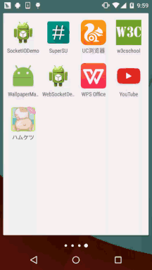

## 一、本节引言：
本节给大家带来的是WallpaperManager(壁纸管理器)，如其名，就是手机壁纸相关的 一个API，在本节中我们会描述下WallpaperManager的基本用法，调用系统自带的 壁纸选择功能，将Activity的背景设置为壁纸背景，以及写一个定时换壁纸的例子~ 好了，不BB，开始本节内容~

官方API文档：WallpaperManager


## 二、WallpaperManager的基本用法
相关方法
设置壁纸的相关方法：

- setBitmap(Bitmap bitmap)：将壁纸设置为bitmap所代表的位图
- setResource(int resid)：将壁纸设置为resid资源所代表的图片
- setStream(InputStream data)：将壁纸设置为data数据所代表的图片

其他方法：

- clear()：清除壁纸，设置回系统默认的壁纸
- getDesiredMinimumHeight()：最小壁纸高度
- getDesiredMinimumWidth()：最小壁纸宽度
- getDrawable()：获得当前系统壁纸，如果没有设置壁纸，则返回系统默认壁纸
- getWallpaperInfo()：加入当前壁纸是动态壁纸，返回动态壁纸信息
- peekDrawable()：获得当前系统壁纸，如果没设置壁纸的话返回null

获得WallpaperManager对象
```java
WallpaperManager wpManager =WallpaperManager.getInstance(this);
```

设置壁纸需要的权限
```xml
<uses-permission android:name="android.permission.SET_WALLPAPER"/> 
```

## 三、调用系统自带的壁纸选择功能
```java
Button btn_set = (Button) findViewById(R.id.btn_set);
    btn_set.setOnClickListener(new View.OnClickListener() {
        @Override
        public void onClick(View v) {
            Intent chooseIntent = new Intent(Intent.ACTION_SET_WALLPAPER);
            startActivity(Intent.createChooser(chooseIntent, "选择壁纸"));
        }
    });
```

运行效果图：


## 四、将Activity的背景设置为壁纸背景
方法有两种，一种是在Activity中用代码进行设置，另一种是在AndroidManifest.xml中修改 Activity的主题~！



方法一：Activity中设置：
```java
@Override
protected void onCreate(Bundle savedInstanceState) {
    setTheme(android.R.style.Theme_Wallpaper_NoTitleBar_Fullscreen);
    super.onCreate(savedInstanceState);
    setContentView(R.layout.activity_main);
}
```

方法二：AndroidManifest.xml修改theme：
```xml
<activity android:name=".MainActivity"
android:theme="@android:style/Theme.Wallpaper.NoTitleBar"/>
```


## 五、定时换壁纸的Demo
这里用到前面学的AlarmManager(闹钟服务)，假如你对它不了解的话可以到： 10.5 AlarmManager(闹钟服务)进行学习~ 下面我们来写个Demo~

运行效果图：


代码实现：

首先我们来写一个定时换壁纸的Service：WallPaperService.java
```java
/**
 * Created by Jay on 2015/11/13 0013.
 */
public class WallPaperService extends Service {

    private int current = 0;  //当前壁纸下标
    private int[] papers = new int[]{R.mipmap.gui_1,R.mipmap.gui_2,R.mipmap.gui_3,R.mipmap.gui_4};
    private WallpaperManager wManager = null;   //定义WallpaperManager服务

    @Override
    public void onCreate() {
        super.onCreate();
        wManager = WallpaperManager.getInstance(this);
    }

    @Override
    public int onStartCommand(Intent intent, int flags, int startId) {
        if(current >= 4)current = 0;
        try{
            wManager.setResource(papers[current++]);
        }catch(Exception e){e.printStackTrace();}
        return START_STICKY;
    }

    @Override
    public IBinder onBind(Intent intent) {
        return null;
    }
}
```

接着撸个简单的布局，三个Button：activity_main.xml：
```xml
<LinearLayout xmlns:android="http://schemas.android.com/apk/res/android"
    android:layout_width="match_parent"
    android:layout_height="match_parent"
    android:orientation="vertical">
    
    <Button
        android:id="@+id/btn_on"
        android:layout_width="wrap_content"
        android:layout_height="wrap_content"
        android:text="开启自动换壁纸" />

    <Button
        android:id="@+id/btn_off"
        android:layout_width="wrap_content"
        android:layout_height="wrap_content"
        android:text="关闭自动换壁纸" />

    <Button
        android:id="@+id/btn_clean"
        android:layout_width="wrap_content"
        android:layout_height="wrap_content"
        android:text="清除壁纸" />

</LinearLayout>
```

接着是我们的Activity，在这里实例化aManager并设置定时事件~：MainActivity.java：
```java
public class MainActivity extends AppCompatActivity implements View.OnClickListener {

    private Button btn_on;
    private Button btn_off;
    private Button btn_clean;
    private AlarmManager aManager;
    private PendingIntent pi;

    @Override
    protected void onCreate(Bundle savedInstanceState) {
        super.onCreate(savedInstanceState);
        setContentView(R.layout.activity_main);
        //①获得AlarmManager对象:
        aManager = (AlarmManager) getSystemService(ALARM_SERVICE);
        //②指定要启动的Service,并指明动作是Servce:
        Intent intent = new Intent(MainActivity.this, WallPaperService.class);
        pi = PendingIntent.getService(MainActivity.this, 0, intent, 0);
        bindViews();
    }

    private void bindViews() {
        btn_on = (Button) findViewById(R.id.btn_on);
        btn_off = (Button) findViewById(R.id.btn_off);
        btn_clean = (Button) findViewById(R.id.btn_clean);
        btn_on.setOnClickListener(this);
        btn_off.setOnClickListener(this);
        btn_clean.setOnClickListener(this);
    }

    @Override
    public void onClick(View v) {
        switch (v.getId()) {
            case R.id.btn_on:
                aManager.setRepeating(AlarmManager.RTC_WAKEUP, 0, 3000, pi);
                btn_on.setEnabled(false);
                btn_off.setEnabled(true);
                Toast.makeText(MainActivity.this, "自动更换壁纸设置成功", Toast.LENGTH_SHORT).show();
                break;
            case R.id.btn_off:
                btn_on.setEnabled(true);
                btn_off.setEnabled(false);
                aManager.cancel(pi);
                break;
            case R.id.btn_clean:
                try {
                    WallpaperManager.getInstance(getApplicationContext()).clear();
                    Toast.makeText(MainActivity.this, "清除壁纸成功~", Toast.LENGTH_SHORT).show();
                } catch (IOException e) {
                    e.printStackTrace();
                }
                break;
        }
    }
}
```

最后别忘了加上设置壁纸的权限以及为我们的Service进行注册：AndroidManifest.xml：
```xml
<uses-permission android:name="android.permission.SET_WALLPAPER" />
<service android:name=".WallPaperService"/>
```

好的，非常简单~


## 六、本节示例代码下载
[WallpaperManagerDemo.zip](../img/WallpaperManagerDemo.zip)


## 七、本节小结：
好的，本节给大家介绍了下WallpaperManager的一些基本用法~更多的东西还需你们自己 进行探究~谢谢~!