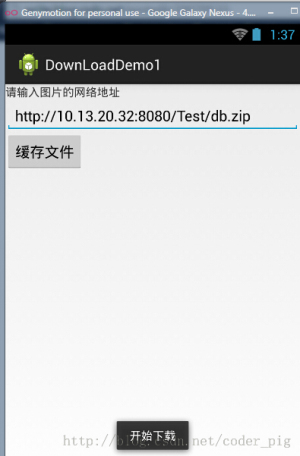
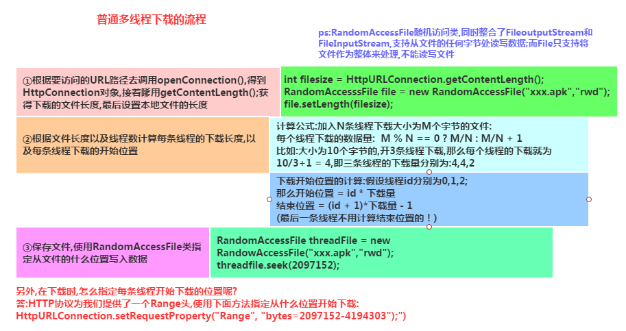
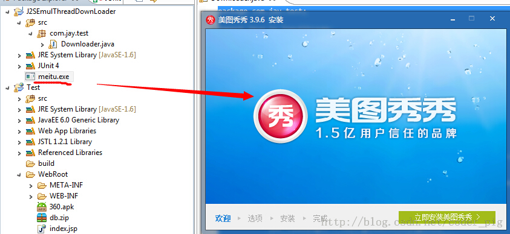

## 一、本节引言：
又是一个深坑，初学者慎入...本节将从普通的单线程下载 -> 普通多线程下载 -> -> 以及一个很实用的例子：利用Android那只DownloadManager更新apk 并覆盖安装的实现代码！好的，这样看上去，本节还是蛮有趣的，开始本节内容！ PS:我们把整个完整的多线程断点续传放到下一节中！


## 二、普通单线程下载文件：
直接使用URLConnection.openStream()打开网络输入流,然后将流写入到文件中！

核心方法：
```java
public static void downLoad(String path,Context context)throws Exception {
  URL url = new URL(path);
  InputStream is = url.openStream();
  //截取最后的文件名
  String end = path.substring(path.lastIndexOf("."));
  //打开手机对应的输出流,输出到文件中
  OutputStream os = context.openFileOutput("Cache_"+System.currentTimeMillis()+end, Context.MODE_PRIVATE);
  byte[] buffer = new byte[1024];
  int len = 0;
  //从输入六中读取数据,读到缓冲区中
  while((len = is.read(buffer)) > 0)
  {
    os.write(buffer,0,len);
  }
  //关闭输入输出流
  is.close();
  os.close();
}
```

运行结果：




## 三、普通多线程下载：
我们都知道使用多线程下载文件可以更快地完成文件的下载,但是为什么呢?

答：因为抢占的服务器资源多,假设服务器最多服务100个用户,服务器中的一个线程 对应一个用户100条线程在计算机中并发执行,由CPU划分时间片轮流执行,加入a有99条线程 下载文件,那么相当于占用了99个用户资源,自然就有用较快的下载速度

PS:当然不是线程越多就越好,开启过多线程的话,app需要维护和同步每条线程的开销, 这些开销反而会导致下载速度的降低,另外还和你的网速有关!

多线程下载的流程：

- 获取网络连接
- 本地磁盘创建相同大小的空文件
- 计算每条线程需从文件哪个部分开始下载，结束
- 依次创建，启动多条线程来下载网络资源的指定部分



PS:这里直接创建一个Java项目，然后在JUnit里运行指定方法即可，

核心代码如下：
```java
public class Downloader {
  //添加@Test标记是表示该方法是Junit测试的方法,就可以直接运行该方法了
    @Test
    public void download() throws Exception
    {
      //设置URL的地址和下载后的文件名
      String filename = "meitu.exe";
      String path = "http://10.13.20.32:8080/Test/XiuXiu_Green.exe";
      URL url = new URL(path);
      HttpURLConnection conn = (HttpURLConnection) url.openConnection();
      conn.setConnectTimeout(5000);
      conn.setRequestMethod("GET");
      //获得需要下载的文件的长度(大小)
      int filelength = conn.getContentLength();
      System.out.println("要下载的文件长度"+filelength);
      //生成一个大小相同的本地文件
      RandomAccessFile file = new RandomAccessFile(filename, "rwd");
      file.setLength(filelength);
      file.close();
      conn.disconnect();
      //设置有多少条线程下载
      int threadsize = 3;
      //计算每个线程下载的量
      int threadlength = filelength % 3 == 0 ? filelength/3:filelength+1;
      for(int i = 0;i < threadsize;i++)
      {
        //设置每条线程从哪个位置开始下载
        int startposition = i * threadlength;
        //从文件的什么位置开始写入数据
        RandomAccessFile threadfile = new RandomAccessFile(filename, "rwd");
        threadfile.seek(startposition);
        //启动三条线程分别从startposition位置开始下载文件
        new DownLoadThread(i,startposition,threadfile,threadlength,path).start();
      }
      int quit = System.in.read();
      while('q' != quit)
      {
        Thread.sleep(2000);
      }
    }
  
  
  private class DownLoadThread extends Thread {
    private int threadid;
    private int startposition;
    private RandomAccessFile threadfile;
    private int threadlength;
    private String path;
    public DownLoadThread(int threadid, int startposition,
        RandomAccessFile threadfile, int threadlength, String path) {
      this.threadid = threadid;
      this.startposition = startposition;
      this.threadfile = threadfile;
      this.threadlength = threadlength;
      this.path = path;
    }
    public DownLoadThread() {}
    @Override
    public void run() {
      try
      {
        URL url = new URL(path);
        HttpURLConnection conn = (HttpURLConnection) url.openConnection();
        conn.setConnectTimeout(5000);
        conn.setRequestMethod("GET");
        //指定从什么位置开始下载
        conn.setRequestProperty("Range", "bytes="+startposition+"-");
        //System.out.println(conn.getResponseCode());
        if(conn.getResponseCode() == 206)
        {
          InputStream is = conn.getInputStream();
          byte[] buffer = new byte[1024];
          int len = -1;
          int length = 0;
          while(length < threadlength && (len = is.read(buffer)) != -1)
          {
            threadfile.write(buffer,0,len);
            //计算累计下载的长度
            length += len;
          }
          threadfile.close();
          is.close();
          System.out.println("线程"+(threadid+1) + "已下载完成");
        }
      }catch(Exception ex){System.out.println("线程"+(threadid+1) + "下载出错"+ ex);}
    }
    
  }
}
```

运行截图：

如图,使用多线程完成了对文件的下载!双击exe文件可运行,说明文件并没有损坏!





注意事项：

- int filelength = conn.getContentLength(); //获得下载文件的长度(大小)
- RandomAccessFile file = new RandomAccessFile(filename, "rwd"); //该类运行对文件进行读写,是多线程下载的核心
- int threadlength = filelength % 3 == 0 ? filelength/3:filelength+1; //计算每个线程要下载的量
- conn.setRequestProperty("Range", "bytes="+startposition+"-"); //指定从哪个位置开始读写,这个是URLConnection提供的方法
- //System.out.println(conn.getResponseCode()); //这个注释了的代码是用来查看conn的返回码的,我们前面用的都是200, 而针对多线程的话,通常是206,必要时我们可以通过调用该方法查看返回码！
- int quit = System.in.read();while('q' != quit){Thread.sleep(2000);} //这段代码是做延时操作的,因为我们用的是本地下载,可能该方法运行完了,而我们的 线程还没有开启,这样会引发异常,这里的话,让用户输入一个字符,如果是'q'的话就退出


## 四、使用DownloadManager更新应用并覆盖安装：
下面的代码可以直接用，加入到项目后，记得为这个内部广播注册一个过滤器：

`AndroidManifest.xml`

```java
import android.app.DownloadManager;
import android.content.BroadcastReceiver;
import android.content.Context;
import android.content.Intent;
import android.content.pm.ApplicationInfo;
import android.content.pm.PackageManager;
import android.database.Cursor;
import android.net.Uri;
import android.os.Bundle;
import android.os.Environment;
import android.support.v7.app.AppCompatActivity;

/**
 * Created by Jay on 2015/9/9 0009.
 */
public class UpdateAct extends AppCompatActivity {
    //这个更新的APK的版本部分，我们是这样命名的:xxx_v1.0.0_xxxxxxxxx.apk
    //这里我们用的是git提交版本的前九位作为表示
    private static final String FILE_NAME = "ABCDEFGHI";

    @Override
    public void onCreate(Bundle savedInstanceState) {
        super.onCreate(savedInstanceState);
        String endpoint = "";
        try {
            //这部分是获取AndroidManifest.xml里的配置信息的，包名，以及Meta_data里保存的东西
            ApplicationInfo info = getPackageManager().getApplicationInfo(
                    getPackageName(), PackageManager.GET_META_DATA);
            //我们在meta_data保存了xxx.xxx这样一个数据，是https开头的一个链接，这里替换成http
            endpoint = info.metaData.getString("xxxx.xxxx").replace("https",
                    "http");
        } catch (PackageManager.NameNotFoundException e) {
            e.printStackTrace();
        }
        //下面的都是拼接apk更新下载url的，path是保存的文件夹路径
        final String _Path = this.getIntent().getStringExtra("path");
        final String _Url = endpoint + _Path;
        final DownloadManager _DownloadManager = (DownloadManager) getSystemService(DOWNLOAD_SERVICE);
        DownloadManager.Request _Request = new DownloadManager.Request(
                Uri.parse(_Url));
        _Request.setDestinationInExternalPublicDir(
                Environment.DIRECTORY_DOWNLOADS, FILE_NAME + ".apk");
        _Request.setTitle(this.getString(R.string.app_name));
        //是否显示下载对话框
        _Request.setShowRunningNotification(true);
        _Request.setMimeType("application/com.trinea.download.file");
        //将下载请求放入队列
        _DownloadManager.enqueue(_Request);
        this.finish();
    }


    //注册一个广播接收器，当下载完毕后会收到一个android.intent.action.DOWNLOAD_COMPLETE
    //的广播,在这里取出队列里下载任务，进行安装
    public static class Receiver extends BroadcastReceiver {
        public void onReceive(Context context, Intent intent) {
            final DownloadManager _DownloadManager = (DownloadManager) context
                    .getSystemService(Context.DOWNLOAD_SERVICE);
            final long _DownloadId = intent.getLongExtra(
                    DownloadManager.EXTRA_DOWNLOAD_ID, 0);
            final DownloadManager.Query _Query = new DownloadManager.Query();
            _Query.setFilterById(_DownloadId);
            final Cursor _Cursor = _DownloadManager.query(_Query);
            if (_Cursor.moveToFirst()) {
                final int _Status = _Cursor.getInt(_Cursor
                        .getColumnIndexOrThrow(DownloadManager.COLUMN_STATUS));
                final String _Name = _Cursor.getString(_Cursor
                        .getColumnIndexOrThrow("local_filename"));
                if (_Status == DownloadManager.STATUS_SUCCESSFUL
                        && _Name.indexOf(FILE_NAME) != 0) {

                    Intent _Intent = new Intent(Intent.ACTION_VIEW);
                    _Intent.setDataAndType(
                            Uri.parse(_Cursor.getString(_Cursor
                                    .getColumnIndexOrThrow(DownloadManager.COLUMN_LOCAL_URI))),
                            "application/vnd.android.package-archive");
                    _Intent.addFlags(Intent.FLAG_ACTIVITY_NEW_TASK);
                    context.startActivity(_Intent);
                }
            }
            _Cursor.close();
        }
    }
}
```


## 五、参考代码下载：
普通单线程下载文件：[DownLoadDemo1.zip](../img/DownLoadDemo1.zip) 普通多线程下载文件：[J2SEMulDownLoader.zip](../img/J2SEmulThreadDownLoader.zip)


## 六、本节小结：
好的，本节给大家介绍了普通单线程以及多线程下载文件，还有利用Android自带DownManager来 下载更新APK，然后覆盖的实现！相信会对大家的实际开发带来便利，好的，就说这么多，谢谢~