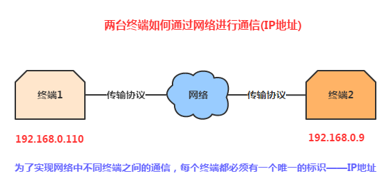
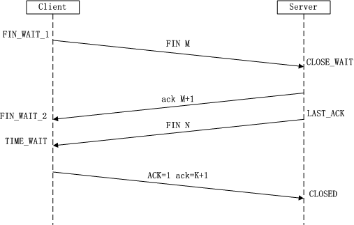

## 一、本节引言：
为了照顾没学过Java Socket的初学者，或者说捋一捋Android开发中涉及到的网络协议相关的概念， 毕竟面试的时候，面试官来了句给我说下网络协议有几层？那么IP协议在哪层？Socket是什么鬼？ 分哪几种？TCP和UDP协议又在哪层？有什么区别...嗯，这...所以学习本节概念性的理论还是很有 必要的！那么话不多说，开始本节内容~


## 二、OSI七层网络模型浅析
当然，我们不是专业搞网络工程的，只要知道有哪些层，大概是拿来干嘛的就可以了！

### OSI七层网络模型(从下往上)：

- `物理层(Physical)`：设备之间的数据通信提供传输媒体及互连设备，为数据传输提供可靠的 环境。可以理解为网络传输的物理媒体部分，比如网卡，网线，集线器，中继器，调制解调器等！ 在这一层，数据还没有被组织，仅作为原始的位流或电气电压处理，这一层的单位是:bit比特
- `数据链路层(Datalink)`：可以理解为数据通道，主要功能是如何在不可靠的物理线路上进行 数据的可靠传递，改层作用包括：物理地址寻址，数据的成帧，流量控制，数据检错以及重发等！ 另外这个数据链路指的是：物理层要为终端设备间的数据通信提供传输媒体及其连接。媒体是 长期的，连接是有生存期的。在连接生存期内，收发两端可以进行不等的一次或多次数据通信。 每次通信都要经过建立通信联络和拆除通信联络两过程！这种建立起来的数据收发关系~ 该层的设备有：网卡，网桥，网路交换机，另外该层的单位为：帧
- `网络层(Network)`：主要功能是将网络地址翻译成对应的物理地址，并决定如何将数据从发 送方路由到接收方，所谓的路由与寻径：一台终端可能需要与多台终端通信，这样就产生的了 把任意两台终端设备数据链接起来的问题！简单点说就是：建立网络连接和为上层提供服务！ 该层的设备有：路由！该层的单位为：数据包，另外IP协议就在这一层！
- `传输层(Transport)`：向上面的应用层提供通信服务，面向通信部分的最高层，同时也是 用户功能中的最低层。接收会话层数据，在必要时将数据进行分割，并将这些数据交给网络 层，并且保证这些数据段有效的到达对端！所以这层的单位是：数据段；而这层有两个很重要 的协议就是：TCP传输控制协议与UDP用户数据报协议，这也是本章节核心讲解的部分！
- `会话层(Session)`：负责在网络中的两节点之间建立、维持和终止通信。建立通信链接， 保持会话过程通信链接的畅通，同步两个节点之间的对话，决定通信是否被中断以及通信中断时 决定从何处重新发送，即不同机器上的用户之间会话的建立及管理！
- `表示层(Presentation)`：对来自应用层的命令和数据进行解释，对各种语法赋予相应 的含义，并按照一定的格式传送给会话层。其主要功能是"处理用户信息的表示问题，如编码、 数据格式转换和加密解密，压缩解压缩"等
- `应用层(Application)`：OSI参考模型的最高层，为用户的应用程序提供网络服务。 它在其他6层工作的基础上，负责完成网络中应用程序与网络操作系统之间的联系，建立与结束使用者之间的联系，并完成网络用户提出的各种网络服务及应用所需的监督、管理和服务等各种协议。此外，该层还负责协调各个应用程序间的工作。应用层为用户提供的服务和协议有：文件服务、目录服务、文件传输服务（FTP）、远程登录服务（Telnet）、电子邮件服务（E-mail）、打印服务、安全服务、网络管理服务、数据库服务等。

好的上面我们浅述了OSI七层网络模型，下面总结下：

OSI是一个理想的模型，一般的网络系统只涉及其中的几层，在七层模型中，每一层都提供一个特殊 的网络功能，从网络功能角度观察：

- 下面4层（物理层、数据链路层、网络层和传输层）主要提供数据传输和交换功能， 即以节点到节点之间的通信为主
- 第4层作为上下两部分的桥梁，是整个网络体系结构中最关键的部分；
- 上3层（会话层、表示层和应用层）则以提供用户与应用程序之间的信息和数据处理功能为主。

简言之，下4层主要完成通信子网的功能，上3层主要完成资源子网的功能。

——以上内容参考自：[OSI七层模型详解](http://blog.csdn.net/yaopeng_2005/article/details/7064869)


## 三、TCP/IP四层模型


TCP/IP是一组协议的代名词，它还包括许多协议，组成了TCP/IP协议簇。 TCP/IP协议簇分为四层，IP位于协议簇的第二层(对应OSI的第三层)，TCP位于协议簇的第三层 (对应OSI的第四层)。TCP/IP通讯协议采用了4层的层级结构，每一层都呼叫它的下一层所提供 的网络来完成自己的需求。这4层分别为：

- `应用层`：应用程序间沟通的层，如简单电子邮件传输（SMTP）、文件传输协议（FTP）、 网络远程访问协议（Telnet）等。
- `传输层`：在此层中，它提供了节点间的数据传送服务，如传输控制协议（TCP）、 用户数据报协议（UDP）等，TCP和UDP给数据包加入传输数据并把它传输到下一层中， 这一层负责传送数据，并且确定数据已被送达并接收。
- `网络互连层`：负责提供基本的数据封包传送功能，让每一块数据包都能够到达目 的主机（但不检查是否被正确接收），如网际协议（IP）。
- `主机到网络层`：对实际的网络媒体的管理，定义如何使用实际网络 （如Ethernet、Serial Line等）来传送数据。


## 四、TCP/UDP区别讲解
好吧，前两点侃侃而谈，只是给大家普及下OSI七层模型和TCP/IP四层模型的概念，接下来要讲的是 和我们Socket开发相关的一些概念名词了！

### 1）IP地址



### 2）端口
1. 用于区分不同的应用程序

2. 端口号的范围为0-65535，其中0-1023未系统的保留端口，我们的程序尽可能别使用这些端口！

3. IP地址和端口号组成了我们的Socket，Socket是网络运行程序间双向通信链路的终结点， 是TCP和UDP的基础！

4. 常用协议使用的端口：HTTP:80，FTP：21，TELNET：23


### 3）TCP协议与UDP协议的比较：
#### TCP协议流程详解:

首先TCP/IP是一个协议簇，里面包括很多协议的。UDP只是其中的一个。之所以命名为TCP/IP协议， 因为TCP,IP协议是两个很重要的协议，就用他两命名了。

下面我们来讲解TCP协议和UDP协议的区别：

TCP（Transmission Control Protocol，传输控制协议）是面向连接的协议，即在收发数据钱 ，都需要与对面建立可靠的链接，这也是面试经常会问到的TCP的三次握手以及TCP的四次挥手！ 三次握手： 建立一个TCP连接时，需要客户端和服务端总共发送3个包以确认连接的建立， 在Socket编程中，这一过程由客户端执行connect来触发，具体流程图如下：


- `第一次握手`：Client将标志位SYN置为1，随机产生一个值seq=J，并将该数据包发送给Server， Client进入SYN_SENT状态，等待Server确认。
- `第二次握手`：Server收到数据包后由标志位SYN=1知道Client请求建立连接，Server将标志位 SYN和ACK都置为1，ack=J+1，随机产生一个值seq=K，并将该数据包发送给Client以确认连接请求 ，Server进入SYN_RCVD状态。
- `第三次握手`：Client收到确认后，检查ack是否为J+1，ACK是否为1，如果正确则将标志位ACK 置为1，ack=K+1，并将该数据包发送给Server，Server检查ack是否为K+1，ACK是否为1，如果正确则 连接建立成功，Client和Server进入ESTABLISHED状态，完成三次握手，随后Client与Server之间可以 开始传输数据了。

四次挥手： 终止TCP连接，就是指断开一个TCP连接时，需要客户端和服务端总共发送4个包以确认连接的断开。 在Socket编程中，这一过程由客户端或服务端任一方执行close来触发，具体流程图如下：



- `第一次挥手`：Client发送一个FIN，用来关闭Client到Server的数据传送，Client进入 FIN_WAIT_1状态
- `第二次挥手`：Server收到FIN后，发送一个ACK给Client，确认序号为收到序号+1（与SYN相同， 一个FIN占用一个序号），Server进入CLOSE_WAIT状态。
- `第三次挥手`：Server发送一个FIN，用来关闭Server到Client的数据传送，Server进入LAST_ACK 状态。
- `第四次挥手`：Client收到FIN后，Client进入TIME_WAIT状态，接着发送一个ACK给Server，确认序号为收到序号+1，Server进入CLOSED状态，完成四次挥手。 另外也可能是同时发起主动关闭的情况：


另外还可能有一个常见的问题就是：为什么建立连接是三次握手，而关闭连接却是四次挥手呢？ 答：因为服务端在LISTEN状态下，收到建立连接请求的SYN报文后，把ACK和SYN放在一个报文里 发送给客户端。而关闭连接时，当收到对方的FIN报文时，仅仅表示对方不再发送数据了但是还 能接收数据，己方也未必全部数据都发送给对方了，所以己方可以立即close，也可以发送一些 数据给对方后，再发送FIN报文给对方来表示同意现在关闭连接，因此，己方ACK和FIN一般都会 分开发送。

#### UDP协议详解：

UDP(User Datagram Protocol)用户数据报协议，非连接的协议，传输数据之前源端和终端不 建立连接，当它想传送时就简单地去抓取来自应用程序的数据，并尽可能快地把它扔到网络上。 在发送端，UDP传送数据的速度仅仅是受应用程序生成数据的速度、计算机的能力和传输带宽 的限制；在接收端，UDP把每个消息段放在队列中，应用程序每次从队列中读一个消息段。 相比TCP就是无需建立链接，结构简单，无法保证正确性，容易丢包

——上述内容部分摘自：

[TCP/IP三次握手与四次挥手](http://blog.chinaunix.net/uid-7411781-id-3812206.html)

[TCP和UDP的区别（转）](http://www.cnblogs.com/bizhu/archive/2012/05/12/2497493.html)


## 五、Java中对于网络提供的几个关键类：
针对不同的网络通信层次，Java给我们提供的网络功能有四大类：

- `InetAddress`： 用于标识网络上的硬件资源
- `URL`： 统一资源定位符，通过URL可以直接读取或者写入网络上的数据
- `Socket和ServerSocket`： 使用TCP协议实现网络通信的Socket相关的类
- `Datagram`： 使用UDP协议，将数据保存在数据报中，通过网络进行通信

本节我们只介绍前两个类，Socket与Datagram到TCP和UDP的章节再讲解！

~InetAddress的使用例子：

示例代码：
```java
public class InetAddressTest {
    public static void main(String[] args) throws Exception{
        //获取本机InetAddress的实例：
        InetAddress address = InetAddress.getLocalHost();
        System.out.println("本机名：" + address.getHostName());
        System.out.println("IP地址：" + address.getHostAddress());
        byte[] bytes = address.getAddress();
        System.out.println("字节数组形式的IP地址：" + Arrays.toString(bytes));
        System.out.println("直接输出InetAddress对象：" + address);
    }
}
```

运行结果图：


~URL：这个就不用说了吧，忘了可以看会前面Http协议讲解那里~


## 六、本节小结：
本节全是概念，看起来可能够呛的是把，不过看不懂也没关系，知道七层模型每层叫 什么，大概拿来干嘛，还有TCP三次握手和四次挥手，就可以了！当然，这只是为了 应付面试~实际开发我们哪会纠结这个...直接Socket是吧~嗯，下节我们就来开始学习 Android中的Socket通信~谢谢~