## 一、本节引言：
经过前面的学习，数据请求，数据解析，文件上传下载等，应该满足大家与服务器交互的基本 需求了，而本节给大家介绍的Android调用WebService，其实这玩意有点类似于一些给我们提供 原始数据API服务的数据平台，比如聚合数据！而WebService则用到了XML和SOAP，通过HTTP协议 即可完成与远程机器的交互！嗯，不多说，开始本节内容~


## 二、WebService简介

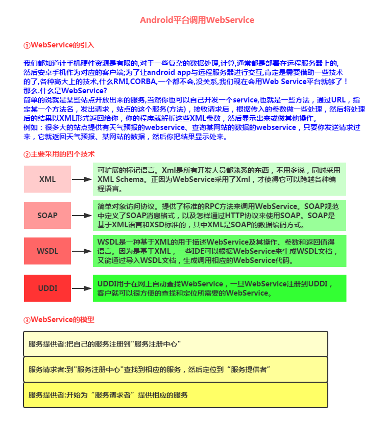

PS：如果看完上面简介还不是很清楚的话，那么就算了，之前公司就用C#搭的一个WebService！ 本节我们并不讨论如何去搭建一个WebService，我们仅仅知道如何去获取WebService提供的服务， 然后解析返回的XML数据，然后把相关数据显示到我们的Android设备上就好！


## 三、去哪里获取WebService服务
网上有很多提供WebService的站点，首先找到这些站点，然后获取相应的服务即可！ 这里选取WebXml和云聚36wu作为例子给大家讲解下，他们的官网：

webXml：http://www.webxml.com.cn/zh_cn/index.aspx

以前是免费的，不过都商业化了，很多服务都要收费，但是可以试用~ 该站点上提供了16个不同的Web服务，可以根据自己的需求，查询相应服务，调用不同的接口！

webXml的相关页面：

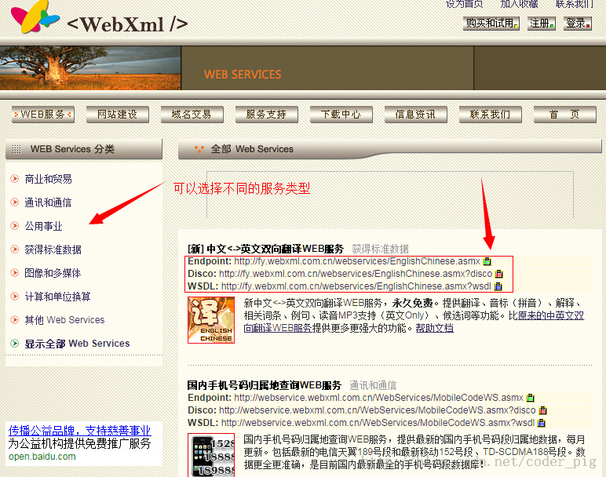

相关使用次数说明:

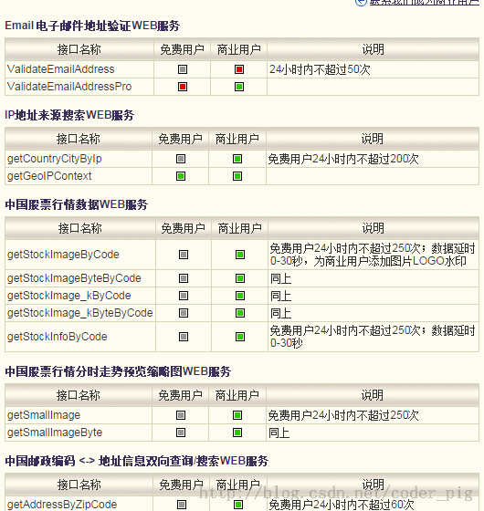

云聚36wu：http://www.36wu.com/Service

同样也提供了很多的服务,很多手机的app都是用的这里的接口,比如彩虹公交,手机天气等 不过,这个也是要收费的=-=,可以试用,不过只能一小时内发送20次请求; 点击申请使用,获得key就可以了!两者随便选一个吧!

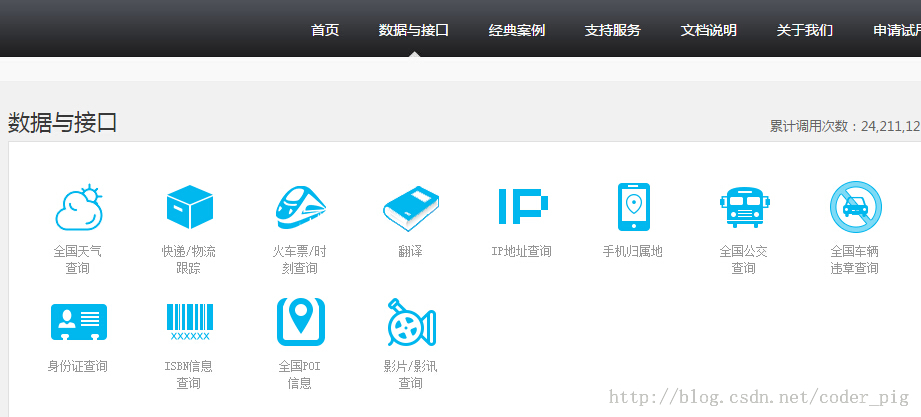


## 四、第三方jar包的准备
首先如果想在Android平台上调用WebService需要依赖于第三方类库:ksoap2 而在Android平台上,使用的是ksoap2 Android,一个高效,轻量级的SOAP开发包!

jar包下载地址：https://code.google.com/p/ksoap2-android/wiki/HowToUse?tm=2

天朝可能上不去，这里提供两个百度云的链接供大家下载使用：

2.54版本：[ksoap2-android 2.54.jar](../img/ksoap2-android-assembly-2.5.4-jar-with-dependencies.jar)

3.30版本：[ksoap2-android 3.30.jar](../img/ksoap2-android-assembly-3.3.0-jar-with-dependencies.jar)

如果所幸你能进入jar包的下载地址的话,那么你会看到下面的界面:

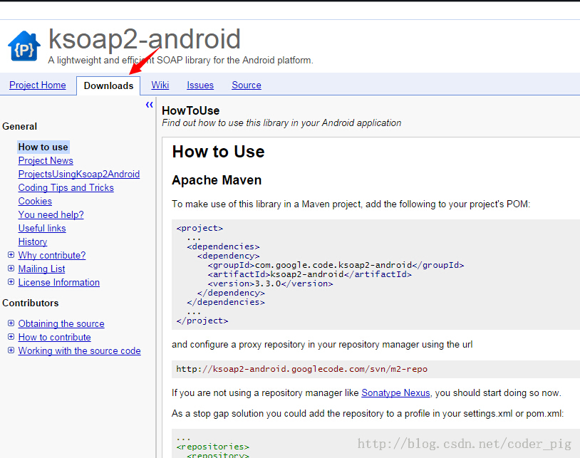

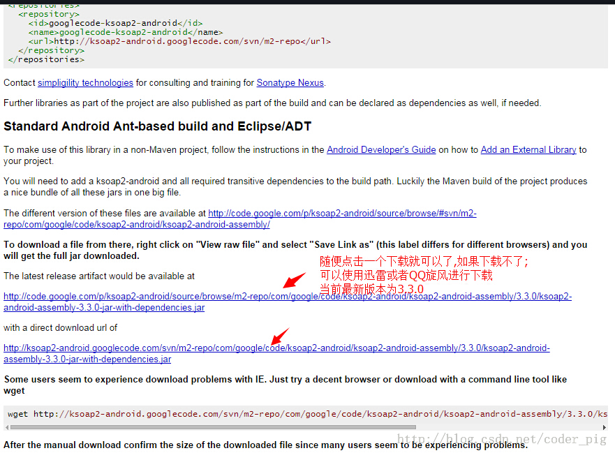


## 五、获取相关的一些参数
首先找到我们需要获取的服务，然后记录相关的参数： NameSpace(命名空间),SoapAction以及URL就不用说了,其他参数这样找:

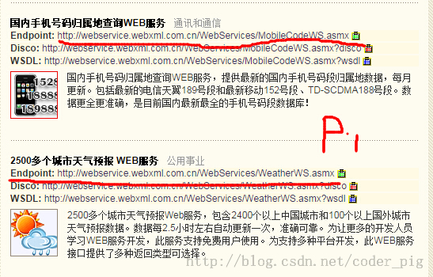

比如我们这里找的是天气的查询参数，点进去我们可以看到这样一个参数文档：

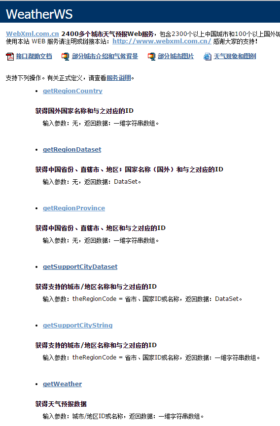

比如这里我们需要的是天气查询部分的功能：

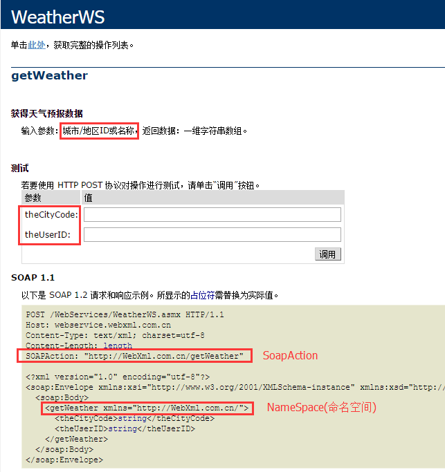

先把框住的SoapAction和NameSpace拷贝下来！当然我们可以在这个页面测试，另外 我们是免费用户，id可以不填直接跳过，输入后点击调用按钮会打开这样一个页面：


嘿嘿，这里就是返回的XML，而我们要做的也就是解析这样一个XML，另外这里的 .gif代表的是天气图标！

同理，我们再把归属地查询的看下SoapAction，NameSpace以及相关参数mark下！


以及返回后的XML数据：

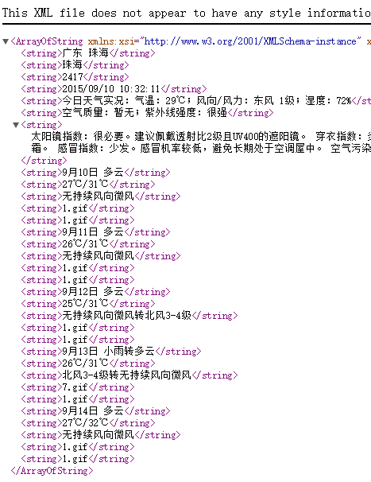


## 六、注册并启用相关WEB服务

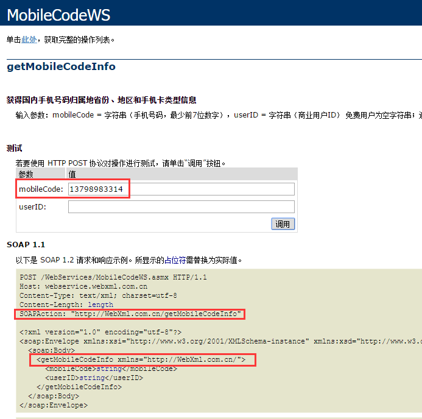


点击我的Web服务器，然后点击试用，WebXML给我们提供了五天的免费试用， 我们把需要的两个服务器开启！

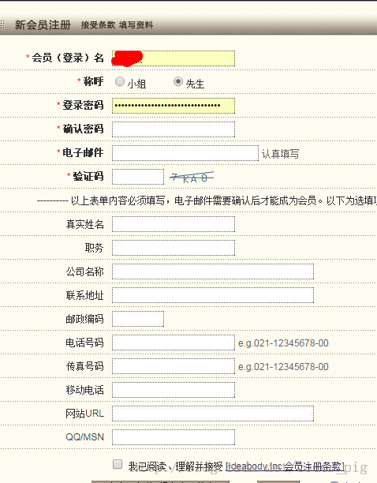

好的，记得mark下我们自己的key哦~


## 七、调用WebService的代码示例
嗯，接下来我们来写代码验证调用WebService的流程：

运行效果图：

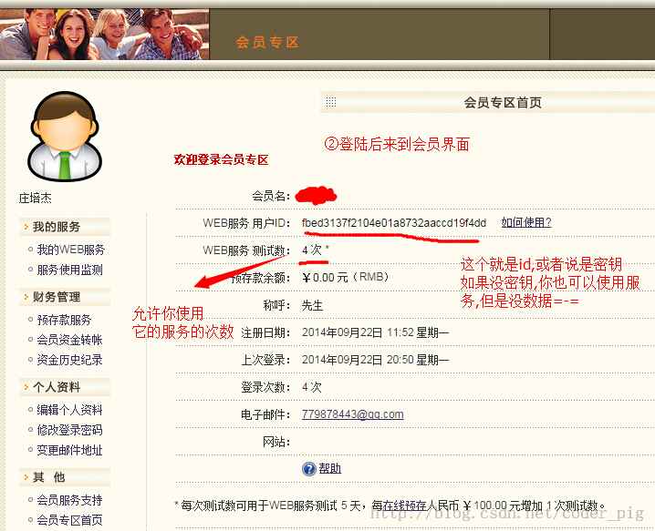

PS:这个号码是以前的号码=-=，别尝试拨打，已经换人了~ 另外天气服务好像有写问题，有时并不能获取到，估计是WebXml做的一些限制， 毕竟试用...

实现代码：
```java
public class MainActivity extends AppCompatActivity implements View.OnClickListener {

    private EditText edit_param;
    private Button btn_attribution;
    private Button btn_weather;
    private TextView txt_result;

    private String city;
    private String number;
    private String result;


    //定义获取手机信息的SoapAction与命名空间,作为常量
    private static final String AddressnameSpace = "http://WebXml.com.cn/";
    //天气查询相关参数
    private static final String Weatherurl = "http://webservice.webxml.com.cn/WebServices/WeatherWS.asmx";
    private static final String Weathermethod = "getWeather";
    private static final String WeathersoapAction = "http://WebXml.com.cn/getWeather";
    //归属地查询相关参数
    private static final String Addressurl = "http://webservice.webxml.com.cn/WebServices/MobileCodeWS.asmx";
    private static final String Addressmethod = "getMobileCodeInfo";
    private static final String AddresssoapAction = "http://WebXml.com.cn/getMobileCodeInfo";


    //定义一个Handler用来更新页面：
    private Handler handler = new Handler() {
        public void handleMessage(Message msg) {
            switch (msg.what) {
                case 0x001:
                    txt_result.setText("结果显示：\n" + result);
                    Toast.makeText(MainActivity.this, "获取天气信息成功", Toast.LENGTH_SHORT).show();
                    break;
                case 0x002:
                    txt_result.setText("结果显示：\n" + result);
                    Toast.makeText(MainActivity.this, "号码归属地查询成功", Toast.LENGTH_SHORT).show();
                    break;
            }

        }
    };

    @Override
    protected void onCreate(Bundle savedInstanceState) {
        super.onCreate(savedInstanceState);
        setContentView(R.layout.activity_main);
        bindViews();
    }

    private void bindViews() {
        edit_param = (EditText) findViewById(R.id.edit_param);
        btn_attribution = (Button) findViewById(R.id.btn_attribution);
        btn_weather = (Button) findViewById(R.id.btn_weather);
        txt_result = (TextView) findViewById(R.id.txt_result);
        btn_attribution.setOnClickListener(this);
        btn_weather.setOnClickListener(this);
    }

    @Override
    public void onClick(View v) {
        switch (v.getId()) {
            case R.id.btn_weather:
                new Thread() {
                    @Override
                    public void run() {
                        getWether();
                    }
                }.start();
                break;
            case R.id.btn_attribution:
                new Thread(new Runnable() {
                    public void run() {
                        getland();
                    }
                }).start();
                break;
        }
    }


    //定义一个获取某城市天气信息的方法：
    public void getWether() {
        result = "";
        SoapObject soapObject = new SoapObject(AddressnameSpace, Weathermethod);
        soapObject.addProperty("theCityCode:", edit_param.getText().toString());
        soapObject.addProperty("theUserID", "dbdf1580476240458784992289892b87");
        SoapSerializationEnvelope envelope = new SoapSerializationEnvelope(SoapEnvelope.VER11);
        envelope.bodyOut = soapObject;
        envelope.dotNet = true;
        envelope.setOutputSoapObject(soapObject);
        HttpTransportSE httpTransportSE = new HttpTransportSE(Weatherurl);
        System.out.println("天气服务设置完毕,准备开启服务");
        try {
            httpTransportSE.call(WeathersoapAction, envelope);
//            System.out.println("调用WebService服务成功");
        } catch (Exception e) {
            e.printStackTrace();
//            System.out.println("调用WebService服务失败");
        }

        //获得服务返回的数据,并且开始解析
        SoapObject object = (SoapObject) envelope.bodyIn;
        System.out.println("获得服务数据");
        result = object.getProperty(1).toString();
        handler.sendEmptyMessage(0x001);
        System.out.println("发送完毕,textview显示天气信息");
    }


    //定义一个获取号码归属地的方法：
    public void getland() {
        result = "";
        SoapObject soapObject = new SoapObject(AddressnameSpace, Addressmethod);
        soapObject.addProperty("mobileCode", edit_param.getText().toString());
        soapObject.addProperty("userid", "dbdf1580476240458784992289892b87");
        SoapSerializationEnvelope envelope = new SoapSerializationEnvelope(SoapEnvelope.VER11);
        envelope.bodyOut = soapObject;
        envelope.dotNet = true;
        envelope.setOutputSoapObject(soapObject);
        HttpTransportSE httpTransportSE = new HttpTransportSE(Addressurl);
        //    System.out.println("号码信息设置完毕,准备开启服务");
        try {
            httpTransportSE.call(AddresssoapAction, envelope);
            //System.out.println("调用WebService服务成功");
        } catch (Exception e) {
            e.printStackTrace();
            //System.out.println("调用WebService服务失败");
        }

        //获得服务返回的数据,并且开始解析
        SoapObject object = (SoapObject) envelope.bodyIn;//System.out.println("获得服务数据");
        result = object.getProperty(0).toString();//System.out.println("获取信息完毕,向主线程发信息");
        handler.sendEmptyMessage(0x001);
        //System.out.println("发送完毕,textview显示天气信息");
    }
}
```

另外，别忘了导包和Internet的权限！
```xml
<uses-permission android:name="android.permission.INTERNET"/>
```

参考代码下载：
WebServiceDemo.zip：[下载 WebServiceDemo.zip](../img/WebServiceDemo.zip)


## 八、本节小结：
好的，本节关于Android端如何去使用这个WebService就讲解到这里，下一节我们来学习一个 类似于浏览器的Android控件——WebView，敬请期待~谢谢~！