## 写在前面
> 本节将介绍如何使用Android Studio开发Android APP，和前面Eclipse + ADT + SDK搭建Android开发环境一样，本节也只是介绍一些基本东西，深入的，比如快捷键，小技巧等会再另一篇文章中详细地介绍！

## 一、下载Android Studio
**官网下载：**[Android Studio for Window ...](http://developer.android.com/sdk/installing/studio.html) 

**百度云下载：**[android-studio-bundle-141.1903250-windows.exe](http://pan.baidu.com/s/1eRhG7i6)

## 二、安装Android Studio
傻瓜式的下一步而已，只列出需要注意的页面：

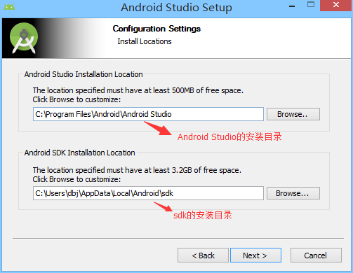

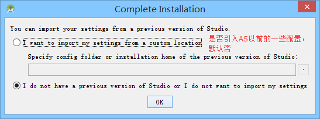

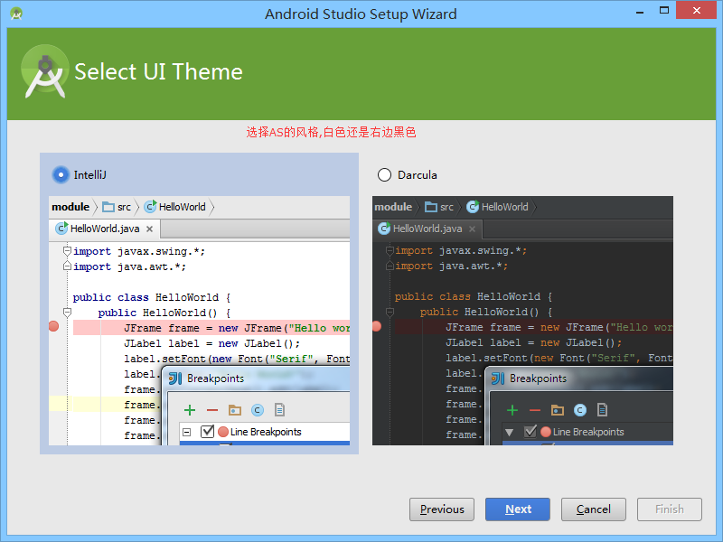
  

## 三、新建工程
安装完毕后，打开我们的Android Studio，第一次启动需要下载SDK等一些东西，时间比较长，笔者等了大概40分钟才下载完毕

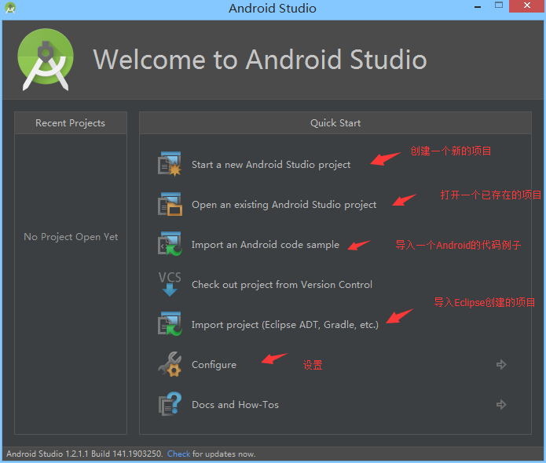

选择第一项,新建一个Android项目

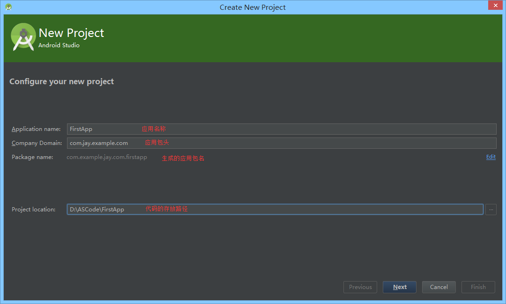

选择开发程序将运行在哪个平台上：

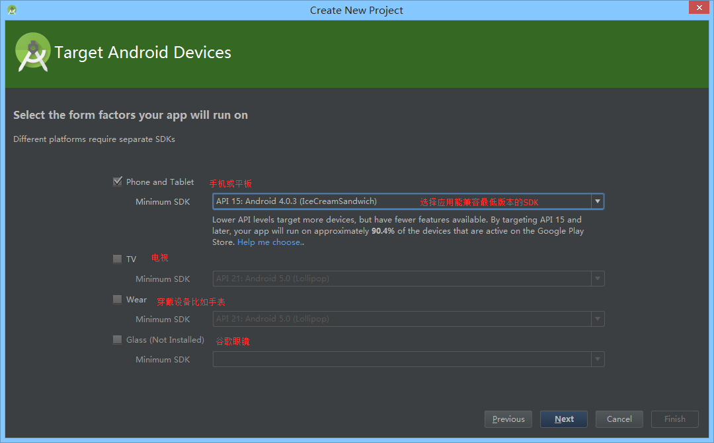

选择Activity的风格：

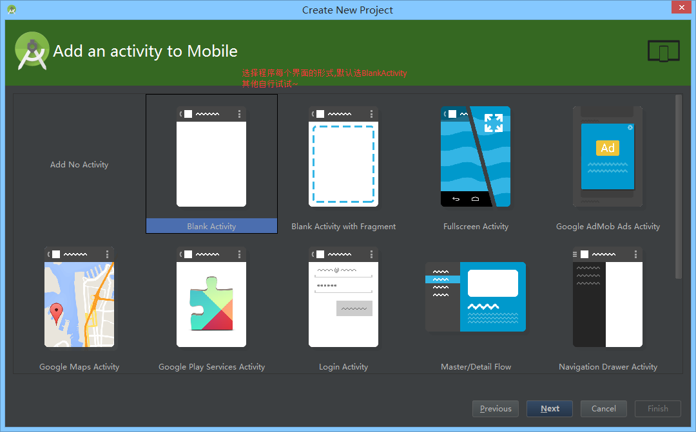

设置进入程序一个页面后的Activity的一些信息

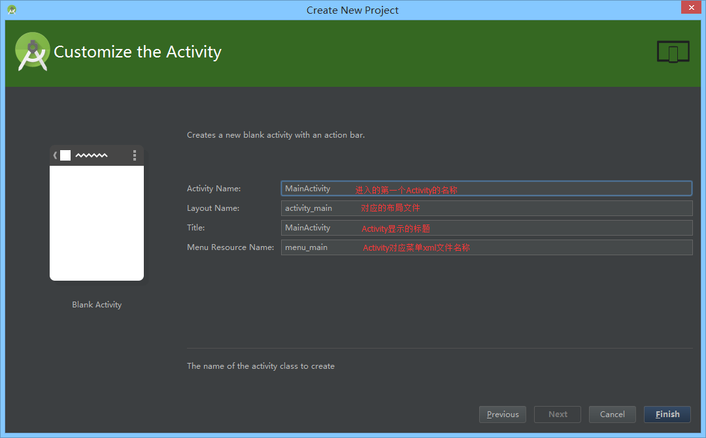

Finish然后是漫长的等待~

## 四、IDE的界面分析
先看下整个界面吧：

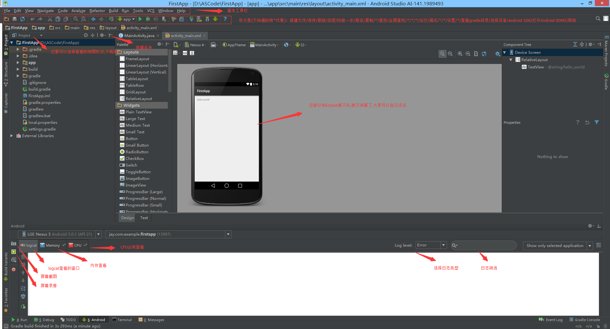

接着看下我们的项目结构，而我们一般关心的只是app这个目录：

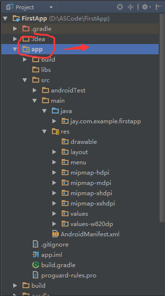
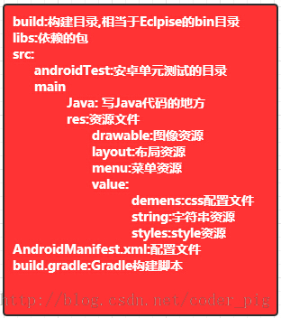

## 五、运行下程序试试
点击菜单栏的X，即可运行程序：

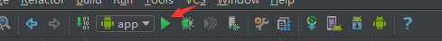

## 六、本节小结
Android Studio的用法还是比较简单的，当然笔者也是刚用Android Studio，后续还会写一篇更深入一点的文章，这里大家琢磨琢磨，暂时能跑起程序，知道在哪里写代码，怎么看Logcat就可以了！