## 一、本节引言
如果你符合下述三种情况的话，你可以考虑安装一个Genymotion Android模拟器:

1. 没有真机调试，只能用模拟器
2. 嫌SDK内置的AVD启动速度，运行速度慢
3. 电脑配置还可以，最好4G内存以上

如果你满足上述三种情况的话，那么装个比真机还快的Genymotion吧！ 官方给出的介绍： 

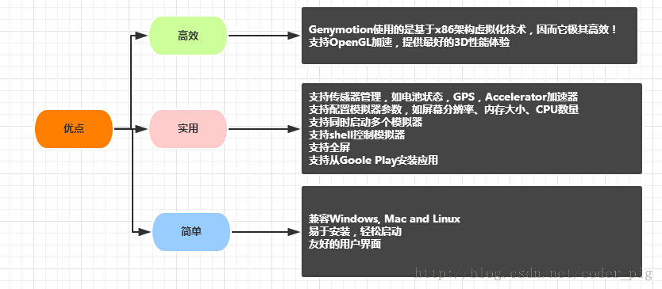

## 二、去哪里下Genymotion
百度"Genymotion"第一个就是了：[Genymotion中文官网](http://www.genymotion.net/)

## 三、下载Genymotion
点开上述链接后：点击注册  

来到下述界面，如果已有账号，直接输入后sign in 如果没有的话，  

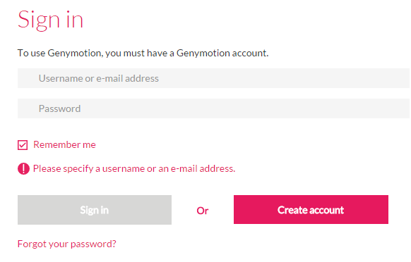

点击Create account创建一个新的账户  

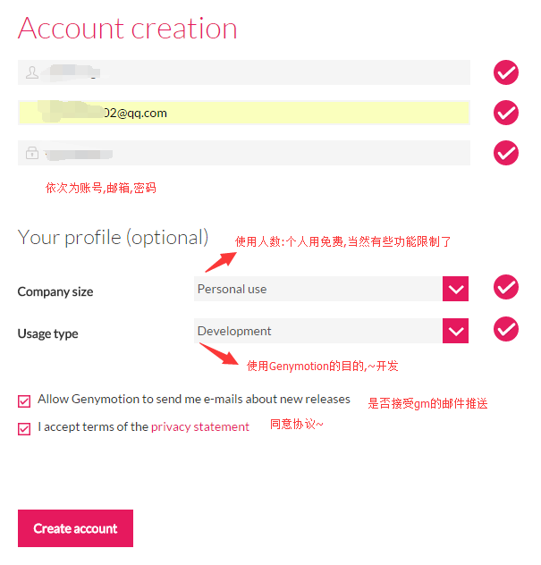

然后我们会收到一个激活邮件：  

打开邮箱，点击激活账号，然后过一会儿会收到另一封创建成功的邮件   

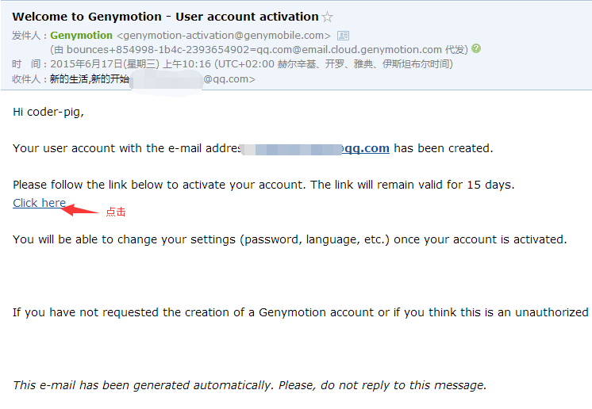
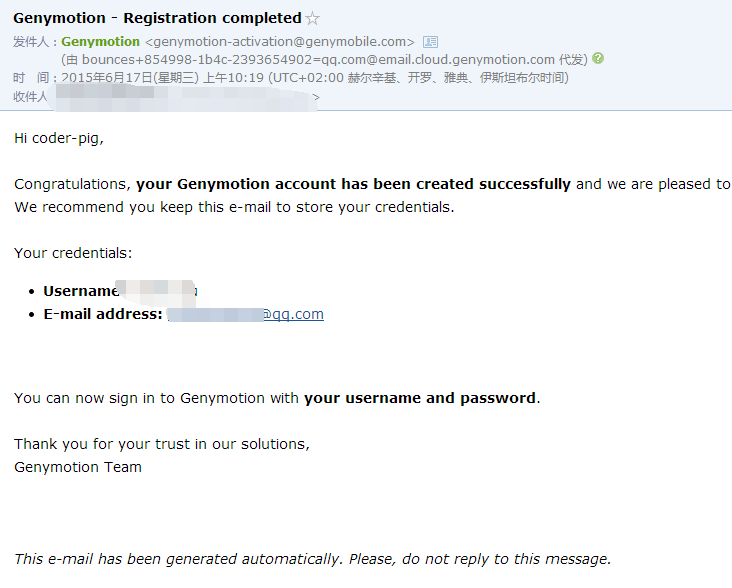

登陆账号后，点击Get Genymotion:  

选择Free版的下载,然后选择带virtual box虚拟机的下载  

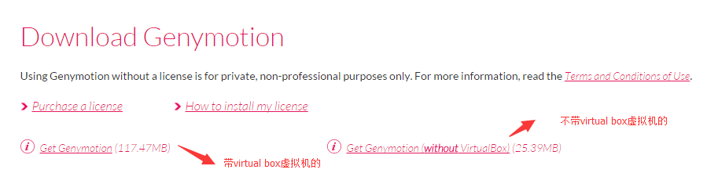

## 四、安装Genymotion
都是傻瓜式的下一步 选择安装目录：  

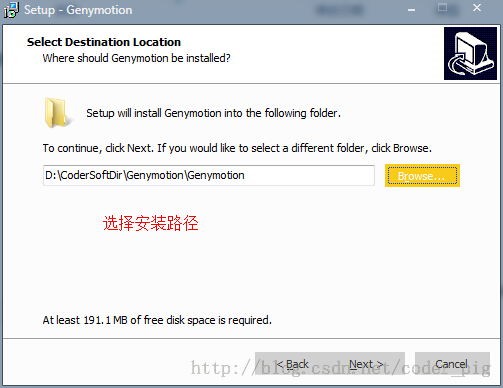

安装完后会弹出Oracle VM virtualBox的安装,这里可以选择路径,笔者直接默认安装了  

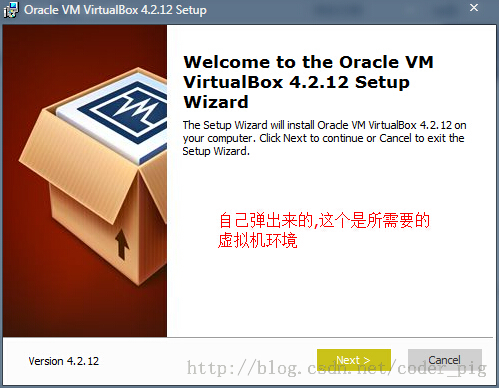
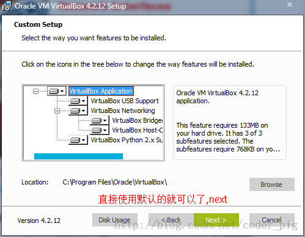
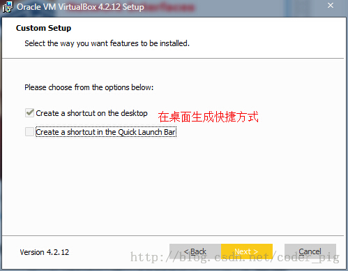

安装过程中会时不时弹出安装一些设备的窗口,这是虚拟机在安装东西,不用理,都按安装:  

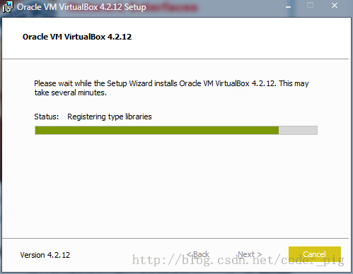
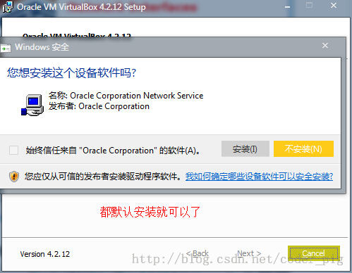

好了,安装完成后,确认,将我们的Genymotion运行起来 

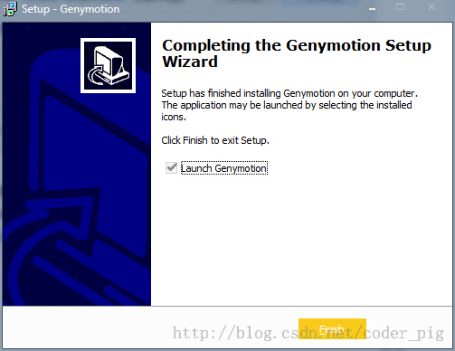

## 五、创建Android模拟器
①运行软件后会来到一个界面,因为是第一次使用,所以需要我们新建一个avd:  

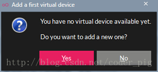

点击yes后会来到选择avd版本的界面,因为这上面什么设备都没有,我们需要连接到官网 获取各种版本的系统与硬件设备等,点击下方的connect,输入我们已经激活的账号密码: 邮箱与密码(笔者可能是网络问题,连续连了几次才成功的)  

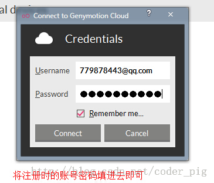

登录成功后就可以对对应的系统以及硬件设备进行选择了:  

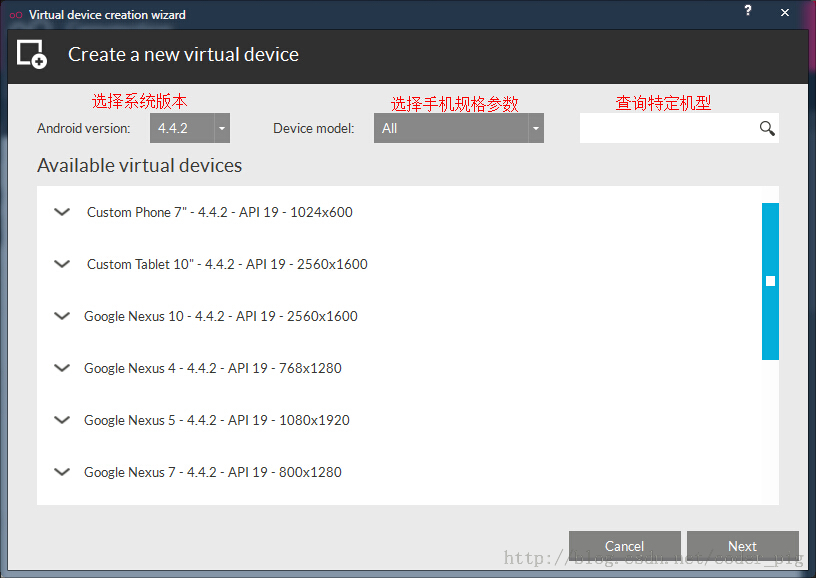

这里显示设备的相关信息,可以自定义模拟器的名称  

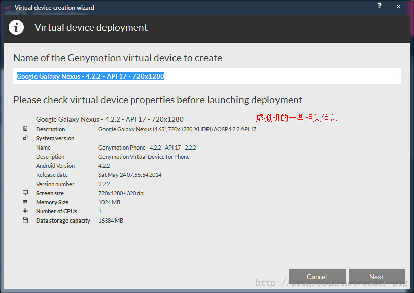

设置完名称后,点击next,就会下载虚拟设备的相关程序以及对应官方的sdk  

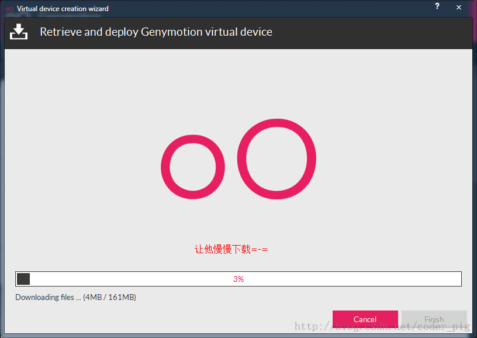
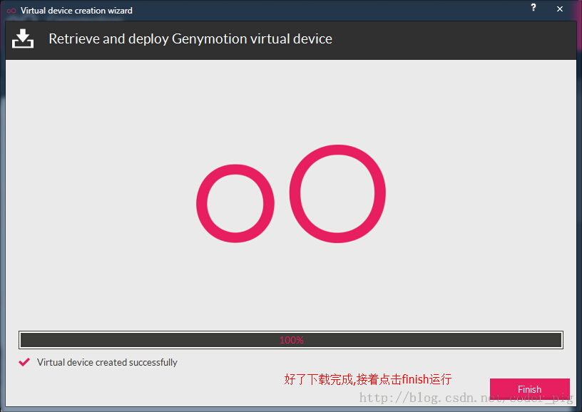

好了,avd已经创建完毕,接着把他运行起来,开机也只是十几秒的事,很赞！操作起来超流畅啊,有木有？

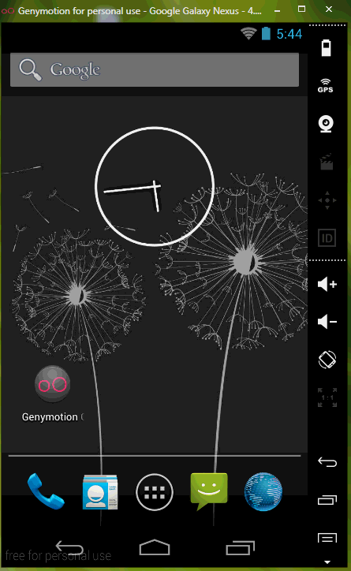

## 六、怎么在模拟器上运行程序
其实这个问题是白问的,我们只要在Eclpise上的Device就可以看到当前正在运行的模拟器; 感觉其实和真机是差不多的,我们只要运行程序时选择在哪个设备上运行即可！

## 七、可能遇到的问题
**①不喜欢原生的系统,想用标准sdk中的系统版本**

答:在下载设备驱动时其实已经下载好对应的sdk了,但是如果你不喜欢的话可以 打开setting--ADB-->选择Eclpise的sdk路径

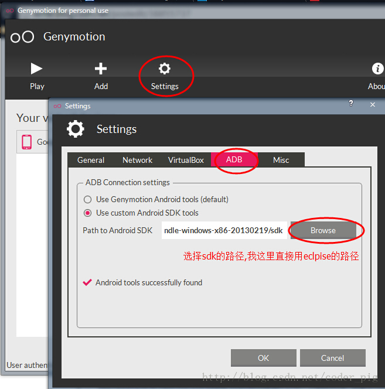

**②老登录不了?或者获取不了手机列表:** 

答:这个大部分的原因都是给墙了,所以只能科学上网了;不过貌似白天是可以的, 虽然有点慢,晚上的话笔者试了N次都是下载不了其他版本的设备!另外登录 不了要看下自己账号密码是否有错误哦！

**③觉得模拟器占屏幕太大了** 

答:先把模拟器关了,点击扳手的图标

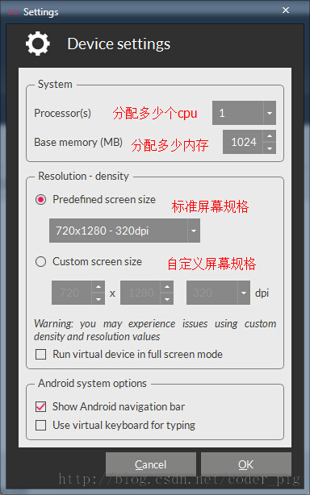

**④运行程序，直接拖拉APK到模拟器上出现下述问题：**

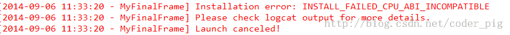

下载下面这个zip包,下载完毕后将它拖拽到模拟器窗口上,弹出对话框点击确定,接着重启下模拟器即可！ [Genymotion-ARM-Translation.zip](http://static.runoob.com/download/Genymotion-ARM-Translation.zip)

**⑤因程序需要，要查看模拟器的sdk目录：** 

之前的话我们在Eclipse上是通过mmt/sdcard找到sd卡目录的; 但是genymotion却不是在这个路径下:而是在下面这个路径下: /mnt/shell/emulated/0/ 可以根据后面的Info慢慢找出来

## 八、本节小结
本节介绍了比真机还快的安卓模拟器——Genymotion的安装与使用，相信各位读者会爱上这个模拟器的， 谢谢~