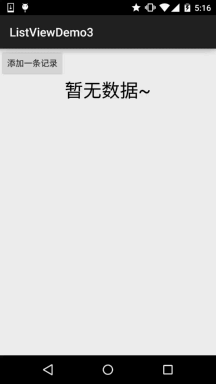
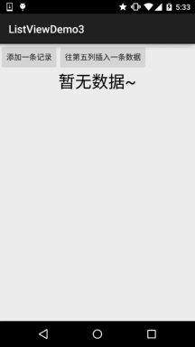

## 一、本节引言：
我们前面已经学习了ListView的一些基本用法咧，但是细心的你可能发现了，我们的数据 一开始定义好的，都是静态的，但是实际开发中，我们的数据往往都是动态变化的，比如 我增删该了某一列，那么列表显示的数据也应该进行同步的更新，那么本节我们就来探讨 下ListView数据更新的问题，包括全部更新，以及更新其中的一项，那么开始本节内容！~ 


## 二、先写个正常的demo先
好的，先写个正常的Demo先，等下我们再慢慢调：

entity类：`Data.java：`
```java
/**
 * Created by Jay on 2015/9/21 0021.
 */
public class Data {
    private int imgId;
    private String content;

    public Data() {}

    public Data(int imgId, String content) {
        this.imgId = imgId;
        this.content = content;
    }

    public int getImgId() {
        return imgId;
    }

    public String getContent() {
        return content;
    }

    public void setImgId(int imgId) {
        this.imgId = imgId;
    }

    public void setContent(String content) {
        this.content = content;
    }
}
```

Activity布局以及列表项布局：`activity_main.xml：`
```xml
<LinearLayout xmlns:android="http://schemas.android.com/apk/res/android"
    xmlns:tools="http://schemas.android.com/tools"
    android:layout_width="match_parent"
    android:layout_height="match_parent"
    android:orientation="vertical"
    tools:context=".MainActivity">

    <ListView
        android:id="@+id/list_one"
        android:layout_width="match_parent"
        android:layout_height="match_parent" />

</LinearLayout>
```

`item_list.xml：`
```xml
<?xml version="1.0" encoding="utf-8"?>
<LinearLayout xmlns:android="http://schemas.android.com/apk/res/android"
    android:layout_width="match_parent"
    android:layout_height="match_parent"
    android:orientation="horizontal">

    <ImageView
        android:id="@+id/img_icon"
        android:layout_width="56dp"
        android:layout_height="56dp"/>

    <TextView
        android:id="@+id/txt_content"
        android:layout_width="wrap_content"
        android:layout_height="wrap_content"
        android:layout_marginTop="20dp"
        android:layout_marginLeft="10dp"
        android:textSize="18sp" />

</LinearLayout>
```

自定义BaseAdapter的实现：`MyAdapter.java：`
```java
/**
 * Created by Jay on 2015/9/21 0021.
 */
public class MyAdapter extends BaseAdapter {

    private Context mContext;
    private LinkedList<Data> mData;

    public MyAdapter() {}

    public MyAdapter(LinkedList<Data> mData, Context mContext) {
        this.mData = mData;
        this.mContext = mContext;
    }

    @Override
    public int getCount() {
        return mData.size();
    }

    @Override
    public Object getItem(int position) {
        return null;
    }

    @Override
    public long getItemId(int position) {
        return position;
    }

    @Override
    public View getView(int position, View convertView, ViewGroup parent) {
        ViewHolder holder = null;
        if(convertView == null){
            convertView = LayoutInflater.from(mContext).inflate(R.layout.item_list,parent,false);
            holder = new ViewHolder();
            holder.img_icon = (ImageView) convertView.findViewById(R.id.img_icon);
            holder.txt_content = (TextView) convertView.findViewById(R.id.txt_content);
            convertView.setTag(holder);
        }else{
            holder = (ViewHolder) convertView.getTag();
        }
        holder.img_icon.setImageResource(mData.get(position).getImgId());
        holder.txt_content.setText(mData.get(position).getContent());
        return convertView;
    }

    private class ViewHolder{
        ImageView img_icon;
        TextView txt_content;
    }
}
```

MainActivity.java的编写：

```java
public class MainActivity extends AppCompatActivity {

    private ListView list_one;
    private MyAdapter mAdapter = null;
    private List<Data> mData = null;
    private Context mContext = null;

    @Override
    protected void onCreate(Bundle savedInstanceState) {
        super.onCreate(savedInstanceState);
        setContentView(R.layout.activity_main);
        mContext = MainActivity.this;
        bindViews();
        mData = new LinkedList<Data>();
        mAdapter = new MyAdapter((LinkedList<Data>) mData,mContext);
        list_one.setAdapter(mAdapter);
    }

    private void bindViews(){
        list_one = (ListView) findViewById(R.id.list_one);
    }
}
```

可以运行，运行后发现我们的页面并没有任何的数据，白茫茫的一片，这样的用户体验并不好， 我们可以通过调用ListView的一个setEmptyView(View)的方法，当ListView数据为空的时候， 显示一个对应的View，另外发现这个方法很奇葩，动态添加的View，竟然无效，只能在ListView 所在的布局文件中添加当ListView无数据时，想显示的View，另外用这个setEmptyView设置后的 View，加载的时候竟然不会显示出来，好灵异....比如这里的是没有数据时显示一个没有数据 的TextView，部分代码如下：

```
<TextView
        android:id="@+id/txt_empty"
        android:layout_width="wrap_content"
        android:layout_height="wrap_content"
        android:layout_gravity="center"
        android:textSize="15pt"
        android:textColor="#000000"/>
txt_empty = (TextView) findViewById(R.id.txt_empty);    
txt_empty.setText("暂无数据~");
list_one.setEmptyView(txt_empty);
```

当然除了这种方法外我们还可以定义一个与ListView一样大小位置的布局，然后设置， android:visibility="gone"，在Java代码中对mData集合的size进行判断，如果==0， 说明没数据，让这个布局显示出来，当有数据的时候让这个布局隐藏~


## 三、添加一条记录
好的，我们弄个添加按钮，没按一次添加一条记录哈~

运行效果图:



代码实现

在我们自定义的BaseAdapter中定义一个方法，方法内容如下：
```java
public void add(Data data) {
    if (mData == null) {
        mData = new LinkedList<>();
    }
    mData.add(data);
    notifyDataSetChanged();
}
```

然后布局自己加个按钮，然后设置下事件，代码如下：
```java
private Button btn_add;
btn_add = (Button) findViewById(R.id.btn_add);
btn_add.setOnClickListener(this);

@Override
public void onClick(View v) {
    switch (v.getId()){
        case R.id.btn_add:
            mAdapter.add(new Data(R.mipmap.ic_icon_qitao,"给猪哥跪了~~~ x " + flag));
            flag++;
            break;
    }
}
```

嘿嘿，成了，添加数据就这么简单~，如果你想插入到特定位置，也行，我们Adapter类里，再另外 写一个方法：

```java
//往特定位置，添加一个元素
public void add(int position,Data data){
    if (mData == null) {
        mData = new LinkedList<>();
    }
    mData.add(position,data);
    notifyDataSetChanged();
}
```

然后加个按钮，写个事件：
```java
private Button btn_add2;
btn_add2 = (Button) findViewById(R.id.btn_add2);
btn_add2.setOnClickListener(this);

case R.id.btn_add2:
//position从0开始算的
mAdapter.add(4,new Data(R.mipmap.ic_icon_qitao,"给猪哥跪了~~~ x " + flag));
break;
```

运行效果图：



可以看到我们的第九项插入到了第五个位置~


## 四、删除某一项
同样的，我们写两个方法，一个直接删对象，一个根据游标来删：
```java
public void remove(Data data) {
    if(mData != null) {
        mData.remove(data);
    }
    notifyDataSetChanged();
}

public void remove(int position) {
    if(mData != null) {
        mData.remove(position);
    }
    notifyDataSetChanged();
}
```

然后加两个Button，调用下这两个方法：
```java
case R.id.btn_remove:
    mAdapter.remove(mData_5);
    break;
case R.id.btn_remove2:
    mAdapter.remove(2);
    break;
```
    
运行效果图：


从图中我们可以看到，第五项被移除了，然后点击游标删除数据，一直删的是第三项！


## 五、移除所有的记录：
这个更加简单，直接调用clear方法即可！方法代码如下：
```java
public void clear() {
    if(mData != null) {
        mData.clear();
    }
    notifyDataSetChanged();
}
```


## 六、更新某一个记录
细心的你应该发现了，进行了数据修改操作后，都会调用一个notifyDataSetChanged(); `一开始我以为：`

notifyDataSetChanged()会把界面上现实的的item都重绘一次，这样会影响ui性能吧，如果数据量 很大，但是我改变一项就要重新绘制所有的item，这肯定不合理是吧！于是乎，我用了一个傻办法 来修改某个Item中控件的值，我在Java代码中写了这样一段代码：
```java
private void updateListItem(int postion,Data mData){
    int visiblePosition = list_one.getFirstVisiblePosition();
    View v = list_one.getChildAt(postion - visiblePosition);
    ImageView img = (ImageView) v.findViewById(R.id.img_icon);
    TextView tv = (TextView) v.findViewById(R.id.txt_content);
    img.setImageResource(mData.getImgId());
    tv.setText(mData.getContent());
}
```

**后来和群里的朋友讨论了下，发现自己错了：**

notifyDataSetChanged()方法会判断是否需要重新渲染，如果当前item没有必要重新渲染 是不会重新渲染的，如果某个Item的状态发生改变，都会导致View的重绘，而重绘的并不是 所有的Item，而是View状态发生变化的那个Item！所以我们直接notifyDataSetChange()方法 即可，当然知道多一个上面的方法也没什么~

代码下载：
[ListViewDemo3.zip](ListViewDemo3.zip)


## 七、本节小结：
好的，本节跟大家讲述了ListView中数据更新的实现，当然不止ListView，其他的Adapter 类控件都可以调用这些方法来完成数据更新~就说这么多吧~谢谢