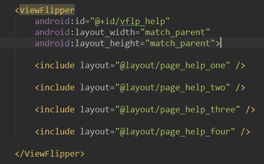
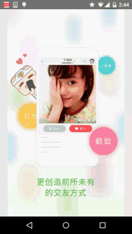
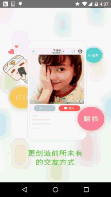
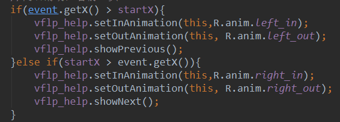
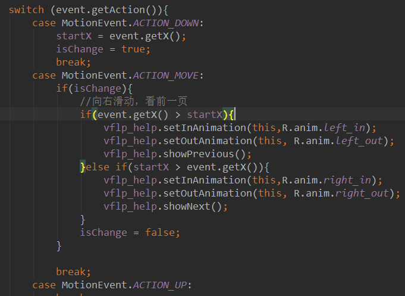

## 一、本节引言：
本节给大家带了的是ViewFlipper，它是Android自带的一个多页面管理控件，且可以自动播放！ 和ViewPager不同，ViewPager是一页页的，而ViewFlipper则是一层层的，和ViewPager一样，很多时候， 用来实现进入应用后的引导页，或者用于图片轮播，本节我们就使用ViewFlipper写一个简单的图片 轮播的例子吧~官方API：ViewFlipper


## 二、为ViewFlipper加入View的两种方法
### 1）静态导入
所谓的静态导入就是像图中这样，把个个页面添加到ViewFlipper的中间！



### 2）动态导入
通过addView方法填充View


## 三、常用的一些方法
- `setInAnimation`：设置View进入屏幕时使用的动画
- `setOutAnimation`：设置View退出屏幕时使用的动画
- `showNext`：调用该方法来显示ViewFlipper里的下一个View
- `showPrevious`：调用该方法来显示ViewFlipper的上一个View
- `setFilpInterval`：设置View之间切换的时间间隔
- `setFlipping`：使用上面设置的时间间隔来开始切换所有的View，切换会循环进行
- `stopFlipping`：停止View切换


## 四、使用实例
### 1）示例1：使用ViewFlipper实现图片轮播(静态导入)
实现效果图：



实现代码：

每个页面的布局都是一个简单的ImageView，这里就不贴了~先贴下两个进入以及 离开的动画：

`right_in.xml：`
```xml
<?xml version="1.0" encoding="utf-8"?>
<set xmlns:android="http://schemas.android.com/apk/res/android">

    <translate
        android:duration="2000"
        android:fromXDelta="100%p"
        android:toXDelta="0" />

</set>
```

`right_out.xml：`
```xml
<?xml version="1.0" encoding="utf-8"?>
<set xmlns:android="http://schemas.android.com/apk/res/android" >

    <translate
        android:duration="2000"
        android:fromXDelta="0"
        android:toXDelta="-100%p" />

</set>
```

然后是`activity_main.xml`布局文件：
```xml
<RelativeLayout xmlns:android="http://schemas.android.com/apk/res/android"
    xmlns:tools="http://schemas.android.com/tools"
    android:layout_width="match_parent"
    android:layout_height="match_parent"
    tools:context=".MainActivity">

    <ViewFlipper
        android:id="@+id/vflp_help"
        android:layout_width="match_parent"
        android:layout_height="match_parent"
        android:inAnimation="@anim/right_in"
        android:outAnimation="@anim/right_out"
        android:flipInterval="3000">

        <include layout="@layout/page_help_one" />

        <include layout="@layout/page_help_two" />

        <include layout="@layout/page_help_three" />

        <include layout="@layout/page_help_four" />

    </ViewFlipper>

</RelativeLayout>
```

这里我们设置了flipInterval = 3000，即每隔3000ms切换一个~ 最后我们只需在MainActivity.java中调用ViewFlipper的startFlipping()方法开始滑动！

`MainActivity.java：`
```java
public class MainActivity extends AppCompatActivity {

    private ViewFlipper vflp_help;
    @Override
    protected void onCreate(Bundle savedInstanceState) {
        super.onCreate(savedInstanceState);
        setContentView(R.layout.activity_main);
        vflp_help = (ViewFlipper) findViewById(R.id.vflp_help);
        vflp_help.startFlipping();
    }
}
```


### 2）示例2：支持手势滑动的ViewFlipper(动态导入)
实现效果图：



代码实现：

因为我们分为进入上一页，进入下一页，所以除了上面的两个动画外，我们再添加两个动画：

`left_in.xml：`
```xml
<?xml version="1.0" encoding="utf-8"?>
<set xmlns:android="http://schemas.android.com/apk/res/android" >

    <translate
        android:duration="500"
        android:fromXDelta="-100%p"
        android:toXDelta="0" />

</set>
```

`left_out.xml：`
```xml
<?xml version="1.0" encoding="utf-8"?>
<set xmlns:android="http://schemas.android.com/apk/res/android">

    <translate
        android:duration="500"
        android:fromXDelta="0"
        android:toXDelta="100%p" />

</set>
```

`MainActivity.java：`
```java
public class MainActivity extends AppCompatActivity  {

    private Context mContext;
    private ViewFlipper vflp_help;
    private int[] resId = {R.mipmap.ic_help_view_1,R.mipmap.ic_help_view_2,
            R.mipmap.ic_help_view_3,R.mipmap.ic_help_view_4};

    private final static int MIN_MOVE = 200;   //最小距离
    private MyGestureListener mgListener;
    private GestureDetector mDetector;

    @Override
    protected void onCreate(Bundle savedInstanceState) {
        super.onCreate(savedInstanceState);
        setContentView(R.layout.activity_main);
        mContext = MainActivity.this;
        //实例化SimpleOnGestureListener与GestureDetector对象
        mgListener = new MyGestureListener();
        mDetector = new GestureDetector(this, mgListener);
        vflp_help = (ViewFlipper) findViewById(R.id.vflp_help);
        //动态导入添加子View
        for(int i = 0;i < resId.length;i++){
            vflp_help.addView(getImageView(resId[i]));
        }

    }

    //重写onTouchEvent触发MyGestureListener里的方法
    @Override
    public boolean onTouchEvent(MotionEvent event) {
        return mDetector.onTouchEvent(event);
    }


    //自定义一个GestureListener,这个是View类下的，别写错哦！！！
    private class MyGestureListener extends GestureDetector.SimpleOnGestureListener {
        @Override
        public boolean onFling(MotionEvent e1, MotionEvent e2, float v, float v1) {
            if(e1.getX() - e2.getX() > MIN_MOVE){
                vflp_help.setInAnimation(mContext,R.anim.right_in);
                vflp_help.setOutAnimation(mContext, R.anim.right_out);
                vflp_help.showNext();
            }else if(e2.getX() - e1.getX() > MIN_MOVE){
                vflp_help.setInAnimation(mContext,R.anim.left_in);
                vflp_help.setOutAnimation(mContext, R.anim.left_out);
                vflp_help.showPrevious();
            }
            return true;
        }
    }

    private ImageView getImageView(int resId){
        ImageView img = new ImageView(this);
        img.setBackgroundResource(resId);
        return img;
    }
}
```

代码要点解析：

1. 这里我们通过动态的方法添加View，这里只是简单的ImageView，可根据自己需求进行扩展！ 
2. 相信细心的你发现了，这里我们的手势用的不是通过onTouchEvent直接判断的，然后重写 onTouch事件，对Action进行判断，然后如果是MotionEvent.ACTION_MOVE的话，就执行下述代码：



后来发现，模拟器上因为是鼠标的关系，并不会频繁的抖动，而真机上，因为手指一直是颤抖的 所以ACTION_MOVE会一直触发，然后View一直切换，后来考虑了Berial(B神)的建议，加入了 一个值来进行判断，就是添加一个标志：



可以是可以，不过感觉还是有点不流畅，怪怪的，后来想想还是用手势类，直接在onFling处理 就好，于是就有了上面的代码，运行起来杠杠滴~ 当然，如果你对Gesture手势不熟悉的话，可以参见之前写过的一篇文章： Android基础入门教程——3.8 Gesture(手势)


## 五、代码示例下载
[ViewFlipperDemo.zip](../img/ViewFlipperDemo.zip)

[ViewFlipperDemo2.zip](../img/ViewFlipperDemo2.zip)


## 六、本节小结：
好的，本节给大家讲解了ViewFlipper(翻转视图)的基本使用，以后做图片轮播和引导页， 你就多了一个选择了~嗯，就说这么多，谢谢~