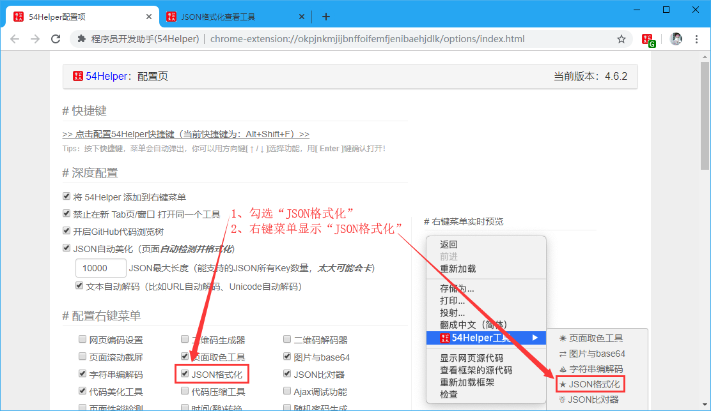
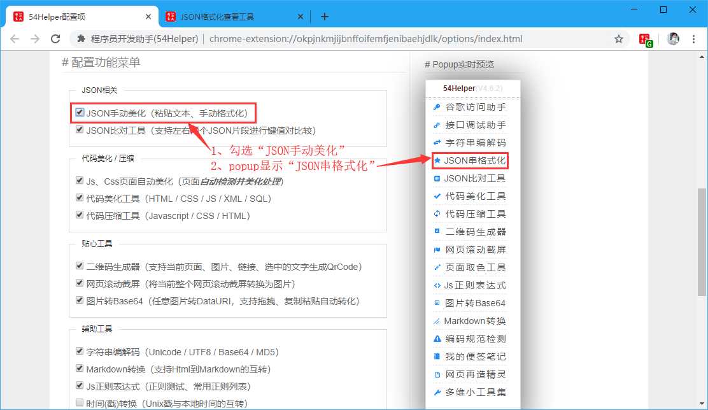
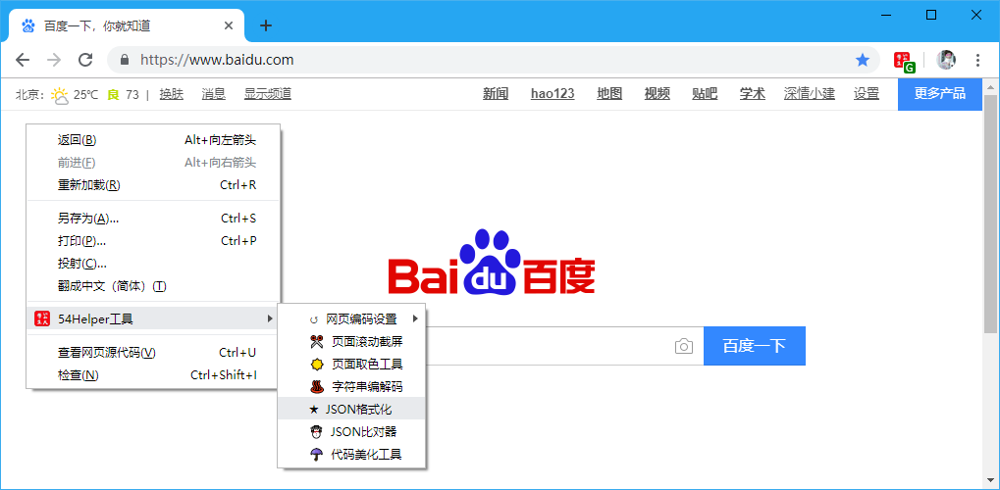
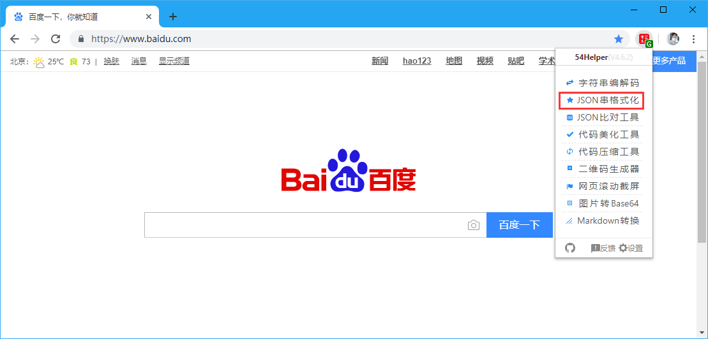
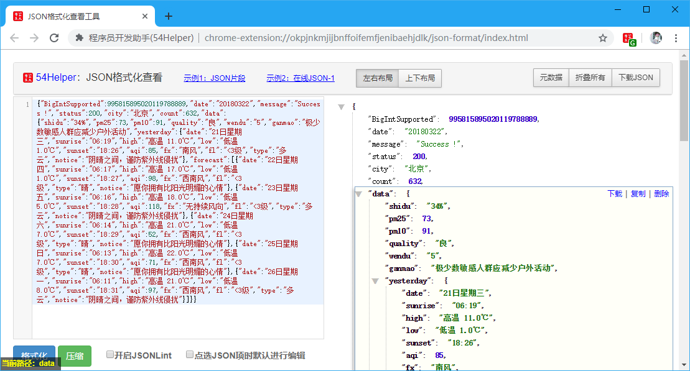
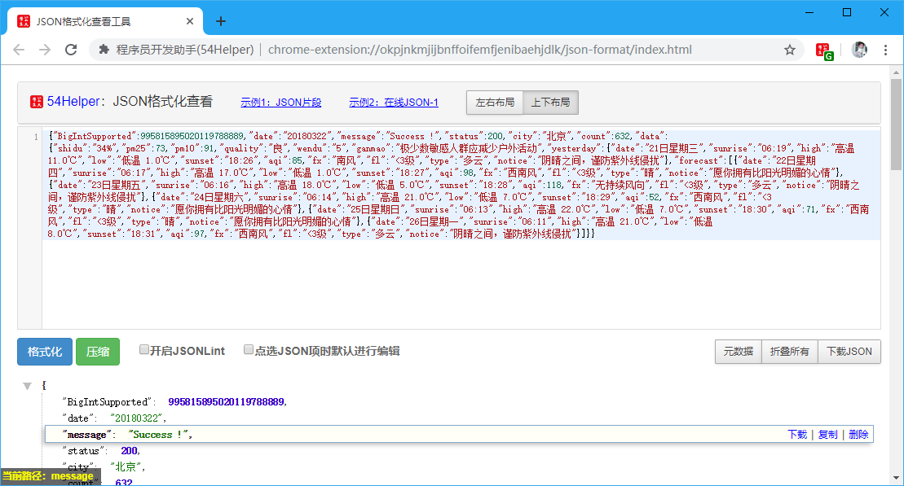

# 一、简介
1、本工具可以对json串格式化  
2、格式化窗体支持“左右布局”和“上下布局”  
3、可以对格式化后的数据“单个字段选择下载、复制、删除”，“查看元数据”，“折叠json”，“展开json”，“下载json”，“开启JSONLint”，“编辑单个字段”  

# 二、配置
## 2.1、右键菜单配置
在设置界面，** 配置右键菜单 **  
1、勾选“JSON格式化”  
2、右键菜单将显示“JSON格式化”  

👆配置右键菜单-JSON格式化开启

## 2.2、popup菜单配置
在设置界面，** 配置功能菜单 **  
1、勾选“JSON格式化”  
2、popup菜单将出现“JSON格式化”  

👆配置功能菜单-JSON格式化开启

# 三、使用
## 3.1、开箱即用
1、点击“鼠标右键”->“54Helper工具”->“JSON格式化”->跳转至“JSON格式化”页面  

👆JSON格式化的使用-右键菜单

2、点击“工具栏54Helper的popup”->“popup弹出”->“JSON格式化”->跳转至“JSON格式化”页面  

👆JSON格式化的使用-popup菜单

3、功能演示说明  
- 格式化窗体支持“左右布局”和“上下布局”
- 可以对格式化后的数据“单个字段选择下载、复制、删除”
- “查看元数据”
- “折叠json”
- “展开json”
- “下载json”
- “开启JSONLint”
- “编辑单个字段”

👆JSON格式化的使用-左右布局

👆JSON格式化的使用-上下布局

