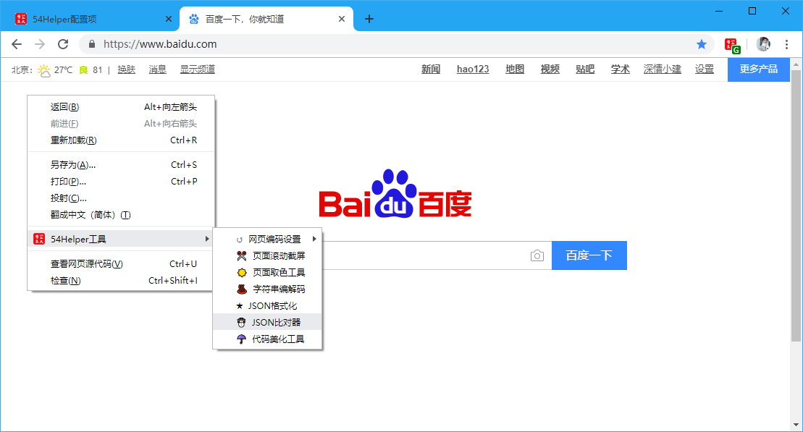

# 一、简介
1、本工具可以对两个json串进行比对差异  
2、非json串会报“JSON不合法！”  
3、会显示两侧总共有多少处差异，并颜色高亮标识出差异处  

# 二、配置
## 2.1、右键菜单配置
在设置界面，** 配置右键菜单 **  
1、勾选“JSON比对器”  
2、右键菜单将显示“JSON比对器”  

👆配置右键菜单-JSON比对器开启

## 2.2、popup菜单配置
在设置界面，** 配置功能菜单 **  
1、勾选“JSON比对器”  
2、popup菜单将出现“JSON比对器”  

👆配置功能菜单-JSON比对器开启

# 三、使用
## 3.1、开箱即用
1、点击“鼠标右键”->“54Helper工具”->“JSON比对器”->跳转至“JSON比对器”页面  

👆JSON比对器的使用-右键菜单

2、点击“工具栏54Helper的popup”->“popup弹出”->“JSON比对器”->跳转至“JSON比对器”页面  

👆JSON比对器的使用-popup菜单

## 3.2、功能演示说明  
- 非json串会报“JSON不合法！”  
- 会显示两侧总共有多少处差异，并颜色高亮标识出差异处  

👆JSON比对器的使用
