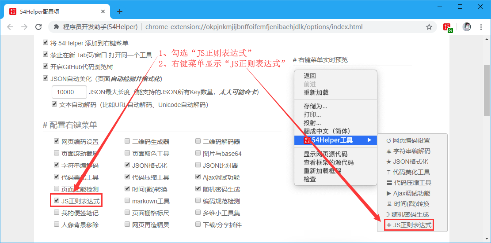
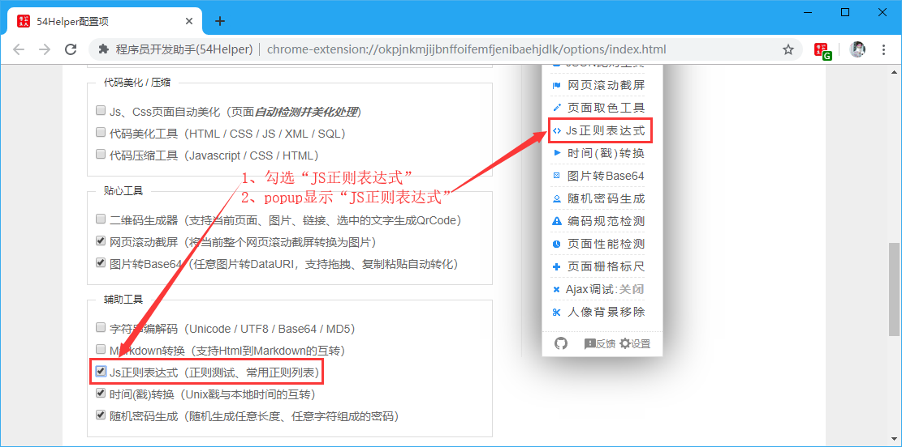
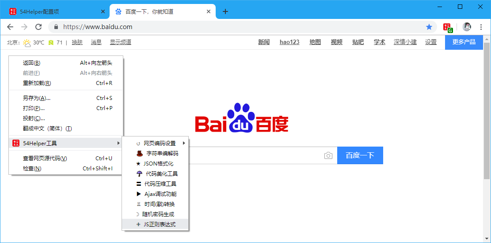
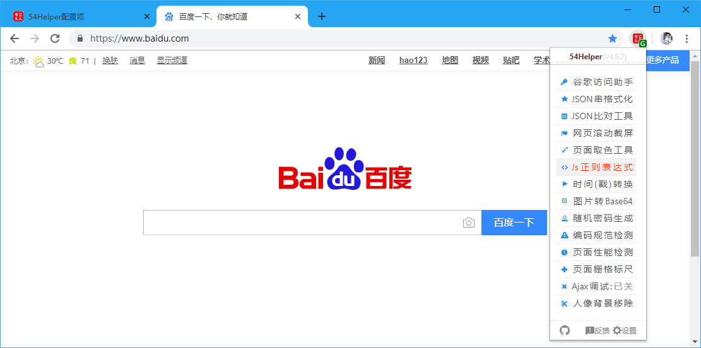
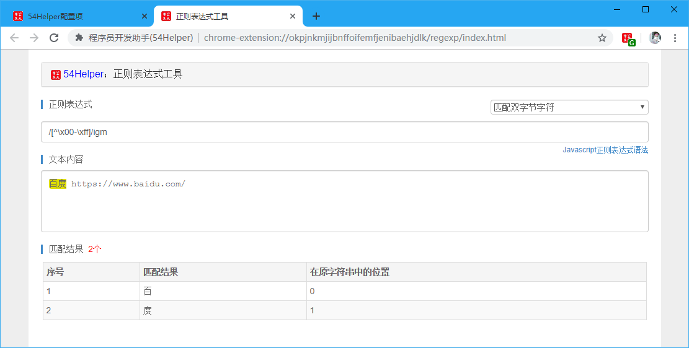

# 一、简介
1、本工具可以编写JS正则表达式验证正确性  
2、本工具已提供一些基本JS正则表达式  
-- 常用正则表达式 --  
```javascript
常用字符
    匹配中文字符：/[\u4e00-\u9fa5]/gm
    匹配双字节字符：/[^\x00-\xff]/igm
    匹配行尾行首空白：/(^\s*)|(\s*$)/
    只能输入数字：/^\d+$/
    只能输入n个数字：/^\d{n}$/
    至少输入n个以上的数字：/^\d{n,}$/
    只能输入m到n个数字：/^\d{m,n}$/
    只能由英文字母组成：/^[a-z]+$/i
    只能由大写英文字母组成：/^[A-Z]+$/
    只能由英文和数字组成：/^[a-z0-9]+$/i
    只能由英文、数字、下划线组成：/^\w+$/

常用表单
    匹配Email地址：/\w+([-+.]\w+)*@\w+([-.]\w+)*\.\w+([-.]\w+)*/
    匹配URL地址：/^https?:\/\/(([a-zA-Z0-9_-])+(\.)?)*(:\d+)?(\/((\.)?(\?)?=?&?[a-zA-Z0-9_-](\?)?)*)*$/i
    匹配手机号码：/^(0|86|17951)?(13[0-9]|15[012356789]|166|17[3678]|18[0-9]|14[57])[0-9]{8}$/
    匹配身份证号：/^(^[1-9]\d{7}((0\d)|(1[0-2]))(([0|1|2]\d)|3[0-1])\d{3}$)|(^[1-9]\d{5}[1-9]\d{3}((0\d)|(1[0-2]))(([0|1|2]\d)|3[0-1])((\d{4})|\d{3}[Xx])$)$/
    匹配邮编号：/^[1-9]\d{5}(?!\d)$/
    匹配日期(yyyy-MM-dd)：/^[1-2][0-9][0-9][0-9]-[0-1]{0,1}[0-9]-[0-3]{0,1}[0-9]$/

浏览器navigator.userAgent
    从UA判断是否为IE浏览器：/msie (\d+\.\d+)/i
    从UA判断是否为webkit内核：/webkit/i
    从UA判断是否为chrome浏览器：/chrome\/(\d+\.\d+)/i
    从UA判断是否为firefox浏览器：/firefox\/(\d+\.\d+)/i
    从UA判断是否为opera浏览器：/opera(\/| )(\d+(\.\d+)?)(.+?(version\/(\d+(\.\d+)?)))?/i
    从UA判断是否为Safari浏览器：/(\d+\.\d)?(?:\.\d)?\s+safari\/?(\d+\.\d+)?/i
    从UA中判断是否为Android系统：/android/i
    从UA中判断是否为iPad：/ipad/i
    从UA中判断是否为iPhone：/iphone/i
    从UA判断是否为Mac OS平台：/macintosh/i
    从UA中判断是否为Windows平台：/windows/i
    从UA中判断是否为移动终端：/(nokia|iphone|android|ipad|motorola|^mot\-|softbank|foma|docomo|kddi|up\.browser|up\.link|htc|dopod|blazer|netfront|helio|hosin|huawei|novarra|CoolPad|webos|techfaith|palmsource|blackberry|alcatel|amoi|ktouch|nexian|samsung|^sam\-|s[cg]h|^lge|ericsson|philips|sagem|wellcom|bunjalloo|maui|symbian|smartphone|midp|wap|phone|windows ce|iemobile|^spice|^bird|^zte\-|longcos|pantech|gionee|^sie\-|portalmmm|jig\s browser|hiptop|^ucweb|^benq|haier|^lct|opera\s*mobi|opera\*mini|320x320|240x320|176x220)/i

HTML相关
    匹配link标签：/\<link\s(.*?)\s*(([^&]>)|(\/\>)|(\<\/link\>))/gi
    匹配HTML标签：/<(\S*?) [^>]*>.*?</\1>|<.*?/>/gm
    匹配非HTML标签：/^[^<>`~!/@\#}$%:;)(_^{&*=|'+]+$/
    匹配script标签：/<script[^>]*>[\s\S]*?<\/[^>]*script>/gi
    匹配HTML注释：/<!--[\s\S]*?--\>/g
    匹配HTML条件注释：/\[\s*if\s+[^\]][\s\w]*\]/i
    匹配非IE的条件注释：/^\[if\s+(!IE|false)\]>.*<!\[endif\]$/i
    匹配CSS expression：/expression[\s\r\n ]?\(/gi
    匹配不合法的HTML标签：/<\W+>/gi
    匹配textarea标签：/<textarea[^>]*>[\s\S]*?<\/[^>]*textarea>/gi
```

# 二、配置
## 2.1、右键菜单配置
在设置界面，** 配置右键菜单 **  
1、勾选“JS正则表达式”  
2、右键菜单将显示“JS正则表达式”  


👆配置右键菜单-JS正则表达式开启

## 2.2、popup菜单配置
在设置界面，** 配置功能菜单 **  
1、勾选“JS正则表达式”  
2、popup菜单将出现“JS正则表达式”  


👆配置功能菜单-JS正则表达式开启

# 三、使用
## 3.1、开箱即用
1、点击“鼠标右键”->“54Helper工具”->“JS正则表达式”->跳转至“JS正则表达式”页面  


👆JS正则表达式的使用-右键菜单

2、点击“工具栏54Helper的popup”->“popup弹出”->“JS正则表达式”->跳转至“JS正则表达式”页面  


👆JS正则表达式的使用-popup菜单

3、功能演示说明  
JS正则表达式简单示例如下  
操作步骤：  
> 1、选择密码生成因子  
> 2、设置密码生成长度  
> 3、点击“生成随机密码”按钮  
> 4、密码输出框获取密码  


👆JS正则表达式

