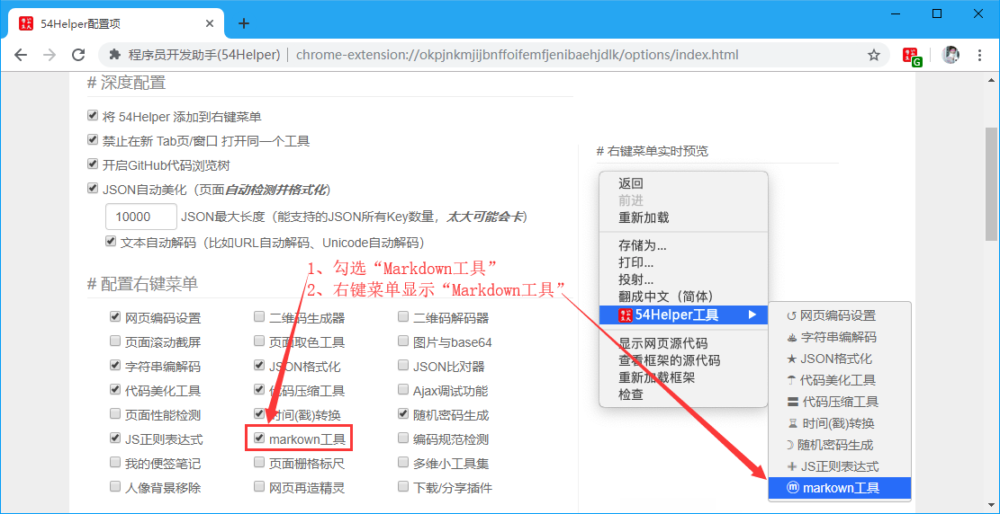
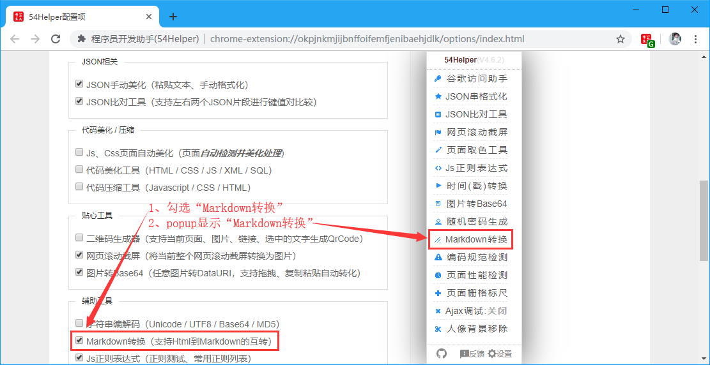
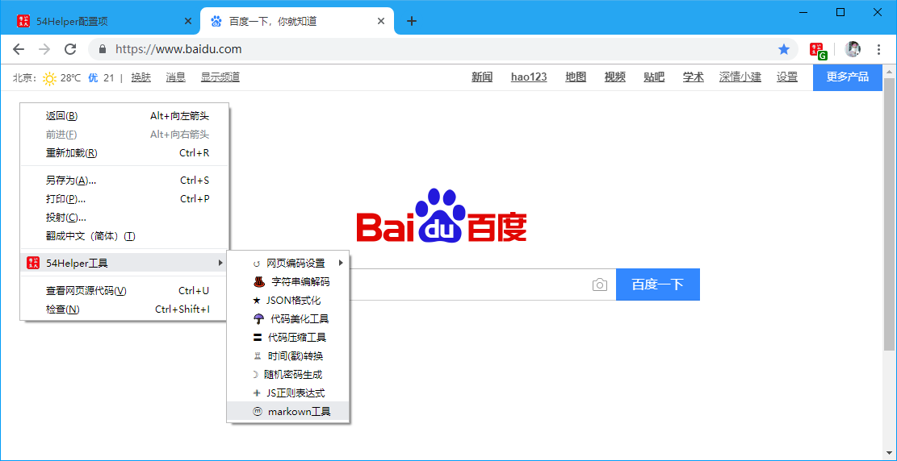
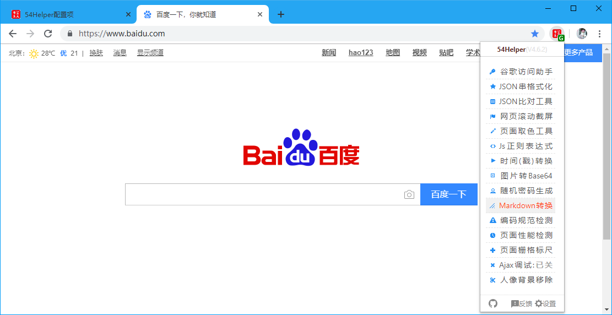
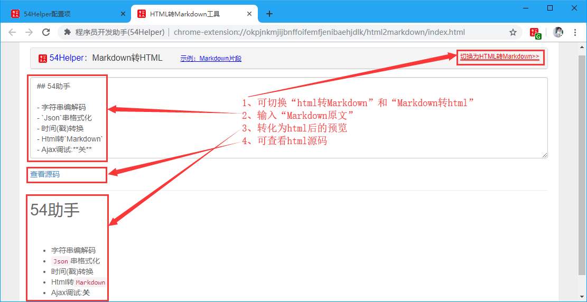

# 一、简介
1、本工具可以编写Markdown文本然后查看编译为html后的样式效果  
2、本工具支持查看编译为html后的源码  

# 二、配置
## 2.1、右键菜单配置
在设置界面，** 配置右键菜单 **  
1、勾选“Markdown工具”  
2、右键菜单将显示“Markdown工具”  

👆配置右键菜单-Markdown工具开启

## 2.2、popup菜单配置
在设置界面，** 配置功能菜单 **  
1、勾选“Markdown工具”  
2、popup菜单将出现“Markdown工具”  

👆配置功能菜单-Markdown工具开启

# 三、使用
## 3.1、开箱即用
1、点击“鼠标右键”->“54Helper工具”->“Markdown工具”->跳转至“Markdown工具”页面  

👆Markdown工具的使用-右键菜单

2、点击“工具栏54Helper的popup”->“popup弹出”->“Markdown工具”->跳转至“Markdown工具”页面  

👆Markdown工具的使用-popup菜单

## 3.2、功能演示说明  
Markdown工具简单示例如下  
操作步骤：  
> 1、点击右上角链接按钮切换“切换为HTML转Markdown>>”或者“切换为Markdown转HTML>>”  
> 2、输入或粘帖“Markdown内容”  
> 3、转换后内容将显示在下方  
> 4、点击`查看源码`可查看html源码  

👆Markdown工具
