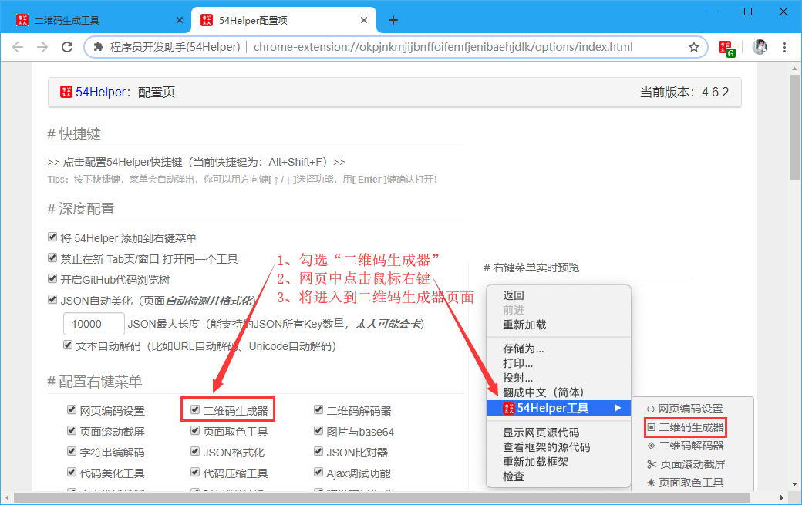
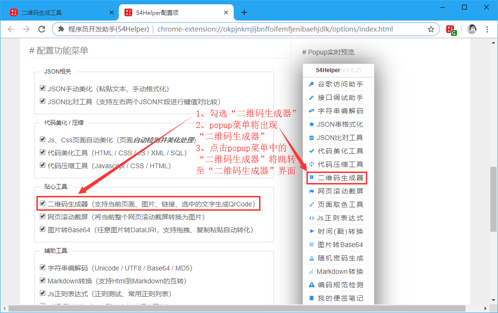
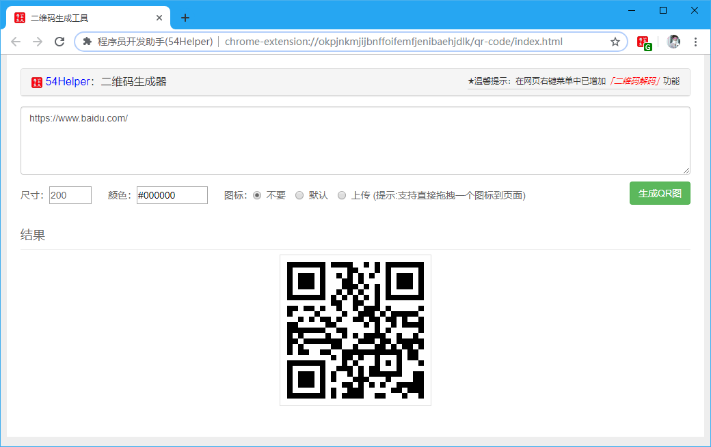
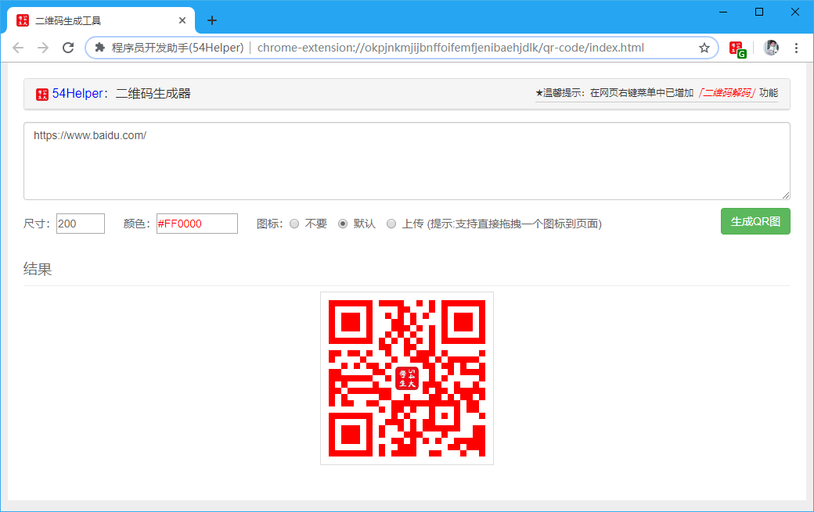

# 一、简介
1、快速生成二维码  
2、将任何字符生成二维码  
3、将网址生成二维码，手机📱扫码浏览内容，方便手机📱测试网页样式兼容性  
4、可定制二维码大小、前景色、中间添加logo  

# 二、配置
## 2.1、右键菜单配置
在设置界面，** 配置右键菜单 **  
1、勾选“二维码生成器”  
2、网页中点击鼠标右键  
3、将进入到“二维码生成器”页面  

👆配置右键菜单-二维码生成器开启

## 2.2、popup菜单配置
在设置界面，** 配置功能菜单 **  
1、勾选“二维码生成器”  
2、popup菜单将出现“二维码生成器”  
3、点击popup菜单中的“二维码生成器”将跳转至“二维码生成器”界面  

👆配置功能菜单-二维码生成器开启

# 三、使用
## 3.1、开箱即用
1、在某个“目标页面”点击鼠标🖱右键，选择“54Helper工具”->“二维码生成器”，将跳转至“二维码生成器”页面并自动将“目标页面”的地址生成二维码，扫码即可。  
2、将要生成二维码的内容复制粘贴到“内容输入框”，点击“生成QR图”，将生成对应二维码，扫码即可。  

👆鼠标🖱右键-鼠标🖱右键跳转至“二维码生成器”页面

## 3.2、高级用法
1、“尺寸”输入框输入数字🔢，设置二维码的大小，二维码为正方形，故只需设置一个边长。  
2、“颜色”输入框点击后会弹出颜色选择器，选择颜色即可，亦可自行输入十六进制颜色值。  
3、“图标”可选择“不要”、“默认”、“上传”，可选择“上传”自己的logo设置到二维码中间。  

👆多样化生成二维码

