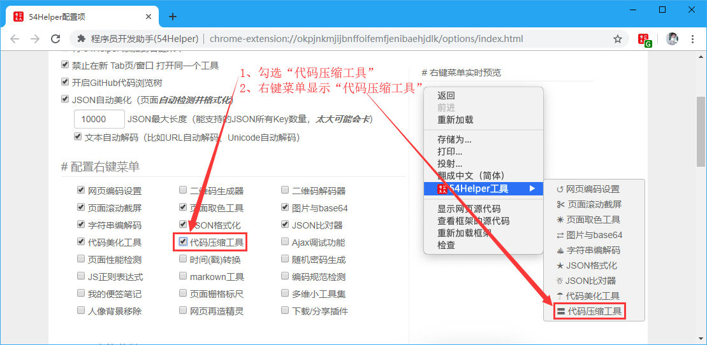
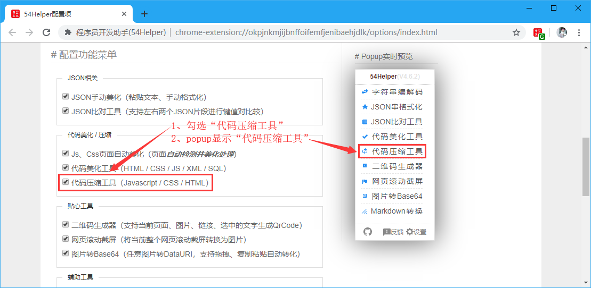
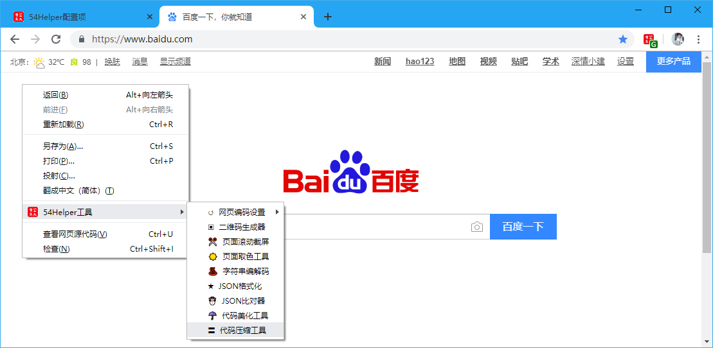
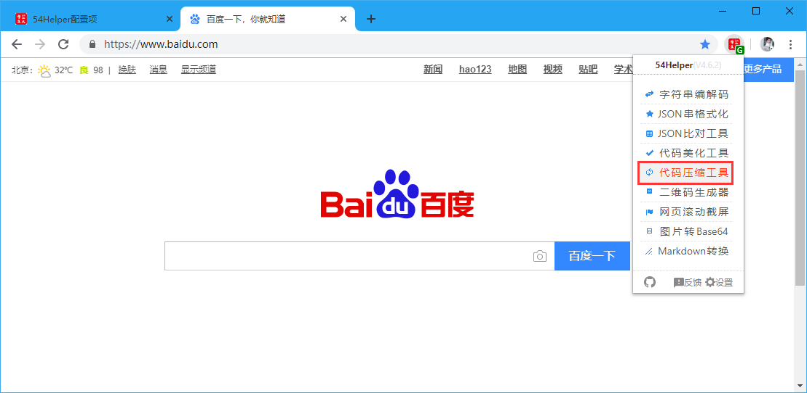
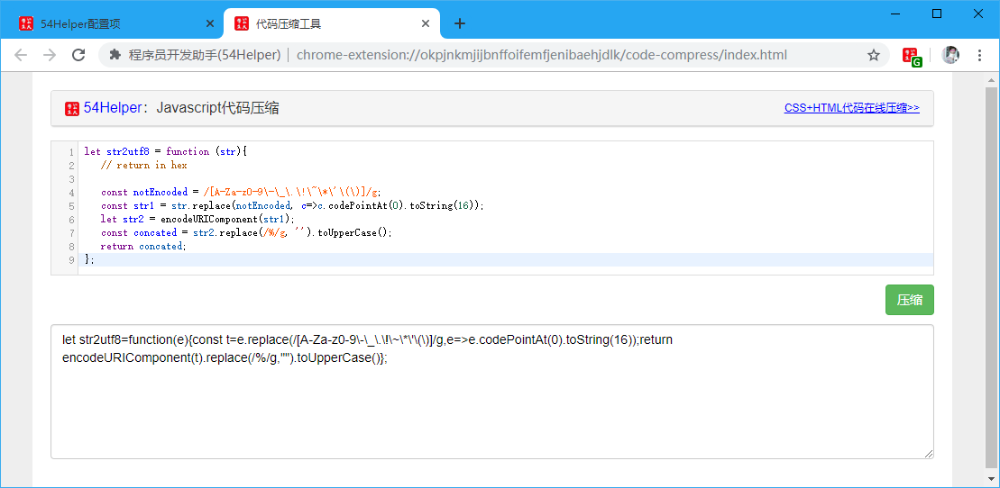

# 一、简介
1、本工具可以对Javascript代码进行压缩  
2、压缩后的代码体积减少，对于页面加载速度优化有一定的帮助  
3、压缩后的代码变量名转义为无疑义的字符，增大黑客研究网站漏洞的难度  

# 二、配置
## 2.1、右键菜单配置
在设置界面，** 配置右键菜单 **  
1、勾选“代码压缩工具”  
2、右键菜单将显示“代码压缩工具”  

👆配置右键菜单-代码压缩工具开启

## 2.2、popup菜单配置
在设置界面，** 配置功能菜单 **  
1、勾选“代码压缩工具”  
2、popup菜单将出现“代码压缩工具”  

👆配置功能菜单-代码压缩工具开启

# 三、使用
## 3.1、开箱即用
1、点击“鼠标右键”->“54Helper工具”->“代码压缩工具”->跳转至“代码压缩工具”页面  

👆代码压缩工具的使用-右键菜单

2、点击“工具栏54Helper的popup”->“popup弹出”->“代码压缩工具”->跳转至“代码压缩工具”页面  

👆代码压缩工具的使用-popup菜单

3、功能演示说明  
本工具可以对Javascript代码进行压缩

👆Javascript代码压缩

