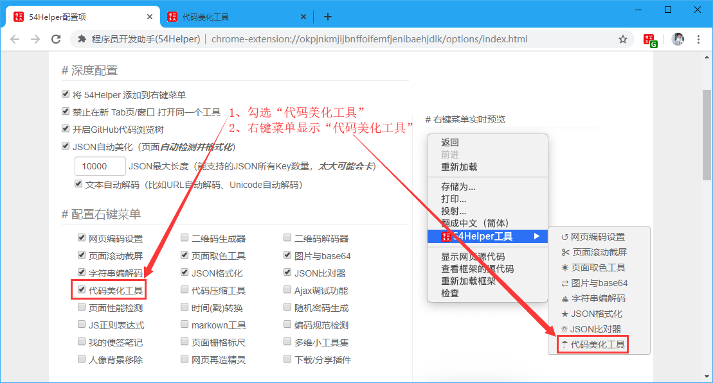
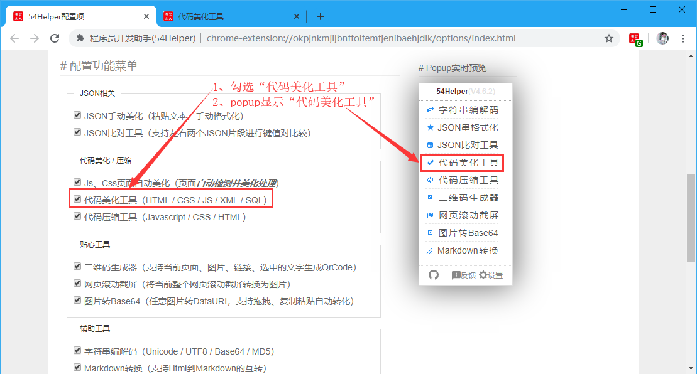
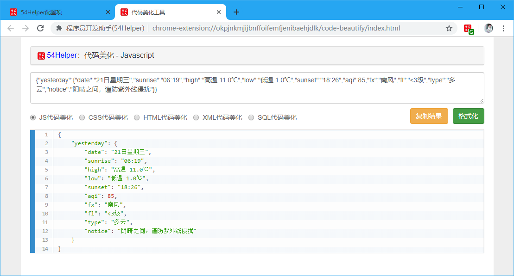
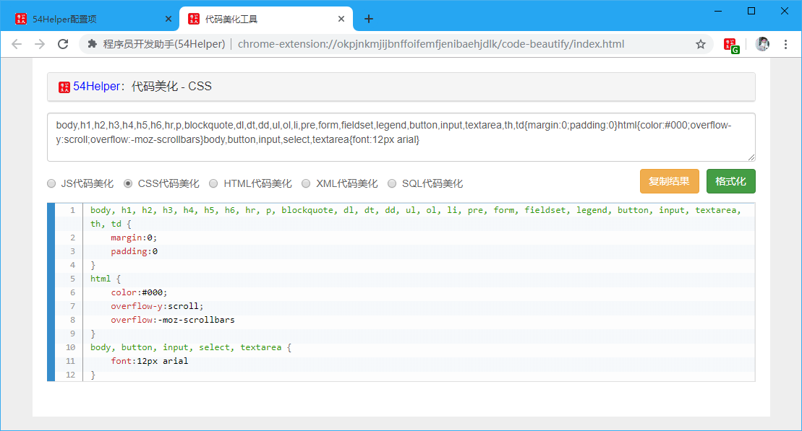
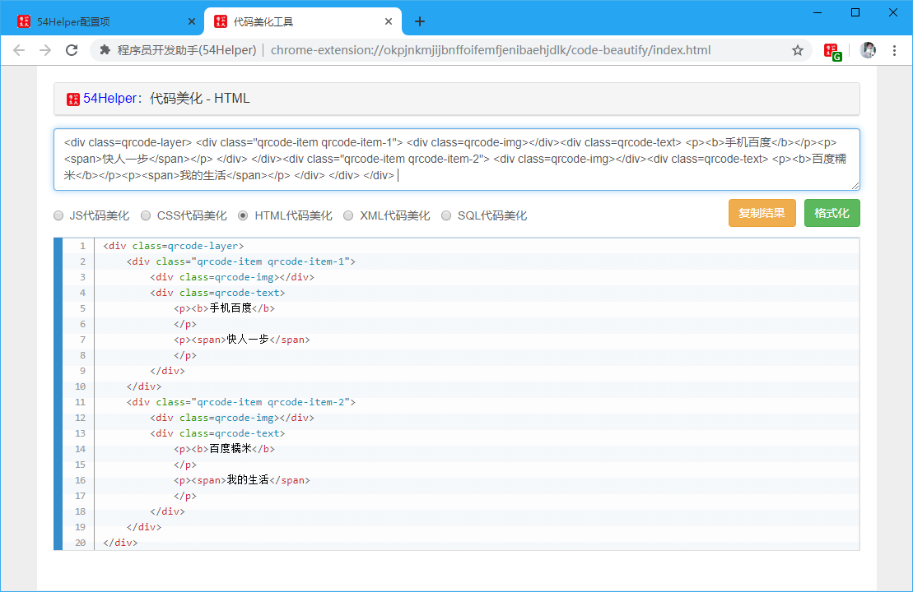
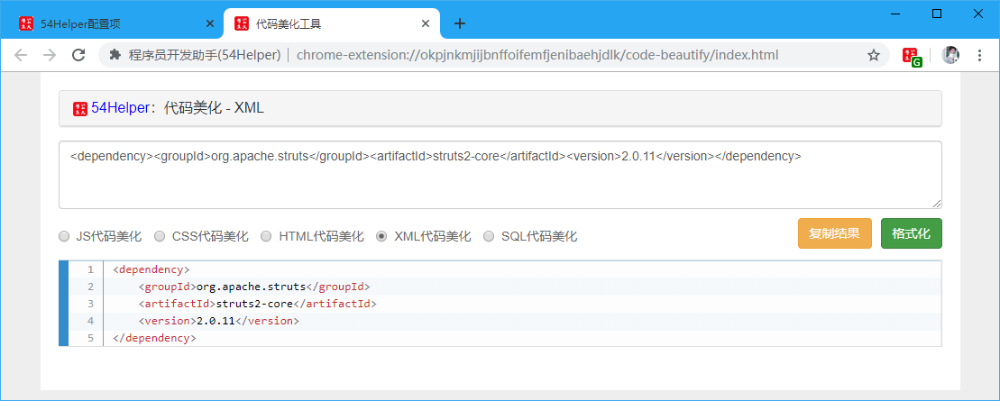
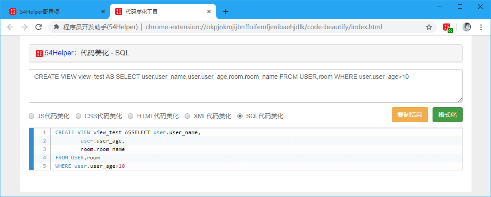

# 一、简介
1、本工具可以对压缩过的代码格式化，方便阅读代码  
2、本工具可以对一下类型格式化“JS代码美化”、“CSS代码美化”、“HTML代码美化”、“XML代码美化”、“SQL代码美化”  

# 二、配置
## 2.1、右键菜单配置
在设置界面，** 配置右键菜单 **  
1、勾选“代码美化工具”  
2、右键菜单将显示“代码美化工具”  

👆配置右键菜单-代码美化工具开启

## 2.2、popup菜单配置
在设置界面，** 配置功能菜单 **  
1、勾选“代码美化工具”  
2、popup菜单将出现“代码美化工具”  

👆配置功能菜单-代码美化工具开启

# 三、使用
## 3.1、开箱即用
1、点击“鼠标右键”->“54Helper工具”->“代码美化工具”->跳转至“代码美化工具”页面  

👆代码美化工具的使用-右键菜单

2、点击“工具栏54Helper的popup”->“popup弹出”->“代码美化工具”->跳转至“代码美化工具”页面  

👆代码美化工具的使用-popup菜单

3、功能演示说明  
本工具可以对一下类型格式化  
- JS代码美化
- CSS代码美化
- HTML代码美化
- XML代码美化
- SQL代码美化

👆JS代码美化

👆CSS代码美化

👆HTML代码美化

👆XML代码美化

👆SQL代码美化

