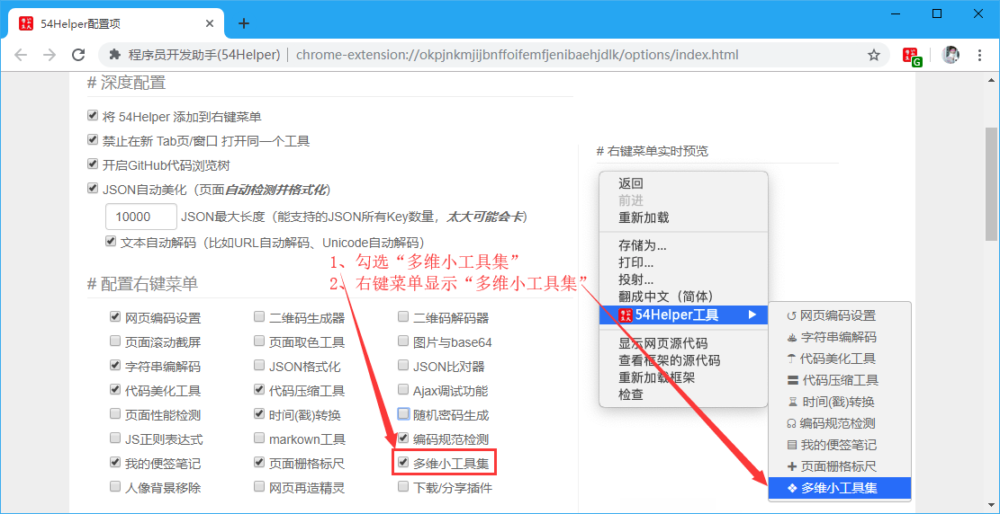
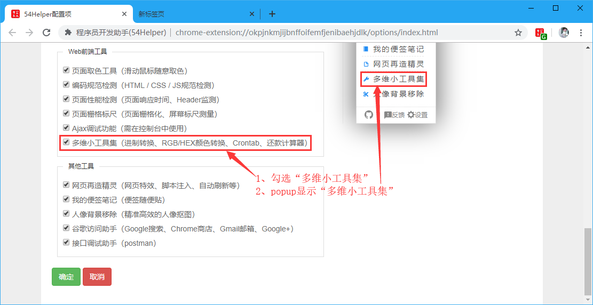
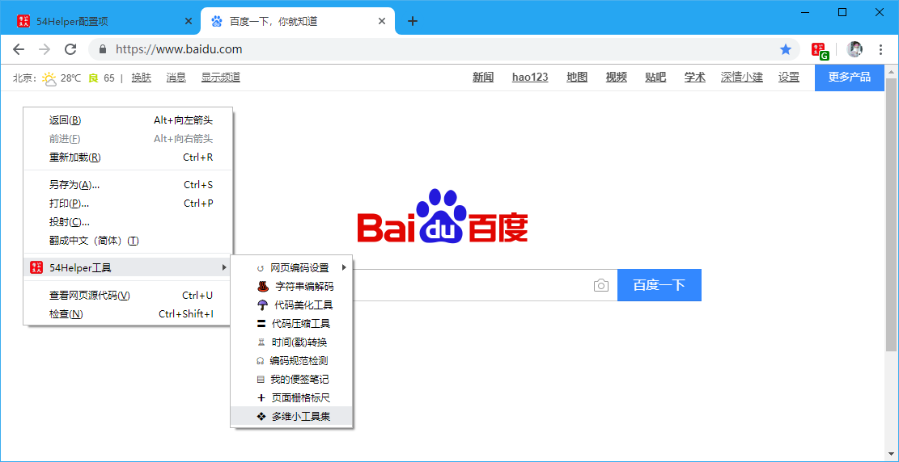
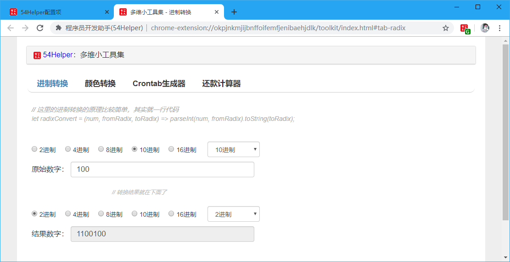
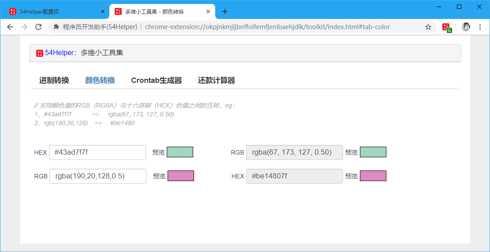
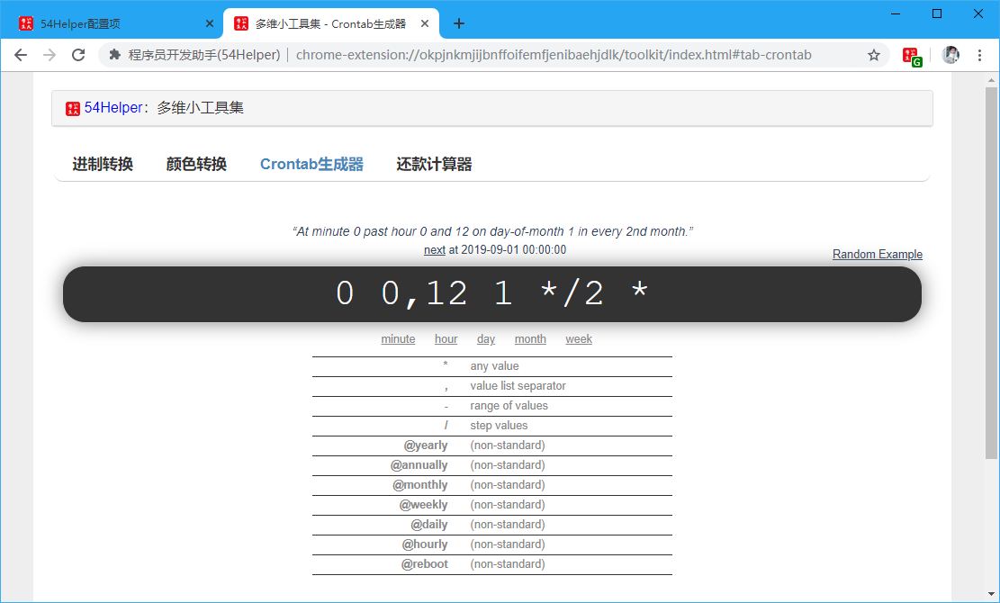
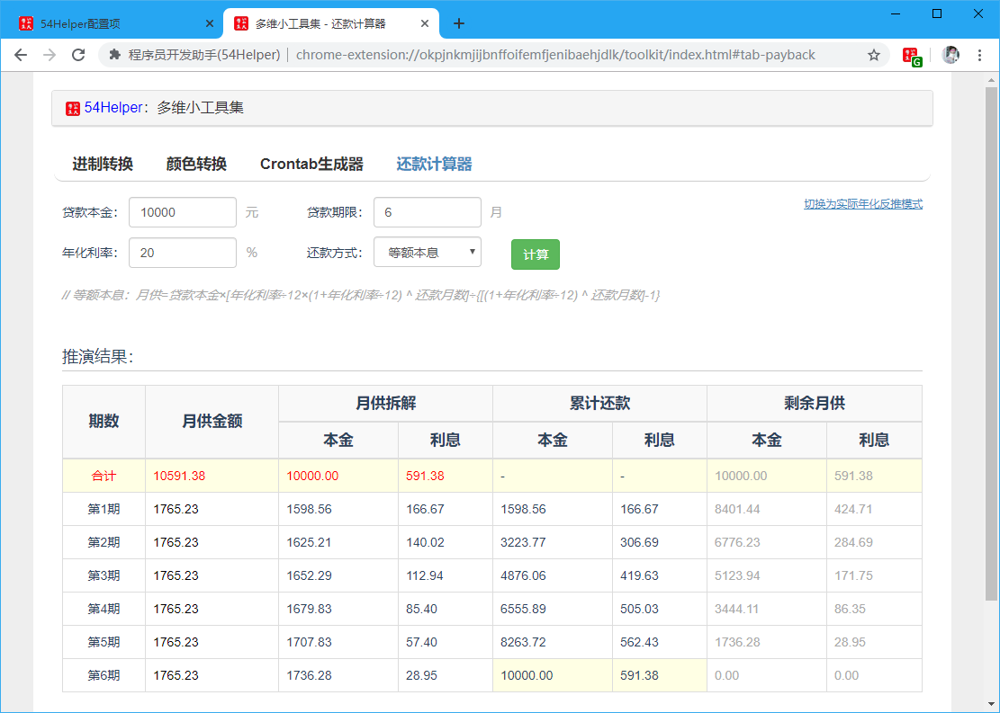

# 一、简介
1、本工具集提供一些小工具，当前包含有(`进制转换、颜色转换、Crontab生成器、还款计算器`)  
2、`进制转换`工具可以实现如下进制间的互转(`2、3、4、5、6、7、8、9、10、11、12、13、14、15、16、17、18、19、20、21、22、23、24、25、26、27、28、29、30、31、32、33、34、35、36`)  
3、`颜色转换`工具可以实现颜色值的`RGB（RGBA）`与`十六进制（HEX）`色值之间的互转  
4、`Crontab生成器`工具可以生成Linux系统的定时任务  
5、`还款计算器`工具根据设定的`本金`、`期限`、`年化率`、`还款方式(等额本金、等额本息)`可生成推演结果表  

# 二、配置
## 2.1、右键菜单配置
在设置界面，** 配置右键菜单 **  
1、勾选“多维小工具集”  
2、右键菜单将显示“多维小工具集”  

👆配置右键菜单-多维小工具集开启

## 2.2、popup菜单配置
在设置界面，** 配置功能菜单 **  
1、勾选“多维小工具集”  
2、popup菜单将出现“多维小工具集”  

👆配置功能菜单-多维小工具集开启

# 三、使用
## 3.1、开箱即用
1、点击“鼠标右键”->“54Helper工具”->“多维小工具集”->跳转至`多维小工具集`页面  

👆多维小工具集的使用-右键菜单

2、点击“工具栏54Helper的popup”->“popup弹出”->“多维小工具集”->跳转至`多维小工具集`页面  

👆多维小工具集的使用-popup菜单

## 3.2、功能演示说明  
多维小工具集简单示例如下  

**1、进制转换**  
操作步骤：  
> 1、设置原始进制值  
> 2、设置目标进制值  
> 3、输入原始数字  
> 4、获得结果数字  

👆多维小工具集-进制转换

**2、颜色转换**  
操作步骤：  
> 1、定好转换模式(`RGB（RGBA）`转`十六进制（HEX）`)还是(`十六进制（HEX）`转`RGB（RGBA）`)  
> 2、输入原始值  
> 3、获得结果值  

👆多维小工具集-颜色转换

**3、Crontab生成器**  
操作步骤：  
> 1、输入对应值(`minute`、`hour`、`day`、`month`、`week`)  
> 2、生成对应Crontab值  

👆多维小工具集-Crontab生成器

**4、还款计算器**  
操作步骤：  
> 1、设置好`本金`、`期限`、`年化率`、`还款方式(等额本金、等额本息)`  
> 2、推演结果将生成表格，阅读即可  
> 3、其中`等额本息：月供=贷款本金×[年化利率÷12×(1+年化利率÷12) ^ 还款月数]÷{[(1+年化利率÷12) ^ 还款月数]-1}`  
> 4、其中`等额本金：月供=贷款本金÷还款月数x(1+年化利率÷12x剩余还款期数)`  

👆多维小工具集-还款计算器
