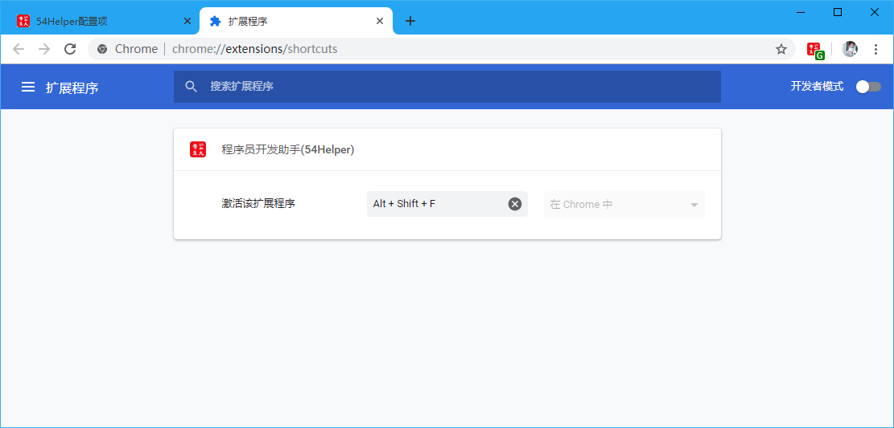

# 一、简介
1、本工具旨在在Chrome浏览器层面，提供通过键盘⌨快捷键启动插件的能力  
2、默认快捷键为：`Alt+Shift+F`  
3、在浏览器任意页面按下快捷键(`Alt+Shift+F`)，菜单会自动弹出，你可以用方向键[`↑/↓`]选择功能，用[`Enter`]键确认打开！

# 二、配置
## 2.1、快捷键配置  
在设置界面，** 快捷键 **  
1、点击`“>> 点击配置54Helper快捷键（当前快捷键为：Alt+Shift+F）>>”`,将跳转至快捷键设置页面  
2、在快捷键设置页面的“程序员开发助手(54Helper)”板块，`激活该扩展程序`的输入框，鼠标🖱点击后，按下键盘⌨快捷键，即可自动设置好快捷键  

👆配置右键菜单-快捷键

👆配置右键菜单-快捷键设置

# 三、使用
## 3.1、开箱即用
1、在浏览器任意页面按下快捷键(`Alt+Shift+F`)，菜单会自动弹出，你可以用方向键[`↑/↓`]选择功能，用[`Enter`]键确认打开！

👆快捷键的使用-使用
