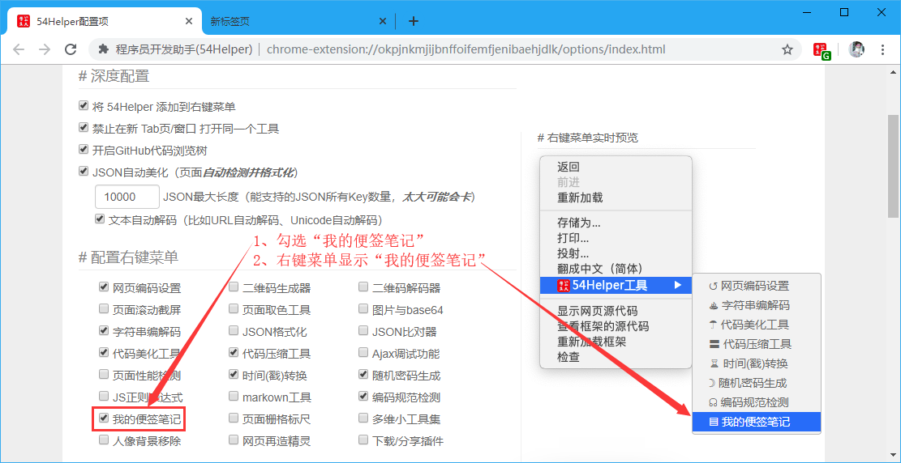
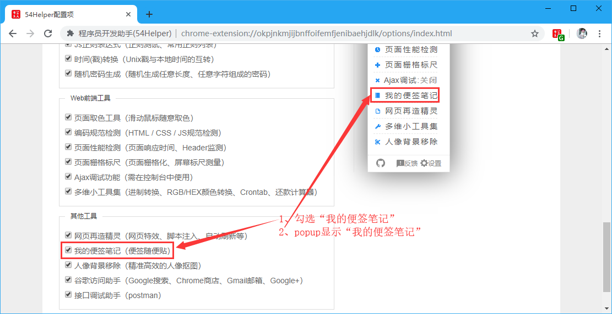
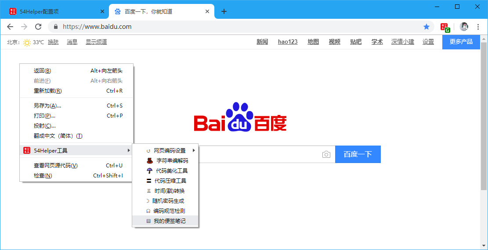
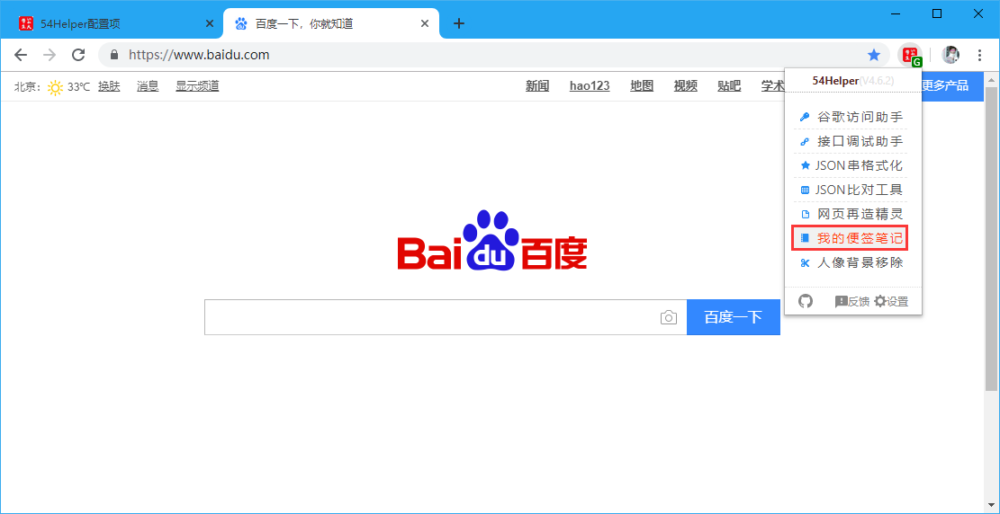
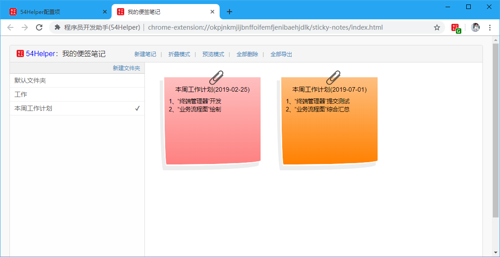
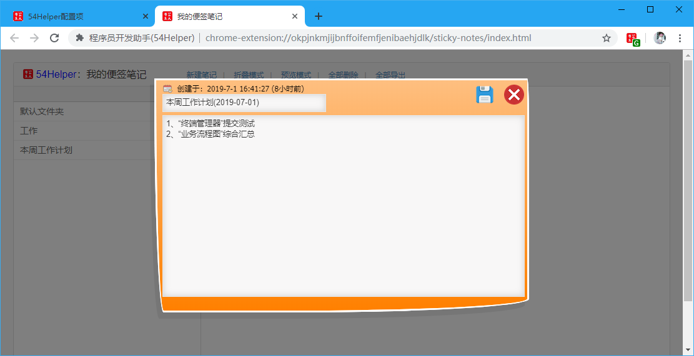

# 一、简介
1、本工具可以建立便签笔记，用于记录  
2、可建立多个笔记、并将笔记分类、将笔记导出  

# 二、配置
## 2.1、右键菜单配置
在设置界面，** 配置右键菜单 **  
1、勾选“我的便签笔记”  
2、右键菜单将显示“我的便签笔记”  

👆配置右键菜单-我的便签笔记开启

## 2.2、popup菜单配置
在设置界面，** 配置功能菜单 **  
1、勾选“我的便签笔记”  
2、popup菜单将出现“我的便签笔记”  

👆配置功能菜单-我的便签笔记开启

# 三、使用
## 3.1、开箱即用
1、点击“鼠标右键”->“54Helper工具”->“我的便签笔记”->跳转至“我的便签笔记”页面  

👆我的便签笔记的使用-右键菜单

2、点击“工具栏54Helper的popup”->“popup弹出”->“我的便签笔记”->跳转至“我的便签笔记”页面  

👆我的便签笔记的使用-popup菜单

3、功能演示说明  
我的便签笔记简单示例如下  
操作步骤：  
> 1、点击菜单中的`我的便签笔记`进入到便签笔记页面  
> 2、点击`新建笔记`  
> 3、填写标题、正文，点击保存关闭  
> 4、点击`笔记`可展开并修改内容  
> 5、点击`新建文件夹`可建立新的便签笔记分类目录  

👆我的便签笔记

👆我的便签笔记-新建笔记
