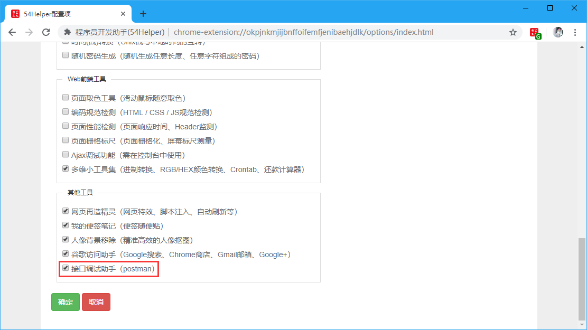
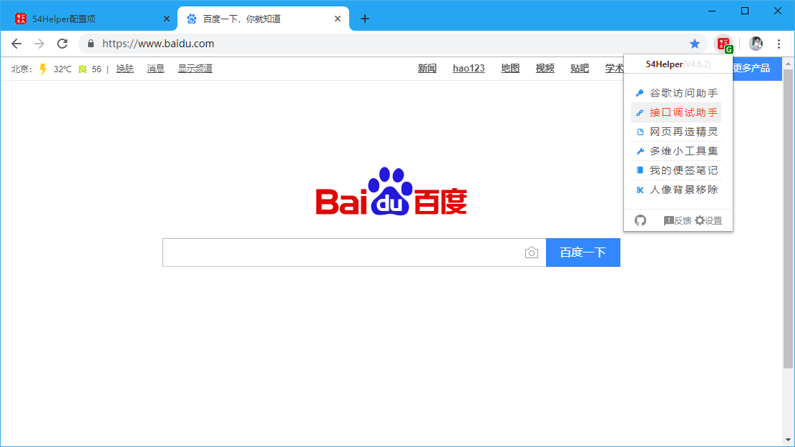
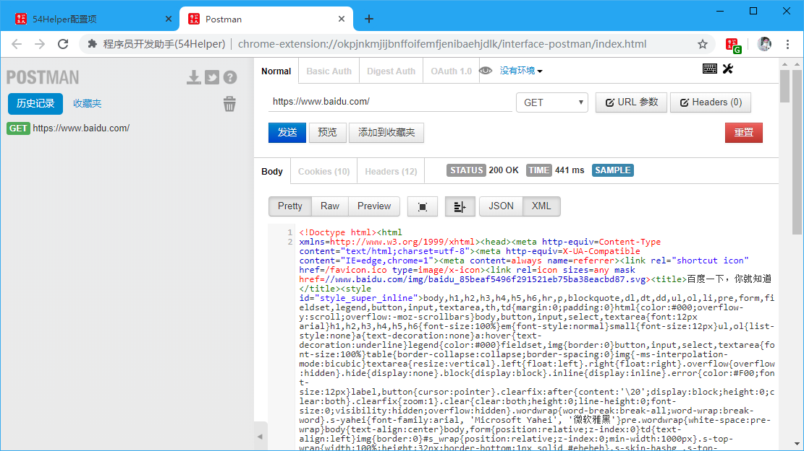

# 一、简介
1、`接口调试助手`是一个接口调试助手  
2、`接口调试助手`是一个基于postman的接口调试助手，使用方式同postman  

# 二、配置
## 2.1、popup菜单配置
在设置界面，** 配置功能菜单 **  
1、勾选“接口调试助手”  
2、popup菜单将出现“接口调试助手”  

👆配置功能菜单-接口调试助手开启

# 三、使用
## 3.1、开箱即用
1、点击“工具栏54Helper的popup”->“popup弹出”->“接口调试助手”->跳转至`接口调试助手`页面  

👆接口调试助手的使用-popup菜单

## 3.2、功能演示说明  
接口调试助手简单示例如下  

操作步骤：  
> 1、本工具基于postman，故操作方式同postman  
> 2、简单的get请求如图所示，将请求地址填写到地址框，选择请求方式(`GET`)，点击发送
> 3、下方可以查看服务器应答结果，包含(`Body`、`Headers`、`STATUS`、`TIME`、`SAMPLE`)等信息    

👆接口调试助手
