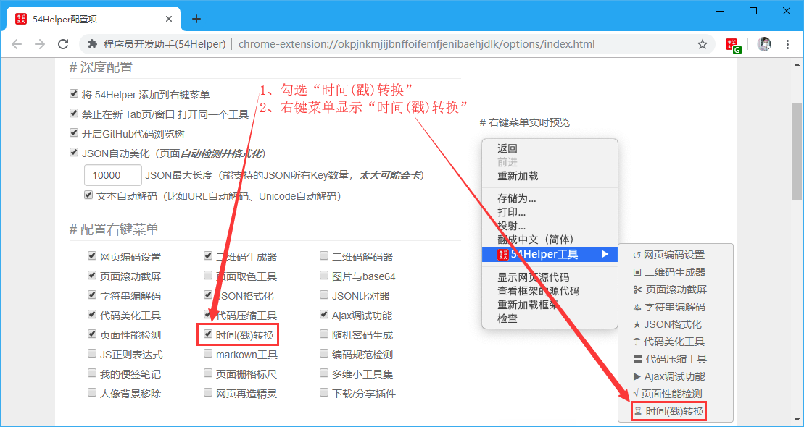
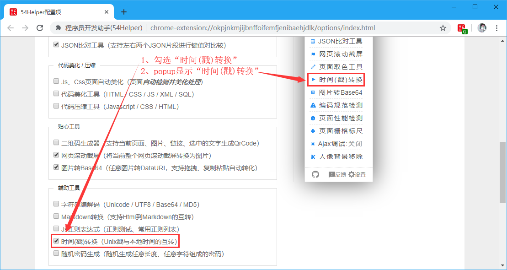
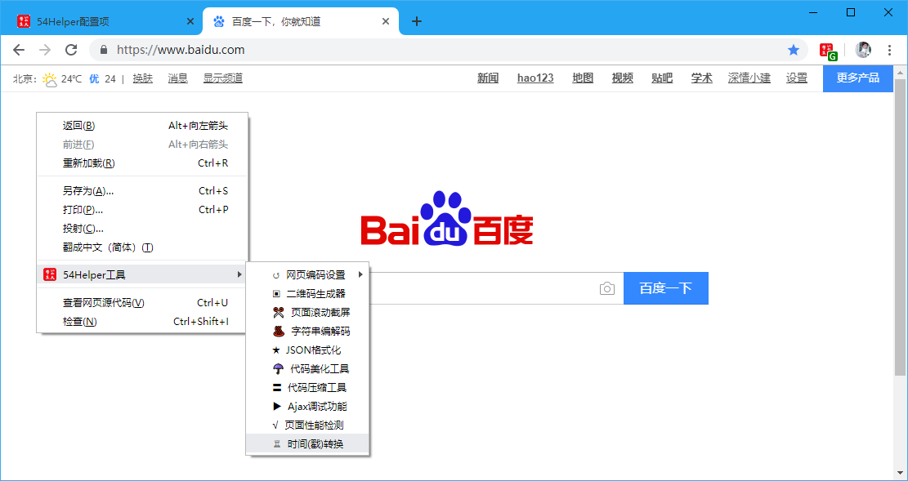
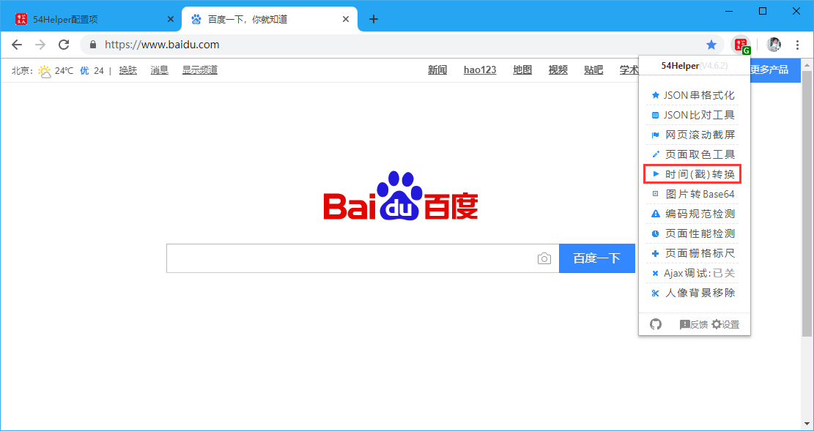
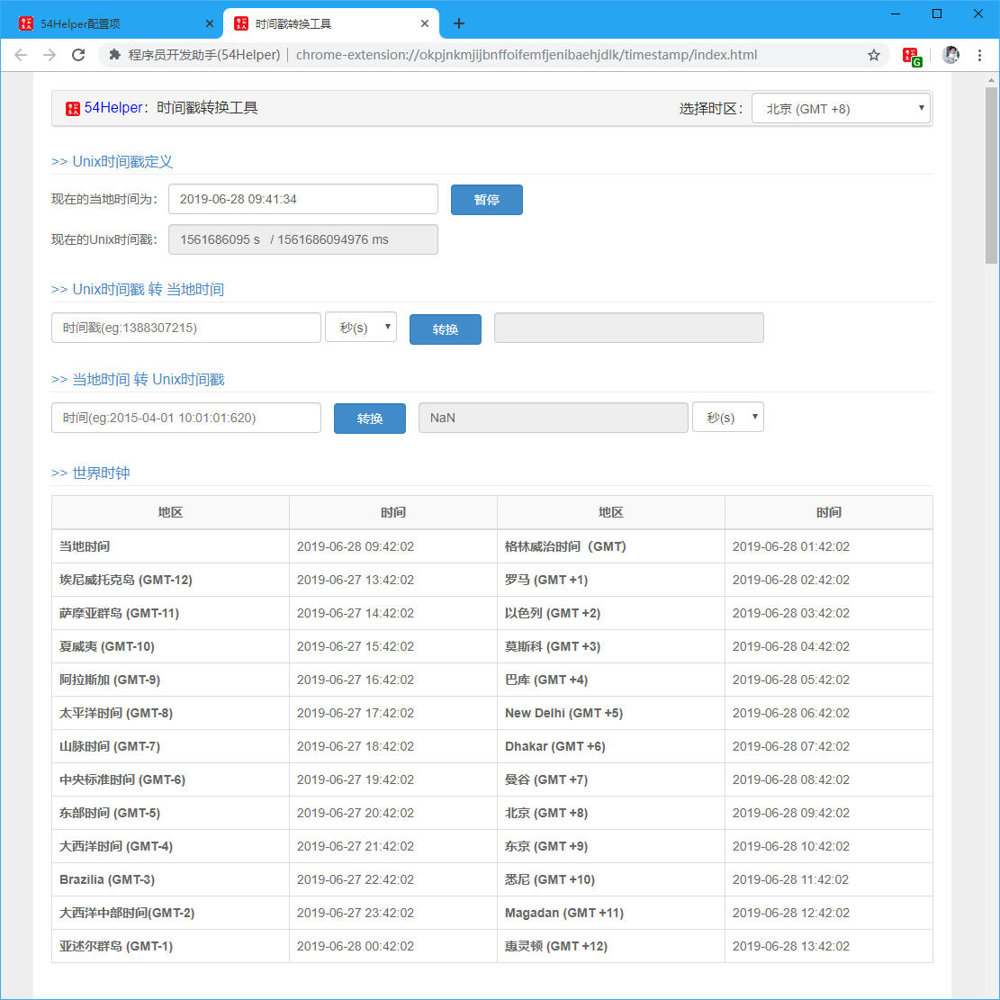

# 一、简介
1、本工具可以查看各时区当前时间  
2、  “Unix时间戳”<->“当地时间”  
3、时区表如下

地区  | 时区 | 时间
---|---|---
当地时间(北京) | GMT+8 | 2019-06-28 14:36:36
埃尼威托克岛 | GMT-12 | 2019-06-27 18:36:36
萨摩亚群岛 | GMT-11 | 2019-06-27 19:36:36
夏威夷 | GMT-10 | 2019-06-27 20:36:36
阿拉斯加 | GMT-9 | 2019-06-27 21:36:36
太平洋时间 | GMT-8 | 2019-06-27 22:36:36
山脉时间 | GMT-7 | 2019-06-27 23:36:36
中央标准时间 | GMT-6 | 2019-06-28 00:36:36
东部时间 | GMT-5 | 2019-06-28 01:36:36
大西洋时间 | GMT-4 | 2019-06-28 02:36:36
Brazilia | GMT-3 | 2019-06-28 03:36:36
大西洋中部时间 | GMT-2 | 2019-06-28 04:36:36
亚述尔群岛 | GMT-1 | 2019-06-28 05:36:36
格林威治时间 | GMT | 2019-06-28 06:36:36
罗马 | GMT+1 | 2019-06-28 07:36:36
以色列 | GMT+2 | 2019-06-28 08:36:36
莫斯科 | GMT+3 | 2019-06-28 09:36:36
巴库 | GMT+4 | 2019-06-28 10:36:36
New Delhi | GMT+5 | 2019-06-28 11:36:36
Dhakar | GMT+6 | 2019-06-28 12:36:36
曼谷 | GMT+7 | 2019-06-28 13:36:36
北京  | GMT+8 | 2019-06-28 14:36:36
东京  | GMT+9 | 2019-06-28 15:36:36
悉尼 | GMT+10 | 2019-06-28 16:36:36
Magadan | GMT+11 | 2019-06-28 17:36:36
惠灵顿 | GMT+12 | 2019-06-28 18:36:36

# 二、配置
## 2.1、右键菜单配置
在设置界面，** 配置右键菜单 **  
1、勾选“时间(戳)转换”  
2、右键菜单将显示“时间(戳)转换”  

👆配置右键菜单-时间(戳)转换开启

## 2.2、popup菜单配置
在设置界面，** 配置功能菜单 **  
1、勾选“时间(戳)转换”  
2、popup菜单将出现“时间(戳)转换”  

👆配置功能菜单-时间(戳)转换开启

# 三、使用
## 3.1、开箱即用
1、点击“鼠标右键”->“54Helper工具”->“时间(戳)转换”->跳转至“时间(戳)转换”页面  

👆时间(戳)转换的使用-右键菜单

2、点击“工具栏54Helper的popup”->“popup弹出”->“时间(戳)转换”->跳转至“时间(戳)转换”页面  

👆时间(戳)转换的使用-popup菜单

## 3.2、功能演示说明  
时间(戳)转换简单示例如下  

👆时间(戳)转换
