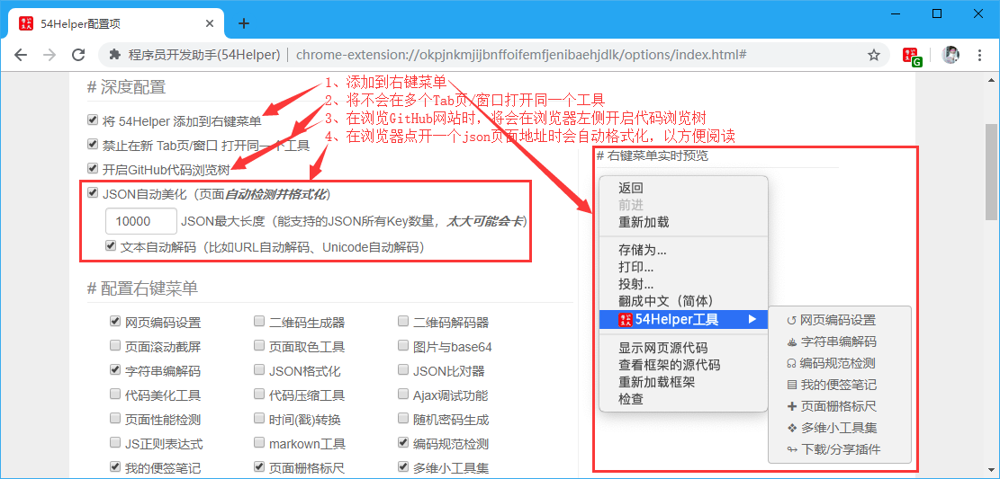
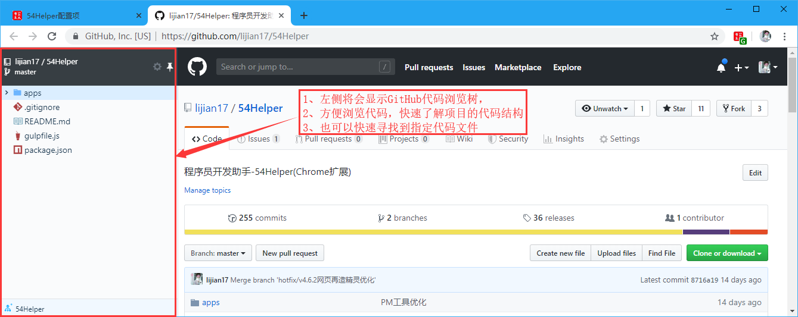
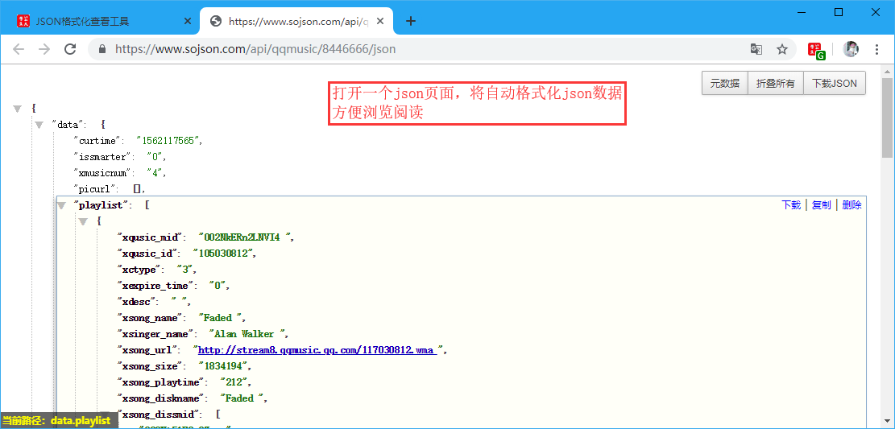

# 一、简介
1、本功能是一个强大的动态处理正浏览的网页  
2、开启其中的功能后，当满足条件时，将自动触发工具的调用  
3、当前已支持`将 54Helper 添加到右键菜单`、`禁止在新 Tab页/窗口 打开同一个工具`、`开启GitHub代码浏览树`、`JSON自动美化（页面自动检测并格式化）`  

# 二、配置
## 2.1、深度配置  
在设置界面，** 深度配置 **  
1、勾选要开启的功能`将 54Helper 添加到右键菜单`、`禁止在新 Tab页/窗口 打开同一个工具`、`开启GitHub代码浏览树`、`JSON自动美化（页面自动检测并格式化）`  
2、当在网页中操作，满足条件时，将自动触发工具的调用  

👆配置右键菜单-深度配置

# 三、使用
## 3.1、开箱即用
1、当浏览GitHub网站的任意仓库时，将触发`GitHub代码浏览树`工具，左侧将出现该工具，使用者可以方便的浏览仓库中的代码  

👆配置右键菜单-GitHub代码浏览树

2、当在浏览器中打开一个json数据的页面时，将触发`JSON自动格式化`工具，json数据自动格式化，以方便阅读json数据  

👆配置右键菜单-JSON自动格式化
