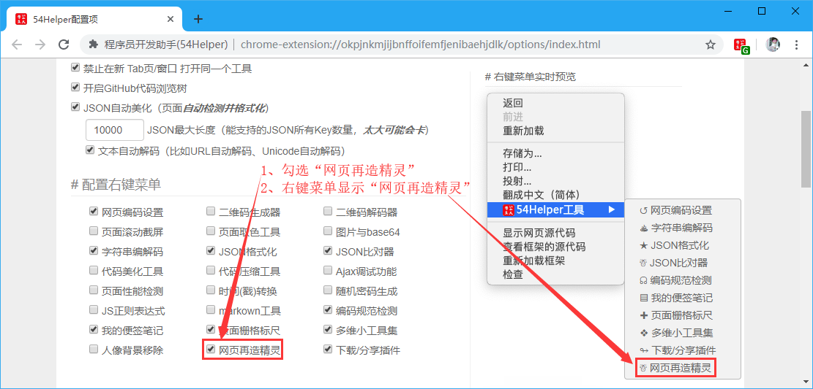
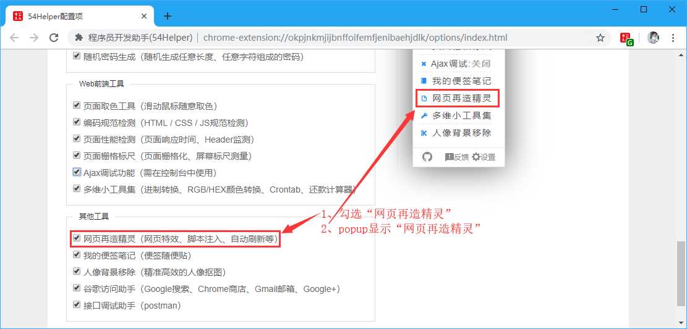
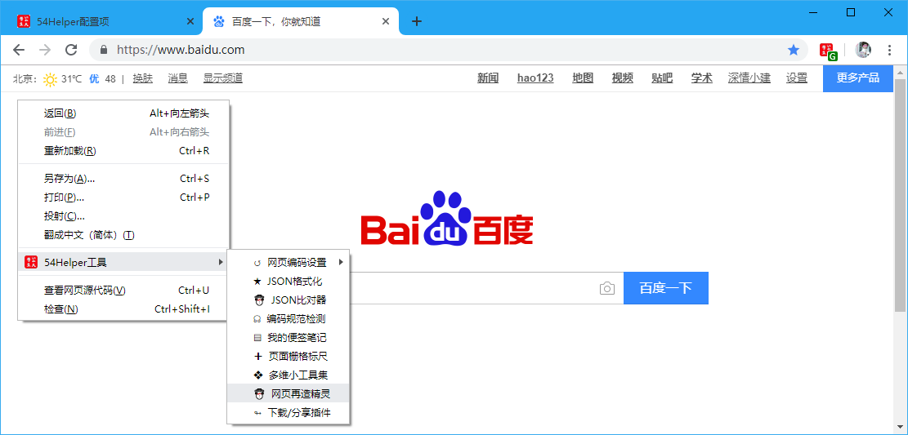

## 一、简介
精灵可以对匹配的网站地址执行如下动作：
- 网页特效
- 网页定制
- 脚本注入
- 自动刷新等


## 二、使用配置
### 2.1 功能开启
在设置界面进行配置，可在** 配置右键菜单 **和** 配置功能菜单 **进行配置。


👆配置右键菜单-网页再造精灵开启


👆配置功能菜单-网页再造精灵开启

### 2.2 功能说明

👆添加精灵
点击左侧 **添加精灵** ，然后在右侧填写信息，填写完后，点 **保存**

---

**示例一：**  
*网页精灵名称：*`百度搜索结果过滤器`  
*网址匹配规则：*`https://www.baidu.com/`  
*网页特效设定：*`（可选）`  
*网页自动刷新：*`（可选）`  
*精灵注入脚本：*（Tips：可以注入任意JS代码，甚至编写一个智能机器人也是可以的，比如网页定制、自动抢票啥的！）  
```javascript
// 以下代码将会红框标识百度推广广告（注：网址匹配规则填写为https://www.baidu.com/）
function adFun() {
	document.querySelectorAll("div[cmatchid]").forEach((item) => {
		item.parentNode.removeChild(item);
	});
	document.querySelectorAll(".result").forEach((item) => {
		item.querySelectorAll("span").forEach((itemSpan) => {
			if (itemSpan.innerHTML.indexOf("广告") != -1) {
				item.parentNode.removeChild(item);
			}
		})
	})
	setTimeout(adFun, 2000);
};
adFun();
```

---

**示例二：**  
*网页精灵名称：*`CSDN广告屏蔽`  
*网址匹配规则：*`https://blog.csdn.net/`  
*网页特效设定：*`（可选）`  
*网页自动刷新：*`（可选）`  
*精灵注入脚本：*`（Tips：可以注入任意JS代码，甚至编写一个智能机器人也是可以的，比如网页定制、自动抢票啥的！）  `
```javascript
document.querySelectorAll("aside,.recommend-right,#dmp_ad_58,#commentBox,.comment-box,.recommend-box,iframe").forEach((item) => {item.parentNode.removeChild(item)});
document.querySelectorAll("main").forEach((item) => {item.style.cssText="margin:0 auto; float: none;"});
```

---


