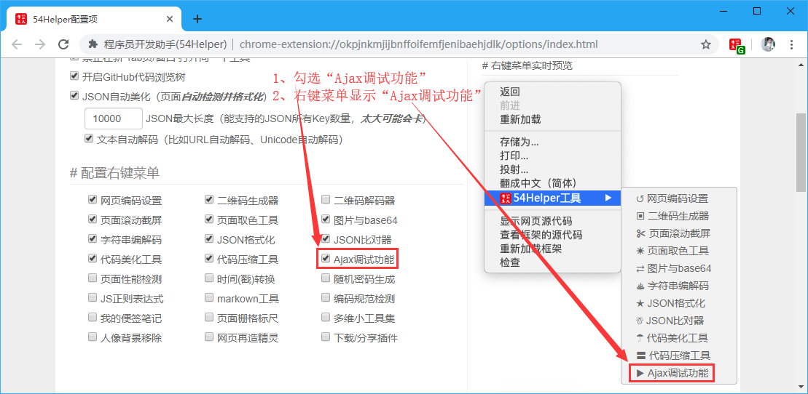
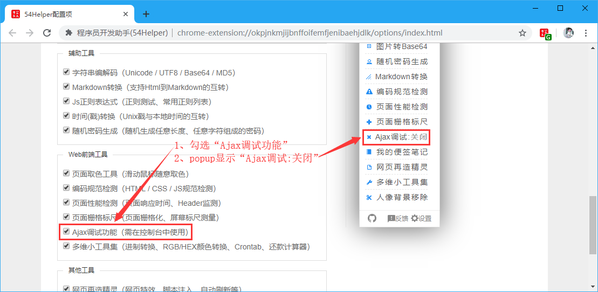
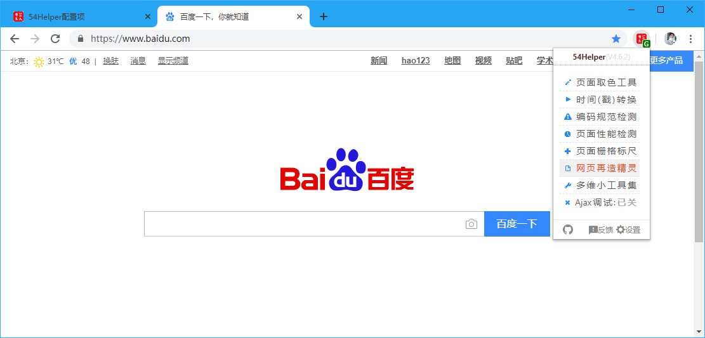

# 一、简介
精灵可以对匹配的网站地址执行如下动作：
- 网页特效（如：网页文字变灰色、网页添加滤镜）
- 网页定制（如：百度搜索广告屏蔽、CSND广告屏蔽）
- 脚本注入（如：注入脚本提供特定功能）
- 自动刷新（如：自动抢票、自动秒杀）

# 二、配置
## 2.1、右键菜单配置
在设置界面，** 配置右键菜单 **  
1、勾选“网页再造精灵”  
2、右键菜单将显示“网页再造精灵”  


👆配置右键菜单-网页再造精灵开启

## 2.2、popup菜单配置
在设置界面，** 配置功能菜单 **  
1、勾选“网页再造精灵”  
2、popup菜单将出现“网页再造精灵”  


👆配置功能菜单-网页再造精灵开启

# 三、使用
## 3.1、开箱即用
1、点击“鼠标右键”->“54Helper工具”->“网页再造精灵”->跳转至`网页再造精灵`页面  


👆网页再造精灵的使用-右键菜单

2、点击“工具栏54Helper的popup”->“popup弹出”->“网页再造精灵”->跳转至`网页再造精灵`页面  


👆网页再造精灵的使用-popup菜单

## 3.2、功能演示说明  
操作步骤：  
> 1、点击左侧`添加精灵`  
> 2、右侧填写信息，要填写的信息包含(`网页精灵名称`、`网址匹配规则`、`网页特效设定（可选）`、`网页自动刷新（可选）`、`精灵注入脚本`)  
> 3、`精灵`可以导入导出，通过线下QQ、微信等发送给他人使用，或者自己保存以便日后使用  
> 4、`精灵`可以停用、删除、全部停用、全部删除  


👆添加精灵

<!--sec data-title="示例一：百度搜索结果过滤器" data-id="section0" data-show=true data-collapse=true ces-->
*网页精灵名称：*`百度搜索结果过滤器`  
*网址匹配规则：*`https://www.baidu.com/`  
*网页特效设定：*`（可选）`  
*网页自动刷新：*`（可选）`  
*精灵注入脚本：*（Tips：可以注入任意JS代码，甚至编写一个智能机器人也是可以的，比如网页定制、自动抢票啥的！）  
```javascript
// 以下代码将会红框标识百度推广广告（注：网址匹配规则填写为https://www.baidu.com/）
function adFun() {
	document.querySelectorAll("div[cmatchid]").forEach((item) => {
		item.parentNode.removeChild(item);
	});
	document.querySelectorAll(".result").forEach((item) => {
		item.querySelectorAll("span").forEach((itemSpan) => {
			if (itemSpan.innerHTML.indexOf("广告") != -1) {
				item.parentNode.removeChild(item);
			}
		})
	})
	setTimeout(adFun, 2000);
};
adFun();
```
<!--endsec-->

<!--sec data-title="示例二：CSDN广告屏蔽" data-id="section2" data-show=true data-collapse=true ces-->
*网页精灵名称：*`CSDN广告屏蔽`  
*网址匹配规则：*`https://blog.csdn.net/`  
*网页特效设定：*`（可选）`  
*网页自动刷新：*`（可选）`  
*精灵注入脚本：*`（Tips：可以注入任意JS代码，甚至编写一个智能机器人也是可以的，比如网页定制、自动抢票啥的！）  `
```javascript
document.querySelectorAll("aside,.recommend-right,#dmp_ad_58,#commentBox,.comment-box,.recommend-box,iframe").forEach((item) => {item.parentNode.removeChild(item)});
document.querySelectorAll("main").forEach((item) => {item.style.cssText="margin:0 auto; float: none;"});
```
<!--endsec-->
